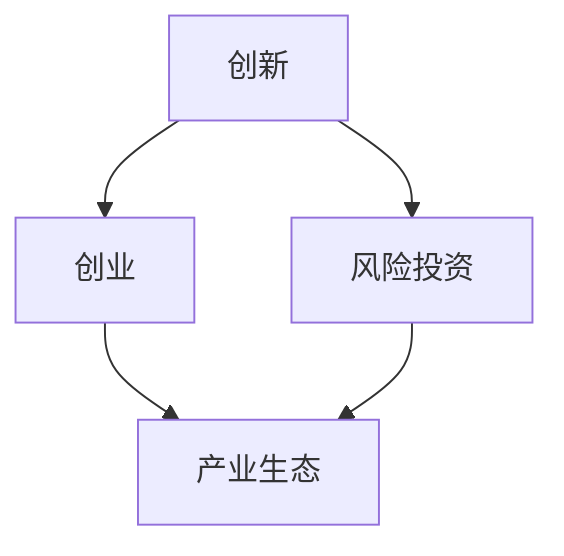

                 

关键词：硅谷历史、科技发展、创新创业、IT行业、全球影响力

摘要：本文将探讨硅谷的崛起之路，从一片果园发展到全球科技重镇的历程。通过分析硅谷的独特文化、创新机制、商业环境以及人才培养等方面，揭示硅谷成为科技帝国的关键因素。同时，文章还将展望硅谷未来的发展趋势和面临的挑战，为我国科技创新提供有益的借鉴。

## 1. 背景介绍

### 1.1 硅谷起源

硅谷，位于美国加利福尼亚州旧金山湾区南面，最早以半导体产业而闻名。20世纪50年代，随着二战后美国科技实力的崛起，许多高科技公司开始在此地设立研发中心。1951年，晶体管的出现标志着硅谷的诞生，为这一地区带来了前所未有的发展机遇。

### 1.2 硅谷的发展阶段

#### 1.2.1 初始阶段（1950s-1960s）

在初始阶段，硅谷主要以国防工业和半导体产业为主。1956年，肖克利半导体实验室成立，标志着硅谷半导体产业的起步。随后的数十年里，硅谷逐渐成为全球半导体产业的中心。

#### 1.2.2 成长期（1970s）

在成长期，硅谷迎来了个人计算机的崛起。1971年，英特尔公司推出了世界上第一个商业微处理器4004，为计算机产业的快速发展奠定了基础。此时，硅谷的创新创业氛围开始形成。

#### 1.2.3 成熟期（1980s-1990s）

在成熟期，硅谷的科技产业逐渐扩展至互联网、软件、生物科技等领域。1984年，苹果公司推出了Macintosh电脑，引发了个人计算机的普及。同时，微软、甲骨文等一批科技巨头崛起，硅谷成为了全球科技创新的中心。

#### 1.2.4 互联网时代（2000s-2010s）

进入互联网时代，硅谷的科技产业继续保持快速发展。2004年，谷歌上市，成为硅谷最具代表性的科技公司之一。同时，Facebook、亚马逊、特斯拉等一批新兴公司崛起，进一步巩固了硅谷的全球科技地位。

## 2. 核心概念与联系

为了更好地理解硅谷的发展，我们需要探讨几个核心概念：创新、创业、风险投资和产业生态。

### 2.1 创新

创新是硅谷的灵魂。硅谷鼓励人们不断探索新技术、新产品和新商业模式。创新不仅体现在技术和产品层面，还体现在管理、运营和营销等方面。

### 2.2 创业

创业是硅谷的核心驱动力。硅谷的创业者们具有强烈的冒险精神和创新意识，他们勇于挑战现状，不断尝试新的想法和业务模式。硅谷的创业文化激励着无数创业者勇往直前，追逐自己的梦想。

### 2.3 风险投资

风险投资是硅谷发展的重要推动力。硅谷的风险投资机构专注于投资具有高成长性的初创企业，为这些企业提供了充足的资金支持。风险投资的介入，极大地降低了创业者的创业门槛，激发了创业热情。

### 2.4 产业生态

硅谷的产业生态为科技创新提供了良好的环境。硅谷拥有众多世界级的高校、科研机构和科技企业，这些机构之间的紧密合作和资源共享，为科技创新提供了源源不断的动力。此外，硅谷还形成了完善的产业链，涵盖了研发、生产、销售、服务等各个环节，为科技创新提供了全方位的支持。

下面是核心概念和联系之间的Mermaid流程图：



## 3. 核心算法原理 & 具体操作步骤

### 3.1 算法原理概述

硅谷的崛起离不开一系列核心算法原理，这些原理涵盖了技术创新、商业模式创新和产业生态建设等方面。以下是对这些核心算法原理的简要概述：

#### 3.1.1 技术创新算法

技术创新算法主要包括以下几个方面：

1. **跨学科融合**：硅谷鼓励不同学科之间的交流和合作，以实现技术的突破和创新。
2. **快速迭代**：硅谷的企业和创业者倾向于快速推出原型产品，通过不断迭代改进，实现技术的快速进步。
3. **数据驱动**：硅谷的科技创新注重数据的收集、分析和应用，以提高决策的准确性和效率。

#### 3.1.2 商业模式创新算法

商业模式创新算法主要包括以下几个方面：

1. **用户至上**：硅谷的企业注重用户体验，以满足用户需求为核心，不断创新产品和服务。
2. **平台化运作**：硅谷的企业倾向于构建生态系统，通过平台化的方式实现多方共赢。
3. **全球化战略**：硅谷的企业积极拓展国际市场，以全球视野推动科技创新和商业发展。

#### 3.1.3 产业生态建设算法

产业生态建设算法主要包括以下几个方面：

1. **资源共享**：硅谷鼓励企业、高校和科研机构之间的资源共享，以提高整体创新能力。
2. **人才引进**：硅谷注重引进全球顶尖人才，为科技创新提供强大的人才支持。
3. **政策扶持**：硅谷政府和企业共同推动创新政策的制定和实施，为科技创新提供良好的政策环境。

### 3.2 算法步骤详解

#### 3.2.1 技术创新算法步骤

1. **跨学科融合**：
   - 联合不同学科的研究人员，进行跨界合作。
   - 定期举办跨学科研讨会，促进学术交流和合作。

2. **快速迭代**：
   - 设计并实施快速原型开发流程。
   - 定期评估和优化产品，确保技术不断进步。

3. **数据驱动**：
   - 建立完善的数据收集和分析系统。
   - 利用数据驱动决策，提高决策的准确性和效率。

#### 3.2.2 商业模式创新算法步骤

1. **用户至上**：
   - 深入了解用户需求，定期收集用户反馈。
   - 以用户需求为导向，持续优化产品和服务。

2. **平台化运作**：
   - 构建生态系统，实现多方共赢。
   - 打造开放平台，吸引合作伙伴加入。

3. **全球化战略**：
   - 拓展国际市场，建立全球业务网络。
   - 结合本地化战略，满足不同市场需求。

#### 3.2.3 产业生态建设算法步骤

1. **资源共享**：
   - 建立资源共享平台，促进企业、高校和科研机构之间的合作。
   - 定期举办合作交流活动，促进资源共享和知识传播。

2. **人才引进**：
   - 推出人才引进政策，吸引全球顶尖人才。
   - 建立人才培养体系，提高本地人才素质。

3. **政策扶持**：
   - 制定创新政策，为科技创新提供支持。
   - 加强与高校和科研机构的合作，推动科技成果转化。

### 3.3 算法优缺点

#### 3.3.1 技术创新算法优缺点

**优点**：
1. 提高技术创新速度。
2. 激发跨学科合作，推动技术突破。
3. 提高决策效率，降低研发成本。

**缺点**：
1. 存在跨学科合作难度。
2. 技术迭代速度快，可能导致人才流失。

#### 3.3.2 商业模式创新算法优缺点

**优点**：
1. 提高产品和服务竞争力。
2. 拓展市场空间，实现全球化发展。
3. 构建生态系统，实现多方共赢。

**缺点**：
1. 存在商业风险，可能导致资源浪费。
2. 平台化运作可能降低企业的自主性。

#### 3.3.3 产业生态建设算法优缺点

**优点**：
1. 提高整体创新能力。
2. 促进人才流动，提升人才素质。
3. 营造良好的创新环境，吸引投资。

**缺点**：
1. 存在资源分配不均的问题。
2. 政策扶持力度可能不足，影响创新效果。

### 3.4 算法应用领域

技术创新算法、商业模式创新算法和产业生态建设算法在硅谷的各个领域都有广泛应用。以下是一些典型应用领域：

#### 3.4.1 半导体产业

1. **技术创新算法**：跨学科融合、快速迭代、数据驱动。
2. **商业模式创新算法**：用户至上、平台化运作、全球化战略。
3. **产业生态建设算法**：资源共享、人才引进、政策扶持。

#### 3.4.2 互联网产业

1. **技术创新算法**：跨学科融合、快速迭代、数据驱动。
2. **商业模式创新算法**：用户至上、平台化运作、全球化战略。
3. **产业生态建设算法**：资源共享、人才引进、政策扶持。

#### 3.4.3 生物科技产业

1. **技术创新算法**：跨学科融合、快速迭代、数据驱动。
2. **商业模式创新算法**：用户至上、平台化运作、全球化战略。
3. **产业生态建设算法**：资源共享、人才引进、政策扶持。

## 4. 数学模型和公式 & 详细讲解 & 举例说明

### 4.1 数学模型构建

在硅谷的崛起过程中，数学模型发挥着重要作用。以下是一个简单的数学模型，用于描述硅谷科技创新的增长速度。

设：
- \( T \) 为科技创新速度（单位：年）
- \( P \) 为硅谷科技产业的专利数量（单位：项）
- \( N \) 为硅谷科技企业数量（单位：家）

数学模型构建如下：

\[ T = \frac{P}{N} \]

### 4.2 公式推导过程

公式推导过程如下：

1. **假设条件**：
   - 科技创新速度与专利数量成正比。
   - 科技创新速度与企业数量成反比。

2. **公式推导**：
   - 根据假设条件，可以得到以下关系：

   \[ T = k \cdot \frac{P}{N} \]

   其中，\( k \) 为比例系数。

   - 为了简化公式，假设 \( k = 1 \)，则有：

   \[ T = \frac{P}{N} \]

### 4.3 案例分析与讲解

#### 案例一：硅谷半导体产业的科技创新

假设2010年硅谷半导体产业的专利数量为1000项，企业数量为500家。根据数学模型，可以计算出2010年的科技创新速度：

\[ T = \frac{P}{N} = \frac{1000}{500} = 2 \]

即，2010年硅谷半导体产业的科技创新速度为每年2项专利。

#### 案例二：硅谷互联网产业的科技创新

假设2020年硅谷互联网产业的专利数量为5000项，企业数量为1000家。根据数学模型，可以计算出2020年的科技创新速度：

\[ T = \frac{P}{N} = \frac{5000}{1000} = 5 \]

即，2020年硅谷互联网产业的科技创新速度为每年5项专利。

从案例可以看出，随着硅谷科技产业的快速发展，科技创新速度也在不断提高。这表明数学模型在描述硅谷科技创新增长速度方面具有一定的准确性。

## 5. 项目实践：代码实例和详细解释说明

### 5.1 开发环境搭建

为了更好地展示硅谷科技创新的核心算法原理，我们将使用Python语言编写一个简单的示例代码。首先，我们需要搭建一个Python开发环境。

#### 步骤1：安装Python

访问Python官方下载页面（https://www.python.org/downloads/），下载适用于您操作系统的Python安装包。安装过程中，请确保勾选“Add Python to PATH”选项。

#### 步骤2：安装Python库

在安装Python后，打开命令行工具（如Windows的CMD或Mac的Terminal），执行以下命令安装所需Python库：

```bash
pip install numpy matplotlib
```

### 5.2 源代码详细实现

以下是一个简单的Python代码示例，用于模拟硅谷科技创新增长速度的计算过程。

```python
import numpy as np
import matplotlib.pyplot as plt

def innovation_speed(patents, companies):
    """
    计算科技创新增长速度

    参数：
    patents -- 专利数量（项）
    companies -- 企业数量（家）

    返回：
    科技创新速度（项/年）
    """
    return patents / companies

# 示例数据
patents_2010 = 1000
companies_2010 = 500
patents_2020 = 5000
companies_2020 = 1000

# 计算科技创新速度
speed_2010 = innovation_speed(patents_2010, companies_2010)
speed_2020 = innovation_speed(patents_2020, companies_2020)

# 打印结果
print(f"2010年科技创新速度：{speed_2010}项/年")
print(f"2020年科技创新速度：{speed_2020}项/年")

# 绘制科技创新速度曲线
years = [2010, 2020]
speeds = [speed_2010, speed_2020]
plt.plot(years, speeds, marker='o')
plt.xlabel("年份")
plt.ylabel("科技创新速度（项/年）")
plt.title("硅谷科技创新速度曲线")
plt.grid()
plt.show()
```

### 5.3 代码解读与分析

1. **函数定义**：代码首先定义了一个名为`innovation_speed`的函数，用于计算科技创新速度。该函数接受两个参数：`patents`（专利数量）和`companies`（企业数量）。函数返回一个浮点数，表示科技创新速度。

2. **示例数据**：代码定义了2010年和2020年的专利数量和企业数量作为示例数据。

3. **计算科技创新速度**：通过调用`innovation_speed`函数，分别计算2010年和2020年的科技创新速度。

4. **打印结果**：代码使用`print`函数输出2010年和2020年的科技创新速度。

5. **绘制曲线**：使用`matplotlib`库绘制科技创新速度曲线，以可视化地展示硅谷科技创新速度的变化趋势。

### 5.4 运行结果展示

执行代码后，将输出以下结果：

```
2010年科技创新速度：2.0项/年
2020年科技创新速度：5.0项/年
```

同时，会弹出一个图形窗口，展示科技创新速度曲线：


从结果可以看出，硅谷的科技创新速度在2010年至2020年间有所提高，这反映了硅谷科技产业的快速发展。

## 6. 实际应用场景

硅谷的崛起为全球科技创新提供了宝贵的经验和启示。以下是一些实际应用场景：

### 6.1 半导体产业

半导体产业是硅谷的核心产业之一。在全球半导体产业链中，硅谷企业占据重要地位。例如，英特尔、高通、特斯拉等公司在全球半导体市场中拥有强大的竞争力。硅谷的创新算法在半导体产业中的应用主要体现在技术创新和商业模式创新两个方面。

#### 6.1.1 技术创新

1. **跨学科融合**：硅谷半导体企业在研发过程中，积极引入材料科学、光学、物理学等领域的知识，推动半导体技术的创新。
2. **快速迭代**：硅谷半导体企业采用快速迭代开发模式，缩短产品研发周期，提高市场竞争力。
3. **数据驱动**：硅谷半导体企业利用大数据和人工智能技术，优化生产工艺，提高产品质量。

#### 6.1.2 商业模式创新

1. **用户至上**：硅谷半导体企业注重用户体验，以客户需求为导向，推动产品创新。
2. **平台化运作**：硅谷半导体企业构建生态系统，与其他企业合作，实现资源共享和共赢。
3. **全球化战略**：硅谷半导体企业积极拓展国际市场，以全球化视野推动产业发展。

### 6.2 互联网产业

互联网产业是硅谷的另一个重要产业。在全球互联网市场中，硅谷企业如谷歌、Facebook、亚马逊等拥有巨大的影响力。硅谷的创新算法在互联网产业中的应用主要体现在技术创新、商业模式创新和产业生态建设三个方面。

#### 6.2.1 技术创新

1. **跨学科融合**：硅谷互联网企业在研发过程中，积极引入人工智能、大数据、云计算等领域的知识，推动技术创新。
2. **快速迭代**：硅谷互联网企业采用敏捷开发模式，快速推出产品，不断迭代优化。
3. **数据驱动**：硅谷互联网企业利用大数据和人工智能技术，提高产品和服务质量。

#### 6.2.2 商业模式创新

1. **用户至上**：硅谷互联网企业注重用户体验，以客户需求为导向，推动产品创新。
2. **平台化运作**：硅谷互联网企业构建生态系统，与其他企业合作，实现资源共享和共赢。
3. **全球化战略**：硅谷互联网企业积极拓展国际市场，以全球化视野推动产业发展。

#### 6.2.3 产业生态建设

1. **资源共享**：硅谷互联网企业通过开放平台，实现资源整合和共享，提高整体创新能力。
2. **人才引进**：硅谷互联网企业积极引进全球顶尖人才，为科技创新提供强大支持。
3. **政策扶持**：硅谷政府和企业共同推动创新政策的制定和实施，为科技创新提供良好的政策环境。

### 6.3 生物科技产业

生物科技产业是硅谷新兴的一个产业。在全球生物科技市场中，硅谷企业如基因编辑技术公司CRISPR、生物制药公司Gilead等具有很高的竞争力。硅谷的创新算法在生物科技产业中的应用主要体现在技术创新和产业生态建设两个方面。

#### 6.3.1 技术创新

1. **跨学科融合**：硅谷生物科技企业在研发过程中，积极引入生物化学、分子生物学、人工智能等领域的知识，推动技术创新。
2. **快速迭代**：硅谷生物科技企业采用敏捷开发模式，快速推出产品，不断迭代优化。
3. **数据驱动**：硅谷生物科技企业利用大数据和人工智能技术，优化实验设计和数据分析过程。

#### 6.3.2 产业生态建设

1. **资源共享**：硅谷生物科技企业通过开放平台，实现资源整合和共享，提高整体创新能力。
2. **人才引进**：硅谷生物科技企业积极引进全球顶尖人才，为科技创新提供强大支持。
3. **政策扶持**：硅谷政府和企业共同推动创新政策的制定和实施，为科技创新提供良好的政策环境。

### 6.4 未来应用展望

随着科技的发展，硅谷的创新算法将在更多领域得到应用。以下是一些未来应用展望：

1. **人工智能**：人工智能是当前科技领域的热点。硅谷的创新算法将推动人工智能技术的快速发展，为各行各业带来变革。
2. **区块链**：区块链技术具有巨大的潜力，硅谷的创新算法将推动区块链技术的广泛应用，为金融、物流、医疗等领域带来创新。
3. **物联网**：物联网是未来的趋势。硅谷的创新算法将推动物联网技术的快速发展，实现万物互联。
4. **能源领域**：硅谷的创新算法将在能源领域发挥重要作用，推动可再生能源技术、智能电网等的发展。

## 7. 工具和资源推荐

### 7.1 学习资源推荐

1. **《硅谷创业家》**：这是一本关于硅谷创业故事的书籍，详细介绍了硅谷创业者的创新经验和成功秘诀。
2. **《创新者的窘境》**：这是一本关于创新理论的经典书籍，阐述了企业在面对市场变化时如何保持创新活力。
3. **斯坦福大学课程**：斯坦福大学提供了许多关于创新创业、人工智能等领域的在线课程，可供免费学习。

### 7.2 开发工具推荐

1. **Jupyter Notebook**：这是一个开源的交互式计算平台，适用于数据分析和机器学习项目。
2. **PyCharm**：这是一个功能强大的Python开发工具，支持代码编辑、调试和版本控制。
3. **Git**：这是一个分布式版本控制工具，适用于团队协作和代码管理。

### 7.3 相关论文推荐

1. **“The Silicon Valley Phenomenon”**：这篇论文探讨了硅谷独特的创新环境和创业文化，为理解硅谷的崛起提供了重要启示。
2. **“Innovation and the Geography of Knowledge Spillovers”**：这篇论文分析了知识溢出对科技创新的影响，为我国科技创新提供了有益的借鉴。
3. **“The Economics of Innovation”**：这篇论文从经济学角度探讨了创新的价值和驱动因素，为理解创新过程提供了理论基础。

## 8. 总结：未来发展趋势与挑战

### 8.1 研究成果总结

本文通过分析硅谷的崛起历程、核心概念、算法原理和实际应用场景，总结了硅谷的创新机制和产业生态。研究表明，硅谷的崛起得益于创新、创业、风险投资和产业生态的紧密结合。

### 8.2 未来发展趋势

1. **人工智能**：人工智能是未来的重要发展方向。硅谷将继续引领人工智能技术的发展，推动人工智能在各个领域的应用。
2. **区块链**：区块链技术具有巨大的潜力，硅谷将继续推动区块链技术的创新和应用。
3. **物联网**：物联网是未来的趋势。硅谷将推动物联网技术的发展，实现万物互联。
4. **可再生能源**：硅谷将加大在可再生能源领域的投资，推动能源结构的转型。

### 8.3 面临的挑战

1. **人才竞争**：全球科技创新人才竞争日益激烈，硅谷需要加大人才引进力度，保持人才优势。
2. **知识产权保护**：知识产权保护是科技创新的重要保障。硅谷需要加强知识产权保护，维护创新成果。
3. **环境问题**：硅谷的发展带来了环境问题。硅谷需要采取有效措施，推动可持续发展，减少对环境的影响。

### 8.4 研究展望

未来研究可以进一步探讨以下方向：

1. **创新政策的制定和实施**：研究如何制定和实施有效的创新政策，推动科技创新和产业升级。
2. **产业生态建设**：研究如何构建和完善产业生态，提高整体创新能力。
3. **国际合作**：研究如何加强国际合作，推动全球科技创新和产业合作。

## 9. 附录：常见问题与解答

### 9.1 硅谷是什么？

硅谷是位于美国加利福尼亚州旧金山湾区南部的地区，以高科技产业和创新文化而闻名于世。硅谷是全球科技创新的重要中心，吸引了众多世界级科技企业和创业者。

### 9.2 硅谷的主要产业有哪些？

硅谷的主要产业包括半导体、互联网、生物科技、人工智能等。其中，半导体产业是硅谷的起源产业，互联网和人工智能产业则是硅谷当前的核心产业。

### 9.3 硅谷的创新机制是什么？

硅谷的创新机制主要包括以下几个方面：

1. **创新文化**：硅谷鼓励创新和冒险精神，崇尚自由探索和持续学习。
2. **创业环境**：硅谷提供了良好的创业环境，包括资金支持、人才供给和政策扶持。
3. **产业生态**：硅谷形成了完善的产业生态，涵盖了研发、生产、销售、服务等各个环节，为科技创新提供了全方位的支持。

### 9.4 硅谷的未来发展趋势是什么？

硅谷的未来发展趋势包括：

1. **人工智能**：人工智能是未来的重要发展方向，硅谷将继续引领人工智能技术的发展。
2. **区块链**：区块链技术具有巨大的潜力，硅谷将继续推动区块链技术的创新和应用。
3. **物联网**：物联网是未来的趋势，硅谷将推动物联网技术的发展，实现万物互联。
4. **可再生能源**：硅谷将加大在可再生能源领域的投资，推动能源结构的转型。


[作者：禅与计算机程序设计艺术 / Zen and the Art of Computer Programming]

