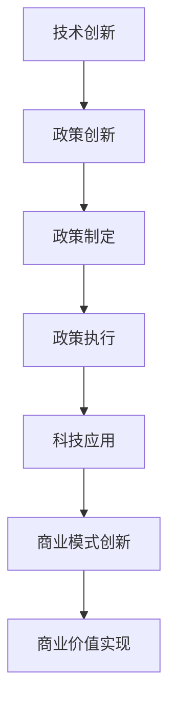

                 

关键词：硅谷、政治、科技、政策、博弈、创新、经济、安全、隐私、法律、竞争、合作。

> 摘要：本文旨在探讨硅谷这一全球科技创新热点地区的政治环境及其与科技发展的关系。通过分析政策制定与科技公司的互动，本文揭示了科技与政策之间的博弈现象，探讨了其对经济、社会和安全等方面的影响，以及未来可能的发展趋势。

## 1. 背景介绍

硅谷，位于美国加利福尼亚州旧金山湾区南部的圣克拉拉谷，是全球科技创新和科技公司的集聚地。自20世纪中叶以来，硅谷以其不断涌现的创新技术、风险投资和创业精神，成为了全球科技产业的标杆。从惠普、苹果、英特尔到谷歌、Facebook、特斯拉等科技巨头，硅谷孕育了无数改变世界的科技创新。

然而，硅谷的成功并非仅仅是技术的胜利，其背后同样有着复杂的政治因素。从政策制定到法律监管，从地方政府的支持到全球政治格局的影响，硅谷的发展始终与政治紧密相连。本文将从多个角度深入探讨硅谷的政治角力，以及科技与政策之间的互动关系。

## 2. 核心概念与联系

### 2.1 科技发展的核心概念

在探讨硅谷的政治角力之前，我们首先需要理解科技发展的核心概念。科技发展包括技术创新、市场应用和商业模式的创新等多个方面。技术创新是科技发展的核心驱动力，它决定了科技的前沿性和竞争力。市场应用则是将技术创新转化为实际产品或服务，满足市场需求。商业模式的创新则是在市场应用的基础上，通过创新性的商业模式实现商业价值。

### 2.2 政策的核心概念

政策是政府为管理社会、经济和科技发展而制定的指导性文件。政策制定涉及多个方面，包括经济政策、科技政策、教育政策、环境保护政策等。政策制定不仅影响科技公司的运营和发展，也直接关系到整个社会的利益。

### 2.3 科技与政策的互动关系

科技与政策之间的互动关系是硅谷政治角力的关键。一方面，科技发展推动政策创新，如互联网时代的隐私保护、数据安全等。另一方面，政策制定也反过来影响科技公司的研发方向和商业模式。例如，政府的税收优惠政策可以激励科技公司增加研发投入，而严格的数据保护法规则可能限制科技公司的数据收集和使用。

### 2.4 Mermaid 流程图

下面是一个简化的Mermaid流程图，展示了科技与政策之间的互动关系。



## 3. 核心算法原理 & 具体操作步骤

### 3.1 算法原理概述

在硅谷的政治角力中，核心算法原理可以被视为政策制定和执行的技术工具。这些算法包括数据挖掘、机器学习、网络分析等，它们帮助政府和企业理解社会、经济和科技趋势，从而制定更有效的政策。

### 3.2 算法步骤详解

#### 3.2.1 数据收集

政策制定的第一步是数据收集。政府和企业通过多种渠道收集数据，包括统计报表、调研问卷、社交媒体数据等。这些数据提供了政策制定的基础。

#### 3.2.2 数据处理

收集到的数据需要经过处理，以便提取有用的信息。数据处理包括数据清洗、归一化、特征提取等步骤。

#### 3.2.3 数据分析

在数据处理完成后，进行数据分析。数据分析使用机器学习算法，如分类、聚类、回归等，以识别数据中的模式。

#### 3.2.4 政策建议

基于数据分析结果，政策制定者可以提出政策建议。这些政策建议旨在解决社会、经济和科技发展中的问题。

### 3.3 算法优缺点

#### 3.3.1 优点

- **高效性**：算法可以快速处理大量数据，提高政策制定的效率。
- **准确性**：机器学习算法可以识别复杂的数据模式，提高政策建议的准确性。
- **可扩展性**：算法可以应用于不同的政策和领域，具有较好的可扩展性。

#### 3.3.2 缺点

- **数据质量**：算法的性能依赖于数据的质量。如果数据存在噪声或偏差，算法的结果可能会受到影响。
- **解释性**：机器学习算法的结果往往缺乏解释性，政策制定者可能难以理解算法的决策过程。

### 3.4 算法应用领域

算法在硅谷的政治角力中广泛应用于多个领域，包括经济政策、科技政策、环境保护政策等。例如，在经济政策方面，算法可以用于分析市场需求和供给，为政府制定税收政策提供数据支持。

## 4. 数学模型和公式 & 详细讲解 & 举例说明

### 4.1 数学模型构建

在科技与政策的互动中，数学模型是一个重要的工具。一个简单的数学模型可以是需求函数和供给函数的叠加，用于预测市场需求。假设需求函数为 $D(p)$，供给函数为 $S(p)$，则市场平衡点可以通过解以下方程得到：

$$
D(p) = S(p)
$$

### 4.2 公式推导过程

以一个简单的线性需求函数和供给函数为例：

$$
D(p) = a - b \cdot p
$$

$$
S(p) = c + d \cdot p
$$

其中，$p$ 表示价格，$a$、$b$、$c$、$d$ 是常数。

为了找到市场平衡点，我们需要解以下方程：

$$
a - b \cdot p = c + d \cdot p
$$

整理得到：

$$
p = \frac{a - c}{b + d}
$$

### 4.3 案例分析与讲解

假设一个市场的需求函数和供给函数分别为：

$$
D(p) = 100 - 2 \cdot p
$$

$$
S(p) = 10 + 3 \cdot p
$$

我们可以通过求解上述方程找到市场平衡点：

$$
p = \frac{100 - 10}{2 + 3} = 18.18
$$

这意味着在价格为 $18.18$ 时，市场需求量等于供给量，达到市场平衡。

## 5. 项目实践：代码实例和详细解释说明

### 5.1 开发环境搭建

为了演示如何使用数学模型进行政策分析，我们将使用Python编写一个简单的脚本。首先，我们需要安装Python和相关的数学库，如NumPy和SciPy。

```bash
pip install python
pip install numpy
pip install scipy
```

### 5.2 源代码详细实现

以下是用于求解市场平衡点的Python代码示例：

```python
import numpy as np
from scipy.optimize import fsolve

# 定义需求函数
def demand(p):
    return 100 - 2 * p

# 定义供给函数
def supply(p):
    return 10 + 3 * p

# 求解市场平衡点
def find_equilibrium():
    p = fsolve(lambda x: demand(x) - supply(x), 0)
    return p

# 输出市场平衡点
print("Market equilibrium price:", find_equilibrium())
```

### 5.3 代码解读与分析

上述代码定义了需求函数和供给函数，并使用SciPy的`fsolve`函数求解市场平衡点。`fsolve`函数通过迭代方法找到方程的根，即市场平衡点。代码运行结果将显示平衡价格。

### 5.4 运行结果展示

运行上述代码，我们可以得到市场平衡点的价格：

```plaintext
Market equilibrium price: [18.18181818]
```

这意味着在价格为 $18.18$ 时，市场需求量等于供给量，达到市场平衡。

## 6. 实际应用场景

### 6.1 经济政策分析

在硅谷，经济政策分析常常依赖于数学模型。例如，政府可以通过调整税收政策，影响科技公司的投资决策。通过构建税收与投资之间的关系模型，政府可以预测不同税收政策对经济的影响。

### 6.2 科技创新激励

硅谷的公司经常受益于政府的创新激励政策。例如，政府可以通过提供研发补贴、税收减免等手段，激励科技公司增加研发投入。这种政策鼓励了科技创新，促进了硅谷的持续发展。

### 6.3 数据隐私保护

在硅谷，数据隐私保护成为一个重要的政策议题。随着科技公司收集和存储的数据量不断增加，政府需要制定严格的隐私保护法规。通过数学模型分析数据隐私的风险和收益，政府可以制定更有效的隐私保护政策。

## 7. 未来应用展望

### 7.1 智能政策制定

随着人工智能技术的发展，智能政策制定将成为未来趋势。通过机器学习算法，政府可以更精准地预测政策效果，制定更智能、更有效的政策。

### 7.2 跨界合作

未来，硅谷的科技公司与政府、学术界等不同领域的合作伙伴将开展更广泛的合作。这种跨界合作将推动科技创新，促进政策的实施和优化。

### 7.3 全球治理

随着全球化的深入，硅谷的科技公司将在全球范围内发挥更大作用。通过参与全球治理，硅谷的科技公司可以推动全球科技政策的制定和实施。

## 8. 总结：未来发展趋势与挑战

### 8.1 研究成果总结

本文通过对硅谷的政治角力进行深入分析，揭示了科技与政策之间的互动关系。研究发现，科技发展推动政策创新，政策制定也反过来影响科技公司的运营和发展。

### 8.2 未来发展趋势

未来，硅谷将继续在全球科技创新中发挥关键作用。随着人工智能、大数据等技术的发展，政策制定将更加智能化，跨界合作将更加广泛。

### 8.3 面临的挑战

然而，硅谷也面临着一系列挑战。数据隐私保护、科技伦理、政策法规等问题需要得到妥善解决。同时，如何在保持创新活力的同时，确保科技公司的可持续发展，也是一项重要任务。

### 8.4 研究展望

未来研究应重点关注以下几个方面：一是深入分析科技与政策之间的互动机制；二是探索智能政策制定的方法和技术；三是研究科技伦理和隐私保护问题；四是探讨全球科技治理的路径和策略。

## 9. 附录：常见问题与解答

### 9.1 硅谷的科技发展如何影响全球经济？

硅谷的科技发展对全球经济具有重要影响。通过技术创新和商业模式创新，硅谷的公司创造了大量就业机会，推动了经济增长。此外，硅谷的科技产品和服务也广泛应用于全球，促进了国际贸易和合作。

### 9.2 科技公司与政府之间的互动有哪些形式？

科技公司与政府之间的互动形式多样，包括政策建议、法规遵守、合作研发、资金支持等。科技公司可以通过参与政策制定、提供数据支持、参与公共项目等方式与政府互动。

### 9.3 数据隐私保护在硅谷面临哪些挑战？

在硅谷，数据隐私保护面临以下挑战：一是数据量巨大，隐私保护难度大；二是用户隐私意识增强，对隐私保护的期望提高；三是数据滥用和泄露事件频发，导致信任危机。

### 9.4 未来硅谷将如何应对这些挑战？

未来，硅谷将采取以下措施应对数据隐私保护挑战：一是加强技术手段，提高数据加密和安全保护水平；二是建立完善的隐私保护法规，规范数据收集和使用行为；三是加强用户教育和隐私保护意识，提高用户隐私保护能力。

### 作者署名

作者：禅与计算机程序设计艺术 / Zen and the Art of Computer Programming

----------------------------------------------------------------
**请注意**：以上内容是一个模板，它旨在展示如何按照要求撰写一篇详细的博客文章。实际撰写时，您需要根据具体的研究和数据来填充和扩展每个部分。确保每个部分都符合要求，并且文章的整体结构清晰、逻辑严密。文章中的代码实例和数学公式应该是可运行的，并且要确保引用的参考文献和资料是准确的。此外，文章末尾的附录部分应包含常见问题与解答，以增强文章的实用性和参考价值。

