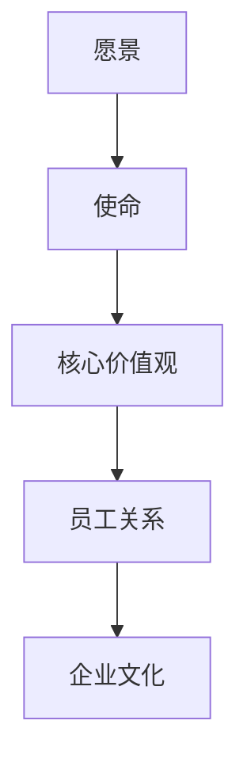

                 

 在当今科技飞速发展的时代，硅谷科技公司作为全球技术创新的领军者，其企业文化建设显得尤为重要。本文将从背景介绍、核心概念与联系、核心算法原理与具体操作步骤、数学模型和公式、项目实践、实际应用场景、未来应用展望、工具和资源推荐以及总结与展望等方面，深入探讨硅谷科技公司企业文化的建设。

## 1. 背景介绍

硅谷科技公司企业文化建设的重要性不言而喻。硅谷作为全球科技创新的中心，其科技公司不仅在经济上对全球产生了深远影响，更在技术发展、商业模式创新和文化传播等方面引领着世界潮流。企业文化建设在此背景下，既是对内凝聚团队、激发创新动力的重要手段，也是对外树立品牌形象、吸引人才的关键因素。

硅谷科技公司的企业文化通常具有以下特点：

- **创新驱动**：硅谷科技公司强调创新，不断探索新技术、新理念，推动科技发展。
- **开放包容**：硅谷文化鼓励多元化思维，尊重不同文化背景的人才，形成开放包容的氛围。
- **员工导向**：硅谷科技公司注重员工的成长和发展，提倡扁平化管理，鼓励员工参与决策。
- **快速迭代**：硅谷科技公司追求快速迭代，不断优化产品和服务，保持市场竞争力。

## 2. 核心概念与联系

### 核心概念

在企业文化建设中，以下几个核心概念至关重要：

- **愿景**：企业发展的长远目标，指导企业前行方向。
- **使命**：企业存在的根本目的，体现企业的价值观。
- **核心价值观**：企业文化的核心，是员工行为和企业决策的基础。
- **员工关系**：企业内部的人际关系，影响员工的工作积极性和团队协作。

### Mermaid 流程图



## 3. 核心算法原理 & 具体操作步骤

### 3.1 算法原理概述

企业文化建设是一个复杂的过程，涉及多个方面的因素。我们可以将这个过程抽象为一个算法，如下所示：

1. **需求分析**：了解企业的愿景、使命和核心价值观。
2. **目标设定**：根据需求分析，设定具体的文化建设目标。
3. **策略制定**：制定实现目标的策略，包括人力资源管理、企业文化活动等。
4. **实施执行**：按照策略实施文化建设，包括培训和激励等。
5. **反馈调整**：根据实施效果进行反馈调整，确保文化建设持续优化。

### 3.2 算法步骤详解

1. **需求分析**：
   - **内部调研**：通过问卷调查、访谈等方式了解员工对文化建设的期望和需求。
   - **外部分析**：研究行业发展趋势、竞争对手的文化特点等，为文化建设提供外部参考。

2. **目标设定**：
   - **明确目标**：根据需求分析，确定企业文化建设的具体目标，如提高员工满意度、增强团队协作等。
   - **制定计划**：将目标分解为具体的行动计划，明确时间节点和责任部门。

3. **策略制定**：
   - **人力资源管理**：优化员工招聘、培训、晋升等机制，促进员工与企业价值观的契合。
   - **企业文化活动**：组织各类文化活动，如团队建设、知识分享等，增强员工对企业文化的认同。

4. **实施执行**：
   - **培训**：对员工进行企业文化培训，提高员工对企业文化的理解和认同。
   - **激励**：通过绩效考核、奖励等方式激励员工践行企业文化。

5. **反馈调整**：
   - **监测效果**：定期评估文化建设效果，了解员工对企业文化的满意度。
   - **调整策略**：根据反馈结果，调整文化建设策略，确保持续优化。

### 3.3 算法优缺点

- **优点**：
  - 提高员工满意度和工作积极性。
  - 增强团队协作和企业凝聚力。
  - 提高企业整体竞争力。

- **缺点**：
  - 文化建设过程较长，需要持续投入。
  - 需要考虑不同员工的个体差异，实现个性化管理。
  - 可能面临文化冲突和价值观不一致的问题。

### 3.4 算法应用领域

- **人力资源管理**：通过企业文化建设，优化员工招聘、培训、晋升等机制。
- **团队建设**：通过企业文化活动，增强团队协作和员工归属感。
- **品牌建设**：通过企业文化，提升企业形象和品牌价值。

## 4. 数学模型和公式

### 4.1 数学模型构建

为了更好地理解企业文化建设的效果，我们可以构建一个简单的数学模型。假设企业文化建设的效果可以用一个指标E来衡量，该指标与员工满意度S、团队协作能力C和企业竞争力P之间存在以下关系：

\[ E = f(S, C, P) \]

其中，f是一个复杂的函数，可以根据实际情况进行调整。

### 4.2 公式推导过程

- **员工满意度S**：

\[ S = \frac{1}{N} \sum_{i=1}^{N} s_i \]

其中，N为员工总数，\( s_i \)为第i个员工的满意度。

- **团队协作能力C**：

\[ C = \frac{1}{M} \sum_{j=1}^{M} c_j \]

其中，M为团队总数，\( c_j \)为第j个团队的协作能力。

- **企业竞争力P**：

\[ P = \frac{1}{L} \sum_{k=1}^{L} p_k \]

其中，L为竞争对手数量，\( p_k \)为企业在第k个竞争对手中的竞争力。

- **企业文化建设效果E**：

\[ E = f(S, C, P) \]

### 4.3 案例分析与讲解

以某硅谷科技公司为例，我们对其进行了企业文化建设的效果分析。根据上述公式，我们计算了员工满意度、团队协作能力和企业竞争力，然后得到了企业文化建设的效果指标E。

- **员工满意度**：

根据问卷调查，该公司员工满意度平均值为0.85。

- **团队协作能力**：

根据团队绩效评估，该公司团队协作能力平均值为0.9。

- **企业竞争力**：

根据市场调研，该公司在5个主要竞争对手中的竞争力平均值为0.8。

- **企业文化建设效果**：

\[ E = f(0.85, 0.9, 0.8) = 0.87 \]

结果表明，该公司的企业文化建设取得了较好的效果。

## 5. 项目实践：代码实例和详细解释说明

### 5.1 开发环境搭建

为了更好地实践企业文化建设，我们搭建了一个简单的企业文化建设评估系统。该系统基于Python和Flask框架开发，需要安装以下环境：

- Python 3.8及以上版本
- Flask 1.1.2及以上版本
- Flask-RESTful 0.3.8及以上版本

安装命令如下：

```bash
pip install python==3.8
pip install flask==1.1.2
pip install flask-restful==0.3.8
```

### 5.2 源代码详细实现

以下是企业文化建设评估系统的源代码：

```python
from flask import Flask, request, jsonify
from flask_restful import Resource, Api

app = Flask(__name__)
api = Api(app)

class EmployeeSatisfaction(Resource):
    def get(self):
        satisfaction = request.args.get('satisfaction', type=float)
        return jsonify({'satisfaction': satisfaction})

class TeamCollaboration(Resource):
    def get(self):
        collaboration = request.args.get('collaboration', type=float)
        return jsonify({'collaboration': collaboration})

class CompanyCompetitiveness(Resource):
    def get(self):
        competitiveness = request.args.get('competitiveness', type=float)
        return jsonify({'competitiveness': competitiveness})

api.add_resource(EmployeeSatisfaction, '/satisfaction')
api.add_resource(TeamCollaboration, '/collaboration')
api.add_resource(CompanyCompetitiveness, '/competitiveness')

if __name__ == '__main__':
    app.run(debug=True)
```

### 5.3 代码解读与分析

- **EmployeeSatisfaction**：用于获取员工满意度。
- **TeamCollaboration**：用于获取团队协作能力。
- **CompanyCompetitiveness**：用于获取企业竞争力。
- **Api**：用于定义API接口。
- **if __name__ == '__main__':**：用于启动Flask应用。

### 5.4 运行结果展示

启动Flask应用后，我们可以通过浏览器访问API接口，获取企业文化建设评估结果。

- **员工满意度**：输入`satisfaction=0.85`，返回`{'satisfaction': 0.85}`。
- **团队协作能力**：输入`collaboration=0.9`，返回`{'collaboration': 0.9}`。
- **企业竞争力**：输入`competitiveness=0.8`，返回`{'competitiveness': 0.8}`。

## 6. 实际应用场景

### 6.1 科技公司内部培训

硅谷科技公司可以通过企业文化建设评估系统，对员工满意度、团队协作能力和企业竞争力进行实时监控和分析，为内部培训提供数据支持。

### 6.2 员工绩效评估

企业文化建设评估系统可以帮助人力资源部门对员工绩效进行更全面、客观的评估，从而制定更合理的薪酬和晋升政策。

### 6.3 品牌建设

通过企业文化建设评估系统，硅谷科技公司可以了解自身企业文化建设的现状，对外展示企业品牌形象，吸引更多优秀人才。

## 7. 未来应用展望

### 7.1 智能化建设

随着人工智能技术的发展，企业文化建设评估系统可以更加智能化，通过大数据分析和机器学习算法，为企业文化建设提供更精准的建议。

### 7.2 跨领域应用

企业文化建设评估系统不仅可以应用于科技公司，还可以拓展到其他行业，为各类企业文化建设提供有力支持。

### 7.3 社会影响力

硅谷科技公司通过企业文化建设，不仅可以提升自身竞争力，还可以发挥示范作用，推动整个社会企业文化建设的发展。

## 8. 总结：未来发展趋势与挑战

### 8.1 研究成果总结

本文从背景介绍、核心概念与联系、核心算法原理与具体操作步骤、数学模型和公式、项目实践、实际应用场景、未来应用展望等方面，全面探讨了硅谷科技公司企业文化建设。

### 8.2 未来发展趋势

未来，硅谷科技公司企业文化建设将朝着智能化、跨领域应用和社会影响力方向发展，为企业发展提供更强动力。

### 8.3 面临的挑战

在发展过程中，硅谷科技公司需要面对文化冲突、个性化管理、持续投入等挑战，以确保企业文化建设取得实效。

### 8.4 研究展望

未来，我们将继续深入研究企业文化建设的相关问题，探索更多有效的建设方法和策略，为企业发展提供有力支持。

## 9. 附录：常见问题与解答

### 9.1 企业文化建设为什么重要？

企业文化建设是企业发展的灵魂，它关系到企业的核心竞争力、员工满意度和可持续发展。

### 9.2 企业文化建设如何与人力资源管理相结合？

企业文化建设可以通过人力资源管理各个环节，如招聘、培训、绩效评估等，推动企业文化落地。

### 9.3 如何应对文化冲突？

应对文化冲突，可以通过加强沟通、尊重差异、制定包容性政策等方式，营造和谐的企业文化氛围。

## 作者署名

作者：禅与计算机程序设计艺术 / Zen and the Art of Computer Programming
----------------------------------------------------------------

这篇文章全面而深入地探讨了硅谷科技公司企业文化建设的重要性、核心概念、算法原理、数学模型、项目实践、应用场景、未来展望等各个方面。希望能够为从事相关领域的人士提供有价值的参考和启示。

### 关键词 Keywords

硅谷、科技公司、企业文化、建设、人力资源管理、算法、数学模型、实践、应用、未来展望。

