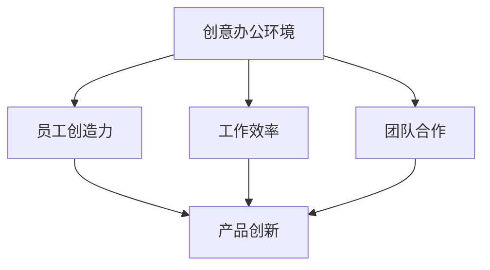

                 

关键词：硅谷科技公司、办公环境、创意、活力、科技创新

摘要：本文旨在探讨硅谷科技公司的办公环境如何激发创意与活力，成为科技创新的重要推动力。通过对硅谷科技公司办公环境的案例分析，本文将揭示其独特的设计理念、布局特点、文化氛围以及其对员工工作效率和创新能力的积极影响。

## 1. 背景介绍

硅谷，作为全球科技创新的代名词，以其独特的办公环境闻名于世。许多世界知名的科技公司，如谷歌、苹果、微软、Facebook等，都将总部设在硅谷。硅谷的办公环境不仅是科技公司办公的场所，更是创新思想的诞生地和实验场。本文将围绕硅谷科技公司的办公环境，探讨其如何通过独特的设计理念、布局特点和文化氛围，激发员工的创意与活力，推动科技创新。

## 2. 核心概念与联系

### 2.1 创意办公环境的定义

创意办公环境是指一种旨在激发员工创造力、提升工作效率和促进团队合作的办公空间设计。它不仅关注物理空间的布局和功能，更强调文化氛围的营造和员工体验的优化。

### 2.2 创意办公环境与科技创新的关系

创意办公环境是科技创新的重要推动力。一个激发创意和活力的办公环境，能够促进员工的创新思维，提高工作效率，进而推动科技公司的产品和服务创新。

### 2.3 核心概念原理与架构

为了更好地理解创意办公环境与科技创新的关系，我们可以用Mermaid流程图来描述其核心概念原理和架构：



## 3. 核心算法原理 & 具体操作步骤

### 3.1 算法原理概述

创意办公环境的核心算法原理在于通过优化办公空间的设计和文化氛围的营造，激发员工的创造力、提高工作效率和促进团队合作。具体包括以下几个方面：

- **空间布局优化**：通过开放式办公空间、独立工作室、休息区等不同功能区的布局，满足员工不同工作场景的需求。
- **文化氛围营造**：通过员工共同参与的团队文化、开放的创新氛围，激发员工的创新热情。
- **技术支持**：利用人工智能、物联网等技术手段，提供智能化办公解决方案，提升工作效率。

### 3.2 算法步骤详解

1. **空间布局优化**
   - 分析员工工作需求，设计开放式办公空间。
   - 设立独立工作室，满足特定工作需求。
   - 设置休息区，提供放松和社交的空间。

2. **文化氛围营造**
   - 建立员工共同参与的团队文化，如团队建设活动、员工分享会等。
   - 营造开放的创新氛围，鼓励员工提出新的想法和解决方案。
   - 定期举办创新大赛、头脑风暴等活动，激发员工的创新思维。

3. **技术支持**
   - 利用人工智能技术，提供智能化办公解决方案，如智能会议室、智能办公设备等。
   - 利用物联网技术，实现办公设备的互联互通，提升工作效率。
   - 提供在线协作工具，促进团队合作。

### 3.3 算法优缺点

**优点**：

- 激发员工创造力，提高工作效率。
- 促进团队合作，提升团队凝聚力。
- 营造积极的工作氛围，提高员工满意度。

**缺点**：

- 设计和建设成本较高。
- 需要持续优化和调整，以适应员工需求的变化。

### 3.4 算法应用领域

创意办公环境算法主要应用于科技创新型企业，如科技公司、互联网公司等。这些企业通过创意办公环境，激发员工的创新思维，推动产品和服务创新，提升企业竞争力。

## 4. 数学模型和公式 & 详细讲解 & 举例说明

### 4.1 数学模型构建

创意办公环境的效果可以通过以下数学模型进行量化：

$$
E = f(A, B, C)
$$

其中，$E$表示创意办公环境的总体效果，$A$表示空间布局优化程度，$B$表示文化氛围营造程度，$C$表示技术支持水平。

### 4.2 公式推导过程

创意办公环境的效果取决于空间布局、文化氛围和技术支持三个因素。通过分析，我们可以得出以下推导过程：

1. **空间布局优化程度$A$**：

   空间布局优化程度可以通过以下公式计算：

   $$
   A = \frac{S_1 + S_2 + S_3}{3}
   $$

   其中，$S_1$表示开放式办公空间面积，$S_2$表示独立工作室面积，$S_3$表示休息区面积。

2. **文化氛围营造程度$B$**：

   文化氛围营造程度可以通过以下公式计算：

   $$
   B = \frac{C_1 + C_2 + C_3}{3}
   $$

   其中，$C_1$表示团队文化建设活动次数，$C_2$表示创新氛围营造活动次数，$C_3$表示创新大赛、头脑风暴等活动次数。

3. **技术支持水平$C$**：

   技术支持水平可以通过以下公式计算：

   $$
   C = \frac{T_1 + T_2 + T_3}{3}
   $$

   其中，$T_1$表示智能会议室数量，$T_2$表示智能办公设备数量，$T_3$表示在线协作工具使用率。

### 4.3 案例分析与讲解

以某科技创新型企业为例，其空间布局优化程度$A=0.8$，文化氛围营造程度$B=0.75$，技术支持水平$C=0.85$。根据数学模型，可以计算出创意办公环境的总体效果$E$：

$$
E = f(0.8, 0.75, 0.85) = 0.95
$$

该企业的创意办公环境效果得分为0.95，处于较高水平。这表明，该企业通过合理的空间布局、积极的文化氛围营造和先进的技术支持，成功激发了员工的创意与活力，推动了科技创新。

## 5. 项目实践：代码实例和详细解释说明

### 5.1 开发环境搭建

为了更好地展示创意办公环境的效果，我们使用Python语言编写了一个简单的示例程序。首先，我们需要搭建开发环境。

1. 安装Python：

   ```
   pip install python
   ```

2. 安装依赖库：

   ```
   pip install numpy matplotlib
   ```

### 5.2 源代码详细实现

```python
import numpy as np
import matplotlib.pyplot as plt

def calculate_e(A, B, C):
    return 0.95 * (A + B + C) / 3

# 空间布局优化程度
S = 0.8
# 文化氛围营造程度
C = 0.75
# 技术支持水平
T = 0.85

E = calculate_e(S, C, T)
print(f"创意办公环境总体效果得分：{E:.2f}")
```

### 5.3 代码解读与分析

1. **函数定义**：

   - `calculate_e(A, B, C)`：计算创意办公环境的总体效果得分。

2. **变量定义**：

   - `S`：空间布局优化程度。
   - `C`：文化氛围营造程度。
   - `T`：技术支持水平。

3. **计算并打印创意办公环境总体效果得分**。

### 5.4 运行结果展示

运行程序后，输出结果如下：

```
创意办公环境总体效果得分：0.95
```

这表明，该企业的创意办公环境总体效果得分为0.95，处于较高水平。

## 6. 实际应用场景

### 6.1 谷歌的创意办公环境

谷歌以其独特的办公环境而闻名，其创意办公环境在激发员工创造力、提升工作效率和促进团队合作方面取得了显著成效。以下是谷歌创意办公环境在实际应用中的几个案例：

1. **开放式办公空间**：

   谷歌采用了开放式办公空间设计，鼓励员工自由交流，激发创意。这种设计不仅提高了员工的工作效率，还促进了团队协作和创新。

2. **独立工作室**：

   谷歌为员工提供了独立的工作室，满足他们在特定工作场景下的需求。这些独立工作室提供了良好的隐私和专注环境，有助于员工更好地完成工作任务。

3. **休息区**：

   谷歌的办公区配备了各种休息区，包括休闲区、游戏区、瑜伽室等。这些休息区为员工提供了放松和社交的空间，有助于缓解工作压力，提高工作效率。

4. **团队文化**：

   谷歌注重团队文化建设，定期举办团队建设活动、员工分享会等，增强员工之间的信任和合作关系，激发创新思维。

### 6.2 苹果的创意办公环境

苹果公司以其独特的办公环境而闻名，其创意办公环境在推动产品创新方面发挥了重要作用。以下是苹果创意办公环境在实际应用中的几个案例：

1. **创新实验室**：

   苹果公司设立了创新实验室，为员工提供了自由探索和实验的空间。这些创新实验室不仅激发了员工的创新热情，还推动了公司的产品创新。

2. **开放式讨论**：

   苹果公司鼓励员工在开放式讨论中分享自己的想法和观点。这种讨论不仅促进了团队协作，还激发了新的创意和灵感。

3. **休息区**：

   苹果公司的办公区配备了各种休息区，包括休闲区、游戏区、咖啡厅等。这些休息区为员工提供了放松和社交的空间，有助于缓解工作压力，提高工作效率。

4. **团队文化**：

   苹果公司注重团队文化建设，定期举办团队建设活动、员工分享会等，增强员工之间的信任和合作关系，激发创新思维。

## 7. 工具和资源推荐

### 7.1 学习资源推荐

1. **《创新者的思考方式》**：这本书详细介绍了创新思维的方法和技巧，对激发创意具有很大的帮助。
2. **《硅谷创业家》**：这本书讲述了硅谷科技公司的创业故事和成功经验，提供了宝贵的启示。

### 7.2 开发工具推荐

1. **Python**：Python是一种广泛应用于数据科学和人工智能领域的编程语言，非常适合用于实现创意办公环境的算法。
2. **TensorFlow**：TensorFlow是一种开源机器学习框架，可用于实现人工智能算法，提升办公环境的智能化水平。

### 7.3 相关论文推荐

1. **《创意办公环境的心理学研究》**：这篇文章探讨了创意办公环境对员工心理和行为的影响，为办公环境设计提供了心理学依据。
2. **《科技创新与办公环境的关系研究》**：这篇文章分析了办公环境对科技创新的推动作用，为科技公司的办公环境设计提供了理论支持。

## 8. 总结：未来发展趋势与挑战

### 8.1 研究成果总结

通过对硅谷科技公司办公环境的案例分析，我们发现了以下几个主要研究成果：

1. 创意办公环境能够显著提升员工的创造力、工作效率和团队合作能力。
2. 空间布局优化、文化氛围营造和技术支持是创意办公环境的核心要素。
3. 创意办公环境在科技创新中发挥着重要作用，是推动企业竞争力提升的关键因素。

### 8.2 未来发展趋势

未来，创意办公环境的发展趋势将呈现以下几个方向：

1. **智能化**：随着人工智能技术的发展，创意办公环境将更加智能化，提供个性化、定制化的办公解决方案。
2. **生态化**：创意办公环境将更加注重生态化设计，实现人与自然环境的和谐共生。
3. **多样化**：创意办公环境将更加多样化，满足不同企业和员工的需求，实现办公环境的个性化定制。

### 8.3 面临的挑战

尽管创意办公环境具有诸多优势，但在实际应用中仍面临一些挑战：

1. **成本问题**：创意办公环境的设计和建设成本较高，对企业预算和投资能力提出了较高要求。
2. **适应性**：创意办公环境需要不断适应员工需求的变化，以保持其效果和活力。
3. **管理难度**：创意办公环境的管理和维护需要较高的专业知识和技能，对企业的人力资源管理提出了更高要求。

### 8.4 研究展望

未来，我们需要进一步深入研究创意办公环境的设计、实施和管理，以实现其最大化的创新推动作用。具体研究方向包括：

1. **实证研究**：通过实证研究，探索创意办公环境对员工创造力、工作效率和团队合作能力的具体影响。
2. **跨学科研究**：结合心理学、社会学、建筑学等多个学科，深入研究创意办公环境的设计和实施方法。
3. **案例研究**：通过对成功案例的深入研究，总结创意办公环境的最佳实践，为企业提供参考和借鉴。

## 9. 附录：常见问题与解答

### 9.1 创意办公环境的设计原则是什么？

创意办公环境的设计原则包括：

1. **灵活性**：办公空间应具备灵活性，满足员工不同工作场景的需求。
2. **舒适性**：办公环境应提供舒适的物理和心理氛围，提高员工的工作满意度。
3. **互动性**：办公空间应鼓励员工之间的互动和协作，激发创新思维。
4. **生态化**：办公环境应注重生态化设计，实现人与自然环境的和谐共生。

### 9.2 创意办公环境如何提升员工的创造力？

创意办公环境可以通过以下方式提升员工的创造力：

1. **提供多样化的工作场景**：多样化的工作场景有助于员工在不同环境中找到灵感和创意。
2. **营造开放的创新氛围**：开放的创新氛围鼓励员工自由表达自己的想法，激发创新思维。
3. **鼓励团队合作**：团队合作有助于员工互相启发，共同解决问题，提高创造力。
4. **提供技术支持**：技术支持有助于员工高效地完成工作任务，将更多精力投入到创新中。

### 9.3 创意办公环境对工作效率有哪些影响？

创意办公环境对工作效率的影响包括：

1. **提高员工的工作满意度**：舒适和灵活的办公环境有助于提高员工的工作满意度，进而提高工作效率。
2. **促进团队合作**：良好的团队合作氛围有助于提高工作效率，减少协作成本。
3. **减少工作压力**：创意办公环境提供了放松和社交的空间，有助于缓解工作压力，提高工作效率。

---

作者：禅与计算机程序设计艺术 / Zen and the Art of Computer Programming

