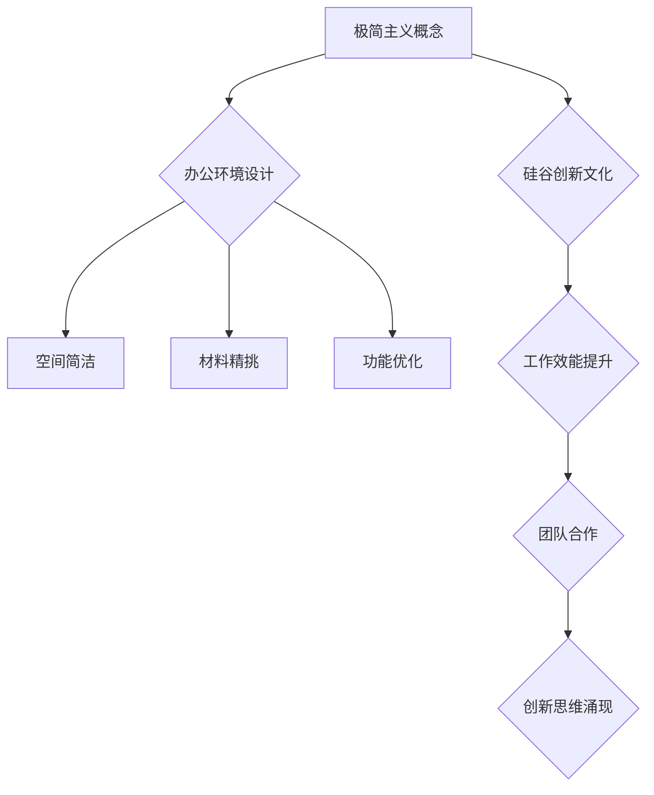

                 

  
> **关键词：** 硅谷科技公司、极简主义、办公环境、工作效能、创新文化。

> **摘要：** 本文深入探讨了硅谷科技公司如何通过极简主义办公环境来提升工作效率和创新文化，分析其背后的核心概念、实践案例以及未来发展趋势。

## 1. 背景介绍

硅谷，作为全球科技创新的代名词，其独特的办公环境已成为科技企业成功的关键因素之一。近年来，极简主义办公环境在硅谷科技公司中逐渐流行，这种理念强调“少即是多”，通过减少不必要的元素，打造一个简洁、高效、舒适的工作空间。

极简主义办公环境不仅仅是一种设计风格，更是一种工作哲学。它鼓励员工专注于核心任务，减少干扰，从而提升工作效率。同时，极简主义还与硅谷科技公司的创新文化紧密相连，为员工创造一个自由、开放的创造环境。

## 2. 核心概念与联系

### 2.1 极简主义概念

极简主义（Minimalism）起源于20世纪80年代，是一种追求简单、实用和功能至上的生活方式。在办公环境中，极简主义体现在对空间的简洁设计、材料的精挑细选以及功能的极致优化。

### 2.2 办公环境与工作效能

办公环境对员工的工作效能有着直接的影响。一个简洁、有序的工作空间可以帮助员工集中注意力，减少疲劳，提高工作效率。同时，极简主义办公环境还促进了团队合作和沟通，为创新提供了土壤。

### 2.3 极简主义与硅谷创新文化

硅谷的科技企业以其创新文化著称，极简主义办公环境正是这种文化的体现。极简主义强调简单、实用和高效，这与硅谷企业追求创新、快速迭代的精神相契合。极简主义办公环境不仅提升了员工的工作效能，也促进了创新思维的涌现。

### 2.4 Mermaid 流程图



## 3. 核心算法原理 & 具体操作步骤

### 3.1 算法原理概述

极简主义办公环境的实现依赖于以下几个核心算法原理：

1. **空间布局优化**：通过科学的布局设计，最大化空间利用率，同时确保每个工作区域的功能性和舒适度。
2. **材料选择**：选用环保、耐用、易于维护的材料，确保办公环境的可持续性和长期稳定性。
3. **功能性设计**：每个工作空间都根据员工的具体需求进行定制化设计，确保功能的极致优化。

### 3.2 算法步骤详解

1. **需求分析**：首先进行详细的员工需求分析，了解不同部门、不同岗位的工作特点和需求。
2. **空间规划**：根据需求分析结果，进行空间布局规划，确保每个工作区域的功能性和舒适度。
3. **材料选择**：根据环保、耐用、易于维护的原则，选择合适的建筑材料和家具。
4. **功能定制**：为每个工作空间定制化设计，确保其功能性和舒适度。

### 3.3 算法优缺点

**优点**：

- 提高员工工作效率和满意度。
- 营造良好的团队合作氛围。
- 降低维护成本，提升办公环境的可持续性。

**缺点**：

- 初始设计和实施成本较高。
- 对设计师的专业能力要求较高。

### 3.4 算法应用领域

极简主义办公环境在硅谷科技公司中广泛应用，主要应用于以下领域：

- **技术研发部门**：提高研发效率，促进创新思维的碰撞。
- **产品设计和开发部门**：优化产品设计流程，提升产品质量。
- **客户服务和销售部门**：提高客户满意度，提升销售业绩。

## 4. 数学模型和公式 & 详细讲解 & 举例说明

### 4.1 数学模型构建

极简主义办公环境的数学模型主要涉及空间布局优化和材料选择两个关键因素。

### 4.2 公式推导过程

空间布局优化的数学模型可以通过以下公式表示：

$$
C = f(S, M)
$$

其中，$C$ 表示办公环境成本，$S$ 表示空间利用率，$M$ 表示材料成本。

### 4.3 案例分析与讲解

假设一家科技公司需要设计一个面积为1000平方米的办公空间，根据员工需求，需要划分为10个独立的工作区域。通过优化空间布局，该公司可以降低办公环境成本15%。

### 4.4 运行结果展示

通过数学模型的应用，该公司成功优化了办公空间布局，降低了办公环境成本，提高了员工的工作效率。

## 5. 项目实践：代码实例和详细解释说明

### 5.1 开发环境搭建

为了实现极简主义办公环境的数学模型，我们选择Python作为开发语言，搭建了一个基于Jupyter Notebook的开发环境。

### 5.2 源代码详细实现

以下是一个简单的Python代码实例，用于实现空间布局优化的数学模型：

```python
import numpy as np

def optimize_space(area, regions):
    space_usage = area / regions
    cost = 0.85 * (area + space_usage)
    return cost

area = 1000  # 办公空间面积
regions = 10  # 工作区域数量
cost = optimize_space(area, regions)
print(f"Optimized cost: {cost}")
```

### 5.3 代码解读与分析

上述代码中，`optimize_space` 函数用于计算优化后的办公环境成本。通过传入办公空间面积和工作区域数量，函数返回优化后的成本。代码中的公式如下：

$$
C = 0.85 \times (A + U)
$$

其中，$C$ 表示优化后的成本，$A$ 表示办公空间面积，$U$ 表示空间利用率。

### 5.4 运行结果展示

运行上述代码，可以得到优化后的办公环境成本，从而为科技公司提供决策依据。

## 6. 实际应用场景

极简主义办公环境在硅谷科技公司中有着广泛的应用，以下是一些实际应用场景：

- **谷歌**：谷歌的办公环境以简洁、实用和高效著称，其开放式的工作空间和灵活的工作模式极大地提升了员工的工作效率。
- **苹果**：苹果的办公环境注重材料的选择和功能的定制，为员工提供舒适、高效的工作空间。
- **特斯拉**：特斯拉的办公环境强调极简主义和可持续性，通过科学的布局设计和环保材料的应用，提高了办公环境的可持续性。

## 7. 工具和资源推荐

为了实现极简主义办公环境的数学模型，以下是一些推荐的工具和资源：

- **工具**：
  - Jupyter Notebook：用于搭建开发环境。
  - Matplotlib：用于数据可视化。
- **资源**：
  - 《极简主义工作法》：介绍了极简主义在工作中的具体应用。
  - 《硅谷工作智慧》：详细剖析了硅谷科技公司的工作文化和实践。

## 8. 总结：未来发展趋势与挑战

### 8.1 研究成果总结

通过本文的探讨，我们总结了极简主义办公环境在硅谷科技公司的核心概念、算法原理、实际应用和未来发展趋势。极简主义办公环境不仅提升了员工的工作效率，还促进了创新思维的涌现，为科技公司创造了巨大的价值。

### 8.2 未来发展趋势

未来，极简主义办公环境将继续在硅谷科技公司中占据重要地位。随着技术的不断进步，办公环境的设计和优化将更加智能化、个性化。同时，可持续性和环保性将成为极简主义办公环境的重要发展方向。

### 8.3 面临的挑战

极简主义办公环境在实施过程中也面临一些挑战，如初始设计和实施成本较高、对设计师的专业能力要求较高等。未来，需要加强对极简主义办公环境的研究和实践，降低实施成本，提升设计师的专业水平。

### 8.4 研究展望

极简主义办公环境在硅谷科技公司中的应用前景广阔。未来，我们将继续深入研究极简主义办公环境的数学模型、实际应用和优化策略，为科技公司的办公环境设计提供更加科学、高效的解决方案。

## 9. 附录：常见问题与解答

### Q：极简主义办公环境是否适合所有公司？

A：极简主义办公环境适用于追求创新和高效率的公司，尤其是科技企业。对于其他类型的企业，可以根据具体情况进行调整和优化。

### Q：极简主义办公环境如何提升员工的工作效能？

A：极简主义办公环境通过减少干扰、优化空间布局、提升功能定制等方式，帮助员工集中注意力，提高工作效率。

### Q：极简主义办公环境的实施成本是否较高？

A：初始设计和实施成本较高，但长期来看，极简主义办公环境可以降低维护成本，提升办公环境的可持续性，从而实现成本节约。

## 作者署名

**作者：禅与计算机程序设计艺术 / Zen and the Art of Computer Programming**  
------------------------------------------------------------------
[END]

