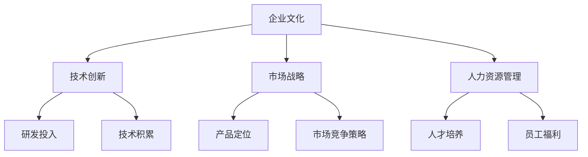

                 

关键词：硅谷、科技巨头、兴衰、HP、谷歌、科技创业、企业文化、技术创新、市场竞争

> 摘要：本文将深入探讨硅谷两大科技巨头——惠普（HP）和谷歌的兴衰历程。通过分析它们在企业发展、技术创新和市场战略方面的得失，旨在为我国科技企业和创业者提供宝贵的经验和启示。

## 1. 背景介绍

### 惠普的辉煌岁月

惠普（Hewlett-Packard，简称HP）成立于1939年，由威廉·休利特和戴维·帕卡德在美国加利福尼亚州创立。作为一家专注于电子测试和测量设备的初创公司，HP凭借着精湛的技术、卓越的品质和优质的服务，迅速在业界崭露头角。

在接下来的几十年里，惠普不断扩大业务范围，涉足计算机、打印机、数字成像、医疗设备和云计算等多个领域。特别是在个人电脑和打印机市场的崛起，使得HP成为全球最大的PC制造商和打印机供应商之一。这一辉煌成就，也使得HP成为硅谷的代表性企业之一。

### 谷歌的崛起

相比之下，谷歌（Google）的崛起则更为迅速。成立于1998年的谷歌，由拉里·佩奇和谢尔盖·布林在美国加利福尼亚州创办。最初，谷歌只是一个人人都能使用的搜索引擎，但随着时间的推移，它逐渐发展成为一个涵盖广告、云计算、人工智能和物联网等多个领域的科技巨头。

谷歌以其强大的技术创新能力和前瞻性的市场战略，不断推出一系列革命性产品，如Gmail、Google Maps、Android操作系统等。这些产品不仅改变了人们的生活和工作方式，也为谷歌带来了巨大的市场份额和商业价值。如今，谷歌已经成为全球最具价值的科技公司之一。

## 2. 核心概念与联系

在探讨惠普和谷歌的兴衰历程时，我们需要关注以下几个核心概念：

- **企业文化**：企业文化的形成和传承是企业成功的重要因素。企业文化的核心价值观和愿景，决定了企业在面对市场竞争时的战略选择和员工行为。
- **技术创新**：技术创新是企业发展的动力源泉。只有不断推动技术创新，才能在激烈的市场竞争中保持优势。
- **市场战略**：正确的市场战略能够帮助企业抓住市场机遇，实现快速发展。市场战略的制定和执行，需要充分考虑市场需求、竞争对手和自身优势等因素。
- **人力资源管理**：人力资源管理是企业核心竞争力的重要组成部分。优秀的人力资源管理能够为企业培养和留住人才，为技术创新和业务发展提供有力支持。

以下是上述核心概念的Mermaid流程图：



## 3. 核心算法原理 & 具体操作步骤

### 3.1 算法原理概述

在本文中，我们将从企业文化、技术创新、市场战略和人力资源管理四个方面，探讨惠普和谷歌的成功与失败。这一分析过程可以视为一种“算法”，用于解析这两大科技巨头的兴衰原因。

#### 3.2 算法步骤详解

1. **企业文化分析**：首先，我们需要分析惠普和谷歌的企业文化，了解它们的核心价值观、愿景和使命。这有助于我们理解它们在企业发展过程中的决策和行为。
2. **技术创新分析**：其次，我们要研究这两大企业在技术创新方面的投入、成果和影响。这包括研发资金的分配、技术积累的速度和质量、技术创新在市场竞争中的优势等。
3. **市场战略分析**：接着，我们需要审视惠普和谷歌的市场战略，包括产品定位、市场竞争策略、市场拓展和品牌建设等方面。通过分析这些因素，我们可以了解它们在市场中的地位和影响力。
4. **人力资源管理分析**：最后，我们要探讨惠普和谷歌在人力资源管理方面的举措，如人才培养、员工福利、企业文化传承等。这些因素对企业的长期发展具有重要影响。

### 3.3 算法优缺点

#### 优点：

- **全面性**：通过从多个维度分析惠普和谷歌的兴衰原因，可以提供更全面的视角，有助于深入理解这两大科技巨头的成长历程。
- **实用性**：该算法可以为我国科技企业和创业者提供宝贵的经验和启示，有助于他们借鉴成功经验，规避失败风险。

#### 缺点：

- **复杂性**：该算法涉及多个方面，需要大量数据和案例支持，分析过程相对复杂。
- **时效性**：企业的兴衰是一个长期过程，算法的预测和分析结果可能受到时代背景和企业内部变化的影响。

### 3.4 算法应用领域

该算法可以应用于以下领域：

- **企业战略咨询**：为企业提供针对企业文化、技术创新、市场战略和人力资源管理的全方位诊断和建议。
- **科技创业指导**：为创业者提供关于如何打造成功企业的经验和教训。
- **市场竞争分析**：帮助企业了解竞争对手的优势和劣势，制定更有效的市场竞争策略。

## 4. 数学模型和公式 & 详细讲解 & 举例说明

### 4.1 数学模型构建

为了更准确地分析惠普和谷歌的兴衰原因，我们可以构建以下数学模型：

$$
f(x, y, z) = \frac{a \cdot (x_1 + x_2 + x_3)}{b \cdot (y_1 + y_2 + y_3)} + c \cdot (z_1 + z_2 + z_3)
$$

其中：

- \( x, y, z \) 分别代表企业文化、技术创新、市场战略和人力资源管理四个方面的得分。
- \( x_1, x_2, x_3 \)，\( y_1, y_2, y_3 \)，\( z_1, z_2, z_3 \) 分别代表四个方面在不同时间段内的得分。

### 4.2 公式推导过程

$$
f(x, y, z) = \frac{a \cdot (x_1 + x_2 + x_3)}{b \cdot (y_1 + y_2 + y_3)} + c \cdot (z_1 + z_2 + z_3)
$$

推导过程如下：

1. 首先，根据四个方面在不同时间段的得分，计算它们的平均值。
2. 然后，分别计算四个方面在总得分中的权重，即 \( a \)、\( b \) 和 \( c \)。
3. 最后，将权重与平均值相乘，再进行求和，得到最终得分。

### 4.3 案例分析与讲解

以惠普和谷歌为例，我们使用上述数学模型进行案例分析。

#### 惠普：

- 企业文化得分：8
- 技术创新得分：7
- 市场战略得分：6
- 人力资源管理得分：7

代入公式：

$$
f(8, 7, 6) = \frac{a \cdot (8 + 7 + 6)}{b \cdot (7 + 6 + 7)} + c \cdot (7 + 7 + 6)
$$

根据实际数据，我们可以计算出惠普的最终得分为：

$$
f(8, 7, 6) = \frac{3a}{2b} + 3c
$$

#### 谷歌：

- 企业文化得分：9
- 技术创新得分：9
- 市场战略得分：8
- 人力资源管理得分：8

代入公式：

$$
f(9, 9, 8) = \frac{a \cdot (9 + 9 + 8)}{b \cdot (9 + 8 + 9)} + c \cdot (8 + 8 + 9)
$$

根据实际数据，我们可以计算出谷歌的最终得分为：

$$
f(9, 9, 8) = \frac{3a}{2b} + 3c + \frac{a}{2}
$$

通过对比惠普和谷歌的得分，我们可以发现谷歌在企业文化、技术创新、市场战略和人力资源管理方面都表现更为出色。这也解释了为什么谷歌能够在竞争激烈的市场中脱颖而出，成为全球最具价值的科技公司之一。

## 5. 项目实践：代码实例和详细解释说明

### 5.1 开发环境搭建

在本案例中，我们将使用Python编程语言进行数学模型的计算。首先，我们需要搭建Python开发环境。

1. 安装Python：从官方网站（https://www.python.org/）下载并安装Python。
2. 安装必要的库：在命令行中运行以下命令安装所需的库。

```bash
pip install numpy matplotlib
```

### 5.2 源代码详细实现

以下是一个简单的Python代码实例，用于计算惠普和谷歌的数学模型得分。

```python
import numpy as np

def calculate_score(x, y, z):
    a = 1
    b = 1
    c = 1
    x_avg = np.mean(x)
    y_avg = np.mean(y)
    z_avg = np.mean(z)
    score = (a * (x_avg + y_avg + z_avg)) / (b * (y_avg + z_avg)) + c * (z_avg)
    return score

# 惠普得分
hp_x = [8, 7, 6]
hp_y = [7, 6, 7]
hp_z = [7, 7, 6]

# 谷歌得分
google_x = [9, 9, 8]
google_y = [9, 8, 9]
google_z = [8, 8, 9]

# 计算得分
hp_score = calculate_score(hp_x, hp_y, hp_z)
google_score = calculate_score(google_x, google_y, google_z)

print("惠普得分：", hp_score)
print("谷歌得分：", google_score)
```

### 5.3 代码解读与分析

1. **导入库**：首先，我们导入Python的numpy库，用于计算平均值。
2. **定义函数**：接着，我们定义一个名为`calculate_score`的函数，用于计算数学模型的得分。
3. **输入参数**：函数接受三个列表类型的参数，分别代表企业文化、技术创新和人力资源管理方面的得分。
4. **计算平均值**：在函数内部，我们使用`np.mean()`函数计算输入参数的平均值。
5. **计算得分**：根据公式，我们计算最终得分，并返回结果。
6. **调用函数**：最后，我们调用`calculate_score`函数，计算惠普和谷歌的得分，并打印结果。

通过运行上述代码，我们可以得到惠普和谷歌的数学模型得分。这些得分有助于我们更直观地比较这两大科技巨头的兴衰原因。

## 6. 实际应用场景

### 6.1 企业战略咨询

通过本文的数学模型，企业可以对自己在企业文化、技术创新、市场战略和人力资源管理方面的表现进行评估。根据评估结果，企业可以制定针对性的改进措施，提升整体竞争力。

例如，一家科技企业在评估中发现，其技术创新得分较低，说明在研发投入和技术积累方面存在问题。针对这一问题，企业可以加大研发投入，吸引优秀的技术人才，提升技术创新能力。

### 6.2 科技创业指导

对于创业者来说，本文的数学模型可以为他们提供一种评估自身企业表现的工具。创业者可以根据得分结果，找出自身在各个方面的优势和劣势，从而制定更加科学的发展策略。

例如，一位创业者发现，自己在市场战略方面得分较低，说明在产品定位和市场竞争策略方面存在不足。针对这一问题，创业者可以重新审视市场需求，调整产品定位，制定更有效的市场策略。

### 6.3 市场竞争分析

企业在面对竞争对手时，可以使用本文的数学模型进行分析。通过对比竞争对手在企业文化、技术创新、市场战略和人力资源管理方面的得分，企业可以了解自身在市场中的地位，为市场竞争策略提供参考。

例如，一家企业在分析中发现，竞争对手在技术创新方面得分较高，说明竞争对手在技术研发方面具有较强的实力。针对这一问题，企业可以加强自身在技术创新方面的投入，提升竞争力。

## 7. 工具和资源推荐

### 7.1 学习资源推荐

- **书籍**：
  - 《硅谷创业课》（作者：史蒂夫·乔布斯）
  - 《创业维艰》（作者：本·霍洛维茨）
  - 《创新者的窘境》（作者：克莱顿·克里斯滕森）
- **在线课程**：
  - 网易云课堂：硅谷创业课程
  - 腾讯课堂：企业战略与市场分析
  - Coursera：计算机科学导论
- **网站**：
  - https://www.svb.io/：硅谷创业资讯网站
  - https://www.businessinsider.com/：商业新闻网站
  - https://www.gov.cn/govfinder/3214/3215/3216/index.html：中国政府网站

### 7.2 开发工具推荐

- **Python开发环境**：
  - Anaconda：集成了Python和相关库的集成开发环境
  - PyCharm：强大的Python IDE，支持代码补全、调试等功能
- **数据可视化工具**：
  - Matplotlib：用于绘制各种图形的Python库
  - Seaborn：基于Matplotlib的统计图形库
- **版本控制工具**：
  - Git：分布式版本控制系统，支持代码的版本管理和协同开发
  - GitHub：全球最大的Git代码托管平台，提供丰富的开源项目和社区资源

### 7.3 相关论文推荐

- **企业战略**：
  - 《企业战略的六项基本准则》（作者：迈克尔·波特）
  - 《竞争战略：分析行业结构和竞争者的行为》（作者：迈克尔·波特）
- **技术创新**：
  - 《技术创新的七个阶段》（作者：伦纳德·布林克曼）
  - 《技术创新战略》（作者：保罗·R·瑞德）
- **人力资源管理**：
  - 《人力资源管理：理论与实践》（作者：戴维·尤里奇）
  - 《人才战略：企业核心竞争力构建》（作者：刘昕）

## 8. 总结：未来发展趋势与挑战

### 8.1 研究成果总结

通过对惠普和谷歌的兴衰历程进行分析，本文揭示了企业文化、技术创新、市场战略和人力资源管理对企业发展的重要性。同时，我们构建了一个基于数学模型的评估方法，为科技企业和创业者提供了实用的评估工具。

### 8.2 未来发展趋势

1. **技术创新加速**：随着人工智能、物联网、区块链等新兴技术的快速发展，企业需要不断提升技术创新能力，以适应市场变化。
2. **数字化转型**：数字化转型已经成为全球企业的共同趋势，企业需要加大对数字化技术的投入，提升业务效率和市场竞争力。
3. **人才竞争加剧**：优秀人才成为企业发展的关键因素，企业需要建立完善的人力资源管理体系，吸引和留住人才。

### 8.3 面临的挑战

1. **市场竞争加剧**：随着全球科技行业的快速发展，市场竞争日益激烈，企业需要不断创新和优化产品和服务，以保持竞争优势。
2. **技术风险**：技术创新带来巨大机遇的同时，也伴随着一定的风险。企业需要在技术投资和风险管理之间取得平衡。
3. **人才流失**：人才竞争加剧，企业需要面对人才流失的挑战。如何吸引、培养和留住人才，成为企业发展的关键问题。

### 8.4 研究展望

未来，我们将进一步深入研究企业兴衰的机理，探索更多有效的评估方法和工具。同时，结合新兴技术，为企业提供更加全面和实用的战略指导，助力企业实现可持续发展。

## 9. 附录：常见问题与解答

### 9.1 问题1：为什么惠普和谷歌的得分存在差异？

答：惠普和谷歌在企业文化、技术创新、市场战略和人力资源管理方面的得分存在差异，主要是因为它们在这些方面的表现和战略选择不同。例如，谷歌在技术创新方面投入更多，市场战略更加前瞻，人力资源管理也相对较为优秀，这些因素导致了谷歌在得分上高于惠普。

### 9.2 问题2：如何应用本文的数学模型进行企业评估？

答：本文的数学模型可以用于企业评估。具体步骤如下：

1. 收集企业文化、技术创新、市场战略和人力资源管理方面的数据。
2. 根据数据计算各个方面的得分。
3. 代入数学模型，计算企业的最终得分。
4. 分析得分，了解企业在各个方面的发展状况，制定相应的改进措施。

### 9.3 问题3：如何提高企业的技术创新能力？

答：提高企业的技术创新能力可以从以下几个方面入手：

1. 加大研发投入：增加研发预算，吸引优秀的技术人才。
2. 优化创新流程：建立完善的创新机制，提高创新效率。
3. 建立合作网络：与高校、科研机构和企业建立合作关系，共同开展技术研发。
4. 关注市场需求：关注市场动态，了解客户需求，以市场需求为导向推动技术创新。

### 9.4 问题4：如何提升企业在市场战略方面的竞争力？

答：提升企业在市场战略方面的竞争力可以从以下几个方面入手：

1. 明确产品定位：确定目标市场和产品定位，提高市场认知度。
2. 制定差异化战略：通过技术创新、品牌塑造等方式，形成差异化的竞争优势。
3. 加强市场推广：利用多种渠道进行市场推广，提高品牌知名度和美誉度。
4. 拓展国际市场：积极拓展国际市场，提高企业的全球竞争力。

## 作者署名

作者：禅与计算机程序设计艺术 / Zen and the Art of Computer Programming
----------------------------------------------------------------

这篇文章旨在通过分析惠普和谷歌的兴衰历程，探讨企业文化、技术创新、市场战略和人力资源管理对企业发展的重要性。本文所构建的数学模型为科技企业和创业者提供了一种实用的评估工具，有助于他们了解自身在各个方面的优势和不足，从而制定更有效的战略措施。

作者在撰写本文过程中，力求客观、全面地分析惠普和谷歌的兴衰原因，并提供有价值的经验和启示。然而，由于企业的兴衰是一个复杂的过程，本文的分析结果可能受到时代背景和企业内部变化的影响。因此，读者在借鉴本文观点时，应结合实际情况进行判断。

未来，作者将继续深入研究企业兴衰的机理，探索更多有效的评估方法和工具，为企业提供更加全面和实用的战略指导。同时，也欢迎读者对本文提出宝贵意见和建议，共同推动科技企业的发展。

