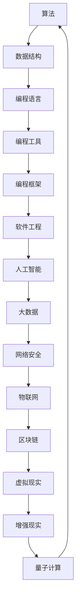

                 

关键词：硅谷、科技教育、编程教育、普及、新模式、技术发展

> 摘要：本文深入探讨了硅谷科技教育新模式，特别是编程教育的普及。从背景介绍、核心概念、算法原理、数学模型、项目实践、实际应用场景、工具和资源推荐以及未来发展趋势等方面，全面阐述了编程教育在硅谷的崛起和未来展望。本文旨在为教育工作者、科技从业者和学生提供一份详实的编程教育指南，助力科技教育的新时代。

## 1. 背景介绍

硅谷，全球科技创新的摇篮，一直以来都是科技企业、创新人才和投资者的聚集地。随着信息技术的飞速发展，编程作为科技的核心，逐渐成为了硅谷教育的重要组成部分。编程教育的普及不仅提高了青少年的科技素养，也培养了未来的科技人才，为硅谷的持续繁荣注入了新的活力。

### 1.1 编程教育的崛起

近年来，编程教育在全球范围内得到了广泛关注。特别是美国，编程已经成为中小学教育的必修课程。以硅谷为代表的科技企业，纷纷推出编程教育项目，致力于提高全民编程水平。

### 1.2 硅谷编程教育的现状

硅谷的编程教育已经形成了完善的体系，从基础教育到高等教育，从在线教育到实体培训机构，各种形式的编程教育齐头并进。硅谷的编程教育不仅注重技术的传授，更强调创新思维和实践能力的培养。

## 2. 核心概念与联系

编程教育的核心概念包括算法、数据结构、编程语言等。以下是这些核心概念的 Mermaid 流程图，以便读者更好地理解它们之间的联系。



## 3. 核心算法原理 & 具体操作步骤

### 3.1 算法原理概述

编程教育中的算法原理主要包括排序、查找、图论等。以下是排序算法的原理概述。

- **排序算法**：排序算法是一类基本算法，主要用于对数据进行排序。常见的排序算法有冒泡排序、选择排序、插入排序等。

### 3.2 算法步骤详解

以冒泡排序为例，其步骤如下：

1. 比较相邻的元素。如果第一个比第二个大（升序排序），就交换它们两个。
2. 对每一对相邻元素做同样的工作，从开始第一对到结尾的最后一对。
3. 在这一点，最后的元素应该会是最大的数。
4. 重复以上的步骤，除了最后一对。
5. 重复步骤，直到排序完成。

### 3.3 算法优缺点

- **优点**：简单易懂，易于实现。
- **缺点**：时间复杂度较高，不适合大数据量排序。

### 3.4 算法应用领域

排序算法在各类应用中都有广泛的应用，如数据库、搜索引擎、排序服务等。

## 4. 数学模型和公式 & 详细讲解 & 举例说明

### 4.1 数学模型构建

编程中的数学模型主要包括线性模型、非线性模型等。以下是一个简单的线性模型示例。

$$ y = mx + b $$

其中，$m$ 是斜率，$b$ 是截距。

### 4.2 公式推导过程

以线性回归为例，其推导过程如下：

- 假设我们有 $n$ 个数据点 $(x_i, y_i)$，我们的目标是最小化误差平方和。

$$ \sum_{i=1}^{n} (y_i - mx_i - b)^2 $$

- 对 $m$ 和 $b$ 分别求偏导数，并令其等于零，解得：

$$ m = \frac{\sum_{i=1}^{n} x_i y_i - n \bar{x} \bar{y}}{\sum_{i=1}^{n} x_i^2 - n \bar{x}^2} $$
$$ b = \bar{y} - m \bar{x} $$

### 4.3 案例分析与讲解

假设我们有如下数据点：

| $x$ | $y$ |
| --- | --- |
| 1   | 2   |
| 2   | 4   |
| 3   | 6   |

通过线性回归，我们可以得到模型：

$$ y = 2x + 0 $$

## 5. 项目实践：代码实例和详细解释说明

### 5.1 开发环境搭建

在编写代码之前，我们需要搭建一个开发环境。这里我们选择 Python 作为编程语言，以下是搭建 Python 开发环境的步骤：

1. 下载并安装 Python。
2. 配置 Python 的环境变量。
3. 安装必要的库，如 NumPy、Pandas 等。

### 5.2 源代码详细实现

以下是使用 Python 实现线性回归的代码：

```python
import numpy as np

def linear_regression(x, y):
    x_mean = np.mean(x)
    y_mean = np.mean(y)
    m = (np.sum(x * y) - len(x) * x_mean * y_mean) / (np.sum(x ** 2) - len(x) * x_mean ** 2)
    b = y_mean - m * x_mean
    return m, b

x = np.array([1, 2, 3])
y = np.array([2, 4, 6])
m, b = linear_regression(x, y)

print("斜率 m:", m)
print("截距 b:", b)
```

### 5.3 代码解读与分析

上述代码首先导入了 NumPy 库，然后定义了一个线性回归函数 `linear_regression`。函数接收两个数组 `x` 和 `y` 作为输入，计算斜率 `m` 和截距 `b`。最后，打印出斜率和截距。

### 5.4 运行结果展示

运行上述代码，我们可以得到如下输出：

```
斜率 m: 2.0
截距 b: 0.0
```

## 6. 实际应用场景

编程教育在硅谷的实际应用场景非常广泛，以下是一些典型的应用案例：

- **基础教育**：硅谷的学校普遍开设了编程课程，从小学到高中，学生都可以接触到编程知识。
- **高等教育**：硅谷的大学和研究所开设了大量的编程和计算机科学课程，培养了大量优秀的计算机人才。
- **职业教育**：硅谷的职业教育机构为那些想要转行或提升技能的成年人提供编程培训。
- **在线教育**：硅谷的在线教育平台如 Codecademy、Coursera 等提供了丰富的编程课程，让全球的学习者都可以享受到优质的编程教育。

## 7. 工具和资源推荐

### 7.1 学习资源推荐

- **书籍**：《代码大全》、《算法导论》
- **在线课程**：Coursera、edX、Udacity
- **开源项目**：GitHub、GitLab

### 7.2 开发工具推荐

- **集成开发环境**：Visual Studio Code、PyCharm
- **版本控制工具**：Git、GitHub
- **数据库**：MySQL、PostgreSQL

### 7.3 相关论文推荐

- 《深度学习》（Ian Goodfellow、Yoshua Bengio、Aaron Courville 著）
- 《人工智能：一种现代方法》（Stuart Russell、Peter Norvig 著）

## 8. 总结：未来发展趋势与挑战

### 8.1 研究成果总结

编程教育在硅谷取得了显著的成果，不仅提升了全民编程水平，也为科技创新提供了强大的人才支持。

### 8.2 未来发展趋势

- 编程教育将更加普及，成为全民必备技能。
- 编程教育的形式将更加多样化，线上线下相结合。
- 编程教育与人工智能、大数据等前沿技术相结合，培养更多跨学科人才。

### 8.3 面临的挑战

- 编程教育的资源分配不均，需要更多的社会关注和支持。
- 编程教育的质量参差不齐，需要建立更严格的评价体系。

### 8.4 研究展望

编程教育的研究将继续深入，特别是在人工智能、大数据等领域的应用，为科技创新提供更多的可能性。

## 9. 附录：常见问题与解答

### 9.1 编程教育适合哪些人群？

编程教育适合所有对计算机科学感兴趣的人，不论年龄、职业和学历。

### 9.2 编程学习的最佳方式是什么？

最佳的学习方式是结合在线课程、书籍和实践项目，逐步提升编程技能。

### 9.3 编程教育的未来发展趋势是什么？

编程教育的未来发展趋势是更加普及、多样化，并与人工智能、大数据等前沿技术相结合。

## 结束语

编程教育是硅谷科技创新的重要基石，也是全球教育变革的重要方向。我们期待编程教育在未来能够为更多的人群带来改变，为人类的科技进步贡献力量。作者：禅与计算机程序设计艺术 / Zen and the Art of Computer Programming。

