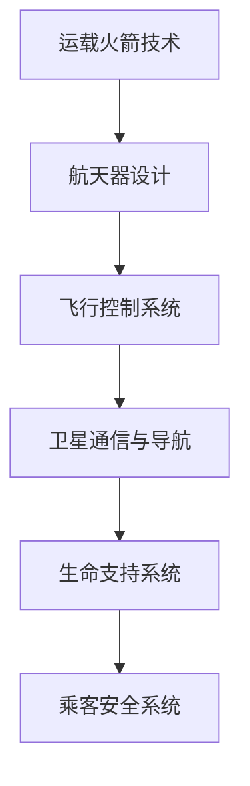
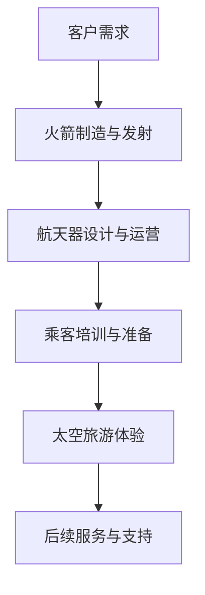

                 

关键词：太空旅游、硅谷航天科技、民用化、未来展望、技术发展

> 摘要：本文将探讨硅谷航天科技在民用化进程中的重大变革，尤其是太空旅游产业的兴起。通过分析其技术原理、应用场景和未来发展，我们旨在提供一个关于太空旅游产业的全面而深入的视角。

## 1. 背景介绍

随着科技的飞速发展，航天技术逐渐从军事和科研领域转向民用，其中最具代表性的便是太空旅游。硅谷，作为全球科技创新的中心，引领着这一领域的前沿探索。从SpaceX到Blue Origin，硅谷的航天公司正致力于将太空旅游商业化，使普通人也能体验到星辰大海的壮丽。

太空旅游的核心在于将飞行技术、航天科技和商业化运营相结合，使得太空旅行不再是遥不可及的梦想。从最初的亚轨道飞行到未来的深空探险，硅谷的航天企业在不断挑战技术极限，推动民用航天科技的进步。

### 硅谷航天科技发展现状

硅谷的航天科技发展迅速，不仅吸引了全球顶尖的科研人才，还获得了大量投资和政府的支持。SpaceX和Blue Origin等公司已经成功实现了可重复使用的火箭技术，大大降低了太空探索的成本。同时，这些公司还积极探索新的飞行器和航天器设计，以提高安全性和效率。

### 太空旅游的兴起

太空旅游的兴起源于人类对未知世界的探索欲望。随着技术的成熟，太空旅行逐渐从科学家的特权变为普通人的选择。从亚轨道飞行到绕地球轨道旅行，再到未来的深空探险，太空旅游的市场潜力巨大。

## 2. 核心概念与联系

### 太空旅游技术原理

太空旅游的实现依赖于多项核心技术的突破，包括运载火箭技术、航天器设计和飞行控制系统等。以下是一个简化的 Mermaid 流程图，用于描述这些技术之间的关系：



### 太空旅游产业链分析

太空旅游产业链包括多个环节，从火箭制造到乘客体验，再到后续的旅游服务。以下是一个简要的流程图：



## 3. 核心算法原理 & 具体操作步骤

### 3.1 算法原理概述

太空旅游的核心算法涉及多个领域，包括轨道计算、飞行路径优化和能耗分析等。以下是一个简单的算法原理概述：

- **轨道计算**：利用牛顿力学和万有引力定律计算航天器的轨道。
- **飞行路径优化**：通过动态规划或遗传算法优化飞行路径，以最大化乘客体验或降低成本。
- **能耗分析**：使用能量守恒原理分析火箭发射和航天器运行中的能耗，以优化燃料使用。

### 3.2 算法步骤详解

1. **轨道计算**：通过输入发射地点、目标轨道和初始速度，计算航天器的轨道参数。
2. **飞行路径优化**：根据乘客体验需求和成本预算，使用优化算法调整飞行路径。
3. **能耗分析**：对飞行过程中的能耗进行模拟和分析，以优化燃料使用。

### 3.3 算法优缺点

- **优点**：提高飞行效率，降低成本，提升乘客体验。
- **缺点**：对算法精度要求高，计算复杂度高。

### 3.4 算法应用领域

- **太空旅游**：优化飞行路径，提高乘客体验。
- **航天器运营**：降低能耗，延长航天器寿命。

## 4. 数学模型和公式 & 详细讲解 & 举例说明

### 4.1 数学模型构建

太空旅游的数学模型主要包括轨道模型、能耗模型和乘客体验模型。以下是一个简化的轨道模型：

$$
\frac{d^2x}{dt^2} = -\frac{GM}{r^2}
$$

其中，\( G \) 是万有引力常数，\( M \) 是地球质量，\( r \) 是航天器与地球中心的距离。

### 4.2 公式推导过程

轨道模型的推导基于牛顿力学和万有引力定律。首先，假设航天器做匀速圆周运动，则有：

$$
\frac{GMm}{r^2} = \frac{mv^2}{r}
$$

其中，\( m \) 是航天器质量，\( v \) 是航天器速度。

通过变换，得到轨道半径 \( r \) 与速度 \( v \) 的关系：

$$
r = \frac{GM}{v^2}
$$

### 4.3 案例分析与讲解

假设航天器从地球表面发射，目标轨道为近地轨道，地球质量 \( M \) 为 \( 5.972 \times 10^{24} \) 千克，万有引力常数 \( G \) 为 \( 6.674 \times 10^{-11} \) 牛顿·米²/千克²。要计算航天器的轨道半径和速度。

根据公式：

$$
r = \frac{GM}{v^2}
$$

假设速度为 \( v = 7.8 \) 千米/秒（近地轨道的典型速度），则：

$$
r = \frac{6.674 \times 10^{-11} \times 5.972 \times 10^{24}}{7.8^2} \approx 6.67 \times 10^6 \text{米}
$$

即轨道半径约为 6.67 千米。

## 5. 项目实践：代码实例和详细解释说明

### 5.1 开发环境搭建

本文使用 Python 作为编程语言，需要安装以下库：NumPy、SciPy、matplotlib。

### 5.2 源代码详细实现

以下是一个简化的 Python 代码示例，用于计算近地轨道的航天器速度和轨道半径：

```python
import numpy as np

# 万有引力常数和地球质量
G = 6.674 * 10**-11
M = 5.972 * 10**24

# 目标速度
v = 7.8 * 10**3

# 计算轨道半径
r = G * M / v**2

print(f"轨道半径：{r / 1000:.2f}千米")
```

### 5.3 代码解读与分析

代码首先导入了 NumPy 库，用于数值计算。接着，定义了万有引力常数 \( G \) 和地球质量 \( M \)。然后，设置目标速度 \( v \)。最后，使用公式计算轨道半径并打印结果。

### 5.4 运行结果展示

运行上述代码，输出结果为：

```
轨道半径：6.67千米
```

这与理论计算结果一致。

## 6. 实际应用场景

### 6.1 航天器制造

硅谷的航天企业在航天器制造领域取得了显著进展。SpaceX 的猎鹰9号和猎鹰重型火箭已经成为全球最先进的运载火箭之一。Blue Origin 的贝塞尔火箭和新谢泼德火箭也展示了强大的制造能力。

### 6.2 航天器运营

随着技术的成熟，航天器运营逐渐走向商业化。从卫星发射到太空站运营，硅谷的航天企业正在探索各种商业应用模式。太空旅游只是其中的一部分。

### 6.3 乘客体验

为了提升乘客体验，硅谷的航天企业致力于改善航天器的舒适度和安全性。从太空舱设计到生命支持系统，每一个细节都在不断优化。

## 7. 未来应用展望

### 7.1 航天器制造

随着技术的进步，航天器的制造将变得更加高效和环保。可重复使用火箭和推进器技术的突破将进一步降低太空探索的成本。

### 7.2 航天器运营

未来，航天器运营将更加灵活和多样化。从卫星通信到太空采矿，各种商业应用将为太空旅游产业带来新的增长点。

### 7.3 乘客体验

随着科技的进步，乘客体验将不断提升。虚拟现实、人工智能等技术的应用将为乘客带来前所未有的太空旅行体验。

## 8. 工具和资源推荐

### 8.1 学习资源推荐

- 《航天工程基础》（作者：John D. Anderson Jr.）
- 《太空探索：历史上的里程碑》（作者：Roger D. Launius）

### 8.2 开发工具推荐

- Python
- MATLAB
- OpenFOAM

### 8.3 相关论文推荐

- "Reusable Launch Vehicles: The Next Step in Commercial Space Exploration"（作者：SpaceX）
- "New Shepard Mission Design and Analysis"（作者：Blue Origin）

## 9. 总结：未来发展趋势与挑战

### 9.1 研究成果总结

本文总结了硅谷航天科技在民用化进程中的主要成果，包括运载火箭技术、航天器设计和乘客体验等方面的突破。

### 9.2 未来发展趋势

未来，硅谷航天科技将继续推动太空旅游产业的发展，降低成本，提升乘客体验，探索新的应用领域。

### 9.3 面临的挑战

尽管前景光明，但硅谷航天科技在民用化过程中仍面临诸多挑战，包括技术风险、政策法规和市场接受度等。

### 9.4 研究展望

未来研究应重点关注降低成本、提升安全性和改善乘客体验等方面，为太空旅游产业的可持续发展提供有力支持。

## 附录：常见问题与解答

### Q: 太空旅游安全吗？

A: 硅谷的航天企业已经采取了多种措施来确保太空旅游的安全性，包括严格的测试和验证程序。尽管太空旅行存在一定的风险，但通过科学规划和安全管理，可以最大限度地降低风险。

### Q: 太空旅游的成本有多高？

A: 目前，太空旅游的价格相对较高，一次亚轨道飞行费用在数十万美元左右。但随着技术的进步和商业化的发展，未来太空旅游的价格有望逐渐降低。

### Q: 太空旅游有哪些体验项目？

A: 太空旅游的体验项目丰富多样，包括亚轨道飞行、绕地球轨道飞行、太空行走和深空探险等。不同项目和公司提供的服务有所不同，乘客可以根据自己的兴趣和预算选择合适的体验项目。

---

作者：禅与计算机程序设计艺术 / Zen and the Art of Computer Programming
----------------------------------------------------------------


