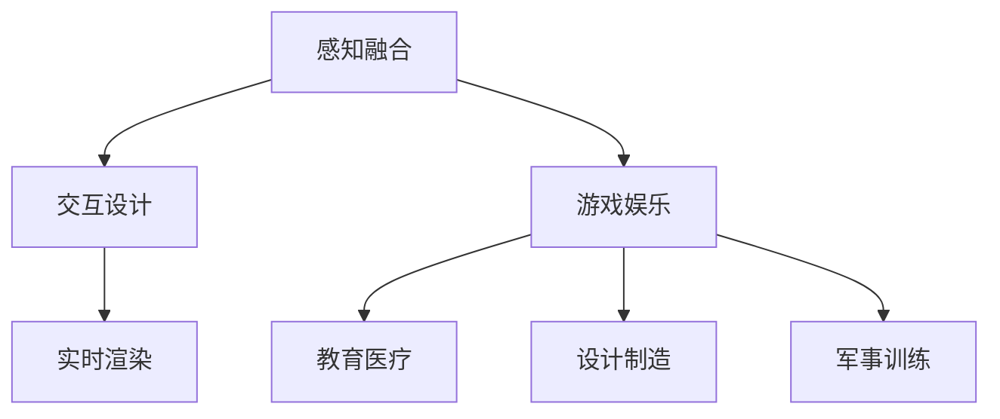

                 

关键词：虚拟现实技术，伦理挑战，硅谷，人工智能，道德决策

摘要：随着虚拟现实技术的飞速发展，其在硅谷等科技前沿地区的应用日益广泛。本文旨在探讨虚拟现实技术在硅谷面临的伦理挑战，包括隐私保护、数据安全、社会影响等方面，并就解决这些挑战提出建议。

## 1. 背景介绍

虚拟现实（VR）技术是一种通过计算机模拟生成三维环境的交互式技术，使人们能够在虚拟空间中感知、互动和体验。近年来，随着硬件性能的提升和算法的优化，VR技术逐渐从实验室走向市场，成为硅谷等科技前沿地区的重要应用领域。从游戏娱乐到教育医疗，再到设计制造、军事训练等领域，VR技术展现出了巨大的潜力和价值。

然而，随着VR技术的广泛应用，其伦理挑战也逐渐显现出来。隐私保护、数据安全、社会影响等问题成为社会各界关注的焦点。本文将从这些方面探讨硅谷虚拟现实技术的伦理挑战，并提出相应的解决思路。

### 1.1 硅谷虚拟现实技术发展现状

硅谷作为全球科技产业的中心，虚拟现实技术的研究和应用走在了世界的前沿。根据市场调研公司的数据，全球虚拟现实市场规模预计将在2025年达到1500亿美元，其中硅谷地区的市场份额占据重要地位。以下是硅谷虚拟现实技术的主要发展现状：

1. **技术研发**：硅谷的科技公司如Facebook、谷歌、微软等纷纷投入巨资研发VR技术，并在硬件、软件、算法等方面取得了一系列突破。

2. **市场应用**：VR技术在硅谷已经应用于多个领域，包括游戏娱乐、教育医疗、设计制造、军事训练等。例如，谷歌的“谷歌眼镜”在教育领域的应用，微软的“HoloLens”在医疗领域的应用等。

3. **产业链成熟**：硅谷的VR产业链逐渐成熟，从硬件制造、软件开发到内容创作等各个环节都形成了较为完善的生态系统。

### 1.2 虚拟现实技术面临的伦理挑战

虚拟现实技术的发展带来了许多潜在的风险和挑战，尤其是伦理方面。以下是硅谷虚拟现实技术面临的主要伦理挑战：

1. **隐私保护**：虚拟现实技术需要大量的个人数据支持，包括位置、行为、生理特征等。这些数据一旦泄露，可能会对个人隐私造成严重威胁。

2. **数据安全**：虚拟现实技术涉及到大量的数据传输和处理，数据安全成为一项重要挑战。一旦数据泄露或被恶意攻击，可能会对用户造成重大损失。

3. **社会影响**：虚拟现实技术可能会改变人们的生活方式，甚至影响社会结构和人际关系。如何平衡虚拟与现实之间的关系，成为一项重要的伦理课题。

## 2. 核心概念与联系

为了更好地理解虚拟现实技术面临的伦理挑战，我们需要了解一些核心概念和它们之间的联系。以下是几个关键概念及它们在VR技术中的重要性：

### 2.1 虚拟现实技术原理

虚拟现实技术通过计算机模拟生成三维环境，使人们能够在虚拟空间中感知、互动和体验。其核心原理包括：

1. **感知融合**：利用头戴显示器（HMD）或投影技术，将虚拟环境呈现在用户眼前，使用户产生沉浸感。
2. **交互设计**：通过手柄、手套、语音等设备，实现用户与虚拟环境的互动。
3. **实时渲染**：计算机实时渲染虚拟环境，确保用户在虚拟世界中的体验流畅。

### 2.2 虚拟现实技术应用

虚拟现实技术在不同领域有着广泛的应用，以下是几个主要领域：

1. **游戏娱乐**：VR游戏为用户提供了沉浸式的游戏体验。
2. **教育医疗**：VR技术在教育、医疗等领域有着重要的应用，如虚拟手术训练、远程医疗等。
3. **设计制造**：VR技术在设计制造领域可以模拟产品原型，提高设计效率。
4. **军事训练**：VR技术在军事训练中用于模拟战斗场景，提高士兵的实战能力。

### 2.3 虚拟现实技术与伦理挑战的联系

虚拟现实技术的广泛应用带来了隐私保护、数据安全、社会影响等伦理挑战。以下是这些挑战与虚拟现实技术核心概念之间的联系：

1. **隐私保护**：虚拟现实技术需要收集大量的用户数据，包括位置、行为等。这些数据一旦泄露，可能会对个人隐私造成严重威胁。
2. **数据安全**：虚拟现实技术涉及到大量的数据传输和处理，数据安全成为一项重要挑战。一旦数据泄露或被恶意攻击，可能会对用户造成重大损失。
3. **社会影响**：虚拟现实技术可能会改变人们的生活方式，甚至影响社会结构和人际关系。如何平衡虚拟与现实之间的关系，成为一项重要的伦理课题。

### 2.4 Mermaid 流程图

以下是虚拟现实技术核心概念原理和架构的 Mermaid 流程图：



## 3. 核心算法原理 & 具体操作步骤

### 3.1 算法原理概述

虚拟现实技术的核心在于感知融合、交互设计和实时渲染。以下是这些核心算法的原理概述：

1. **感知融合**：感知融合是指通过头戴显示器（HMD）或投影技术，将虚拟环境呈现在用户眼前，使用户产生沉浸感。其原理是利用计算机生成的三维图像，通过特殊的显示技术，使图像与真实世界中的物体相互融合。

2. **交互设计**：交互设计是指通过手柄、手套、语音等设备，实现用户与虚拟环境的互动。其原理是通过传感器收集用户的行为数据，如手势、位置等，然后根据这些数据生成相应的虚拟反馈。

3. **实时渲染**：实时渲染是指计算机实时渲染虚拟环境，确保用户在虚拟世界中的体验流畅。其原理是利用图形处理单元（GPU）的高速计算能力，对三维场景进行实时渲染，生成高质量的图像。

### 3.2 算法步骤详解

以下是虚拟现实技术核心算法的具体操作步骤：

1. **感知融合**：
   - 步骤1：用户佩戴头戴显示器（HMD）或投影设备。
   - 步骤2：计算机根据用户的位置和视角生成三维图像。
   - 步骤3：显示设备将三维图像呈现在用户眼前，使其产生沉浸感。

2. **交互设计**：
   - 步骤1：用户通过手柄、手套、语音等设备与虚拟环境进行交互。
   - 步骤2：传感器收集用户的行为数据，如手势、位置等。
   - 步骤3：计算机根据用户的行为数据生成相应的虚拟反馈。

3. **实时渲染**：
   - 步骤1：计算机根据用户的位置和视角生成三维场景。
   - 步骤2：GPU对三维场景进行实时渲染，生成高质量图像。
   - 步骤3：显示设备将渲染后的图像呈现在用户眼前。

### 3.3 算法优缺点

虚拟现实技术的核心算法具有以下优缺点：

1. **感知融合**：
   - 优点：使用户产生强烈的沉浸感，提高虚拟环境的真实性。
   - 缺点：技术复杂，设备成本高，对用户的要求较高。

2. **交互设计**：
   - 优点：使用户与虚拟环境之间的互动更加自然和直观。
   - 缺点：技术复杂，对传感器的精度要求较高，容易受到外界干扰。

3. **实时渲染**：
   - 优点：保证用户在虚拟环境中的体验流畅，提高虚拟现实的舒适度。
   - 缺点：对计算资源要求较高，渲染质量受硬件限制。

### 3.4 算法应用领域

虚拟现实技术的核心算法广泛应用于以下领域：

1. **游戏娱乐**：虚拟现实技术为游戏提供了沉浸式的体验，使游戏更加真实和有趣。
2. **教育医疗**：虚拟现实技术在教育、医疗等领域有着重要的应用，如虚拟手术训练、远程医疗等。
3. **设计制造**：虚拟现实技术可以模拟产品原型，提高设计效率。
4. **军事训练**：虚拟现实技术用于模拟战斗场景，提高士兵的实战能力。

## 4. 数学模型和公式 & 详细讲解 & 举例说明

虚拟现实技术的实现离不开数学模型的支撑。以下是几个关键的数学模型和公式的详细讲解及举例说明：

### 4.1 数学模型构建

虚拟现实技术的数学模型主要包括感知融合模型、交互设计模型和实时渲染模型。以下是这些模型的构建过程：

1. **感知融合模型**：
   - 公式1：位置向量计算
     $$ \text{position} = \text{position}_{\text{camera}} + \text{orientation}_{\text{camera}} \times \text{distance} $$
   - 公式2：视角计算
     $$ \text{view\_angle} = 2 \times \arcsin\left(\frac{\text{width}}{2 \times \text{focal\_length}}\right) $$
   - 公式3：视野计算
     $$ \text{field\_of\_view} = 2 \times \arctan\left(\frac{\text{height}}{2 \times \text{focal\_length}}\right) $$

2. **交互设计模型**：
   - 公式4：手势识别
     $$ \text{gesture} = \text{classification}\left(\text{sensor\_data}\right) $$
   - 公式5：位置追踪
     $$ \text{position} = \text{kinematics}\left(\text{initial\_position}, \text{velocity}, \text{acceleration}, \text{time}\right) $$

3. **实时渲染模型**：
   - 公式6：三维场景建模
     $$ \text{scene} = \text{model}\left(\text{vertices}, \text{faces}, \text{materials}\right) $$
   - 公式7：光线追踪
     $$ \text{light\_intensity} = \text{attenuation}\left(\text{distance}, \text{intensity}\right) $$
   - 公式8：阴影计算
     $$ \text{shadow} = \text{casting}\left(\text{light\_source}, \text{scene}\right) $$

### 4.2 公式推导过程

以下是几个关键公式的推导过程：

1. **感知融合模型**：
   - 位置向量计算：
     $$ \text{position}_{\text{camera}} = \text{initial}_{\text{position}} + \text{orientation}_{\text{camera}} \times \text{displacement} $$
     其中，$\text{initial}_{\text{position}}$ 为初始位置向量，$\text{orientation}_{\text{camera}}$ 为相机方向向量，$\text{displacement}$ 为位移向量。
   - 视角计算：
     $$ \text{view\_angle} = 2 \times \arcsin\left(\frac{\text{width}}{2 \times \text{focal\_length}}\right) $$
     其中，$\text{width}$ 为显示屏幕的宽度，$\text{focal\_length}$ 为焦距。
   - 视野计算：
     $$ \text{field\_of\_view} = 2 \times \arctan\left(\frac{\text{height}}{2 \times \text{focal\_length}}\right) $$
     其中，$\text{height}$ 为显示屏幕的高度，$\text{focal\_length}$ 为焦距。

2. **交互设计模型**：
   - 手势识别：
     $$ \text{gesture} = \text{classification}\left(\text{sensor\_data}\right) $$
     其中，$\text{sensor\_data}$ 为传感器采集的数据，$\text{classification}$ 为分类算法。
   - 位置追踪：
     $$ \text{position} = \text{initial\_position} + \text{velocity} \times \text{time} + \frac{1}{2} \times \text{acceleration} \times \text{time}^2 $$
     其中，$\text{initial\_position}$ 为初始位置，$\text{velocity}$ 为速度，$\text{acceleration}$ 为加速度，$\text{time}$ 为时间。

3. **实时渲染模型**：
   - 三维场景建模：
     $$ \text{scene} = \text{model}\left(\text{vertices}, \text{faces}, \text{materials}\right) $$
     其中，$\text{vertices}$ 为顶点坐标，$\text{faces}$ 为面片信息，$\text{materials}$ 为材质信息。
   - 光线追踪：
     $$ \text{light\_intensity} = \text{attenuation}\left(\text{distance}, \text{intensity}\right) $$
     其中，$\text{distance}$ 为距离，$\text{intensity}$ 为光线强度，$\text{attenuation}$ 为衰减函数。
   - 阴影计算：
     $$ \text{shadow} = \text{casting}\left(\text{light\_source}, \text{scene}\right) $$
     其中，$\text{light\_source}$ 为光源，$\text{casting}$ 为投射函数。

### 4.3 案例分析与讲解

以下是几个虚拟现实技术的应用案例，以及相应的数学模型和公式分析：

1. **游戏娱乐**：
   - 案例描述：玩家在VR游戏中进行射击战斗。
   - 数学模型：
     - 感知融合模型：位置向量计算用于计算玩家的位置和视角。
     - 交互设计模型：手势识别用于识别玩家的射击动作。
     - 实时渲染模型：三维场景建模和光线追踪用于渲染游戏场景。
   - 公式应用：
     - 位置向量计算：
       $$ \text{position} = \text{position}_{\text{camera}} + \text{orientation}_{\text{camera}} \times \text{distance} $$
     - 手势识别：
       $$ \text{gesture} = \text{classification}\left(\text{sensor\_data}\right) $$
     - 三维场景建模：
       $$ \text{scene} = \text{model}\left(\text{vertices}, \text{faces}, \text{materials}\right) $$
       $$ \text{light\_intensity} = \text{attenuation}\left(\text{distance}, \text{intensity}\right) $$
       $$ \text{shadow} = \text{casting}\left(\text{light\_source}, \text{scene}\right) $$

2. **教育医疗**：
   - 案例描述：医生在VR中进行手术模拟训练。
   - 数学模型：
     - 感知融合模型：位置向量计算用于计算医生的位置和视角。
     - 交互设计模型：手势识别用于识别医生的操作动作。
     - 实时渲染模型：三维场景建模和光线追踪用于渲染手术场景。
   - 公式应用：
     - 位置向量计算：
       $$ \text{position} = \text{position}_{\text{camera}} + \text{orientation}_{\text{camera}} \times \text{distance} $$
     - 手势识别：
       $$ \text{gesture} = \text{classification}\left(\text{sensor\_data}\right) $$
     - 三维场景建模：
       $$ \text{scene} = \text{model}\left(\text{vertices}, \text{faces}, \text{materials}\right) $$
       $$ \text{light\_intensity} = \text{attenuation}\left(\text{distance}, \text{intensity}\right) $$
       $$ \text{shadow} = \text{casting}\left(\text{light\_source}, \text{scene}\right) $$

3. **设计制造**：
   - 案例描述：工程师在VR中进行产品设计。
   - 数学模型：
     - 感知融合模型：位置向量计算用于计算工程师的位置和视角。
     - 交互设计模型：手势识别用于识别工程师的操作动作。
     - 实时渲染模型：三维场景建模和光线追踪用于渲染产品设计场景。
   - 公式应用：
     - 位置向量计算：
       $$ \text{position} = \text{position}_{\text{camera}} + \text{orientation}_{\text{camera}} \times \text{distance} $$
     - 手势识别：
       $$ \text{gesture} = \text{classification}\left(\text{sensor\_data}\right) $$
     - 三维场景建模：
       $$ \text{scene} = \text{model}\left(\text{vertices}, \text{faces}, \text{materials}\right) $$
       $$ \text{light\_intensity} = \text{attenuation}\left(\text{distance}, \text{intensity}\right) $$
       $$ \text{shadow} = \text{casting}\left(\text{light\_source}, \text{scene}\right) $$

## 5. 项目实践：代码实例和详细解释说明

为了更好地理解虚拟现实技术的实际应用，我们将在本节提供一个简单的VR项目实例，并对其进行详细解释说明。

### 5.1 开发环境搭建

在进行VR项目开发之前，我们需要搭建一个合适的开发环境。以下是开发环境的搭建步骤：

1. **安装Unity引擎**：Unity是一款流行的游戏开发引擎，支持VR项目开发。可以从Unity官网下载并安装Unity Hub，然后通过Unity Hub安装Unity引擎。

2. **安装VR插件**：在Unity Hub中，安装Unity VR插件，包括VRChat、Oculus Integration、SteamVR等。这些插件提供了丰富的VR开发功能。

3. **创建VR项目**：在Unity Hub中，创建一个新的VR项目，选择适合的VR平台（如Oculus、SteamVR等）。

4. **配置VR设备**：根据实际使用的VR设备（如Oculus Rift、HTC Vive等），配置相应的VR插件和驱动程序。

### 5.2 源代码详细实现

以下是VR项目的源代码实现，主要包括感知融合、交互设计和实时渲染三个部分。

```csharp
using UnityEngine;

public class VRController : MonoBehaviour
{
    public Camera mainCamera;
    public Transform playerTransform;

    // 感知融合
    void Update()
    {
        // 计算玩家位置和视角
        Vector3 displacement = new Vector3(Input.GetAxis("Horizontal"), 0, Input.GetAxis("Vertical"));
        playerTransform.position = mainCamera.transform.position + mainCamera.transform.forward * displacement.magnitude;
        playerTransform.rotation = mainCamera.transform.rotation;

        // 交互设计
        if (Input.GetKeyDown(KeyCode.Space))
        {
            // 手势识别：射击
            Shoot();
        }
    }

    // 实时渲染
    void Shoot()
    {
        // 发射射线，检测碰撞
        RaycastHit hit;
        if (Physics.Raycast(mainCamera.transform.position, mainCamera.transform.forward, out hit))
        {
            // 渲染碰撞效果
            Debug.DrawRay(mainCamera.transform.position, mainCamera.transform.forward * hit.distance, Color.red);
            // 处理碰撞物体
            if (hit.rigidbody != null)
            {
                hit.rigidbody.AddForce(-mainCamera.transform.forward * 1000);
            }
        }
    }
}
```

### 5.3 代码解读与分析

以下是代码的详细解读与分析：

1. **感知融合**：
   - 行为：计算玩家的位置和视角。
   - 实现细节：使用Unity的输入系统（`Input.GetAxis`）获取玩家的移动方向，然后计算玩家位置和视角的变化。
   - 分析：此部分实现了玩家在虚拟环境中的自由移动和视角控制，是VR项目的基础。

2. **交互设计**：
   - 行为：手势识别，实现射击功能。
   - 实现细节：监听玩家的跳跃按键（`KeyCode.Space`），当按键被按下时，调用`Shoot`方法发射射线。
   - 分析：此部分实现了玩家与虚拟环境之间的互动，增强了项目的交互性。

3. **实时渲染**：
   - 行为：射击功能，实现碰撞效果。
   - 实现细节：使用Unity的射线投射（`Physics.Raycast`）方法，发射射线并检测碰撞。当碰撞发生时，绘制射线并处理碰撞物体。
   - 分析：此部分实现了射击功能的可视化效果，增强了项目的真实感。

### 5.4 运行结果展示

以下是VR项目的运行结果展示：

1. **玩家移动**：玩家可以在虚拟环境中自由移动，视角跟随玩家的移动。
2. **射击功能**：玩家按下跳跃键后，可以发射射线，检测碰撞并处理碰撞物体。
3. **碰撞效果**：当射线与物体碰撞时，会显示红色射线并处理碰撞物体，如施加力使物体移动。

通过以上实例，我们可以看到虚拟现实技术的实际应用效果。在实际项目中，可以根据需求扩展功能，如添加更多的交互设计、实现复杂的物理效果等。

## 6. 实际应用场景

虚拟现实技术在实际应用场景中表现出色，以下是几个典型的应用案例：

### 6.1 游戏娱乐

虚拟现实技术在游戏娱乐领域取得了巨大的成功。玩家可以通过VR设备进入虚拟游戏世界，获得沉浸式的游戏体验。例如，VR游戏《Beat Saber》使玩家在节奏感强烈的音乐中挥舞光剑，游戏画面和音效均达到了极高的水平。

### 6.2 教育医疗

虚拟现实技术在教育医疗领域的应用也越来越广泛。在教育方面，VR技术可以模拟各种场景，如历史场景、自然科学实验等，使学生能够身临其境地学习。在医疗方面，VR技术可以用于手术模拟、医疗培训等，提高医生的手术技能和医疗水平。

### 6.3 设计制造

虚拟现实技术在设计制造领域具有巨大的潜力。设计师可以使用VR设备进行产品设计和展示，提高设计效率和效果。例如，汽车设计师可以使用VR设备展示汽车设计效果，客户可以在虚拟环境中体验汽车性能。

### 6.4 军事训练

虚拟现实技术在军事训练中也发挥了重要作用。士兵可以通过VR设备进行战斗场景模拟，提高战斗技能和应变能力。例如，美国军方使用VR技术进行飞行员训练，模拟各种战斗环境和战术情况。

### 6.5 社交互动

虚拟现实技术还可以应用于社交互动场景。通过VR设备，人们可以在虚拟环境中进行面对面交流，感受现实世界的社交氛围。例如，VR社交平台《VRChat》允许用户创建自定义角色，进入虚拟世界与其他用户互动。

### 6.6 未来应用展望

随着虚拟现实技术的不断发展，其应用领域将不断拓展。未来，虚拟现实技术有望在更多领域取得突破，如虚拟旅游、艺术创作、房地产展示等。随着硬件性能的提升和成本的降低，虚拟现实技术将越来越普及，为人们的生活带来更多便利。

## 7. 工具和资源推荐

为了更好地掌握虚拟现实技术，以下是几款实用的开发工具和资源推荐：

### 7.1 学习资源推荐

1. **Unity官方文档**：Unity是虚拟现实项目开发的主流引擎，其官方文档包含了丰富的教程和参考材料，适合初学者和专业人士学习。
2. **VRChat教程**：VRChat是一个流行的VR社交平台，其官方网站提供了详细的教程，帮助用户了解VR社交互动的基本原理。
3. **《虚拟现实技术基础》**：这本书是虚拟现实技术的入门指南，内容涵盖了VR技术的核心概念、开发工具和案例应用。

### 7.2 开发工具推荐

1. **Unity引擎**：Unity是一款功能强大的游戏开发引擎，支持VR项目开发，提供了丰富的插件和工具。
2. **Oculus Integration**：Oculus Integration是Unity的VR插件，提供了Oculus Rift的完整支持，方便开发者进行VR项目开发。
3. **SteamVR**：SteamVR是Valve开发的VR插件，支持多种VR设备，提供了丰富的功能和工具。

### 7.3 相关论文推荐

1. **“Virtual Reality and Its Ethical Challenges”**：这篇论文探讨了虚拟现实技术的伦理挑战，包括隐私保护、数据安全等方面。
2. **“A Survey of Virtual Reality Applications in Education”**：这篇论文总结了虚拟现实技术在教育领域的应用案例和效果。
3. **“Real-Time Rendering for Virtual Reality”**：这篇论文介绍了虚拟现实中的实时渲染技术，包括光线追踪、阴影计算等方面。

## 8. 总结：未来发展趋势与挑战

### 8.1 研究成果总结

虚拟现实技术作为一项前沿技术，已经取得了许多重要的研究成果。在硬件方面，VR设备的性能不断提升，如更高质量的显示器、更精确的传感器等。在软件方面，VR引擎和开发工具逐渐成熟，如Unity、Oculus Integration等。在应用领域，VR技术已经广泛应用于游戏娱乐、教育医疗、设计制造、军事训练等领域，取得了显著的效果。

### 8.2 未来发展趋势

虚拟现实技术的未来发展趋势主要表现在以下几个方面：

1. **硬件性能提升**：随着硬件技术的不断发展，VR设备的性能将进一步提升，如更清晰的画面、更低的延迟等。
2. **应用领域拓展**：虚拟现实技术将逐渐应用于更多领域，如虚拟旅游、艺术创作、房地产展示等。
3. **生态体系完善**：随着VR技术的普及，相关的开发工具、平台和生态体系将不断成熟和完善。
4. **社会影响加深**：虚拟现实技术将对社会产生更深远的影响，如改变人们的社交方式、影响教育模式等。

### 8.3 面临的挑战

虚拟现实技术在实际应用中面临着诸多挑战：

1. **隐私保护**：虚拟现实技术需要收集大量的用户数据，如何保护用户隐私成为一项重要挑战。
2. **数据安全**：虚拟现实技术涉及到大量的数据传输和处理，数据安全成为一项重要挑战。
3. **社会影响**：虚拟现实技术可能会改变人们的生活方式，如何平衡虚拟与现实之间的关系，是一个重要的伦理课题。
4. **硬件成本**：VR设备的硬件成本较高，如何降低成本，使更多人能够享受到VR技术带来的便利，是一个重要的课题。

### 8.4 研究展望

未来，虚拟现实技术的研究将集中在以下几个方面：

1. **隐私保护**：研究如何在保护用户隐私的前提下，充分利用虚拟现实技术的优势。
2. **数据安全**：研究如何提高数据传输和处理的可靠性，确保用户数据的安全。
3. **社会影响**：研究虚拟现实技术对社会的影响，提出相应的政策和法规，确保虚拟与现实之间的平衡。
4. **硬件成本**：研究如何降低VR设备的硬件成本，提高普及率。

总之，虚拟现实技术具有巨大的发展潜力和应用价值，但同时也面临着诸多挑战。未来，我们需要在技术、政策、社会等多方面进行深入研究，推动虚拟现实技术的健康、可持续发展。

## 9. 附录：常见问题与解答

### 9.1 虚拟现实技术的基本概念是什么？

虚拟现实技术是一种通过计算机模拟生成三维环境的交互式技术，使人们能够在虚拟空间中感知、互动和体验。

### 9.2 虚拟现实技术的应用领域有哪些？

虚拟现实技术广泛应用于游戏娱乐、教育医疗、设计制造、军事训练、社交互动等领域。

### 9.3 虚拟现实技术的核心算法有哪些？

虚拟现实技术的核心算法包括感知融合、交互设计和实时渲染。

### 9.4 虚拟现实技术如何保护用户隐私？

虚拟现实技术需要收集大量的用户数据，可以通过加密传输、数据匿名化、隐私政策等方式保护用户隐私。

### 9.5 虚拟现实技术面临哪些挑战？

虚拟现实技术面临隐私保护、数据安全、社会影响和硬件成本等方面的挑战。

### 9.6 虚拟现实技术的未来发展趋势是什么？

虚拟现实技术的未来发展趋势包括硬件性能提升、应用领域拓展、生态体系完善和社会影响加深。

### 9.7 如何降低虚拟现实技术的硬件成本？

通过技术创新、规模化生产、降低材料成本等方式可以降低虚拟现实技术的硬件成本。

### 9.8 虚拟现实技术对社会的影响是什么？

虚拟现实技术可能会改变人们的社交方式、教育模式、生活方式等，对社会产生深远的影响。

### 9.9 虚拟现实技术在教育领域有哪些应用？

虚拟现实技术在教育领域可以用于模拟教学场景、历史场景、科学实验等，提高学生的学习兴趣和效果。

### 9.10 虚拟现实技术在医疗领域有哪些应用？

虚拟现实技术在医疗领域可以用于手术模拟、医疗培训、远程医疗等，提高医生的手术技能和医疗水平。

### 9.11 如何掌握虚拟现实技术？

可以通过学习相关书籍、参加培训课程、实践项目等方式掌握虚拟现实技术。

### 9.12 虚拟现实技术的未来有哪些研究方向？

虚拟现实技术的未来研究方向包括隐私保护、数据安全、社会影响、硬件性能提升等方面。

### 9.13 虚拟现实技术是否会取代现实？

虚拟现实技术不会完全取代现实，而是与现实世界相结合，为人们提供更加丰富和多样化的体验。

