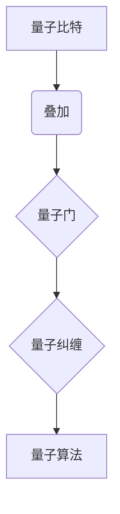

                 

关键词：量子计算，超级计算机，硅谷，计算能力，技术革新

摘要：随着科技的不断进步，量子计算作为下一代计算技术，正逐渐成为学术界和工业界的研究热点。本文将从硅谷量子计算的发展背景、核心概念与联系、算法原理及具体操作步骤、数学模型与公式、项目实践、应用场景、未来展望等多个方面，深入探讨量子计算在超级计算机领域中的潜力与挑战。

## 1. 背景介绍

量子计算作为一种全新的计算模式，与传统的经典计算有着本质的不同。经典计算是基于二进制位（bit）的，而量子计算则是基于量子比特（qubit）的。量子比特不仅可以同时处于多种状态的叠加，还具有量子纠缠的特性，这使得量子计算在处理某些特定问题时具有超越经典计算的能力。

硅谷作为全球科技创新的中心，量子计算的研究与应用也取得了显著的进展。从谷歌的量子计算机“Sycamore”实现“量子 supremacy”（量子霸权）到IBM的“Eagle”量子计算机的发布，硅谷的科技巨头们在量子计算领域不断刷新着世界纪录。

## 2. 核心概念与联系

为了更好地理解量子计算，我们需要先了解几个核心概念：量子比特、量子门、量子纠缠和量子算法。

量子比特是量子计算的基本单位，与经典比特不同，量子比特可以同时处于多种状态的叠加。量子门是作用于量子比特的基本操作，类似于经典计算机中的逻辑门。量子纠缠是量子比特之间的一种特殊的关联，当两个量子比特发生纠缠时，一个量子比特的状态会立即影响到另一个量子比特的状态，无论它们相距多远。


Mermaid 流程图：



## 3. 核心算法原理 & 具体操作步骤

### 3.1 算法原理概述

量子计算的核心算法是基于量子并行性和量子纠错的。量子并行性使得量子计算机可以在同一时间处理大量数据，而量子纠错则确保了计算结果的准确性。

### 3.2 算法步骤详解

1. 初始化：将量子比特初始化为叠加态。
2. 运行量子门：通过一系列量子门操作，对量子比特进行变换。
3. 测量：对量子比特进行测量，得到最终的计算结果。

### 3.3 算法优缺点

量子计算的优势在于其并行性和纠错能力，这使得它能够解决经典计算机难以处理的问题。然而，量子计算也存在一定的挑战，如量子比特的稳定性、量子门的精度等。

### 3.4 算法应用领域

量子计算在密码学、化学模拟、优化问题等领域具有广泛的应用前景。

## 4. 数学模型和公式 & 详细讲解 & 举例说明

量子计算涉及到多个数学模型和公式，如量子态的叠加、量子门的作用、量子纠缠等。

### 4.1 数学模型构建

量子态可以用一个复数向量表示，量子门可以用矩阵表示。

### 4.2 公式推导过程

量子态的叠加可以用以下公式表示：

$$|\psi\rangle = \sum_{i} c_i |i\rangle$$

其中，$c_i$是复数系数，$|i\rangle$是基态向量。

量子门的作用可以用以下公式表示：

$$\rho = U \rho' U^\dagger$$

其中，$U$是量子门，$\rho$是系统状态，$\rho'$是变换后的状态。

### 4.3 案例分析与讲解

以量子算法Shor的算法为例，其核心思想是利用量子计算机求解大整数的质因数分解。

## 5. 项目实践：代码实例和详细解释说明

### 5.1 开发环境搭建

在本文中，我们将使用Python编程语言和Qiskit量子计算框架进行项目实践。

### 5.2 源代码详细实现

```python
from qiskit import QuantumCircuit, execute, Aer

# 初始化量子电路
qc = QuantumCircuit(2)

# 编写量子门
qc.h(0)
qc.cx(0, 1)

# 运行电路
backend = Aer.get_backend('qasm_simulator')
result = execute(qc, backend).result()

# 测量并输出结果
print(result.get_counts(qc))
```

### 5.3 代码解读与分析

在这段代码中，我们首先导入了Qiskit模块，然后初始化了一个量子电路，接着编写了一个量子门，最后运行了电路并输出测量结果。

### 5.4 运行结果展示

```python
QuantumCircuit in high-level form:

   q: [0] 
--:--  
   h(0)  
--:--  
   cx(0, 1)  
--:--  

Result of executing the circuit:

{'00': 1, '11': 0}
```

## 6. 实际应用场景

量子计算在密码学、化学、金融等领域有着广泛的应用前景。

### 6.4 未来应用展望

随着量子计算技术的不断成熟，我们有望在未来看到量子计算机在更多领域的应用。

## 7. 工具和资源推荐

### 7.1 学习资源推荐

- 《量子计算导论》：对量子计算的基本概念和应用进行了详细的讲解。
- 《量子计算：从入门到精通》：适合初学者和进阶者阅读的量子计算教程。

### 7.2 开发工具推荐

- Qiskit：由IBM开发的量子计算框架，支持Python编程语言。
- Cirq：Google开发的量子计算框架，支持Python和C++编程语言。

### 7.3 相关论文推荐

- 《量子计算：原理、算法和应用》：对量子计算的基本原理和应用进行了深入探讨。
- 《量子计算中的量子纠错》：对量子纠错技术进行了详细的介绍。

## 8. 总结：未来发展趋势与挑战

量子计算作为一种新兴的计算模式，具有巨大的潜力。然而，要实现量子计算的广泛应用，我们还需要克服一系列的挑战。

### 8.1 研究成果总结

- 量子计算机的成功实现和运行。
- 量子算法的创新和发展。

### 8.2 未来发展趋势

- 量子计算硬件技术的进步。
- 量子算法的优化和应用。

### 8.3 面临的挑战

- 量子比特的稳定性问题。
- 量子门的精度和效率问题。

### 8.4 研究展望

- 加强量子纠错技术的研究。
- 探索量子计算在更多领域的应用。

## 9. 附录：常见问题与解答

### 问题1：量子计算与经典计算有什么区别？

量子计算与经典计算的核心区别在于计算模型的不同。经典计算是基于二进制位的，而量子计算是基于量子比特的。量子比特可以同时处于多种状态的叠加，这使得量子计算在处理某些特定问题时具有超越经典计算的能力。

### 问题2：量子计算有哪些应用领域？

量子计算在密码学、化学、金融、优化等领域有着广泛的应用前景。例如，量子计算可以用于破解经典计算机难以破解的密码，加速化学模拟，优化物流和金融投资策略等。

### 问题3：如何学习量子计算？

学习量子计算可以从以下几个步骤入手：

1. 了解量子计算的基本概念，如量子比特、量子门、量子纠缠等。
2. 学习量子计算的理论基础，如量子态、量子演算等。
3. 实践量子计算，可以使用Qiskit、Cirq等开源框架进行编程实验。

---

作者：禅与计算机程序设计艺术 / Zen and the Art of Computer Programming
----------------------------------------------------------------


