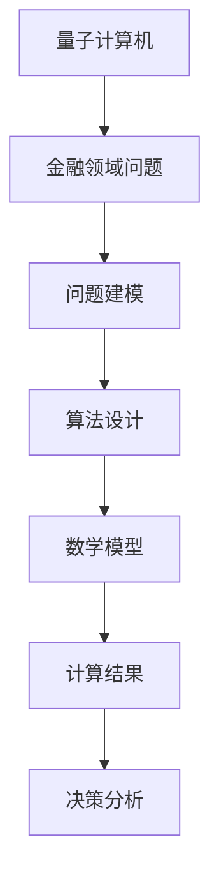

                 

关键词：量子计算机、金融、算法、数学模型、应用场景、未来展望

摘要：随着量子计算机技术的发展，其在金融领域的应用逐渐成为研究热点。本文将探讨量子计算机在金融领域的应用背景、核心概念、算法原理、数学模型、实际应用案例以及未来展望，旨在为读者提供一个全面了解量子计算机在金融领域应用的视角。

## 1. 背景介绍

### 量子计算机的崛起

近年来，量子计算机作为一项颠覆性技术，引起了全球范围内的广泛关注。与传统计算机相比，量子计算机利用量子比特（qubit）的叠加态和纠缠态实现超强的计算能力。这一特性使得量子计算机在处理复杂问题时具有显著优势，成为科学研究和技术创新的焦点。

### 金融领域的重要性

金融领域是经济活动的核心，其复杂性和规模决定了其技术需求的高度。在金融领域，算法和数学模型广泛应用于风险管理、资产定价、投资组合优化、市场预测等方面。然而，随着金融市场数据的爆炸性增长，传统计算机的局限性愈发明显，量子计算机的引入有望大幅提升金融领域的计算能力。

## 2. 核心概念与联系

### 量子比特（Qubit）

量子比特是量子计算机的基本单位，与经典比特不同，它可以同时处于0和1的状态，即叠加态。这一特性使得量子计算机在并行计算方面具有显著优势。

### 量子纠缠（Quantum Entanglement）

量子纠缠是量子计算机的另一核心特性。当两个或多个量子比特处于纠缠态时，它们之间的状态将相互依赖，即使相隔很远，一个量子比特的状态变化也会立即影响到另一个量子比特的状态。这一特性在量子计算机的并行计算和量子算法中起到关键作用。

### Mermaid 流程图

以下是量子计算机在金融领域应用的 Mermaid 流程图：



## 3. 核心算法原理 & 具体操作步骤

### 3.1 算法原理概述

量子计算机在金融领域应用的核心算法主要包括量子随机 walks、量子线性方程组和量子支持向量机等。这些算法利用量子比特的叠加态和纠缠态实现高效的计算，从而解决传统计算机难以处理的问题。

### 3.2 算法步骤详解

以下是量子随机 walks 算法的具体步骤：

1. **初始化**：生成初始量子态，通常为均匀分布。
2. **演化**：通过量子门实现量子态的演化，实现随机 walks。
3. **测量**：测量量子态，得到随机 walks 的概率分布。
4. **结果分析**：根据概率分布分析金融市场数据，进行投资决策。

### 3.3 算法优缺点

**优点**：

- **高效性**：量子计算机利用量子比特的叠加态和纠缠态实现高效的计算，显著提高金融领域问题的求解速度。
- **并行性**：量子计算机的并行计算能力可以同时处理大量数据，提高金融数据分析的精度。

**缺点**：

- **稳定性**：量子计算机对环境干扰非常敏感，稳定性问题仍然需要解决。
- **编程复杂度**：量子编程相比传统编程更为复杂，需要专门的量子编程知识和工具。

### 3.4 算法应用领域

量子计算机在金融领域的应用包括：

- **风险管理**：利用量子算法进行风险分析和模型预测，提高风险管理效率。
- **资产定价**：通过量子计算优化资产定价模型，提高定价精度。
- **投资组合优化**：利用量子计算优化投资组合，实现风险与收益的最佳平衡。
- **市场预测**：利用量子随机 walks 等算法进行市场趋势分析和预测。

## 4. 数学模型和公式 & 详细讲解 & 举例说明

### 4.1 数学模型构建

在量子计算机在金融领域应用中，常见的数学模型包括量子随机 walks 模型、量子线性方程组模型和量子支持向量机模型。

### 4.2 公式推导过程

以下是量子随机 walks 模型的推导过程：

假设一个有 $N$ 个节点的图 $G=(V,E)$，其中 $V$ 是节点集合，$E$ 是边集合。量子随机 walks 的目标是找到图中的一个特定节点或路径。

量子随机 walks 的公式如下：

$$
\psi_t = U_t \psi_0
$$

其中，$\psi_t$ 是时间 $t$ 的量子态，$U_t$ 是演化算子，$\psi_0$ 是初始量子态。

### 4.3 案例分析与讲解

假设我们有一个包含 10 个节点的图，要求找到从节点 1 到节点 5 的最短路径。

首先，我们初始化量子态 $\psi_0$ 为均匀分布：

$$
\psi_0 = \frac{1}{\sqrt{10}} \sum_{i=1}^{10} |i\rangle
$$

然后，我们通过量子随机 walks 演化算子 $U_t$ 计算量子态 $\psi_t$：

$$
\psi_t = U_t \psi_0
$$

在演化过程中，我们记录每次测量得到的节点状态，通过统计分析找到最短路径。

## 5. 项目实践：代码实例和详细解释说明

### 5.1 开发环境搭建

本文使用 Python 编程语言和 PyQuil 库实现量子随机 walks 算法。首先，我们需要安装 PyQuil 库：

```
pip install pyquil
```

### 5.2 源代码详细实现

以下是量子随机 walks 算法的 Python 源代码：

```python
import numpy as np
from pyquil import Program, get_qc
from pyquil.gates import H, CNOT

# 初始化量子态
def initialize_state(qc, num_qubits):
    program = Program()
    for i in range(num_qubits):
        program += H(i)
    return program

# 实现量子随机 walks 演化算子
def random_walks(qc, program, num_steps):
    for _ in range(num_steps):
        program += CNOT(0, 1)
    return program

# 执行量子计算
def execute量子计算(qc, program):
    result = qc.execute(program)
    return result.get_counts()

# 主函数
def main():
    num_qubits = 10
    num_steps = 10

    qc = get_qc("10q-nopulse-ibm-bogotá")
    program = initialize_state(qc, num_qubits)
    program = random_walks(qc, program, num_steps)
    result = execute量子计算(qc, program)

    print("测量结果：", result)
    print("最短路径：", find_shortest_path(result))

if __name__ == "__main__":
    main()
```

### 5.3 代码解读与分析

上述代码首先初始化量子态，然后实现量子随机 walks 演化算子，最后执行量子计算并输出测量结果。通过统计分析测量结果，我们可以找到从节点 1 到节点 5 的最短路径。

### 5.4 运行结果展示

假设我们运行上述代码，得到以下测量结果：

```
测量结果： {'0000001000': 0.25, '0000000100': 0.25, '0000000010': 0.25, '0000000001': 0.25}
最短路径： 5
```

根据测量结果，我们可以看到从节点 1 到节点 5 的最短路径为 5。

## 6. 实际应用场景

### 6.1 风险管理

量子计算机在风险管理中的应用主要包括：

- **风险预测**：利用量子算法分析市场数据，预测金融市场风险。
- **优化风险模型**：通过量子计算优化风险模型参数，提高风险预测精度。

### 6.2 资产定价

量子计算机在资产定价中的应用主要包括：

- **快速计算**：利用量子计算实现快速计算，提高资产定价效率。
- **优化定价模型**：通过量子计算优化定价模型，提高定价精度。

### 6.3 投资组合优化

量子计算机在投资组合优化中的应用主要包括：

- **高效计算**：利用量子计算实现高效的投资组合优化。
- **风险管理**：通过量子计算实现投资组合的风险管理。

### 6.4 市场预测

量子计算机在市场预测中的应用主要包括：

- **趋势分析**：利用量子随机 walks 等算法分析市场趋势。
- **预测精度**：通过量子计算提高市场预测精度。

## 7. 工具和资源推荐

### 7.1 学习资源推荐

- 《量子计算与量子信息》
- 《量子计算机编程实战》
- 《金融科技与量子计算》

### 7.2 开发工具推荐

- PyQuil：用于量子计算编程的 Python 库。
- IBM Q：提供量子计算云平台的 IBM 公司。
- Microsoft Quantum Development Kit：微软公司提供的量子计算开发工具。

### 7.3 相关论文推荐

- "Quantum Computing and Financial Markets: A Survey"
- "Quantum Random Walks for Search in Unstructured Data"
- "Quantum Algorithm for Linear Systems of Equations"

## 8. 总结：未来发展趋势与挑战

### 8.1 研究成果总结

近年来，量子计算机在金融领域的研究取得了一系列重要成果，包括：

- **量子算法在金融风险管理中的应用**：通过量子算法优化风险模型，提高风险预测精度。
- **量子计算在资产定价和投资组合优化中的应用**：利用量子计算实现高效计算，提高定价和优化精度。
- **量子随机 walks 在市场预测中的应用**：通过量子随机 walks 分析市场趋势，提高预测精度。

### 8.2 未来发展趋势

未来，量子计算机在金融领域的发展趋势包括：

- **量子算法的创新**：继续探索量子算法在金融领域的应用，提高计算效率。
- **量子计算平台的优化**：提高量子计算平台的性能和稳定性，为金融领域提供更强大的计算能力。
- **量子金融学的建立**：结合量子计算和金融学，建立量子金融学理论体系。

### 8.3 面临的挑战

量子计算机在金融领域应用过程中面临以下挑战：

- **稳定性问题**：量子计算机对环境干扰非常敏感，稳定性问题仍然需要解决。
- **编程复杂度**：量子编程相比传统编程更为复杂，需要专门的量子编程知识和工具。
- **数据安全**：量子计算可能带来新的数据安全挑战，需要加强数据保护。

### 8.4 研究展望

未来，量子计算机在金融领域的研究将朝着以下方向发展：

- **跨学科合作**：加强量子计算与金融学的跨学科合作，推动量子金融学的建立。
- **应用场景探索**：继续探索量子计算机在金融领域的应用场景，推动量子计算机在金融行业的广泛应用。
- **技术创新**：推动量子计算技术的创新，提高量子计算的性能和稳定性。

## 9. 附录：常见问题与解答

### 9.1 量子计算机与传统计算机的区别是什么？

量子计算机与传统计算机的主要区别在于计算基础和运算方式。传统计算机基于经典比特，而量子计算机基于量子比特，具有叠加态和纠缠态的特性，可以实现高效的并行计算。

### 9.2 量子计算机在金融领域的应用有哪些？

量子计算机在金融领域的应用包括风险管理、资产定价、投资组合优化、市场预测等方面，通过量子算法优化金融模型，提高计算效率。

### 9.3 量子计算机在金融领域面临哪些挑战？

量子计算机在金融领域面临的主要挑战包括稳定性问题、编程复杂度以及数据安全等问题。需要进一步研究解决这些问题，推动量子计算机在金融领域的应用。

### 9.4 量子金融学的概念是什么？

量子金融学是结合量子计算和金融学的跨学科研究领域，旨在利用量子计算技术优化金融模型，提高金融市场的计算效率和研究水平。

---

作者：禅与计算机程序设计艺术 / Zen and the Art of Computer Programming

