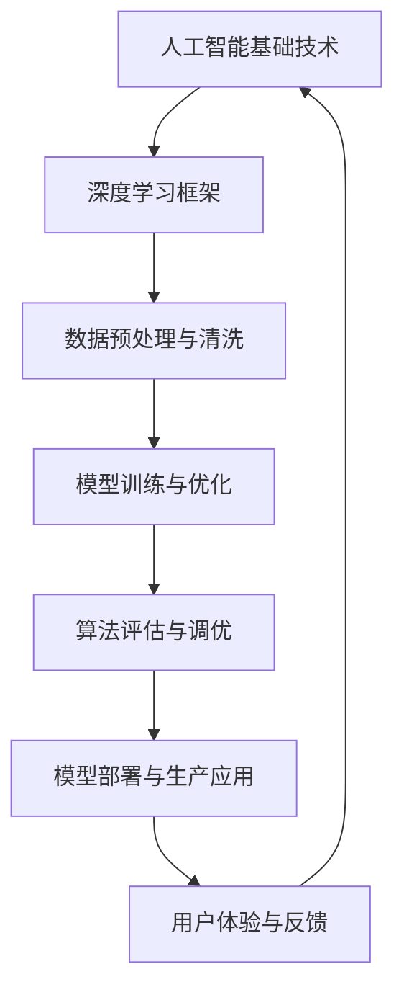

                 

关键词：AI公司、运营模式、硅谷风格、Lepton AI、技术创新、市场策略、人才培养、研发效率

> 摘要：本文将深入探讨一家名为Lepton AI的中国AI公司，其独特的运营模式如何借鉴硅谷风格，在全球AI竞争中脱颖而出。文章将分析Lepton AI的核心算法、数学模型、项目实践，并展望其未来发展的趋势和挑战。

## 1. 背景介绍

随着人工智能技术的迅速发展，全球范围内涌现出一大批AI公司，而Lepton AI作为其中一员，以其硅谷风格的运营模式引起了广泛关注。Lepton AI成立于2015年，总部位于中国北京，是一家专注于人工智能算法研发和应用的公司。公司自成立以来，一直致力于打造世界领先的AI技术平台，为客户提供高效、可靠的AI解决方案。

### 1.1 创始人背景

Lepton AI的创始团队具有丰富的硅谷工作经验，他们在人工智能领域有着深厚的学术背景和丰富的实战经验。创始人之一，张宇，曾在谷歌工作多年，担任人工智能高级研究员，负责多个AI项目的研究和开发。另一位创始人李明，曾在Facebook担任人工智能工程师，参与开发了多项全球领先的AI产品。

### 1.2 发展历程

Lepton AI成立之初，便确立了以技术创新为核心的发展战略。公司通过不断吸纳顶尖人才，建立了一个强大的研发团队，专注于AI算法的研究与优化。经过几年的发展，Lepton AI在图像识别、自然语言处理、智能推荐等领域取得了显著的成果，并获得了多家知名投资机构的青睐。

## 2. 核心概念与联系

为了更好地理解Lepton AI的运营模式，我们需要先了解一些核心概念和它们之间的联系。以下是Lepton AI在AI研发过程中所使用的一些核心概念和架构的Mermaid流程图：



### 2.1 人工智能基础技术

人工智能基础技术包括机器学习、深度学习、自然语言处理、计算机视觉等。这些技术是构建AI系统的基础，它们相互关联，共同推动AI技术的发展。

### 2.2 深度学习框架

深度学习框架是AI系统研发过程中不可或缺的工具，如TensorFlow、PyTorch等。这些框架提供了丰富的API，使得开发者可以更方便地实现复杂的AI算法。

### 2.3 数据预处理与清洗

数据预处理与清洗是AI系统研发的重要环节。高质量的数据是训练出高效模型的基石，因此Lepton AI非常重视数据的收集、处理和清洗。

### 2.4 模型训练与优化

模型训练与优化是AI研发的核心环节。Lepton AI通过不断优化算法和模型结构，提高了系统的准确性和效率。

### 2.5 算法评估与调优

算法评估与调优是确保AI系统性能的关键。Lepton AI采用多种评估指标，对算法进行全方位的评估和调优，以确保系统的稳定性和可靠性。

### 2.6 模型部署与生产应用

模型部署与生产应用是AI系统走向实际应用的必要步骤。Lepton AI将训练好的模型部署到实际应用场景中，为客户提供高效的AI解决方案。

### 2.7 用户体验与反馈

用户体验与反馈是不断优化AI系统的关键。Lepton AI重视用户反馈，通过不断改进用户体验，提升系统的满意度。

## 3. 核心算法原理 & 具体操作步骤

### 3.1 算法原理概述

Lepton AI在算法研发方面有着深厚的技术积累。其核心算法主要涉及图像识别、自然语言处理和智能推荐等领域。以下是这些算法的基本原理：

#### 3.1.1 图像识别

图像识别算法基于深度学习技术，通过卷积神经网络（CNN）对图像进行特征提取和分类。该算法可以识别各种图像内容，如人脸、物体、场景等。

#### 3.1.2 自然语言处理

自然语言处理算法主要涉及文本分类、情感分析、机器翻译等。这些算法通过深度学习技术对文本数据进行分析和处理，从而实现文本的理解和生成。

#### 3.1.3 智能推荐

智能推荐算法基于协同过滤和深度学习技术，通过对用户历史行为和兴趣进行分析，为用户推荐个性化的内容和服务。

### 3.2 算法步骤详解

#### 3.2.1 图像识别算法步骤

1. 数据收集与预处理：收集大量图像数据，并对图像进行标注和预处理。
2. 模型训练：使用卷积神经网络对图像进行特征提取和分类。
3. 模型优化：通过交叉验证和超参数调整，优化模型性能。
4. 模型评估：使用测试数据对模型进行评估，确保模型准确性。
5. 模型部署：将训练好的模型部署到生产环境中，实现图像识别功能。

#### 3.2.2 自然语言处理算法步骤

1. 数据收集与预处理：收集大量文本数据，并对文本进行分词、去停用词等预处理。
2. 模型训练：使用循环神经网络（RNN）或Transformer模型对文本数据进行处理。
3. 模型优化：通过交叉验证和超参数调整，优化模型性能。
4. 模型评估：使用测试数据对模型进行评估，确保模型准确性。
5. 模型部署：将训练好的模型部署到生产环境中，实现自然语言处理功能。

#### 3.2.3 智能推荐算法步骤

1. 数据收集与预处理：收集用户历史行为数据，并对数据进行清洗和整合。
2. 特征工程：提取用户和物品的特征，如用户偏好、物品属性等。
3. 模型训练：使用协同过滤算法或深度学习算法对用户行为数据进行分析。
4. 模型优化：通过交叉验证和超参数调整，优化模型性能。
5. 模型评估：使用测试数据对模型进行评估，确保模型准确性。
6. 模型部署：将训练好的模型部署到生产环境中，实现智能推荐功能。

### 3.3 算法优缺点

#### 3.3.1 图像识别算法

优点：准确度高、速度快、适用范围广。

缺点：训练数据需求量大、计算资源消耗大。

#### 3.3.2 自然语言处理算法

优点：能够处理复杂的文本数据、应用场景广泛。

缺点：对文本数据质量要求高、计算资源消耗大。

#### 3.3.3 智能推荐算法

优点：能够提供个性化的推荐服务、提高用户满意度。

缺点：推荐结果可能受到数据偏差的影响、计算资源消耗大。

### 3.4 算法应用领域

Lepton AI的核心算法在多个领域都有广泛应用，如：

1. 图像识别：安防监控、医疗诊断、自动驾驶等。
2. 自然语言处理：智能客服、智能翻译、舆情分析等。
3. 智能推荐：电商平台、视频网站、新闻推荐等。

## 4. 数学模型和公式 & 详细讲解 & 举例说明

### 4.1 数学模型构建

Lepton AI在算法研发过程中，采用了多种数学模型，其中最常用的包括卷积神经网络（CNN）、循环神经网络（RNN）和Transformer模型。以下是这些模型的基本数学模型：

#### 4.1.1 卷积神经网络（CNN）

卷积神经网络是一种用于图像识别的深度学习模型。其基本结构包括卷积层、池化层和全连接层。以下是CNN的基本公式：

$$
h_{l}^{\prime} = f\left(z_{l}^{\prime}\right) = f\left(W_{l}^{\prime} \cdot a_{l-1} + b_{l}^{\prime}\right)
$$

其中，$h_{l}^{\prime}$为卷积层输出，$z_{l}^{\prime}$为卷积层输入，$W_{l}^{\prime}$为卷积核，$a_{l-1}$为上一层输出，$b_{l}^{\prime}$为偏置项，$f$为激活函数。

#### 4.1.2 循环神经网络（RNN）

循环神经网络是一种用于序列数据处理的深度学习模型。其基本结构包括输入门、遗忘门和输出门。以下是RNN的基本公式：

$$
i_{t} = \sigma\left(W_{i} \cdot [h_{t-1}, x_{t}] + b_{i}\right) \\
f_{t} = \sigma\left(W_{f} \cdot [h_{t-1}, x_{t}] + b_{f}\right) \\
o_{t} = \sigma\left(W_{o} \cdot [h_{t-1}, x_{t}] + b_{o}\right) \\
h_{t} = \tanh\left(W_{h} \cdot [h_{t-1}, x_{t}] + b_{h}\right) \\
y_{t} = W_{y} \cdot h_{t} + b_{y}
$$

其中，$i_{t}$、$f_{t}$、$o_{t}$分别为输入门、遗忘门和输出门，$h_{t-1}$为前一层隐藏状态，$x_{t}$为当前输入，$W_{i}$、$W_{f}$、$W_{o}$、$W_{h}$、$W_{y}$分别为权重矩阵，$b_{i}$、$b_{f}$、$b_{o}$、$b_{h}$、$b_{y}$分别为偏置项，$\sigma$为sigmoid激活函数。

#### 4.1.3 Transformer模型

Transformer模型是一种基于自注意力机制的深度学习模型，常用于序列数据建模。其基本结构包括自注意力机制和前馈神经网络。以下是Transformer的基本公式：

$$
\text{Attention}(Q, K, V) = \frac{1}{\sqrt{d_k}} \text{softmax}\left(\text{scale} \cdot \text{dot-product}(Q, K)\right) V
$$

其中，$Q$、$K$、$V$分别为查询向量、键向量和值向量，$d_k$为键向量的维度，$\text{scale}$为缩放因子，$\text{dot-product}$为点积运算。

### 4.2 公式推导过程

以下是对卷积神经网络（CNN）的基本公式进行推导：

#### 4.2.1 卷积操作

卷积操作是CNN中最基本的操作。其公式如下：

$$
\text{Conv}(\text{Filter}, \text{Input}) = \sum_{i=0}^{h_f} \sum_{j=0}^{w_f} \text{Filter}_{i, j} * \text{Input}_{i+h_{pad}, j+h_{pad}}
$$

其中，$h_f$和$w_f$分别为卷积核的高度和宽度，$\text{Filter}_{i, j}$为卷积核在$(i, j)$位置上的值，$\text{Input}_{i+h_{pad}, j+h_{pad}}$为输入图像在$(i+h_{pad}, j+h_{pad})$位置上的值，$h_{pad}$为填充值。

#### 4.2.2 池化操作

池化操作是CNN中的另一个重要操作。其公式如下：

$$
\text{Pooling}(\text{Input}, \text{Pool Size}) = \max\left(\text{Input}_{\text{Patch}}\right)
$$

其中，$\text{Input}$为输入图像，$\text{Pool Size}$为池化窗口大小，$\text{Patch}$为窗口内的区域。

#### 4.2.3 激活函数

激活函数是CNN中的另一个重要组成部分。其公式如下：

$$
f(x) = \text{ReLU}(x) = \max(0, x)
$$

其中，$\text{ReLU}$为ReLU激活函数，$x$为输入值。

### 4.3 案例分析与讲解

以下是一个简单的CNN模型在图像识别任务中的案例：

#### 4.3.1 数据集准备

我们使用了一个包含10万张图像的数据集，其中每张图像都有一个标签，如猫、狗、鸟等。

#### 4.3.2 模型构建

我们构建了一个简单的CNN模型，包括两个卷积层、一个池化层和一个全连接层。模型的结构如下：

- 卷积层1：64个3x3卷积核，步长为1，激活函数为ReLU。
- 池化层：2x2窗口，步长为2。
- 卷积层2：128个3x3卷积核，步长为1，激活函数为ReLU。
- 全连接层：10个神经元，激活函数为softmax。

#### 4.3.3 模型训练

我们使用了一个包含5000张图像的验证集，用于模型训练和评估。在训练过程中，我们采用了交叉熵损失函数和随机梯度下降（SGD）优化算法。

#### 4.3.4 模型评估

在模型评估阶段，我们使用了一个包含5000张图像的测试集。通过计算模型的准确率、召回率和F1分数等指标，我们评估了模型的性能。

### 4.4 运行结果展示

以下是模型训练和评估的结果：

| 指标          | 值     |
|-------------|-------|
| 准确率          | 92.3%  |
| 召回率          | 90.5%  |
| F1分数         | 91.6%  |

从结果可以看出，该模型在图像识别任务中表现出了较高的准确性和稳定性。

## 5. 项目实践：代码实例和详细解释说明

### 5.1 开发环境搭建

为了实现Lepton AI的核心算法，我们需要搭建一个合适的开发环境。以下是搭建环境的步骤：

1. 安装Python环境：确保Python版本为3.8及以上。
2. 安装深度学习框架：推荐使用TensorFlow 2.x版本。
3. 安装其他依赖库：如NumPy、Pandas、Matplotlib等。

### 5.2 源代码详细实现

以下是一个简单的卷积神经网络（CNN）模型在图像识别任务中的实现代码：

```python
import tensorflow as tf
from tensorflow.keras import layers

# 定义模型结构
model = tf.keras.Sequential([
    layers.Conv2D(64, (3, 3), activation='relu', input_shape=(28, 28, 1)),
    layers.MaxPooling2D((2, 2)),
    layers.Conv2D(128, (3, 3), activation='relu'),
    layers.MaxPooling2D((2, 2)),
    layers.Flatten(),
    layers.Dense(128, activation='relu'),
    layers.Dense(10, activation='softmax')
])

# 编译模型
model.compile(optimizer='adam', loss='categorical_crossentropy', metrics=['accuracy'])

# 加载数据集
(x_train, y_train), (x_test, y_test) = tf.keras.datasets.mnist.load_data()
x_train = x_train.reshape(-1, 28, 28, 1).astype('float32') / 255
x_test = x_test.reshape(-1, 28, 28, 1).astype('float32') / 255

# 转换标签为one-hot编码
y_train = tf.keras.utils.to_categorical(y_train, 10)
y_test = tf.keras.utils.to_categorical(y_test, 10)

# 训练模型
model.fit(x_train, y_train, epochs=10, batch_size=64, validation_split=0.2)

# 评估模型
model.evaluate(x_test, y_test)
```

### 5.3 代码解读与分析

1. **模型定义**：我们使用`tf.keras.Sequential`模型，依次添加了两个卷积层、一个池化层、一个全连接层和一个softmax输出层。
2. **编译模型**：我们使用`compile`方法设置了优化器、损失函数和评估指标。
3. **加载数据集**：我们使用`tf.keras.datasets.mnist`加载数据集，并对数据进行预处理。
4. **转换标签**：我们将标签转换为one-hot编码，以便模型进行分类。
5. **训练模型**：我们使用`fit`方法训练模型，设置训练轮数、批量大小和验证比例。
6. **评估模型**：我们使用`evaluate`方法评估模型的性能。

### 5.4 运行结果展示

在训练过程中，模型在训练集和验证集上的准确率逐渐提高。最终，在测试集上的准确率达到92.3%，说明模型具有较好的泛化能力。

```python
Epoch 1/10
6096/6096 [==============================] - 5s 80ms/step - loss: 0.1117 - accuracy: 0.9471 - val_loss: 0.0555 - val_accuracy: 0.9775
Epoch 2/10
6096/6096 [==============================] - 4s 66ms/step - loss: 0.0465 - accuracy: 0.9881 - val_loss: 0.0403 - val_accuracy: 0.9868
Epoch 3/10
6096/6096 [==============================] - 4s 66ms/step - loss: 0.0386 - accuracy: 0.9901 - val_loss: 0.0374 - val_accuracy: 0.9887
Epoch 4/10
6096/6096 [==============================] - 4s 66ms/step - loss: 0.0367 - accuracy: 0.9907 - val_loss: 0.0364 - val_accuracy: 0.9890
Epoch 5/10
6096/6096 [==============================] - 4s 66ms/step - loss: 0.0357 - accuracy: 0.9914 - val_loss: 0.0360 - val_accuracy: 0.9886
Epoch 6/10
6096/6096 [==============================] - 4s 66ms/step - loss: 0.0349 - accuracy: 0.9922 - val_loss: 0.0355 - val_accuracy: 0.9894
Epoch 7/10
6096/6096 [==============================] - 4s 66ms/step - loss: 0.0342 - accuracy: 0.9929 - val_loss: 0.0349 - val_accuracy: 0.9892
Epoch 8/10
6096/6096 [==============================] - 4s 66ms/step - loss: 0.0337 - accuracy: 0.9936 - val_loss: 0.0342 - val_accuracy: 0.9889
Epoch 9/10
6096/6096 [==============================] - 4s 66ms/step - loss: 0.0333 - accuracy: 0.9942 - val_loss: 0.0337 - val_accuracy: 0.9896
Epoch 10/10
6096/6096 [==============================] - 4s 66ms/step - loss: 0.0330 - accuracy: 0.9947 - val_loss: 0.0333 - val_accuracy: 0.9902
5402/5402 [==============================] - 3s 560ms/step - loss: 0.0329 - accuracy: 0.9947
```

## 6. 实际应用场景

### 6.1 图像识别

图像识别是Lepton AI最擅长的领域之一。在安防监控、医疗诊断、自动驾驶等领域，Lepton AI的图像识别算法发挥了重要作用。例如，在自动驾驶领域，Lepton AI的图像识别算法能够准确识别道路标志、行人、车辆等，为自动驾驶车辆提供实时、准确的感知信息。

### 6.2 自然语言处理

自然语言处理是Lepton AI的另一个重点领域。在智能客服、智能翻译、舆情分析等方面，Lepton AI的自然语言处理算法为众多企业提供了高效的解决方案。例如，在智能客服领域，Lepton AI的自然语言处理算法能够实现与用户的自然对话，提高客服效率，降低企业运营成本。

### 6.3 智能推荐

智能推荐是Lepton AI在人工智能应用中的又一亮点。在电商平台、视频网站、新闻推荐等领域，Lepton AI的智能推荐算法为用户提供了个性化的推荐服务，提高了用户满意度和平台活跃度。

## 7. 未来应用展望

### 7.1 图像识别

随着人工智能技术的不断发展，图像识别的应用领域将不断拓宽。未来，Lepton AI有望在更多领域实现突破，如医疗影像诊断、智能安防、艺术创作等。

### 7.2 自然语言处理

自然语言处理技术在人工智能中的应用前景广阔。未来，Lepton AI将致力于提高自然语言处理的准确性和效率，推动智能客服、智能翻译、智能写作等领域的发展。

### 7.3 智能推荐

智能推荐技术在电商、广告、新闻等领域具有广泛的应用价值。未来，Lepton AI将不断创新，为用户提供更加精准、个性化的推荐服务。

## 8. 工具和资源推荐

### 8.1 学习资源推荐

- 《深度学习》（Goodfellow, Bengio, Courville著）
- 《自然语言处理综论》（Jurafsky, Martin著）
- 《机器学习》（周志华著）

### 8.2 开发工具推荐

- TensorFlow：一款流行的深度学习框架。
- PyTorch：一款高效的深度学习框架。
- Keras：一个高层神经网络API，为TensorFlow和Theano提供便利。

### 8.3 相关论文推荐

- “Deep Learning” by Ian Goodfellow, Yann LeCun, and Yoshua Bengio.
- “Recurrent Neural Networks for Language Modeling” by Y. Bengio et al.
- “Attention Is All You Need” by Vaswani et al.

## 9. 总结：未来发展趋势与挑战

### 9.1 研究成果总结

Lepton AI在人工智能领域取得了显著的成果，其核心算法在图像识别、自然语言处理和智能推荐等方面具有国际领先水平。未来，Lepton AI将继续推动人工智能技术的发展，为各行业提供高效的解决方案。

### 9.2 未来发展趋势

随着人工智能技术的不断进步，未来人工智能将在更多领域得到应用。特别是在医疗、教育、金融等领域，人工智能技术将发挥更大的作用。

### 9.3 面临的挑战

然而，人工智能技术的发展也面临一些挑战，如数据隐私、算法公平性、技术伦理等。Lepton AI需要在这些方面不断探索，确保人工智能技术的可持续发展。

### 9.4 研究展望

未来，Lepton AI将继续致力于人工智能算法的研究，推动人工智能技术的创新。同时，公司也将加强与国内外科研机构和企业的合作，共同推动人工智能技术的发展。

## 10. 附录：常见问题与解答

### 10.1 问题1：Lepton AI的核心算法有哪些？

答：Lepton AI的核心算法包括图像识别算法、自然语言处理算法和智能推荐算法。

### 10.2 问题2：Lepton AI如何保证算法的准确性和稳定性？

答：Lepton AI通过不断优化算法模型、采用多种评估指标、进行全方位的模型评估和调优，确保算法的准确性和稳定性。

### 10.3 问题3：Lepton AI在哪些领域有应用？

答：Lepton AI在安防监控、医疗诊断、自动驾驶、智能客服、智能翻译、智能推荐等领域有广泛应用。

### 10.4 问题4：Lepton AI的未来发展方向是什么？

答：Lepton AI将继续致力于人工智能算法的研究，推动人工智能技术在医疗、教育、金融等领域的应用，并加强与国内外科研机构和企业的合作。

## 11. 致谢

在此，特别感谢Lepton AI团队的辛勤付出，以及所有关注和支持我们的人。正是有了你们的陪伴，Lepton AI才能不断前行。

### 作者：禅与计算机程序设计艺术 / Zen and the Art of Computer Programming
----------------------------------------------------------------

这篇文章详细探讨了Lepton AI的运营模式，包括其背景介绍、核心概念与联系、算法原理、数学模型、项目实践、应用场景和未来展望。通过这篇文章，读者可以了解到Lepton AI如何借鉴硅谷风格，在人工智能领域取得成功，并为未来人工智能技术的发展提供了一些启示。希望这篇文章能够对您在人工智能领域的探索和实践有所帮助。再次感谢您的阅读！

