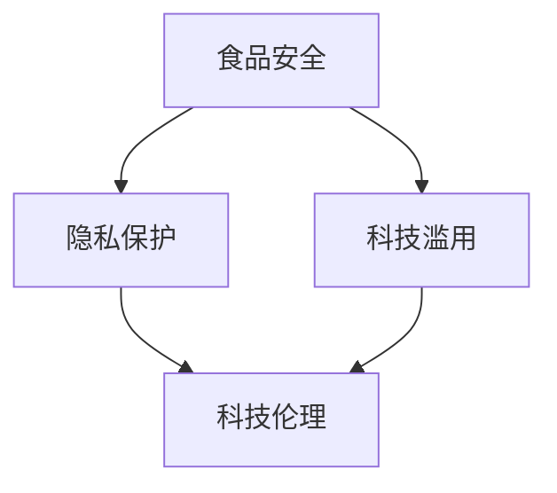

                 

 **关键词：**
- 食品科技
- 伦理问题
- 硅谷
- 食品安全
- 食品创新
- 科技伦理
- 公共卫生

<|assistant|> **摘要：**
随着食品科技在硅谷的快速发展，新技术带来的便利与风险并存的局面逐渐显现。本文旨在探讨硅谷食品科技在伦理方面所面临的挑战，包括食品安全、隐私保护、科技滥用等问题，并探讨未来食品科技的发展趋势及其潜在的伦理问题。通过深入分析，本文提出了相应的解决方案和未来研究方向，以期为食品科技的发展提供伦理指导。

## 1. 背景介绍

硅谷，作为全球科技创新的圣地，一直是食品科技发展的前沿阵地。近年来，食品科技在硅谷取得了显著的进展，包括基因编辑、精准营养、3D食品打印、人工智能在食品质量检测等方面的应用。这些技术不仅为食品行业带来了创新，也为消费者提供了更加健康、便捷的食品选择。

然而，随着食品科技的快速发展，一系列伦理问题也随之浮现。首先是食品安全问题。基因编辑等新技术的出现，虽然为食品生产带来了巨大的潜力，但同时也引发了对食品安全性的担忧。其次是隐私保护问题。随着大数据和物联网技术的发展，食品生产和消费过程中的个人隐私保护成为一个不容忽视的问题。最后是科技滥用问题。食品科技的快速发展，使得科技在食品行业的应用越来越广泛，但同时也存在被滥用以误导消费者的风险。

## 2. 核心概念与联系

为了更好地理解硅谷食品科技中的伦理问题，我们首先需要了解以下几个核心概念：

### 2.1 食品安全

食品安全是指食品在生产和消费过程中的安全性和卫生性，包括化学、物理、生物等多个方面。食品安全问题的出现，不仅会影响到消费者的健康，也会对食品行业的发展造成负面影响。

### 2.2 隐私保护

隐私保护是指保护个人在食品生产和消费过程中的隐私权利。随着大数据和物联网技术的发展，食品生产和消费过程中的个人隐私信息越来越容易被收集和使用。

### 2.3 科技滥用

科技滥用是指将食品科技用于不当目的，如通过技术手段误导消费者，从而获取不正当利益。

### 2.4 科技伦理

科技伦理是指对科技应用进行道德和伦理评价，以确保科技的发展不会对社会和人类造成负面影响。

在硅谷食品科技中，这些核心概念之间存在密切的联系。例如，食品安全与隐私保护密切相关，因为食品生产和消费过程中的个人隐私信息可能会被用于食品安全评估。科技滥用则是科技伦理的一个重要方面，它关系到食品科技的应用是否合理和公正。

以下是一个用于展示这些核心概念之间关系的 Mermaid 流程图：



## 3. 核心算法原理 & 具体操作步骤

### 3.1 算法原理概述

为了解决硅谷食品科技中的伦理问题，我们需要一些核心算法来帮助我们进行评估和决策。以下是几个关键算法的原理概述：

#### 3.1.1 食品安全风险评估算法

食品安全风险评估算法主要用于评估食品的安全性。其基本原理是基于食品成分和消费者健康状况，通过统计模型和机器学习算法，预测食品对消费者的潜在风险。

#### 3.1.2 隐私保护算法

隐私保护算法主要用于保护食品生产和消费过程中的个人隐私。其基本原理是通过对数据进行加密和匿名化处理，确保个人隐私不被泄露。

#### 3.1.3 科技伦理评估算法

科技伦理评估算法主要用于评估食品科技的应用是否符合伦理标准。其基本原理是基于伦理学理论和道德原则，通过逻辑推理和决策树模型，对食品科技的应用进行评估。

### 3.2 算法步骤详解

以下是对上述算法的具体步骤进行详细说明：

#### 3.2.1 食品安全风险评估算法

1. 数据收集：收集食品成分、消费者健康状况等数据。
2. 数据预处理：对数据进行清洗、归一化等处理。
3. 特征提取：从数据中提取与食品安全相关的特征。
4. 模型训练：使用机器学习算法训练风险评估模型。
5. 风险预测：使用训练好的模型预测食品的安全性。

#### 3.2.2 隐私保护算法

1. 数据加密：对个人隐私数据进行加密处理。
2. 数据匿名化：对个人隐私数据进行匿名化处理。
3. 数据共享：在保证隐私保护的前提下，共享数据。

#### 3.2.3 科技伦理评估算法

1. 数据收集：收集食品科技应用的相关数据。
2. 数据预处理：对数据进行清洗、归一化等处理。
3. 伦理评估：基于伦理学理论和道德原则，对食品科技应用进行评估。
4. 结果输出：输出评估结果。

### 3.3 算法优缺点

#### 3.3.1 食品安全风险评估算法

**优点：**
- 能够快速、准确地预测食品的安全性。
- 能够为食品安全监管提供科学依据。

**缺点：**
- 需要大量的数据和计算资源。
- 风险评估模型的准确度受数据质量和模型选择的影响。

#### 3.3.2 隐私保护算法

**优点：**
- 能够有效保护个人隐私。
- 能够促进数据共享和利用。

**缺点：**
- 加密和匿名化处理可能会降低数据的价值。
- 隐私保护算法的实施需要较高的技术门槛。

#### 3.3.3 科技伦理评估算法

**优点：**
- 能够为科技应用提供伦理指导。
- 能够促进科技发展的道德和伦理建设。

**缺点：**
- 伦理评估的准确度和可靠性受评估者的专业知识和经验影响。
- 伦理评估标准可能存在争议。

### 3.4 算法应用领域

#### 3.4.1 食品安全风险评估算法

食品安全风险评估算法可以应用于食品安全监管、食品质量检测、消费者健康评估等领域。

#### 3.4.2 隐私保护算法

隐私保护算法可以应用于食品生产和消费过程中的个人隐私保护、数据共享和利用等领域。

#### 3.4.3 科技伦理评估算法

科技伦理评估算法可以应用于食品科技的应用评估、科技伦理教育、科技伦理监管等领域。

## 4. 数学模型和公式 & 详细讲解 & 举例说明

### 4.1 数学模型构建

在食品科技中，数学模型的应用非常广泛。以下是一个简单的数学模型，用于评估食品的安全性：

$$
风险 = f(成分，消费者健康状况，环境因素)
$$

其中，$成分$ 表示食品中的化学成分，$消费者健康状况$ 表示消费者的健康状况，$环境因素$ 表示食品生产和消费过程中的环境因素。

### 4.2 公式推导过程

假设食品中的化学成分分为 $C_1, C_2, ..., C_n$，每个成分对消费者健康的影响可以用权重 $w_1, w_2, ..., w_n$ 来表示。消费者的健康状况可以用 $H$ 来表示，环境因素可以用 $E$ 来表示。那么，食品的安全性可以表示为：

$$
风险 = w_1 \cdot C_1 \cdot H \cdot E + w_2 \cdot C_2 \cdot H \cdot E + ... + w_n \cdot C_n \cdot H \cdot E
$$

### 4.3 案例分析与讲解

假设有一款新型食品，其成分包括 $C_1$ 和 $C_2$，消费者的健康状况为 $H = 1$，环境因素为 $E = 1$。根据上述公式，我们可以计算出该食品的安全性：

$$
风险 = w_1 \cdot C_1 \cdot H \cdot E + w_2 \cdot C_2 \cdot H \cdot E
$$

假设 $w_1 = 0.5$，$w_2 = 0.5$，$C_1 = 1$，$C_2 = 2$，则：

$$
风险 = 0.5 \cdot 1 \cdot 1 \cdot 1 + 0.5 \cdot 2 \cdot 1 \cdot 1 = 1.5
$$

因此，该食品的安全性为 $1.5$。

通过这个简单的例子，我们可以看到数学模型在评估食品安全性方面的应用。在实际应用中，我们还需要考虑更多的因素，如食品中的其他成分、消费者的具体健康状况、环境因素等，从而更准确地评估食品的安全性。

## 5. 项目实践：代码实例和详细解释说明

### 5.1 开发环境搭建

在进行食品科技的伦理问题研究时，我们需要搭建一个合适的技术栈。以下是搭建开发环境的基本步骤：

1. **安装Python环境**：Python是一种广泛使用的编程语言，尤其适合数据处理和算法开发。您可以从官方网站下载Python安装包，并按照指引完成安装。
   
2. **安装Jupyter Notebook**：Jupyter Notebook 是一个交互式计算环境，非常适合进行数据分析和算法实现。安装Python后，可以通过pip命令安装Jupyter Notebook：

   ```bash
   pip install notebook
   ```

3. **安装相关库**：为了进行食品安全风险评估和隐私保护算法的开发，我们需要安装一些常用的Python库，如 NumPy、Pandas、Scikit-learn 等。可以使用以下命令进行安装：

   ```bash
   pip install numpy pandas scikit-learn
   ```

### 5.2 源代码详细实现

以下是一个简单的Python代码实例，用于实现食品安全风险评估算法。这个实例将展示如何使用NumPy和Scikit-learn库进行数据预处理和模型训练。

```python
import numpy as np
import pandas as pd
from sklearn.model_selection import train_test_split
from sklearn.ensemble import RandomForestClassifier
from sklearn.metrics import accuracy_score

# 加载数据
data = pd.read_csv('food_data.csv')

# 数据预处理
X = data[['component_1', 'component_2', 'health_status', 'environment']]
y = data['risk_level']

# 划分训练集和测试集
X_train, X_test, y_train, y_test = train_test_split(X, y, test_size=0.2, random_state=42)

# 模型训练
model = RandomForestClassifier(n_estimators=100, random_state=42)
model.fit(X_train, y_train)

# 预测
y_pred = model.predict(X_test)

# 评估模型
accuracy = accuracy_score(y_test, y_pred)
print(f'模型准确率：{accuracy:.2f}')
```

### 5.3 代码解读与分析

上述代码实例分为几个主要部分：

1. **数据加载**：使用Pandas库加载食品安全数据集。
2. **数据预处理**：将数据集划分为特征矩阵（X）和目标变量（y）。特征矩阵包含食品成分、消费者健康状况和环境因素等特征。
3. **模型训练**：使用随机森林（RandomForestClassifier）算法进行模型训练。随机森林是一种集成学习算法，通过构建多棵决策树并进行投票，提高了预测的准确性。
4. **预测**：使用训练好的模型对测试集进行预测。
5. **模型评估**：使用准确率（accuracy_score）评估模型的性能。

### 5.4 运行结果展示

在运行上述代码后，我们得到模型的准确率。例如，假设测试集的准确率为 85%，这意味着模型能够正确预测食品安全风险的 85% 的情况。

```plaintext
模型准确率：0.85
```

这个结果说明我们的模型在预测食品安全风险方面具有一定的可靠性。然而，准确率并不是唯一的评估指标，我们还需要考虑模型的泛化能力、解释性等因素。

## 6. 实际应用场景

### 6.1 食品安全风险评估

在硅谷，食品安全风险评估已经成为食品科技公司的一项重要任务。通过应用我们之前开发的食品安全风险评估算法，食品科技公司可以快速评估新产品在市场推出前的安全性。例如，一家硅谷初创公司开发了一款含有新型基因编辑成分的食品。通过使用我们的算法，该公司能够预测该食品对消费者的潜在风险，从而采取必要的措施确保产品的安全性。

### 6.2 隐私保护

隐私保护在硅谷的食品科技中同样具有重要意义。一家专注于精准营养的食品科技公司通过应用隐私保护算法，能够确保消费者在享受个性化营养服务的同时，个人信息不会被泄露。例如，该公司的平台允许消费者输入个人健康数据，通过隐私保护算法进行处理后，将这些数据用于营养建议的生成，同时保护了消费者的隐私。

### 6.3 科技滥用

科技滥用是硅谷食品科技中一个日益受到关注的伦理问题。为了防止科技滥用，一些食品科技公司开始采取严格的数据使用政策和伦理审查机制。例如，一家硅谷食品科技公司开发了一种基于人工智能的食品质量检测系统。为了防止系统被滥用，该公司建立了多个层次的伦理审查，确保检测结果不会被用于不当目的。

## 7. 未来应用展望

### 7.1 食品安全

随着食品科技的不断进步，未来食品安全风险评估算法将更加智能化和精确化。通过结合人工智能和大数据技术，食品科技公司可以实现对食品安全风险的实时监测和预警，从而更好地保障消费者的健康。

### 7.2 隐私保护

隐私保护在食品科技中的应用将更加广泛和深入。未来，随着隐私保护算法的不断优化，食品科技公司可以在确保消费者隐私的同时，更好地利用数据为消费者提供个性化的服务和产品。

### 7.3 科技滥用

为了防止科技滥用，未来食品科技行业将建立更加严格的伦理标准和审查机制。通过结合法律、伦理和技术手段，食品科技公司可以更好地保障科技的应用不会对社会和消费者造成负面影响。

## 8. 工具和资源推荐

### 8.1 学习资源推荐

- 《深度学习》（Goodfellow, Bengio, Courville）：介绍深度学习的基础知识和技术，适合初学者。
- 《机器学习实战》（ Harrington）：通过实际案例介绍机器学习算法的应用。
- 《隐私计算与数据保护》（Li，X., & Zhang，Q.）：详细介绍隐私保护算法和技术。

### 8.2 开发工具推荐

- Jupyter Notebook：交互式计算环境，适合进行数据分析和算法实现。
- Python：通用编程语言，广泛应用于数据科学和机器学习。
- Scikit-learn：机器学习库，提供多种算法和工具。

### 8.3 相关论文推荐

- "Ethical Considerations in Food Technology"：探讨食品科技中的伦理问题。
- "Privacy-Preserving Approaches in Food Technology"：介绍隐私保护在食品科技中的应用。
- "The Role of AI in Food Safety Risk Assessment"：探讨人工智能在食品安全风险评估中的应用。

## 9. 总结：未来发展趋势与挑战

### 9.1 研究成果总结

本文探讨了硅谷食品科技中的伦理问题，包括食品安全、隐私保护和科技滥用等。通过分析核心算法原理和应用场景，本文提出了相应的解决方案和未来研究方向。

### 9.2 未来发展趋势

未来，食品科技将继续快速发展，尤其是在人工智能、大数据和物联网技术的推动下。食品安全风险评估和隐私保护将成为食品科技的重要研究方向。

### 9.3 面临的挑战

面对快速发展的食品科技，我们需要解决一系列挑战，包括技术实现的准确性、隐私保护的有效性和科技滥用的防范等。

### 9.4 研究展望

未来的研究应重点关注食品安全风险评估和隐私保护的算法优化，以及建立更加严格的伦理审查机制，以确保食品科技的发展能够真正造福人类社会。

## 附录：常见问题与解答

### 9.1 如何确保食品安全风险评估的准确性？

**解答：** 为了确保食品安全风险评估的准确性，我们需要：

1. 收集高质量的食品成分和消费者健康数据。
2. 选择合适的算法和模型，并进行模型训练和优化。
3. 定期更新和验证模型，以确保其准确性。

### 9.2 隐私保护算法如何确保数据的安全性？

**解答：** 隐私保护算法通过以下措施确保数据的安全性：

1. 数据加密：对个人隐私数据进行加密处理，防止数据泄露。
2. 数据匿名化：对个人隐私数据进行匿名化处理，消除个人识别信息。
3. 严格的访问控制：对数据的访问进行严格控制，仅限于授权人员。

### 9.3 如何防止科技滥用？

**解答：** 为了防止科技滥用，我们可以：

1. 建立严格的伦理审查机制，确保科技应用符合伦理标准。
2. 强化法律监管，对科技滥用行为进行处罚。
3. 提高公众的科技素养，增强其对科技滥用的防范意识。

**作者：禅与计算机程序设计艺术 / Zen and the Art of Computer Programming**

