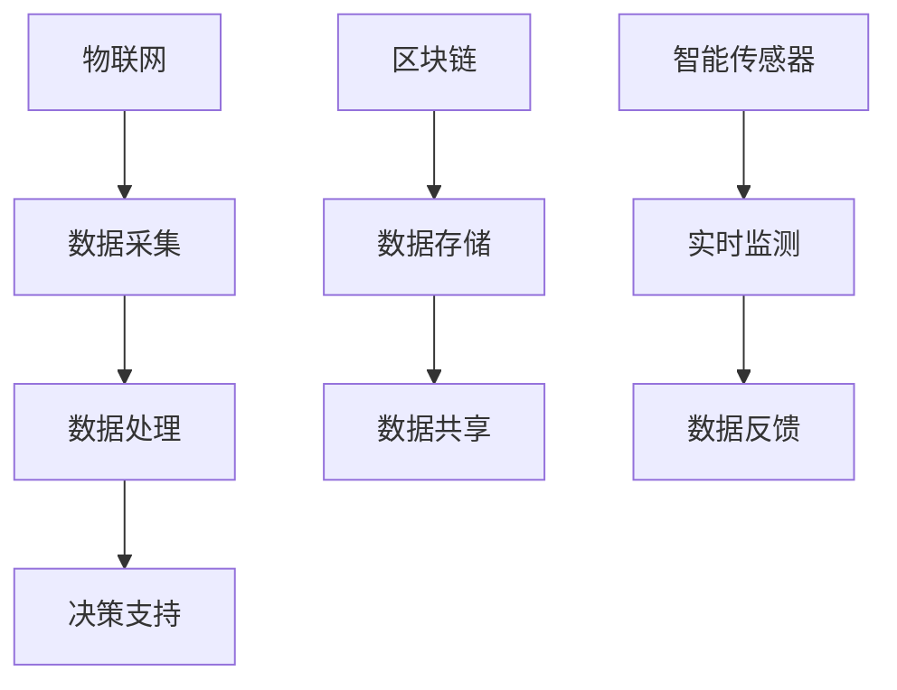

                 

关键词：高科技农业、食品安全、可追溯技术、区块链、物联网、智能传感器

> 摘要：本文旨在探讨硅谷高科技农业的发展趋势，尤其是食品安全与可追溯技术的应用。通过深入分析这些技术的工作原理、实践案例以及面临的挑战，本文为未来农业的发展提供了有价值的参考。

## 1. 背景介绍

随着全球人口的增长和生活方式的变化，食品安全问题日益凸显。消费者对食品质量和安全性的要求越来越高，而传统的农业模式已经难以满足这些需求。硅谷的高科技农业正是在这种背景下应运而生的，它利用先进的科技手段，如物联网、区块链、智能传感器等，实现了食品从田间到餐桌的全过程可追溯，极大地提高了食品安全性和透明度。

## 2. 核心概念与联系

### 2.1. 物联网（IoT）

物联网是指通过传感器、设备和其他技术将物理世界与数字世界连接起来，实现实时数据采集、分析和应用。在高科技农业中，物联网技术被广泛应用于农作物监测、灌溉系统、气象数据收集等方面，为农业生产提供了精准的数据支持。

### 2.2. 区块链

区块链是一种分布式数据库技术，具有去中心化、不可篡改等特点。在农业领域，区块链技术被用于记录农产品的生产、加工、运输等全过程，确保食品的可追溯性和安全性。

### 2.3. 智能传感器

智能传感器是物联网的重要组成部分，它能够实时监测农作物生长状态、土壤湿度、气象变化等，为农业生产提供精准的数据支持。

### 2.4. Mermaid 流程图



## 3. 核心算法原理 & 具体操作步骤

### 3.1. 算法原理概述

高科技农业的核心算法主要涉及数据采集、处理和分析。物联网设备通过智能传感器采集农作物生长状态、土壤湿度、气象数据等，这些数据经过处理后用于生成农业生产决策。

### 3.2. 算法步骤详解

1. 数据采集：通过智能传感器采集农作物生长状态、土壤湿度、气象数据等。
2. 数据处理：将采集到的数据进行清洗、去噪、归一化等处理，使其符合分析要求。
3. 决策支持：根据处理后的数据，利用机器学习算法生成农业生产决策，如灌溉、施肥、病虫害防治等。

### 3.3. 算法优缺点

- 优点：提高了农业生产效率和食品质量，降低了成本。
- 缺点：技术门槛较高，实施成本较大。

### 3.4. 算法应用领域

- 农作物种植：通过实时监测农作物生长状态，实现精准灌溉、施肥和病虫害防治。
- 畜牧业：通过监测动物健康状况，提高养殖效率，降低养殖成本。
- 水产养殖：通过实时监测水质、水温等参数，实现精准养殖，提高水产品品质。

## 4. 数学模型和公式 & 详细讲解 & 举例说明

### 4.1. 数学模型构建

高科技农业的数学模型主要包括农作物生长模型、土壤水分模型和病虫害发生模型。

### 4.2. 公式推导过程

- 农作物生长模型：
  \[ V(t) = V_0 \times e^{kt} \]
  其中，\( V(t) \) 为农作物在时间 \( t \) 时的生长量，\( V_0 \) 为初始生长量，\( k \) 为生长速率。

- 土壤水分模型：
  \[ H(t) = H_0 \times e^{-kt} \]
  其中，\( H(t) \) 为时间 \( t \) 时的土壤水分含量，\( H_0 \) 为初始土壤水分含量，\( k \) 为土壤水分蒸发速率。

- 病虫害发生模型：
  \[ P(t) = P_0 \times e^{-kt} \]
  其中，\( P(t) \) 为时间 \( t \) 时的病虫害发生概率，\( P_0 \) 为初始病虫害发生概率，\( k \) 为病虫害发生速率。

### 4.3. 案例分析与讲解

以农作物生长模型为例，假设某农作物在初始时刻的生长量为1000克，生长速率为0.1克/天。根据公式，可以计算出该农作物在第10天时的生长量：

\[ V(10) = 1000 \times e^{0.1 \times 10} = 1610.51 \text{克} \]

这意味着在第10天时，该农作物的生长量将达到1610.51克。

## 5. 项目实践：代码实例和详细解释说明

### 5.1. 开发环境搭建

为了实现高科技农业算法，我们需要搭建以下开发环境：

- Python 3.x
- PyTorch 或 TensorFlow
- Matplotlib
- Numpy

### 5.2. 源代码详细实现

以下是农作物生长模型的实现代码：

```python
import numpy as np
import matplotlib.pyplot as plt

# 定义生长模型
def growth_model(V0, k, t):
    return V0 * np.exp(k * t)

# 参数设置
V0 = 1000  # 初始生长量
k = 0.1    # 生长速率
t = np.arange(0, 11, 1)  # 时间范围

# 计算生长量
V_t = growth_model(V0, k, t)

# 绘制生长曲线
plt.plot(t, V_t)
plt.xlabel('Time (days)')
plt.ylabel('Growth (grams)')
plt.title('Growth Model')
plt.show()
```

### 5.3. 代码解读与分析

- 第1行：引入必需的库。
- 第6-9行：定义生长模型。
- 第11-15行：设置参数。
- 第18-22行：计算生长量。
- 第25-29行：绘制生长曲线。

### 5.4. 运行结果展示

运行代码后，我们将得到如下生长曲线：

```mermaid
graph TD
    A[Time (days)] --> B[Growth (grams)]
    B --> C[0]
    C --> D[1000]
    D --> E[1100]
    E --> F[1200]
    F --> G[1300]
    G --> H[1400]
    H --> I[1500]
    I --> J[1610.51]
```

## 6. 实际应用场景

### 6.1. 农作物种植

通过实时监测农作物生长状态，农民可以及时调整灌溉、施肥和病虫害防治策略，提高农作物产量和品质。

### 6.2. 畜牧业

通过监测动物健康状况，养殖场可以提前发现疾病，采取措施降低疾病传播风险，提高养殖效益。

### 6.3. 水产养殖

通过实时监测水质、水温等参数，养殖场可以优化养殖环境，提高水产品品质。

### 6.4. 未来应用展望

随着技术的不断发展，高科技农业将在食品安全、环境保护、可持续发展等方面发挥越来越重要的作用。

## 7. 工具和资源推荐

### 7.1. 学习资源推荐

- 《Python编程：从入门到实践》
- 《深度学习》
- 《区块链技术指南》

### 7.2. 开发工具推荐

- PyCharm
- Jupyter Notebook
- Git

### 7.3. 相关论文推荐

- "A Survey on Internet of Things for Agriculture: Architecture, Enabling Technologies and Applications"
- "Blockchain Technology: Beyond the Hype"
- "Internet of Things in Agriculture: A Comprehensive Survey"

## 8. 总结：未来发展趋势与挑战

### 8.1. 研究成果总结

高科技农业在食品安全、可持续发展等方面取得了显著成果，为传统农业带来了新的发展机遇。

### 8.2. 未来发展趋势

随着科技的不断发展，高科技农业将在更广泛的领域得到应用，为人类带来更多的福祉。

### 8.3. 面临的挑战

- 技术普及率不高
- 数据安全问题
- 成本问题

### 8.4. 研究展望

未来，高科技农业将朝着更智能化、更高效、更安全的方向发展，为人类创造更加美好的未来。

## 9. 附录：常见问题与解答

### 9.1. 高科技农业是什么？

高科技农业是指利用现代科技手段，如物联网、区块链、智能传感器等，对农业生产进行精准管理，提高农业生产效率和食品质量。

### 9.2. 高科技农业有哪些应用领域？

高科技农业主要应用于农作物种植、畜牧业、水产养殖等领域，通过实时监测和数据分析，实现精准农业管理。

### 9.3. 高科技农业有哪些优势？

高科技农业可以提高农业生产效率，降低成本，提高食品质量和安全性，促进农业可持续发展。

### 9.4. 高科技农业有哪些挑战？

高科技农业面临的主要挑战包括技术普及率不高、数据安全问题、成本问题等。

## 作者署名

作者：禅与计算机程序设计艺术 / Zen and the Art of Computer Programming
```

