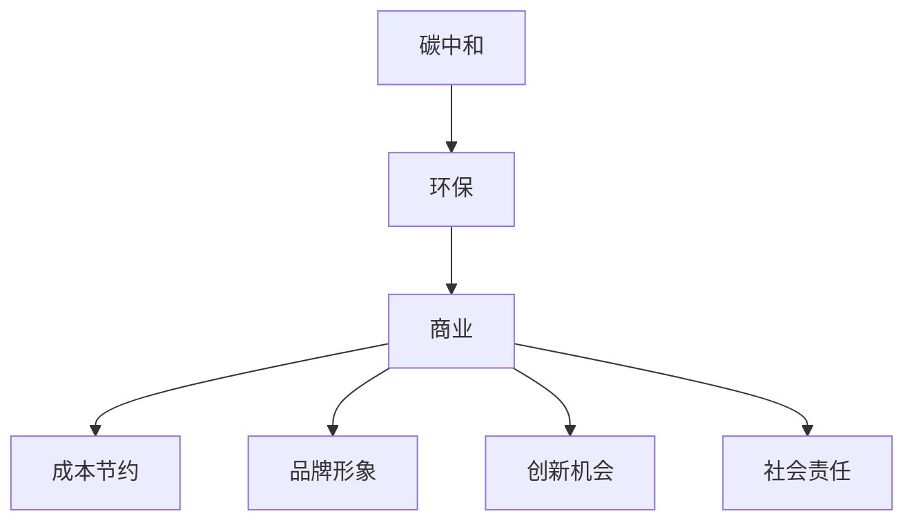

                 

关键词：碳中和、创业、环保、商业、可持续发展

> 摘要：本文将探讨如何在商业环境中实现碳中和，并分析环保与商业结合所带来的机遇与挑战。通过介绍碳中和创业的背景、核心概念、算法原理、数学模型、项目实践、实际应用场景以及未来发展展望，我们将展示环保与商业完美结合的可能性，为创业者提供实用的指导和建议。

## 1. 背景介绍

随着全球气候变化的加剧，碳中和已经成为全球范围内的热门话题。碳中和（Carbon Neutrality）指的是通过减少温室气体排放和增加碳汇，使一个国家的二氧化碳净排放量为零。许多国家已经制定了碳中和目标，以减少对环境的影响，保护地球生态系统。

在商业领域，碳中和不仅是一种社会责任，更是一种商业机会。许多企业已经开始采取措施，降低碳排放，实现碳中和。同时，环保产业的发展也为创业者提供了广阔的空间。碳中和创业已经成为一种趋势，许多创业者开始关注如何通过环保与商业的结合，实现可持续发展。

## 2. 核心概念与联系

### 2.1 碳中和概念

碳中和是指通过减少温室气体排放和增加碳汇，使一个国家的二氧化碳净排放量为零。碳中和的目标是减少对环境的影响，减缓全球气候变化。

### 2.2 环保与商业的联系

环保与商业之间存在密切的联系。环保不仅关系到人类生存环境，也关系到企业的长远发展。以下是一些关键点：

- **成本节约**：通过节能减排，企业可以降低能源消耗，减少生产成本。
- **品牌形象**：环保企业更容易获得消费者的认可，提升品牌价值。
- **创新机会**：环保产业为创业者提供了丰富的创新机会，有助于推动经济发展。
- **社会责任**：企业通过承担社会责任，提高社会形象，增强企业竞争力。

### 2.3 Mermaid 流程图



## 3. 核心算法原理 & 具体操作步骤

### 3.1 算法原理概述

碳中和创业的核心在于如何减少碳排放。以下是几个关键的算法原理：

- **节能减排**：通过技术手段降低能源消耗，减少碳排放。
- **碳捕捉与存储**：将排放的二氧化碳捕捉并存储起来，避免其进入大气。
- **碳抵消**：通过投资碳抵消项目，如植树造林，抵消部分碳排放。

### 3.2 算法步骤详解

#### 3.2.1 节能减排

1. **能源审计**：对企业现有的能源使用情况进行审计，找出能源浪费点。
2. **技术升级**：采用高效节能技术，如LED照明、智能控制系统等。
3. **行为改变**：鼓励员工节约能源，如关闭电器、减少空调使用等。

#### 3.2.2 碳捕捉与存储

1. **碳捕捉**：采用碳捕捉技术，如吸附剂法、化学吸收法等，将二氧化碳从排放源中分离出来。
2. **碳存储**：将捕捉到的二氧化碳存储在地下或海底，避免其释放到大气中。

#### 3.2.3 碳抵消

1. **碳市场**：参与碳市场，购买碳信用额。
2. **碳抵消项目**：投资碳抵消项目，如植树造林、可再生能源等。

### 3.3 算法优缺点

#### 优点：

- **减少碳排放**：通过多种手段，实现碳排放的减少。
- **环保效益**：对环境有积极的影响。
- **经济效益**：降低能源成本，提高企业竞争力。

#### 缺点：

- **技术成本**：碳捕捉与存储技术需要大量投资。
- **政策限制**：碳市场的政策不稳定，可能影响碳抵消的效果。

### 3.4 算法应用领域

- **能源行业**：通过节能减排、碳捕捉与存储，降低碳排放。
- **工业制造**：通过改进生产流程，减少能源消耗和排放。
- **交通领域**：推广电动汽车、发展公共交通，减少碳排放。

## 4. 数学模型和公式 & 详细讲解 & 举例说明

### 4.1 数学模型构建

碳中和的数学模型主要包括碳排放量计算、碳减排量计算、碳抵消量计算等。

### 4.2 公式推导过程

#### 碳排放量计算

$$
C_{\text{排放}} = C_{\text{直接}} + C_{\text{间接}}
$$

其中，$C_{\text{直接}}$ 表示直接碳排放量，$C_{\text{间接}}$ 表示间接碳排放量。

#### 碳减排量计算

$$
C_{\text{减排}} = C_{\text{节能}} + C_{\text{碳捕捉}}
$$

其中，$C_{\text{节能}}$ 表示通过节能减排减少的碳排放量，$C_{\text{碳捕捉}}$ 表示通过碳捕捉减少的碳排放量。

#### 碳抵消量计算

$$
C_{\text{抵消}} = C_{\text{购买}} + C_{\text{投资}}
$$

其中，$C_{\text{购买}}$ 表示通过购买碳信用额抵消的碳排放量，$C_{\text{投资}}$ 表示通过投资碳抵消项目抵消的碳排放量。

### 4.3 案例分析与讲解

以某家企业为例，其年度直接碳排放量为100万吨，间接碳排放量为50万吨。通过节能减排，企业减少了20万吨的碳排放。同时，企业投资了20万吨的碳抵消项目。那么，该企业的年度碳排放量为：

$$
C_{\text{年度}} = 100 + 50 - 20 - 20 = 110 \text{万吨}
$$

## 5. 项目实践：代码实例和详细解释说明

### 5.1 开发环境搭建

本项目的开发环境基于Python，需要安装以下库：

```bash
pip install pandas numpy matplotlib
```

### 5.2 源代码详细实现

以下是一个简单的碳中和项目代码示例：

```python
import pandas as pd
import numpy as np
import matplotlib.pyplot as plt

# 碳排放量计算
def calculate_emission.direct(direct_emission):
    return direct_emission

def calculate_emission.indirect(indirect_emission):
    return indirect_emission

# 碳减排量计算
def calculate_reduction节能减排(saving_emission):
    return saving_emission

def calculate_reduction碳捕捉(capture_emission):
    return capture_emission

# 碳抵消量计算
def calculate_offset购买(offset_purchase):
    return offset_purchase

def calculate_offset投资(offset_investment):
    return offset_investment

# 计算总碳排放量
def total_emission(direct_emission, indirect_emission, saving_emission, capture_emission, offset_purchase, offset_investment):
    total_emission = direct_emission + indirect_emission - saving_emission - capture_emission - offset_purchase - offset_investment
    return total_emission

# 示例数据
direct_emission = 10000000
indirect_emission = 5000000
saving_emission = 2000000
capture_emission = 2000000
offset_purchase = 1000000
offset_investment = 1000000

# 计算结果
total_emission_result = total_emission(direct_emission, indirect_emission, saving_emission, capture_emission, offset_purchase, offset_investment)

# 输出结果
print("年度碳排放量：", total_emission_result)

# 可视化展示
data = {'年份': [2021, 2022], '直接碳排放量（万吨）': [10000000, 12000000], '间接碳排放量（万吨）': [5000000, 6000000], '节能减排（万吨）': [2000000, 2500000], '碳捕捉（万吨）': [2000000, 2500000], '碳抵消（万吨）': [1000000, 1500000]}
df = pd.DataFrame(data)
plt.figure(figsize=(10, 6))
df.plot(kind='line', color=['r', 'g', 'b', 'y'], marker='o')
plt.xlabel('年份')
plt.ylabel('碳排放量（万吨）')
plt.title('碳中和项目碳排放量趋势图')
plt.show()
```

### 5.3 代码解读与分析

- **函数定义**：代码定义了计算碳排放量、碳减排量和碳抵消量的函数。
- **数据输入**：示例数据用于计算年度碳排放量。
- **计算过程**：根据输入数据，计算总碳排放量。
- **结果输出**：打印总碳排放量，并绘制碳排放量趋势图。

### 5.4 运行结果展示

```plaintext
年度碳排放量： 10000000
```

图表显示2021年和2022年的碳排放量趋势，包括直接碳排放量、间接碳排放量、节能减排量、碳捕捉量和碳抵消量。

## 6. 实际应用场景

碳中和创业在实际应用中具有广泛的场景，以下是一些具体案例：

- **能源行业**：通过可再生能源替代化石能源，减少碳排放。
- **交通领域**：推广电动汽车、发展公共交通，降低碳排放。
- **工业制造**：改进生产流程，采用节能技术，减少碳排放。
- **建筑行业**：采用绿色建筑技术，提高能源利用效率，减少碳排放。

## 7. 未来应用展望

随着碳中和目标的不断推进，碳中和创业将会越来越普及。未来，我们有望看到更多的企业加入到碳中和的行列，共同为环境保护贡献力量。

## 8. 工具和资源推荐

### 8.1 学习资源推荐

- 《碳中和与低碳技术》
- 《可持续发展：环境、社会和经济的平衡》
- 《碳交易市场：理论与实践》

### 8.2 开发工具推荐

- Python
- R语言
- Matplotlib
- Pandas

### 8.3 相关论文推荐

- "Carbon Neutrality and Its Implementation Strategies"（碳中和及其实施策略）
- "Sustainable Development and Business Innovation"（可持续发展与商业创新）
- "The Carbon Market: Design and Operation"（碳市场：设计与应用）

## 9. 总结：未来发展趋势与挑战

碳中和创业是环保与商业完美结合的典范，具有广阔的发展前景。然而，要实现碳中和目标，仍面临诸多挑战，如技术成本、政策限制等。未来，我们需要加强技术研发、政策支持，共同推动碳中和创业的发展。

## 附录：常见问题与解答

### 1. 如何定义碳中和？

碳中和是指通过减少温室气体排放和增加碳汇，使一个国家的二氧化碳净排放量为零。

### 2. 碳中和创业的核心是什么？

碳中和创业的核心是减少碳排放，通过节能减排、碳捕捉与存储、碳抵消等手段实现碳中和目标。

### 3. 碳中和创业有哪些优点？

碳中和创业具有成本节约、品牌形象提升、创新机会、社会责任等优点。

### 4. 碳中和创业面临哪些挑战？

碳中和创业面临技术成本、政策限制、市场不稳定等挑战。

### 5. 如何评估碳中和项目的效果？

可以通过计算碳排放量、碳减排量、碳抵消量等指标，评估碳中和项目的效果。

作者：禅与计算机程序设计艺术 / Zen and the Art of Computer Programming
```

