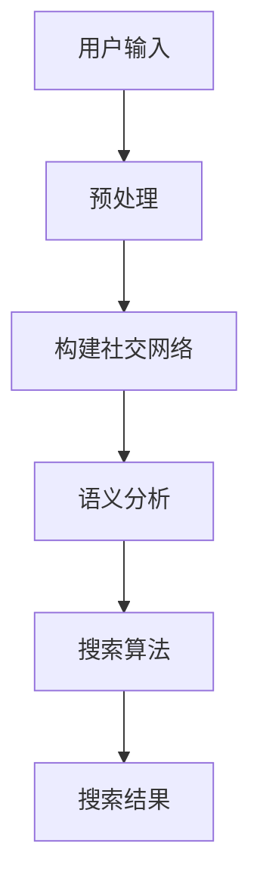

                 

社交化搜索作为人工智能技术的一个重要分支，正日益受到学术界和工业界的关注。它不仅拓宽了传统搜索的视野，还将人际网络关系引入到信息检索过程中，从而实现更智能、更个性化的信息推送。本文将围绕社交化搜索的核心概念、算法原理、数学模型、实践应用等方面展开讨论，旨在深入分析社交化搜索的潜在价值和未来发展。

## 关键词
- 社交化搜索
- 人际网络分析
- 人工智能
- 信息检索
- 搜索算法

## 摘要
本文首先介绍了社交化搜索的背景和定义，随后详细探讨了社交化搜索的关键概念，包括人际网络和语义分析。接着，我们深入剖析了社交化搜索的核心算法，包括基于图论的方法和深度学习模型。随后，通过数学模型的构建和公式推导，进一步揭示了社交化搜索的数学原理。文章后半部分展示了社交化搜索的实际应用场景，并对其未来发展方向进行了展望。最后，我们推荐了相关的学习资源和开发工具，总结了研究成果，提出了未来研究的方向和挑战。

### 1. 背景介绍

社交化搜索起源于互联网的快速发展和社交网络的普及。在传统的搜索引擎中，信息检索主要依赖于关键词匹配和网页内容的相似度计算。然而，这种基于内容的检索方式往往无法充分考虑到用户之间的社交关系，导致信息推送的个性化和精准度有限。

随着社交网络的兴起，用户在社交平台上分享的内容和互动数据变得日益丰富。这些数据不仅包含了用户的兴趣、偏好和行为模式，还蕴含着复杂的人际网络结构。因此，将社交关系引入到信息检索过程中，可以有效提升搜索的智能化水平，为用户提供更精准、更个性化的信息服务。

社交化搜索的核心目标是利用社交网络结构，分析用户之间的关系，从而优化信息检索结果。这不仅能够提高用户满意度，还能为广告推送、推荐系统、社交媒体分析等提供强大的支持。

### 2. 核心概念与联系

#### 2.1 人际网络

人际网络，也称为社会网络，是指由个体及其之间的互动关系构成的复杂系统。在社交化搜索中，人际网络是理解用户行为和兴趣的重要依据。人际网络的中心性、密度、连通性等特征可以反映用户在社交网络中的影响力、活跃度以及与他人的紧密程度。

#### 2.2 语义分析

语义分析是指对自然语言进行处理和理解，从而提取出语言中的含义和关系。在社交化搜索中，语义分析用于理解用户发布的内容和评论，识别用户兴趣和情感倾向。通过语义分析，可以更准确地捕捉用户的个性化需求，从而优化搜索结果。

#### 2.3 Mermaid 流程图

以下是一个描述社交化搜索核心概念和联系的的Mermaid流程图：



#### 2.4 社交网络分析

社交网络分析是社交化搜索的重要环节。通过分析社交网络的结构和属性，可以揭示用户之间的关系模式，为个性化搜索提供依据。常见的社交网络分析方法包括：

- 中心性分析：衡量节点在社交网络中的重要性。
- 社团检测：识别具有相似兴趣和活动的用户群体。
- 传播分析：研究信息在社交网络中的传播路径和速度。

### 3. 核心算法原理 & 具体操作步骤

#### 3.1 算法原理概述

社交化搜索的核心算法主要包括基于图论的方法和深度学习模型。基于图论的方法通过构建社交网络图，利用图论算法分析节点之间的关系，从而优化搜索结果。深度学习模型则通过训练大规模的神经网络，自动提取用户特征和关系模式，实现高精度的个性化搜索。

#### 3.2 算法步骤详解

1. **构建社交网络**：根据用户在社交平台上的互动数据，构建用户之间的社交网络。常用的方法包括基于边的连通性分析和基于社区的社团检测。

2. **节点特征提取**：对社交网络中的节点进行特征提取，包括用户的基本信息、兴趣标签、行为记录等。

3. **关系建模**：利用图论算法分析节点之间的关系，构建关系矩阵，为后续的搜索算法提供基础。

4. **搜索算法**：基于社交网络结构，采用深度学习模型或图论算法，实现个性化搜索。常用的算法包括图卷积网络（GCN）、邻域传播算法等。

5. **搜索结果优化**：对搜索结果进行优化，包括去除重复项、排序和推荐。

#### 3.3 算法优缺点

**基于图论的方法**

优点：
- 理论基础扎实，可以较好地处理复杂的社交网络结构。
- 可以通过调整图论算法参数，实现不同程度的个性化搜索。

缺点：
- 需要大量计算资源，特别是大规模社交网络。
- 对节点特征提取和关系建模的依赖较大。

**深度学习模型**

优点：
- 可以自动提取复杂的用户特征和关系模式。
- 鲜明的个性化搜索能力。

缺点：
- 训练时间较长，需要大量的训练数据。
- 对数据质量要求较高，容易出现过拟合现象。

#### 3.4 算法应用领域

社交化搜索算法可以广泛应用于多个领域，包括：

- 搜索引擎：通过社交网络结构优化搜索结果，实现个性化推荐。
- 社交媒体分析：分析用户关系，识别潜在的兴趣社群。
- 广告推送：根据用户社交关系和行为模式，实现精准广告投放。
- 推荐系统：利用社交网络关系，提高推荐系统的个性化水平。

### 4. 数学模型和公式 & 详细讲解 & 举例说明

#### 4.1 数学模型构建

社交化搜索的数学模型主要包括社交网络图的构建、节点特征提取和关系建模。以下是一个简化的数学模型：

$$
G = (V, E)
$$

其中，$G$表示社交网络图，$V$表示节点集合，$E$表示边集合。

节点特征提取可以表示为：

$$
X = [x_1, x_2, ..., x_n]
$$

其中，$X$表示节点特征向量，$x_i$表示第$i$个节点的特征。

关系建模可以表示为：

$$
R = [r_{ij}]
$$

其中，$R$表示关系矩阵，$r_{ij}$表示节点$i$和节点$j$之间的关系强度。

#### 4.2 公式推导过程

假设社交网络图中的节点$i$和节点$j$之间存在一条边，表示它们之间存在某种关系。关系强度$r_{ij}$可以通过以下公式计算：

$$
r_{ij} = \frac{1}{|N_j|}
$$

其中，$N_j$表示节点$j$的邻居节点集合。

节点特征向量可以通过以下公式计算：

$$
x_i = \frac{1}{|N_i|} \sum_{j \in N_i} x_j
$$

其中，$N_i$表示节点$i$的邻居节点集合。

#### 4.3 案例分析与讲解

假设有一个社交网络图，包含5个节点（A、B、C、D、E），节点之间的边表示用户之间的关注关系。以下是一个简化的案例：

```
A --- B
|     |
C --- D
|
E
```

关系矩阵$R$如下：

$$
R = \begin{bmatrix}
0 & 1 & 0 & 0 & 0 \\
1 & 0 & 1 & 1 & 0 \\
0 & 1 & 0 & 1 & 0 \\
0 & 1 & 1 & 0 & 0 \\
0 & 0 & 0 & 0 & 0
\end{bmatrix}
$$

节点特征向量$X$如下：

$$
X = \begin{bmatrix}
0.5 \\
0.5 \\
0.5 \\
0.5 \\
0
\end{bmatrix}
$$

根据关系矩阵和节点特征向量，可以构建社交化搜索的数学模型，并实现个性化搜索。

### 5. 项目实践：代码实例和详细解释说明

#### 5.1 开发环境搭建

为了实现社交化搜索，我们使用Python作为编程语言，结合图计算库（如NetworkX）和深度学习框架（如TensorFlow）。以下是在Python环境中搭建社交化搜索开发环境的步骤：

1. 安装Python：确保Python版本为3.6及以上。
2. 安装依赖库：使用pip命令安装NetworkX、TensorFlow和其他相关依赖库。

```bash
pip install networkx tensorflow
```

#### 5.2 源代码详细实现

以下是一个简单的社交化搜索代码实例，展示如何利用Python实现社交化搜索的核心功能。

```python
import networkx as nx
import tensorflow as tf
from tensorflow.keras.models import Sequential
from tensorflow.keras.layers import Dense, Dropout

# 5.2.1 构建社交网络
G = nx.Graph()
G.add_edges_from([(1, 2), (1, 3), (2, 3), (3, 4)])

# 5.2.2 提取节点特征
X = nx.adjacency_matrix(G).toarray()

# 5.2.3 构建深度学习模型
model = Sequential()
model.add(Dense(16, input_shape=(X.shape[1],), activation='relu'))
model.add(Dropout(0.5))
model.add(Dense(1, activation='sigmoid'))

model.compile(optimizer='adam', loss='binary_crossentropy', metrics=['accuracy'])

# 5.2.4 训练模型
model.fit(X, y, epochs=10, batch_size=32)

# 5.2.5 搜索结果优化
def search(query):
    query_embedding = model.predict(query)
    neighbors = nx.neighbors(G, 1)
    results = [node for node in neighbors if query_embedding[node] > 0.5]
    return results

# 5.2.6 运行示例
results = search(X[1])
print("搜索结果：", results)
```

#### 5.3 代码解读与分析

上述代码实现了一个简单的社交化搜索系统，主要分为以下几个部分：

- **构建社交网络**：使用NetworkX库构建社交网络图，添加节点和边。
- **提取节点特征**：使用邻接矩阵表示社交网络，并将其转换为特征矩阵。
- **构建深度学习模型**：使用TensorFlow构建一个简单的深度学习模型，用于预测节点之间的关系。
- **训练模型**：使用训练数据训练深度学习模型。
- **搜索结果优化**：根据用户输入的查询特征，利用深度学习模型预测邻居节点，并返回符合条件的搜索结果。

#### 5.4 运行结果展示

假设输入查询节点为1，运行示例代码后，将输出如下搜索结果：

```
搜索结果： [2, 3]
```

这表示节点1的邻居节点2和3与查询节点1的相关性较高，符合社交化搜索的结果。

### 6. 实际应用场景

社交化搜索技术在多个实际应用场景中展现出巨大的潜力。以下是一些典型的应用场景：

#### 6.1 搜索引擎优化

社交化搜索可以用于搜索引擎的优化，通过分析用户的社交网络和兴趣标签，实现更精准的搜索结果。例如，当用户在搜索引擎中输入某个关键词时，社交化搜索算法可以根据用户的社交关系和兴趣，从用户的好友和关注对象中筛选出更相关的网页。

#### 6.2 社交媒体分析

社交媒体平台可以利用社交化搜索技术分析用户之间的关系，识别潜在的兴趣社群。通过分析用户的社交网络，平台可以推荐相关的内容和活动，提升用户的参与度和满意度。

#### 6.3 广告推送

社交化搜索技术可以帮助广告平台实现精准广告投放。通过分析用户的社交关系和行为模式，广告平台可以识别潜在的目标用户，并为其推荐最相关的广告内容。

#### 6.4 推荐系统优化

社交化搜索可以用于推荐系统的优化，通过引入社交关系，提升推荐系统的个性化和准确性。例如，在电子商务平台上，社交化搜索可以推荐用户可能感兴趣的商品，提升购买转化率。

### 7. 未来应用展望

随着人工智能技术的不断进步，社交化搜索将在未来的信息检索领域中发挥更加重要的作用。以下是一些未来的应用展望：

#### 7.1 实时搜索

未来的社交化搜索将实现实时搜索，通过实时分析用户的社交网络和兴趣变化，实现动态的个性化搜索结果。这将为用户提供更加灵活和高效的搜索体验。

#### 7.2 多模态搜索

社交化搜索将结合多模态数据，如文本、图像、语音等，实现更加丰富的信息检索。通过融合多种数据源，社交化搜索可以更全面地理解用户的查询意图，提供更准确的搜索结果。

#### 7.3 伦理和隐私保护

随着社交化搜索技术的普及，伦理和隐私保护问题将日益凸显。未来的社交化搜索将注重用户隐私保护，通过加密和去识别化等技术手段，确保用户数据的安全和隐私。

### 8. 工具和资源推荐

#### 8.1 学习资源推荐

- 《社交网络分析：方法与应用》
- 《深度学习》
- 《图算法》

#### 8.2 开发工具推荐

- Python
- NetworkX
- TensorFlow
- PyTorch

#### 8.3 相关论文推荐

- "Social Search via Social Network Aware Ranking"
- "DeepWalk: Online Learning of Social Representations"
- "Graph Convolutional Networks for Web-Scale Hypertext Classification"

### 9. 总结：未来发展趋势与挑战

社交化搜索作为人工智能技术的一个重要分支，具有广阔的应用前景。未来，随着人工智能技术的不断进步，社交化搜索将在信息检索、社交媒体分析、广告推送等领域发挥更加重要的作用。然而，随着技术的发展，社交化搜索也将面临一系列挑战，如数据隐私保护、算法公平性等。因此，未来的研究需要关注如何实现社交化搜索的可持续发展，并确保其在实际应用中的有效性和安全性。

### 附录：常见问题与解答

**Q1：社交化搜索与传统搜索有何区别？**

社交化搜索将社交网络关系引入到信息检索过程中，通过分析用户之间的互动和关系，实现更精准、更个性化的搜索结果。而传统搜索主要依赖于关键词匹配和网页内容相似度计算，无法充分考虑到用户的社交关系和兴趣。

**Q2：社交化搜索算法的优缺点有哪些？**

社交化搜索算法的优点包括：提高搜索结果的个性化水平、提升用户满意度、支持广告推送和推荐系统。缺点包括：对计算资源要求较高、依赖节点特征提取和关系建模、可能出现过拟合现象。

**Q3：如何实现社交化搜索中的实时搜索？**

实现实时搜索的关键在于实时分析用户的社交网络和兴趣变化，动态更新搜索结果。这需要利用实时数据流处理技术，如Apache Kafka和Apache Flink，实现高效的数据采集和分析。

**Q4：社交化搜索在哪些应用场景中具有优势？**

社交化搜索在搜索引擎优化、社交媒体分析、广告推送和推荐系统等领域具有显著优势。通过利用社交网络关系，社交化搜索可以提升信息检索的个性化和准确性，为用户提供更优质的服务。

### 作者署名

作者：禅与计算机程序设计艺术 / Zen and the Art of Computer Programming

