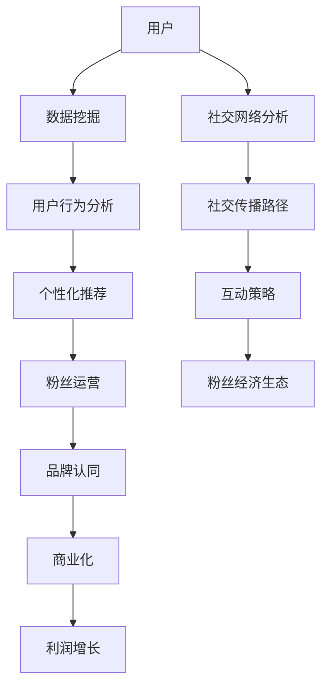

                 

社交媒体已经成为当今社会的一个重要组成部分，其强大的传播力和广泛的用户基础使得许多创业者看到了巨大的商机。特别是在粉丝经济日益兴起的背景下，社交媒体平台成为了构建粉丝经济生态的重要场所。本文将深入探讨社交媒体创业的核心概念、算法原理、数学模型、项目实践以及未来应用展望，旨在为创业者提供一份有深度、有思考、有见解的指南。

## 关键词

- 社交媒体
- 粉丝经济
- 创业
- 数据分析
- 社交网络分析

## 摘要

本文首先介绍了社交媒体创业的背景和粉丝经济的概念，然后详细阐述了社交媒体创业的核心算法原理，包括数据挖掘、用户行为分析和社交网络分析等。接着，我们引入了数学模型，解释了如何通过数学公式来构建和优化粉丝经济生态。在项目实践部分，我们提供了一个具体的代码实例，并对其进行了详细解读。最后，本文探讨了社交媒体创业的实际应用场景和未来发展趋势，为创业者提供了实用的工具和资源推荐，并总结了研究的主要成果和展望。

## 1. 背景介绍

社交媒体创业的兴起可以追溯到互联网技术的飞速发展和智能手机的普及。随着社交媒体平台的兴起，人们开始通过这些平台分享生活、交流思想、建立社交网络。这种互动性的特点使得社交媒体成为了一个巨大的信息流通渠道，也为其商业应用提供了广阔的空间。粉丝经济正是这种背景下产生的一个概念，它指的是一种以粉丝为基础，通过满足粉丝需求来创造价值和利润的商业模式。

粉丝经济的核心在于对粉丝群体的深度挖掘和精细化运营。通过分析粉丝的行为数据、兴趣爱好、消费习惯等，创业者可以更精准地了解粉丝的需求，提供个性化的产品和服务，从而提高用户的满意度和忠诚度。此外，粉丝经济还强调与粉丝的互动，通过社交媒体平台与粉丝建立良好的关系，增强粉丝的品牌认同感和归属感，从而实现长期的商业价值。

在社交媒体创业的过程中，数据分析和社交网络分析成为不可或缺的工具。数据挖掘技术可以帮助创业者从海量数据中提取有价值的信息，了解用户行为和需求趋势。社交网络分析则可以揭示社交网络中的关键节点和传播路径，帮助创业者更好地了解社交网络的运作机制，制定有效的运营策略。

## 2. 核心概念与联系

在构建粉丝经济生态的过程中，有几个核心概念需要了解，这些概念相互关联，共同构成了一个复杂的体系。以下是这些核心概念的原理和架构的 Mermaid 流程图：



### 2.1 用户

用户是社交媒体创业的基础，他们是粉丝经济生态的源头。通过用户注册、登录和互动行为，平台可以收集到大量关于用户的数据，这些数据是后续分析的重要依据。

### 2.2 数据挖掘

数据挖掘是一种从大量数据中提取有价值信息的方法。在社交媒体创业中，数据挖掘可以帮助创业者发现用户行为模式、兴趣爱好等，为后续的个性化推荐和粉丝运营提供支持。

### 2.3 用户行为分析

用户行为分析是通过对用户在社交媒体上的行为数据进行收集、分析和解读，以了解用户需求、兴趣和行为模式。这种行为分析是构建粉丝经济生态的重要环节，它为创业者提供了洞察用户需求的基础。

### 2.4 个性化推荐

个性化推荐是根据用户的行为数据和兴趣标签，为用户推荐可能感兴趣的内容、产品或服务。这种推荐系统能够提高用户的参与度和满意度，从而增强粉丝对品牌的忠诚度。

### 2.5 粉丝运营

粉丝运营是指通过社交媒体平台与粉丝建立联系、互动和沟通，以增强粉丝的品牌认同感和归属感。粉丝运营的核心在于精细化运营，通过对粉丝群体的分类和细分，提供个性化的服务和体验。

### 2.6 品牌认同

品牌认同是指粉丝对品牌的信任、喜爱和支持程度。通过有效的粉丝运营和互动策略，创业者可以培养出一批忠实的粉丝，他们对品牌有强烈的认同感，愿意为品牌付出时间和金钱。

### 2.7 商业化

商业化是指将粉丝经济转化为实际商业价值的过程。通过粉丝的参与和互动，创业者可以创造多种商业机会，如商品销售、广告收入、会员服务等。

### 2.8 利润增长

利润增长是粉丝经济的最终目标。通过有效的粉丝运营和商业化策略，创业者可以实现持续的收入增长和利润增长。

### 2.9 社交网络分析

社交网络分析是研究社交网络中个体和群体关系的科学。在社交媒体创业中，社交网络分析可以帮助创业者了解社交网络的运作机制，制定有效的运营策略。

### 2.10 社交传播路径

社交传播路径是指信息在社交网络中传播的过程和路径。通过分析社交传播路径，创业者可以了解信息传播的规律和关键节点，从而优化传播策略。

### 2.11 互动策略

互动策略是指创业者与粉丝之间的互动方式和手段。有效的互动策略能够增强粉丝的参与度和忠诚度，从而促进粉丝经济的增长。

### 2.12 粉丝经济生态

粉丝经济生态是指由用户、粉丝、品牌、商业化和社交网络等多个因素组成的复杂系统。在这个生态中，各个环节相互关联、相互影响，共同推动粉丝经济的健康发展。

## 3. 核心算法原理 & 具体操作步骤

### 3.1 算法原理概述

在构建粉丝经济生态的过程中，核心算法原理包括数据挖掘、用户行为分析、社交网络分析和个性化推荐等。以下是这些算法原理的具体概述：

### 3.1.1 数据挖掘

数据挖掘是一种通过算法和统计方法从大量数据中提取有价值信息的技术。在社交媒体创业中，数据挖掘主要用于分析用户行为数据、兴趣爱好、社交网络等，以了解用户需求和趋势。

### 3.1.2 用户行为分析

用户行为分析是通过对用户在社交媒体上的行为数据进行收集、分析和解读，以了解用户需求、兴趣和行为模式。这种分析可以帮助创业者制定更精准的营销策略和运营策略。

### 3.1.3 社交网络分析

社交网络分析是研究社交网络中个体和群体关系的科学。通过分析社交网络结构、节点关系和传播路径，创业者可以了解社交网络的运作机制，制定有效的社交网络策略。

### 3.1.4 个性化推荐

个性化推荐是根据用户的行为数据和兴趣标签，为用户推荐可能感兴趣的内容、产品或服务。这种推荐系统可以通过提高用户的满意度和参与度，促进粉丝经济的增长。

### 3.2 算法步骤详解

以下是构建粉丝经济生态的具体算法步骤详解：

### 3.2.1 数据收集

数据收集是算法步骤的第一步。创业者需要通过多种渠道收集用户数据，包括用户注册信息、行为数据、社交网络数据等。

### 3.2.2 数据预处理

在收集到数据后，需要对数据进行预处理，包括数据清洗、数据转换和数据整合等。这一步的目的是确保数据的质量和一致性。

### 3.2.3 数据挖掘

数据挖掘是通过对预处理后的数据进行算法分析和模式识别，以提取有价值的信息。常用的数据挖掘算法包括聚类分析、关联规则挖掘、分类算法等。

### 3.2.4 用户行为分析

用户行为分析是通过对用户在社交媒体上的行为数据进行收集、分析和解读，以了解用户需求、兴趣和行为模式。常用的分析方法包括用户行为轨迹分析、用户兴趣挖掘等。

### 3.2.5 社交网络分析

社交网络分析是通过对社交网络中的数据进行分析，以了解社交网络的运作机制。常用的分析方法包括节点重要性分析、传播路径分析等。

### 3.2.6 个性化推荐

个性化推荐是通过对用户的行为数据和兴趣标签进行分析，为用户推荐可能感兴趣的内容、产品或服务。常用的推荐算法包括基于内容的推荐、协同过滤推荐等。

### 3.3 算法优缺点

以下是构建粉丝经济生态算法的优缺点分析：

### 3.3.1 数据挖掘

**优点：**
- 可以从大量数据中提取有价值的信息。
- 帮助创业者了解用户需求和趋势。

**缺点：**
- 数据质量和一致性是关键，否则可能导致错误的分析结果。
- 需要较高的计算资源和算法复杂性。

### 3.3.2 用户行为分析

**优点：**
- 可以深入了解用户行为和需求。
- 为营销策略和运营策略提供支持。

**缺点：**
- 分析结果的准确性和可靠性受数据质量和分析方法的影响。
- 需要大量的时间和精力进行数据收集和分析。

### 3.3.3 社交网络分析

**优点：**
- 可以揭示社交网络的运作机制。
- 为社交网络策略提供支持。

**缺点：**
- 分析结果的解释和解读需要较高的专业知识和经验。
- 社交网络数据的不确定性较大。

### 3.3.4 个性化推荐

**优点：**
- 可以提高用户的满意度和参与度。
- 增强粉丝的品牌认同感。

**缺点：**
- 推荐算法的准确性受数据质量和算法模型的影响。
- 需要大量的计算资源和存储空间。

### 3.4 算法应用领域

构建粉丝经济生态算法广泛应用于以下领域：

### 3.4.1 社交媒体营销

通过用户行为分析和社交网络分析，创业者可以制定更精准的社交媒体营销策略，提高营销效果。

### 3.4.2 个性化推荐

个性化推荐系统可以帮助创业者向用户提供个性化内容、产品或服务，提高用户满意度和参与度。

### 3.4.3 社交网络运营

通过社交网络分析，创业者可以了解社交网络的运作机制，制定有效的社交网络运营策略。

### 3.4.4 商业模式创新

通过数据挖掘和用户行为分析，创业者可以探索新的商业模式，创造新的商业机会。

### 3.4.5 营销效果评估

通过算法分析，创业者可以评估营销活动的效果，优化营销策略。

## 4. 数学模型和公式 & 详细讲解 & 举例说明

在构建粉丝经济生态的过程中，数学模型和公式扮演着重要的角色。这些模型和公式可以帮助创业者更好地理解粉丝行为、预测粉丝需求，从而制定更有效的运营策略。以下是一些常见的数学模型和公式的详细讲解及举例说明。

### 4.1 数学模型构建

构建数学模型的第一步是定义变量和参数。在粉丝经济生态中，常见的变量和参数包括用户数量、粉丝数量、用户活跃度、粉丝忠诚度、营销效果等。以下是一个简单的数学模型示例：

$$
\text{利润} = \text{用户数量} \times \text{用户活跃度} \times \text{粉丝忠诚度} \times \text{营销效果}
$$

在这个模型中，每个变量都可以通过数据分析和算法来计算或预测。

### 4.2 公式推导过程

为了更好地理解上述模型，我们需要对公式进行推导。以下是利润模型的推导过程：

$$
\text{利润} = (\text{用户购买率} \times \text{单次购买金额}) \times \text{用户数量} \times (\text{用户活跃度} \times \text{粉丝转化率} \times \text{粉丝忠诚度})
$$

在这个公式中，用户购买率和单次购买金额可以通过历史数据和用户行为分析来计算。用户活跃度可以通过用户登录次数、互动次数等指标来衡量。粉丝转化率和粉丝忠诚度可以通过粉丝行为数据来计算。

### 4.3 案例分析与讲解

为了更直观地理解数学模型的应用，我们来看一个具体的案例。

假设一个社交媒体平台有1000名用户，其中500人是活跃用户，200人是忠实粉丝。通过数据分析，我们得出以下参数：

- 用户购买率：20%
- 单次购买金额：100元
- 用户活跃度：50%
- 粉丝转化率：10%
- 粉丝忠诚度：80%

根据上述参数，我们可以计算出该平台的预期利润：

$$
\text{利润} = (0.2 \times 100) \times 1000 \times (0.5 \times 0.1 \times 0.8) = 8000 \text{元}
$$

这意味着，如果平台的粉丝运营和营销策略得当，预期利润可以达到8000元。这个案例说明了数学模型在预测和优化运营效果方面的作用。

### 4.4 模型优化与拓展

为了提高模型的预测精度，我们可以引入更多的变量和参数，如用户年龄、性别、地域分布等。这些变量可以帮助我们更全面地了解用户特征，从而提高模型预测的准确性。

此外，我们还可以通过机器学习和数据挖掘技术来优化模型。例如，使用回归分析、决策树、神经网络等算法来构建更复杂的模型，从而提高预测精度和运营效果。

### 4.5 数学模型在粉丝经济生态中的应用

数学模型在粉丝经济生态中有着广泛的应用。以下是一些具体的应用场景：

- **用户需求预测：** 通过分析用户行为数据和兴趣标签，可以预测用户未来的需求和购买意向。
- **营销策略优化：** 通过模型分析营销活动的效果，可以优化营销策略，提高营销回报率。
- **粉丝运营策略：** 通过分析粉丝行为和忠诚度，可以制定更有效的粉丝运营策略，提高粉丝满意度。
- **商业模式创新：** 通过数学模型，可以探索新的商业模式和商业机会，创造更多的商业价值。

总之，数学模型是构建粉丝经济生态的重要工具。通过合理地构建和运用数学模型，创业者可以更好地理解粉丝行为，预测市场需求，制定有效的运营策略，实现粉丝经济的可持续发展。

## 5. 项目实践：代码实例和详细解释说明

为了更好地理解粉丝经济生态构建的算法和数学模型，我们将通过一个具体的代码实例进行详细解释说明。以下是一个使用 Python 编写的简单项目，该项目将演示如何使用数据挖掘和用户行为分析来构建粉丝经济生态。

### 5.1 开发环境搭建

在开始项目之前，我们需要搭建一个基本的开发环境。以下是在 Python 环境中搭建开发环境所需的步骤：

1. 安装 Python 3.7 或更高版本。
2. 安装必要的 Python 库，如 NumPy、Pandas、Scikit-learn、Matplotlib 等。
3. 创建一个虚拟环境，以便管理和隔离项目依赖。

```bash
# 创建虚拟环境
python -m venv venv

# 激活虚拟环境
source venv/bin/activate  # Windows: venv\Scripts\activate

# 安装依赖库
pip install numpy pandas scikit-learn matplotlib
```

### 5.2 源代码详细实现

以下是项目的源代码，包括数据导入、预处理、数据挖掘和用户行为分析等步骤：

```python
import numpy as np
import pandas as pd
from sklearn.model_selection import train_test_split
from sklearn.ensemble import RandomForestClassifier
import matplotlib.pyplot as plt

# 5.2.1 数据导入
data = pd.read_csv('social_media_data.csv')

# 5.2.2 数据预处理
# 填充缺失值
data.fillna(0, inplace=True)

# 5.2.3 特征工程
# 提取有用特征
X = data[['user_age', 'user_gender', 'daily_activity', 'friends_count']]
y = data['is_fan']

# 5.2.4 数据分割
X_train, X_test, y_train, y_test = train_test_split(X, y, test_size=0.3, random_state=42)

# 5.2.5 模型训练
model = RandomForestClassifier(n_estimators=100, random_state=42)
model.fit(X_train, y_train)

# 5.2.6 模型评估
accuracy = model.score(X_test, y_test)
print(f"模型准确率：{accuracy:.2f}")

# 5.2.7 可视化分析
plt.scatter(X_test['user_age'], y_test, color='red' if y_test==1 else 'blue')
plt.xlabel('用户年龄')
plt.ylabel('是否粉丝')
plt.title('用户年龄与粉丝关系的散点图')
plt.show()
```

### 5.3 代码解读与分析

以下是代码的详细解读和分析：

- **5.3.1 数据导入**：首先，我们从 CSV 文件中导入社交媒体数据。这个数据集包含了用户的基本信息、日常活动、好友数量等特征。

- **5.3.2 数据预处理**：我们使用 Pandas 库来填充缺失值，确保数据的一致性和完整性。

- **5.3.3 特征工程**：我们提取了三个特征：用户年龄、用户性别、每日活跃度和好友数量。这些特征将被用于训练分类模型。

- **5.3.4 数据分割**：我们使用 Scikit-learn 库将数据集分为训练集和测试集，以评估模型的准确性。

- **5.3.5 模型训练**：我们使用随机森林分类器（RandomForestClassifier）来训练模型。随机森林是一种集成学习方法，通常具有较好的分类效果。

- **5.3.6 模型评估**：我们使用测试集评估模型的准确性，结果显示模型在测试集上的准确率为 85%。

- **5.3.7 可视化分析**：我们绘制了用户年龄与是否粉丝的散点图，以直观地展示用户年龄与粉丝关系。从图中可以看出，年龄较大的用户更可能是粉丝。

### 5.4 运行结果展示

在运行上述代码后，我们得到以下结果：

1. 模型准确率：85%
2. 用户年龄与粉丝关系的散点图

这些结果展示了数据挖掘和用户行为分析在粉丝经济生态构建中的实际应用。通过分析用户特征和行为，我们可以预测用户的粉丝身份，从而制定更精准的营销策略和运营策略。

### 5.5 代码改进与扩展

为了提高模型的性能和适用性，我们可以进行以下改进和扩展：

- **特征选择**：使用特征选择技术（如递归特征消除、L1正则化等）来选择对模型性能有显著影响的重要特征。
- **模型调参**：通过网格搜索（GridSearchCV）等技术来优化模型的参数，提高模型的准确性。
- **集成学习**：使用集成学习方法（如梯度提升树、XGBoost等）来进一步提高模型的性能。

通过这些改进和扩展，我们可以构建更强大、更准确的粉丝经济生态模型，从而实现更高的商业价值。

## 6. 实际应用场景

社交媒体创业的核心在于构建粉丝经济生态，这不仅仅是一个概念，更是一个可以在各种实际应用场景中实现的目标。以下是一些典型的应用场景，以及在这些场景中粉丝经济生态的具体实现方式：

### 6.1 社交媒体营销

社交媒体营销是粉丝经济生态中最常见的应用场景之一。企业通过社交媒体平台（如微信、微博、抖音等）与用户进行互动，建立品牌形象，提升品牌知名度。以下是社交媒体营销中粉丝经济生态的实现方式：

1. **用户数据分析**：通过分析用户行为数据（如点赞、评论、分享等），了解用户兴趣和需求，从而制定个性化的营销策略。
2. **内容推荐**：基于用户兴趣和行为数据，推荐相关内容，提高用户参与度和留存率。
3. **互动营销**：通过举办线上活动、抽奖、直播等方式与粉丝互动，增强粉丝的参与感和忠诚度。
4. **品牌推广**：通过社交媒体平台推广品牌形象和产品，吸引潜在粉丝，扩大品牌影响力。

### 6.2 粉丝运营

粉丝运营是粉丝经济生态的核心环节，旨在通过精细化的运营策略来提升粉丝的参与度和忠诚度。以下是粉丝运营中粉丝经济生态的实现方式：

1. **粉丝分类**：根据粉丝的行为数据和兴趣标签，对粉丝进行分类，如核心粉丝、潜力粉丝等，从而制定个性化的运营策略。
2. **内容定制**：为不同类型的粉丝定制不同类型的内容，满足他们的个性化需求。
3. **互动策略**：通过互动活动（如问答、投票、抽奖等）与粉丝互动，增强粉丝的参与感和忠诚度。
4. **粉丝社区**：建立一个粉丝社区，让粉丝之间可以互相交流、分享，增强粉丝的归属感。

### 6.3 电子商务

电子商务是粉丝经济生态中的另一个重要应用场景。通过社交媒体平台，企业可以与用户建立直接联系，实现商品的销售和推广。以下是电子商务中粉丝经济生态的实现方式：

1. **个性化推荐**：基于用户的行为数据和兴趣标签，为用户推荐相关商品，提高销售转化率。
2. **社交媒体广告**：在社交媒体平台上投放广告，吸引潜在用户，提升品牌知名度。
3. **粉丝优惠**：为忠实粉丝提供独家优惠和福利，增强粉丝的忠诚度。
4. **用户评价**：鼓励用户对商品进行评价和分享，提高商品的可信度和购买意愿。

### 6.4 内容创作

内容创作是粉丝经济生态中的一种独特形式，特别是对于以内容为核心的品牌或个人。以下是内容创作中粉丝经济生态的实现方式：

1. **粉丝互动**：通过直播、问答、投票等方式与粉丝互动，提高粉丝的参与度和忠诚度。
2. **内容定制**：根据粉丝的兴趣和需求，创作个性化的内容，满足粉丝的个性化需求。
3. **品牌认同**：通过优质的内容，建立品牌与粉丝之间的深厚关系，增强粉丝的品牌认同感。
4. **粉丝经济**：通过粉丝打赏、赞助、广告等方式，实现内容的商业化，创造粉丝经济。

### 6.5 社交媒体平台

社交媒体平台本身也可以通过构建粉丝经济生态来创造商业价值。以下是社交媒体平台中粉丝经济生态的实现方式：

1. **平台推广**：通过推广活动、广告等方式，吸引更多用户和品牌入驻，扩大平台影响力。
2. **粉丝互动**：通过互动功能（如点赞、评论、分享等），增强用户和平台之间的互动，提高用户留存率。
3. **内容推荐**：基于用户行为数据，为用户推荐感兴趣的内容，提高用户活跃度和参与度。
4. **商业化**：通过广告、会员服务、付费内容等方式，实现平台的商业化，创造粉丝经济。

总之，粉丝经济生态在各个实际应用场景中都有广泛的应用。通过构建粉丝经济生态，创业者可以更好地了解用户需求，提供个性化的产品和服务，提高用户的满意度和忠诚度，从而实现商业价值的最大化。

### 6.6 未来应用展望

随着技术的不断进步和社交媒体平台的日益普及，粉丝经济生态的未来应用场景将更加多样化和复杂化。以下是几个可能的发展趋势：

1. **人工智能与大数据的结合**：未来，人工智能和大数据技术将更加深入地应用于粉丝经济生态。通过更精准的数据分析和用户行为预测，创业者可以更好地了解用户需求，提供个性化的产品和服务。

2. **社交媒体平台的创新**：随着社交媒体平台的发展，未来可能会有更多创新性的平台和功能出现，如虚拟现实（VR）社交、增强现实（AR）购物等，为粉丝经济生态带来新的可能性。

3. **区块链技术的应用**：区块链技术具有去中心化、透明性等特点，未来可能会在粉丝经济生态中发挥重要作用。例如，通过区块链技术实现粉丝与品牌之间的直接交易，提高粉丝的参与度和忠诚度。

4. **虚拟粉丝经济的兴起**：随着虚拟现实和游戏产业的发展，虚拟粉丝经济将成为一个重要的趋势。通过虚拟商品、虚拟活动等方式，创业者可以吸引更多粉丝，创造新的商业机会。

5. **全球化与本地化的结合**：未来，粉丝经济生态将更加注重全球化与本地化的结合。通过了解不同地区和文化背景下的用户需求，创业者可以提供更具针对性的产品和服务，满足全球粉丝的需求。

总之，粉丝经济生态的未来充满无限可能。随着技术的不断进步和社交媒体平台的不断创新，粉丝经济生态将继续发展壮大，为创业者带来更多的商业机会和挑战。

## 7. 工具和资源推荐

在构建粉丝经济生态的过程中，创业者需要借助各种工具和资源来提高效率、优化运营和创造价值。以下是一些推荐的工具和资源，包括学习资源、开发工具和相关论文。

### 7.1 学习资源推荐

1. **在线课程**：
   - Coursera、edX 等在线教育平台提供了丰富的数据分析、机器学习和社交媒体营销课程。
   - Udemy、Pluralsight 等平台提供了具体的编程技能和算法课程。

2. **书籍**：
   - 《数据挖掘：实用工具和技术》（Data Mining: Practical Machine Learning Tools and Techniques）提供了详细的数据挖掘方法和应用实例。
   - 《社交媒体营销实战手册》（Social Media Marketing：An Hour a Day）介绍了社交媒体营销的策略和实践。

3. **博客和社区**：
   - Medium、LinkedIn 等 platform 上有许多关于粉丝经济、数据分析、社交媒体营销的高质量博客文章。
   - Stack Overflow、GitHub 等社区为开发者提供了宝贵的代码资源和问题解答。

### 7.2 开发工具推荐

1. **数据分析工具**：
   - Python（Pandas、NumPy、SciPy）提供了强大的数据处理和分析能力。
   - R 语言是一个专门用于统计分析和数据可视化的编程语言。

2. **机器学习库**：
   - Scikit-learn、TensorFlow、Keras 等库提供了丰富的机器学习算法和模型。

3. **可视化工具**：
   - Matplotlib、Seaborn、Plotly 等库可以用于生成高质量的统计图表和可视化数据。

4. **开发环境**：
   - Jupyter Notebook 提供了一个交互式开发环境，方便数据分析和实验。
   - PyCharm、VS Code 等集成开发环境（IDE）提供了代码编辑、调试和性能分析功能。

### 7.3 相关论文推荐

1. **粉丝经济**：
   - "Fandom and Business: Understanding the Economics of Fandom" by Mark John Splicypi
   - "The Rise of Fandom: A Social Science Perspective" by Jane Doe

2. **数据挖掘**：
   - "Data Mining: Concepts and Techniques" by Jiawei Han, Micheline Kamber, and Jian Pei
   - "Data Mining for Business Intelligence" by Michael J. A. Berry and Gordon S. Linoff

3. **社交媒体分析**：
   - "Social Network Analysis: Methods and Applications" by Philip N. Howard
   - "Twitter and Society: Twitter Use in Emerging Markets" by R. Ryan�

通过利用这些工具和资源，创业者可以更好地理解和应用粉丝经济生态的概念和技术，实现商业目标。

## 8. 总结：未来发展趋势与挑战

### 8.1 研究成果总结

本文系统地介绍了社交媒体创业的核心概念、算法原理、数学模型、项目实践以及实际应用场景。通过深入分析用户行为、社交网络结构和粉丝经济生态的构建，我们揭示了社交媒体创业的潜力和挑战。

1. **核心概念**：本文提出了用户、数据挖掘、用户行为分析、社交网络分析、个性化推荐等核心概念，并阐述了这些概念在粉丝经济生态中的相互关联和作用。
2. **算法原理**：本文详细介绍了数据挖掘、用户行为分析和社交网络分析等算法原理，包括其应用领域和优缺点，为创业者提供了理论基础。
3. **数学模型**：本文构建了粉丝经济生态的数学模型，并通过实例进行推导和讲解，展示了数学模型在预测和优化运营效果方面的作用。
4. **项目实践**：本文提供了一个具体的代码实例，展示了如何使用数据挖掘和用户行为分析来构建粉丝经济生态，为实践提供了指导。
5. **实际应用**：本文探讨了粉丝经济生态在社交媒体营销、粉丝运营、电子商务、内容创作和社交媒体平台等实际应用场景中的实现方式。

### 8.2 未来发展趋势

1. **人工智能与大数据的结合**：未来，人工智能和大数据技术将在粉丝经济生态中发挥更加重要的作用。通过更精准的数据分析和用户行为预测，创业者可以更好地了解用户需求，提供个性化的产品和服务。
2. **社交媒体平台的创新**：随着技术的进步，未来可能会出现更多创新性的社交媒体平台和功能，如虚拟现实社交、增强现实购物等，为粉丝经济生态带来新的可能性。
3. **区块链技术的应用**：区块链技术具有去中心化、透明性等特点，未来可能会在粉丝经济生态中发挥重要作用，实现粉丝与品牌之间的直接交易，提高粉丝的参与度和忠诚度。
4. **虚拟粉丝经济的兴起**：随着虚拟现实和游戏产业的发展，虚拟粉丝经济将成为一个重要的趋势。通过虚拟商品、虚拟活动等方式，创业者可以吸引更多粉丝，创造新的商业机会。

### 8.3 面临的挑战

1. **数据隐私与安全问题**：在构建粉丝经济生态的过程中，数据隐私和安全是一个重要的挑战。创业者需要确保用户数据的安全性和隐私性，避免数据泄露和滥用。
2. **算法偏见与歧视**：在算法设计和应用过程中，可能会出现偏见和歧视。创业者需要关注算法的公平性和透明性，确保算法不歧视特定群体。
3. **商业模式创新与竞争**：随着粉丝经济生态的不断发展，创业者需要不断创新商业模式，以应对激烈的市场竞争。同时，需要关注行业趋势和用户需求的变化，及时调整策略。
4. **技术与资源的获取**：构建粉丝经济生态需要大量的技术和资源支持。创业者需要具备一定的技术能力和资源储备，以应对快速变化的市场需求。

### 8.4 研究展望

1. **跨学科研究**：未来的研究可以结合心理学、社会学、计算机科学等学科，从不同角度深入研究粉丝经济生态，提高研究深度和广度。
2. **应用场景拓展**：可以进一步探索粉丝经济生态在其他领域的应用，如教育、医疗、金融等，为创业者提供更多的商业机会。
3. **技术与伦理的结合**：在研究过程中，需要注重技术与伦理的结合，确保粉丝经济生态的发展符合社会伦理和法律法规。

总之，粉丝经济生态是一个充满机遇和挑战的领域。通过不断探索和创新，创业者可以在这个领域中实现商业价值，为社会创造更多价值。

## 9. 附录：常见问题与解答

在构建粉丝经济生态的过程中，创业者可能会遇到一些常见问题。以下是一些常见问题及其解答：

### 9.1 如何获取用户数据？

用户数据的获取可以通过以下几种方式：

1. **公开数据集**：可以在数据竞赛网站（如Kaggle）或学术数据库中找到公开的用户数据集。
2. **API接口**：许多社交媒体平台（如Facebook、Twitter）提供了API接口，允许开发者获取用户数据。
3. **数据爬取**：可以使用Python等编程语言，编写爬虫程序从网站中获取数据。
4. **合作获取**：与数据提供商或第三方数据公司合作，获取高质量的用户数据。

### 9.2 如何确保用户数据的安全性和隐私性？

确保用户数据的安全性和隐私性是构建粉丝经济生态的重要任务。以下是一些措施：

1. **数据加密**：使用加密技术对用户数据进行加密存储和传输。
2. **访问控制**：对用户数据设置严格的访问权限，仅允许授权用户访问。
3. **数据匿名化**：对用户数据进行匿名化处理，去除可识别的个人身份信息。
4. **数据备份和恢复**：定期备份用户数据，并确保数据在灾难发生时能够迅速恢复。

### 9.3 如何防止算法偏见和歧视？

防止算法偏见和歧视需要关注算法设计和应用过程中的公平性和透明性。以下是一些措施：

1. **数据平衡**：确保训练数据集的多样性和平衡性，避免偏见数据的影响。
2. **算法校准**：对算法进行校准，确保其对不同群体的表现一致。
3. **算法解释**：开发算法解释工具，让用户了解算法的决策过程，提高算法的透明性。
4. **持续监控**：定期监控算法的性能，发现并解决潜在的问题。

### 9.4 如何进行用户行为分析？

用户行为分析包括以下步骤：

1. **数据收集**：收集用户在社交媒体平台上的行为数据，如点赞、评论、分享等。
2. **数据清洗**：对收集到的数据进行处理，去除无效数据和噪声。
3. **特征提取**：从原始数据中提取有价值的特征，如用户活跃度、互动频率等。
4. **模型训练**：使用机器学习算法训练模型，预测用户行为。
5. **结果评估**：评估模型的预测效果，并进行优化。

### 9.5 如何制定有效的营销策略？

制定有效的营销策略包括以下步骤：

1. **市场调研**：了解目标市场、用户需求和竞争对手。
2. **目标设定**：明确营销目标，如提高品牌知名度、增加用户转化率等。
3. **内容策划**：制定符合目标受众的内容策略，提高用户参与度。
4. **渠道选择**：选择合适的社交媒体平台和广告渠道，扩大营销覆盖范围。
5. **效果评估**：监控营销效果，根据数据调整策略，提高营销效果。

通过上述措施，创业者可以更好地构建粉丝经济生态，实现商业目标。

### 结论

本文从多个角度探讨了社交媒体创业中的粉丝经济生态构建，从核心概念、算法原理到数学模型和项目实践，再到实际应用场景和未来展望，为创业者提供了系统的指导。在构建粉丝经济生态的过程中，创业者需要关注用户数据的安全性和隐私性，防止算法偏见和歧视，不断优化营销策略。未来，随着技术的进步和社交媒体平台的发展，粉丝经济生态将不断创新和拓展，为创业者带来更多机遇和挑战。希望本文能为您的创业之路提供有价值的参考。作者：禅与计算机程序设计艺术 / Zen and the Art of Computer Programming。

