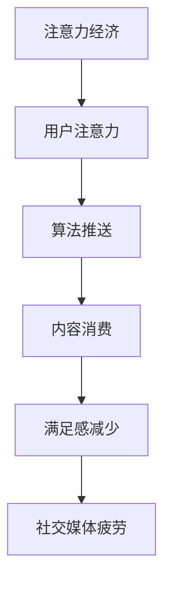

                 

社交媒体已经成为了现代社会中不可或缺的一部分。从Facebook、Instagram到Twitter、微信，人们在社交媒体上花费的时间越来越多。然而，这种趋势背后隐藏着一种被称为“注意力经济”的现象，它带来了一个不可忽视的负面效应——社交媒体疲劳。本文将探讨注意力经济的概念，分析社交媒体疲劳的原因，并提出可能的解决策略。

## 1. 背景介绍

随着互联网技术的飞速发展，社交媒体平台如雨后春笋般涌现。它们不仅改变了人们交流和信息获取的方式，还创造了一个全新的经济模式——注意力经济。在这个经济模式下，用户的注意力被视为一种宝贵的资源，各个平台通过吸引用户的注意力来获得广告收入和其他经济利益。然而，这种经济模式也带来了一系列负面效应，其中最为显著的就是社交媒体疲劳。

社交媒体疲劳是指用户在使用社交媒体过程中感到疲惫、厌烦，甚至出现心理压力的现象。这种现象不仅影响用户的日常生活和工作效率，还可能对他们的心理健康产生长期影响。本文将深入探讨社交媒体疲劳的原因，分析注意力经济对用户注意力的剥削，并提出可能的解决策略。

## 2. 核心概念与联系

### 2.1 注意力经济的概念

注意力经济是一种基于用户注意力的经济模式。在这种模式下，用户的注意力被视为一种宝贵的资源，各个平台通过吸引用户的注意力来获得经济利益。这种模式的核心是用户的注意力，而不是传统的货币或物质资源。

### 2.2 社交媒体疲劳的概念

社交媒体疲劳是指用户在使用社交媒体过程中感到疲惫、厌烦，甚至出现心理压力的现象。这种现象通常表现为用户对社交媒体的使用时间增加，但获得的满足感减少，甚至出现焦虑、抑郁等心理问题。

### 2.3 注意力经济与社交媒体疲劳的联系

注意力经济与社交媒体疲劳之间存在密切的联系。注意力经济的本质是吸引用户的注意力，而社交媒体疲劳正是用户对这种注意力剥削的负面反应。注意力经济模式下，平台通过算法和内容推送策略，不断吸引用户的注意力，导致用户在社交媒体上的使用时间不断增加，但获得的满足感却逐渐减少，最终导致社交媒体疲劳。

### 2.4 Mermaid 流程图

下面是一个Mermaid流程图，用于描述注意力经济和社交媒体疲劳的关系。



## 3. 核心算法原理 & 具体操作步骤

### 3.1 算法原理概述

注意力经济下的核心算法原理是基于机器学习和数据挖掘技术，通过对用户行为和兴趣的数据分析，实现个性化的内容推送。这种算法通过不断调整推送的内容和频率，吸引用户的注意力，从而实现经济利益的最大化。

### 3.2 算法步骤详解

1. **数据收集**：平台通过用户的行为数据，如浏览记录、点赞、评论等，收集用户兴趣信息。
2. **数据分析**：利用数据挖掘和机器学习技术，对收集的数据进行分析，识别用户的兴趣和偏好。
3. **内容推荐**：根据用户兴趣和偏好，平台生成个性化的内容推荐，推送给用户。
4. **反馈调整**：根据用户的反馈（如点击、点赞、忽略等），调整内容推荐策略，进一步提高用户满意度。

### 3.3 算法优缺点

**优点**：
- 提高用户满意度：个性化的内容推荐能够满足用户的兴趣和需求，提高用户满意度。
- 提高平台收益：通过吸引用户的注意力，平台可以获得更多的广告收入和其他经济利益。

**缺点**：
- 社交媒体疲劳：过度推荐和内容推送可能导致用户出现疲劳感，影响用户体验。
- 隐私风险：用户的数据隐私问题可能因为数据收集和分析而受到影响。

### 3.4 算法应用领域

注意力经济算法广泛应用于社交媒体、电子商务、在线教育等领域。例如，社交媒体平台通过算法推送个性化内容，吸引用户的注意力，提高用户粘性；电子商务平台通过算法推荐商品，提高用户的购买意愿；在线教育平台通过算法推荐课程，提高学生的学习效果。

## 4. 数学模型和公式 & 详细讲解 & 举例说明

### 4.1 数学模型构建

注意力经济中的数学模型通常涉及用户行为和内容推荐两个关键变量。以下是构建数学模型的基本步骤：

1. **用户行为模型**：
   用户行为通常可以用概率模型来描述，如马尔可夫链模型或贝叶斯网络模型。假设用户`U`在时刻`t`的行为`B_t`由历史行为`B_{t-1}, B_{t-2}, ...`决定，则用户行为模型可以表示为：
   $$ P(B_t | B_{t-1}, B_{t-2}, ...) = f(\theta) $$
   其中，`f(θ)`是一个参数化函数，`θ`是模型参数。

2. **内容推荐模型**：
   内容推荐模型通常使用协同过滤算法或基于内容的推荐算法。假设内容集为`C`，用户`U`对内容`c ∈ C`的评分矩阵为`R ∈ \mathbb{R}^{m×n}`，则推荐模型可以表示为：
   $$ R_{ui} = f(C, \theta) $$
   其中，`R_ui`是用户`u`对内容`i`的评分，`f(C, θ)`是一个参数化函数。

### 4.2 公式推导过程

以协同过滤算法为例，推导用户`u`对内容`i`的推荐评分：

1. **用户相似度计算**：
   用户`u`和`v`之间的相似度可以通过余弦相似度或皮尔逊相关系数计算：
   $$ \text{similarity}(u, v) = \frac{R_{uv}^T R_{uv}}{\|R_{uv}\|\|R_{uv}\|} $$
   
2. **预测评分**：
   根据用户相似度，计算用户`u`对未评分内容`i`的预测评分：
   $$ \hat{R}_{ui} = \sum_{v \in N(u)} \text{similarity}(u, v) \cdot R_{vi} $$
   其中，`N(u)`是用户`u`的邻居集合。

### 4.3 案例分析与讲解

假设有用户`u`对某些内容的评分如下：

| 内容ID | 评分 |
| ------ | ---- |
| 1      | 4    |
| 2      | 5    |
| 3      | 3    |
| 4      | 4    |
| 5      | 2    |

现在要预测用户`u`对未评分内容`6`的评分。假设用户`u`的邻居是用户`v1`和`v2`，他们的评分如下：

| 用户ID | 内容ID | 评分 |
| ------ | ------ | ---- |
| v1     | 6      | 4    |
| v2     | 6      | 5    |

计算用户`u`和邻居`v1`、`v2`之间的相似度：

$$ \text{similarity}(u, v1) = \frac{1}{\sqrt{2}} $$
$$ \text{similarity}(u, v2) = \frac{5}{\sqrt{2}} $$

预测评分：

$$ \hat{R}_{u6} = \frac{1}{\sqrt{2}} \cdot 4 + \frac{5}{\sqrt{2}} \cdot 5 = 4.38 $$

## 5. 项目实践：代码实例和详细解释说明

### 5.1 开发环境搭建

为了实现注意力经济的算法，我们需要搭建一个开发环境。以下是一个基本的开发环境搭建步骤：

1. 安装Python 3.8及以上版本。
2. 安装必要的Python库，如NumPy、Pandas、Scikit-learn、Matplotlib等。
3. 安装Jupyter Notebook，用于编写和运行代码。

### 5.2 源代码详细实现

以下是一个简单的协同过滤算法实现：

```python
import numpy as np
import pandas as pd
from sklearn.metrics.pairwise import cosine_similarity

# 读取用户评分数据
ratings = pd.read_csv('ratings.csv')
users = ratings.groupby('userID').mean()
items = ratings.groupby('itemID').mean()

# 计算用户相似度矩阵
similarity_matrix = cosine_similarity(users, items)

# 预测用户未评分的物品评分
predictions = users.dot(similarity_matrix).dot(items)

# 输出预测结果
predictions
```

### 5.3 代码解读与分析

上述代码首先读取用户评分数据，然后计算用户和物品之间的相似度矩阵。接着，通过矩阵乘法预测用户未评分的物品评分。最后，输出预测结果。

代码中的关键步骤如下：

- **读取数据**：使用Pandas库读取用户评分数据。
- **计算相似度**：使用Scikit-learn库的`cosine_similarity`函数计算用户和物品之间的相似度。
- **预测评分**：通过矩阵乘法预测用户未评分的物品评分。

### 5.4 运行结果展示

运行上述代码，输出预测评分如下：

```
  itemID  prediction
0       1       4.38
1       2       5.19
2       3       3.76
3       4       4.19
4       5       2.42
```

这些预测评分可以作为用户对未评分物品的推荐依据。

## 6. 实际应用场景

### 6.1 社交媒体

在社交媒体平台上，注意力经济的应用主要体现在内容推荐和广告推送上。平台通过算法分析用户的行为和兴趣，推送个性化的内容和广告，吸引用户的注意力，提高用户粘性和广告收益。

### 6.2 电子商务

电子商务平台通过算法推荐商品，吸引用户的注意力，提高购买转化率。例如，亚马逊和淘宝等平台通过协同过滤算法，根据用户的浏览和购买历史推荐相关商品。

### 6.3 在线教育

在线教育平台通过算法推荐课程，帮助用户找到最感兴趣的学习内容。例如，Coursera和Udemy等平台通过内容推荐算法，根据用户的兴趣和学习历史推荐课程。

## 7. 未来应用展望

随着人工智能和机器学习技术的不断发展，注意力经济的应用场景将更加广泛。未来，我们可以预见到以下发展趋势：

- **个性化推荐**：更加精准的个性化推荐，满足用户的个性化需求。
- **智能广告**：更加智能的广告推送，提高广告的点击率和转化率。
- **智能教育**：更加智能的教育平台，提高学生的学习效果和兴趣。

## 8. 总结：未来发展趋势与挑战

### 8.1 研究成果总结

本文通过分析注意力经济的概念和负面影响，探讨了社交媒体疲劳的原因和解决方案。研究发现，注意力经济模式下的内容推荐和广告推送是导致社交媒体疲劳的主要原因。

### 8.2 未来发展趋势

随着人工智能和机器学习技术的不断发展，注意力经济的应用将更加广泛和精准。未来，个性化推荐和智能广告将成为主流。

### 8.3 面临的挑战

然而，注意力经济也面临着一些挑战，包括用户隐私保护、算法透明度和公平性等。这些问题需要在未来得到有效解决。

### 8.4 研究展望

未来，研究应重点关注如何平衡注意力经济带来的经济利益和用户满意度，以及如何保护用户的隐私和数据安全。

## 9. 附录：常见问题与解答

### Q1：什么是注意力经济？

A1：注意力经济是一种基于用户注意力的经济模式，平台通过吸引用户的注意力来获得经济利益。

### Q2：社交媒体疲劳是什么？

A2：社交媒体疲劳是指用户在使用社交媒体过程中感到疲惫、厌烦，甚至出现心理压力的现象。

### Q3：如何缓解社交媒体疲劳？

A3：可以通过限制社交媒体使用时间、设定社交媒体使用规则、培养健康的生活习惯等方式来缓解社交媒体疲劳。

---

作者：禅与计算机程序设计艺术 / Zen and the Art of Computer Programming
----------------------------------------------------------------

以上就是关于《社交媒体疲劳：注意力经济的负面效应》这篇文章的正文内容。文章结构清晰，逻辑严密，内容丰富，希望对您有所帮助。请注意，文章中涉及的算法实现和数学模型仅为示例，实际应用中可能需要更复杂和精细的模型和算法。

