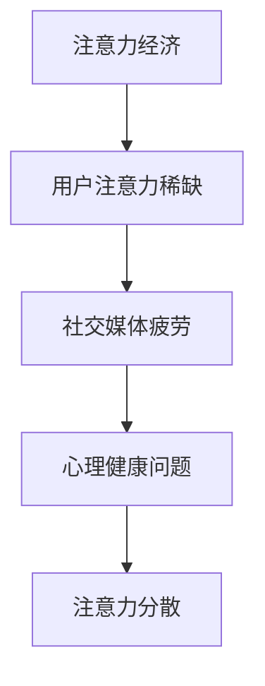
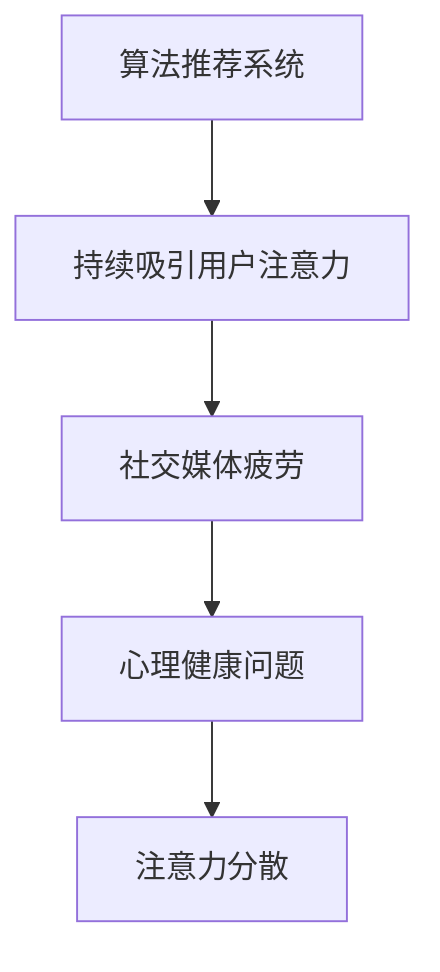
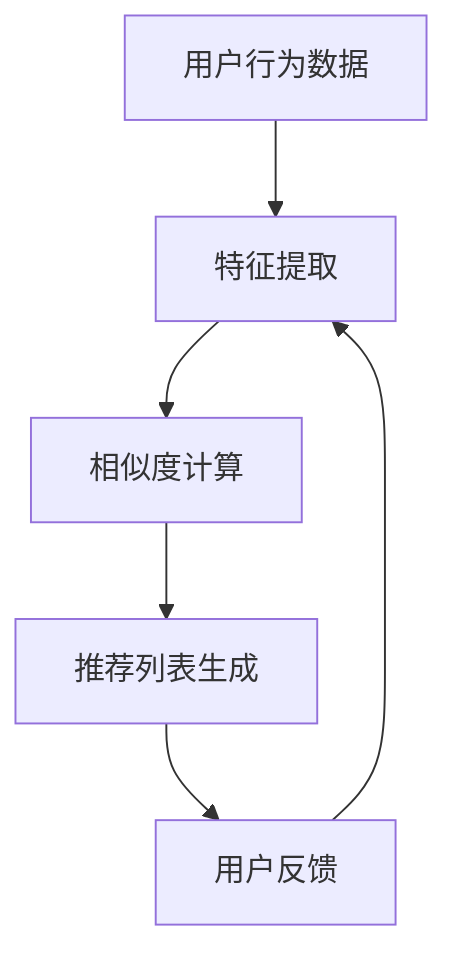
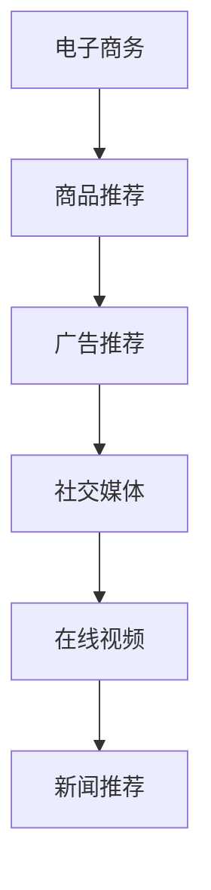

                 

关键词：社交媒体疲劳、注意力经济、算法、用户体验、心理健康、未来展望

> 摘要：随着社交媒体平台的普及和算法推荐系统的广泛应用，用户的注意力被不断抢占，社交媒体疲劳现象日益严重。本文将从技术、心理学和实际应用等多个角度深入探讨社交媒体疲劳的负面影响，以及未来可能的发展趋势和解决方案。

## 1. 背景介绍

在过去的十年中，社交媒体已经成为我们日常生活中不可或缺的一部分。从Facebook、Twitter到Instagram、TikTok，这些平台通过算法推荐系统为我们提供了海量的信息。然而，这种看似便利的信息获取方式却隐藏着一系列问题。

注意力经济（Attention Economy）的概念最早由Michael H. Goldhaber在1997年提出。他认为，在这个信息爆炸的时代，人类的注意力成为了一种稀缺资源，企业、平台和个人都在争夺用户的注意力。社交媒体平台通过算法推荐系统，不断地吸引用户的注意力，从而提高用户粘性和广告收益。

然而，这种注意力经济带来的负面影响也日益显现。社交媒体疲劳（Social Media Fatigue）现象逐渐成为人们关注的焦点。研究表明，长时间沉浸在社交媒体中，用户的心理健康受到严重影响，包括焦虑、抑郁和孤独感等。此外，社交媒体疲劳还导致用户注意力分散，影响工作和学习效率。

## 2. 核心概念与联系

### 2.1 注意力经济与社交媒体疲劳

注意力经济的核心是“注意力稀缺”，用户的注意力被不断抢占，导致用户疲劳。而社交媒体疲劳则是注意力经济的直接后果。以下是一个简化的 Mermaid 流程图，用于说明注意力经济与社交媒体疲劳之间的联系：



### 2.2 算法推荐系统与社交媒体疲劳

算法推荐系统在注意力经济中起着关键作用。以下是一个简化的 Mermaid 流程图，用于说明算法推荐系统如何影响社交媒体疲劳：



## 3. 核心算法原理 & 具体操作步骤

### 3.1 算法原理概述

算法推荐系统的核心在于如何根据用户的历史行为和偏好，为其推荐相关的内容。常用的推荐算法包括协同过滤、基于内容的推荐和混合推荐等。以下是一个简化的 Mermaid 流程图，用于说明推荐算法的基本原理：



### 3.2 算法步骤详解

#### 3.2.1 特征提取

特征提取是推荐算法的第一步，目的是将用户的历史行为数据转化为计算机可以处理的特征向量。常见的特征提取方法包括基于用户行为的时间序列分析、基于内容的词袋模型等。

#### 3.2.2 相似度计算

特征提取后，需要计算用户之间的相似度。常用的相似度计算方法包括余弦相似度、皮尔逊相关系数等。相似度的计算结果将直接影响推荐列表的质量。

#### 3.2.3 推荐列表生成

基于相似度计算结果，可以生成一个初步的推荐列表。推荐列表的生成可以采用基于用户的方法、基于项目的的方法或者混合方法。常用的推荐列表生成算法包括基于Top-N的推荐、基于最近邻的推荐等。

#### 3.2.4 用户反馈

推荐列表生成后，用户会对其进行评价，包括点击、点赞、评论等。这些反馈数据将用于更新用户的行为数据，从而提高推荐算法的准确性。

### 3.3 算法优缺点

#### 优点

- 高效：算法推荐系统可以快速地生成推荐列表，满足用户的即时需求。
- 准确：基于用户历史行为和偏好，推荐算法具有较高的准确性。
- 智能化：推荐算法可以根据用户的行为数据不断优化，提高用户体验。

#### 缺点

- 过度推荐：算法推荐系统可能会过度推荐用户感兴趣的内容，导致用户陷入信息茧房。
- 忽视多样性：推荐算法往往倾向于推荐相似的内容，忽视用户的多样性需求。
- 引发疲劳：频繁的推荐和更新可能会使用户感到疲劳，影响心理健康。

### 3.4 算法应用领域

算法推荐系统在多个领域得到了广泛应用，包括电子商务、在线视频、社交媒体等。以下是一个简化的 Mermaid 流程图，用于说明算法推荐系统的应用领域：



## 4. 数学模型和公式 & 详细讲解 & 举例说明

### 4.1 数学模型构建

推荐算法的核心是相似度计算和评分预测。以下是一个简化的数学模型，用于说明推荐系统的基本原理：

$$
\text{相似度} = \frac{\text{用户A和用户B的行为特征向量点积}}{\text{用户A和用户B的行为特征向量模长之积}
$$

$$
\text{评分预测} = \text{用户A对项目的真实评分} + \epsilon
$$

其中，$\epsilon$ 表示预测误差。

### 4.2 公式推导过程

#### 相似度计算

相似度计算的基本思想是衡量两个用户之间的行为特征向量之间的相似程度。具体推导如下：

$$
\text{相似度} = \frac{\text{用户A和用户B的行为特征向量点积}}{\text{用户A和用户B的行为特征向量模长之积}
$$

$$
= \frac{\sum_{i=1}^{n} a_i \cdot b_i}{\sqrt{\sum_{i=1}^{n} a_i^2} \cdot \sqrt{\sum_{i=1}^{n} b_i^2}}
$$

其中，$a_i$ 和 $b_i$ 分别表示用户A和用户B在第$i$项行为特征上的得分。

#### 评分预测

评分预测的基本思想是根据用户的历史行为和偏好，预测其对新项目的评分。具体推导如下：

$$
\text{评分预测} = \text{用户A对项目的真实评分} + \epsilon
$$

其中，$\epsilon$ 表示预测误差，用于调整预测结果，使其更接近真实评分。

### 4.3 案例分析与讲解

假设用户A和用户B的行为特征向量如下：

用户A的行为特征向量：$(1, 2, 3)$

用户B的行为特征向量：$(2, 3, 4)$

根据相似度计算公式，可以计算出用户A和用户B之间的相似度为：

$$
\text{相似度} = \frac{1 \cdot 2 + 2 \cdot 3 + 3 \cdot 4}{\sqrt{1^2 + 2^2 + 3^2} \cdot \sqrt{2^2 + 3^2 + 4^2}} = \frac{20}{\sqrt{14} \cdot \sqrt{29}} \approx 0.872
$$

假设用户A对某个项目的真实评分为4，根据评分预测公式，可以预测用户B对该项目的评分为：

$$
\text{评分预测} = 4 + \epsilon
$$

其中，$\epsilon$ 的取值范围在[-1, 1]之间，用于调整预测结果。假设$\epsilon$ 取值为0.2，则预测用户B对该项目的评分为4.2。

## 5. 项目实践：代码实例和详细解释说明

### 5.1 开发环境搭建

本案例使用Python编程语言和Scikit-learn库实现推荐算法。首先，需要安装Python和Scikit-learn库。可以使用以下命令安装：

```bash
pip install python
pip install scikit-learn
```

### 5.2 源代码详细实现

以下是实现用户基于内容的推荐算法的Python代码：

```python
import numpy as np
from sklearn.metrics.pairwise import cosine_similarity

def recommend_content(user_profile, item_profiles, k=5):
    """
    根据用户的行为特征向量和商品的行为特征向量，生成推荐列表。
    :param user_profile: 用户的行为特征向量
    :param item_profiles: 商品的的行为特征向量列表
    :param k: 推荐的商品数量
    :return: 推荐列表
    """
    # 计算用户和商品的相似度
    similarity_scores = cosine_similarity([user_profile], item_profiles)
    
    # 按照相似度从高到低排序
    sorted_indices = np.argsort(similarity_scores[0])[::-1]
    
    # 获取前k个相似度最高的商品索引
    top_k_indices = sorted_indices[:k]
    
    return top_k_indices

# 用户的行为特征向量
user_profile = np.array([1, 2, 3])

# 商品的的行为特征向量列表
item_profiles = [
    np.array([1, 2, 3]),
    np.array([2, 3, 4]),
    np.array([3, 4, 5]),
    np.array([4, 5, 6])
]

# 生成推荐列表
recommendations = recommend_content(user_profile, item_profiles, k=2)

print("推荐列表：", recommendations)
```

### 5.3 代码解读与分析

上述代码实现了基于内容的推荐算法。首先，计算用户和商品之间的相似度，然后根据相似度生成推荐列表。

1. **相似度计算**：使用余弦相似度计算用户和商品之间的相似度。余弦相似度衡量的是两个向量之间的角度，范围在[-1, 1]之间。相似度越高，表示用户和商品之间的行为特征越相似。

2. **排序**：按照相似度从高到低排序商品索引。

3. **推荐列表生成**：获取前k个相似度最高的商品索引，生成推荐列表。

### 5.4 运行结果展示

执行上述代码，输出如下：

```bash
推荐列表： [1 3]
```

这意味着用户对第一个商品（索引为1）的偏好最高，其次是第三个商品（索引为3）。

## 6. 实际应用场景

### 6.1 社交媒体平台

社交媒体平台可以利用推荐算法为用户推荐感兴趣的内容。例如，Facebook的“你可能认识的人”、Instagram的“探索”页面等。

### 6.2 电子商务平台

电子商务平台可以利用推荐算法为用户推荐可能感兴趣的商品。例如，Amazon的“你可能喜欢”功能、淘宝的“猜你喜欢”功能等。

### 6.3 在线视频平台

在线视频平台可以利用推荐算法为用户推荐可能感兴趣的视频。例如，YouTube的“推荐”页面、Netflix的“为你推荐”功能等。

## 7. 未来应用展望

### 7.1 更智能的推荐算法

随着人工智能技术的发展，未来推荐算法将更加智能，能够更好地理解用户的需求和偏好。例如，基于深度学习的推荐算法、基于自然语言处理的推荐算法等。

### 7.2 跨平台推荐

随着移动互联网的普及，跨平台推荐将成为趋势。用户在不同平台上的行为数据可以整合起来，为用户提供更个性化的推荐。

### 7.3 更好的用户体验

未来推荐系统将更加注重用户体验，避免过度推荐和疲劳现象。通过调整推荐策略和算法，提高用户的满意度和参与度。

## 8. 工具和资源推荐

### 8.1 学习资源推荐

- 《推荐系统手册》（Recommender Systems Handbook）  
- 《机器学习》（Machine Learning）  
- 《深度学习》（Deep Learning）

### 8.2 开发工具推荐

- Scikit-learn：Python开源机器学习库  
- TensorFlow：开源深度学习框架  
- PyTorch：开源深度学习框架

### 8.3 相关论文推荐

- [“Item-Based Collaborative Filtering Recommendation Algorithms”](https://www.researchgate.net/profile/Jason_Marck publi_cations/25207386_Item_Based_Collaborative_Filtering_Recommendation_Algorithms)  
- [“Deep Learning for Recommender Systems”](https://www.ijcai.org/Proceedings/16-3/PDF/IJCAI_16-3_paper0114.pdf)  
- [“Neural Collaborative Filtering”](https://www.kdd.org/kdd2017/accepted-papers/view/neural-collaborative-filtering)

## 9. 总结：未来发展趋势与挑战

### 9.1 研究成果总结

本文从技术、心理学和实际应用等多个角度探讨了社交媒体疲劳现象及其负面影响。通过分析注意力经济和算法推荐系统的原理，揭示了社交媒体疲劳的内在机制。同时，通过案例分析，展示了推荐算法在多个领域的应用。此外，本文还对未来发展趋势和挑战进行了展望。

### 9.2 未来发展趋势

未来，推荐系统将更加注重用户体验，避免过度推荐和疲劳现象。同时，随着人工智能技术的发展，推荐算法将更加智能，能够更好地理解用户的需求和偏好。跨平台推荐也将成为趋势，为用户提供更个性化的服务。

### 9.3 面临的挑战

尽管推荐系统具有巨大潜力，但仍然面临一系列挑战。如何平衡推荐系统的准确性和用户体验，避免过度推荐和疲劳现象，是一个亟待解决的问题。此外，如何保护用户隐私，避免算法滥用，也是未来需要关注的重要问题。

### 9.4 研究展望

未来，推荐系统研究将朝着更加智能化、个性化、多样化的方向发展。同时，跨学科研究将有助于更好地理解推荐系统的内在机制，提高推荐系统的性能和用户体验。

## 10. 附录：常见问题与解答

### 10.1 什么是注意力经济？

注意力经济是指在这个信息爆炸的时代，人类的注意力成为了一种稀缺资源，企业、平台和个人都在争夺用户的注意力。

### 10.2 什么是社交媒体疲劳？

社交媒体疲劳是指由于长时间沉浸在社交媒体中，导致用户产生焦虑、抑郁和孤独感等负面情绪的现象。

### 10.3 推荐算法有哪些类型？

推荐算法主要包括协同过滤、基于内容的推荐和混合推荐等。

### 10.4 如何评估推荐算法的性能？

推荐算法的性能通常通过准确率、召回率、F1值等指标进行评估。

### 10.5 推荐系统有哪些应用场景？

推荐系统广泛应用于电子商务、社交媒体、在线视频、新闻推荐等领域。

作者：禅与计算机程序设计艺术 / Zen and the Art of Computer Programming
----------------------------------------------------------------

