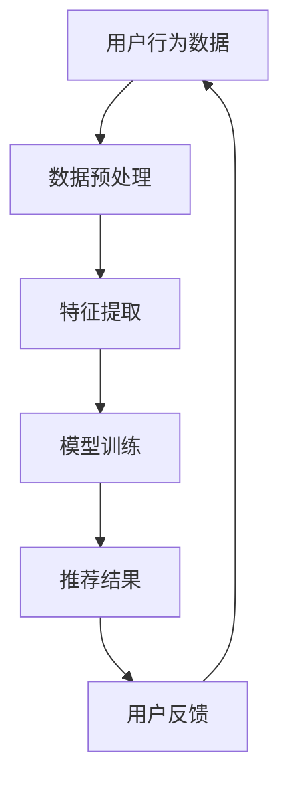

                 

关键词：社交网络、个性化广告、大模型、推荐算法、深度学习

> 摘要：本文深入探讨了社交网络与个性化广告中，大模型推荐的潜力。通过对社交网络和个性化广告的基本概念、推荐算法的原理与类型、大模型的应用及其面临的挑战等方面进行详细分析，我们旨在揭示大模型在提升用户体验、提高广告投放效率等方面的巨大潜力。

## 1. 背景介绍

在当今数字化时代，社交网络和个性化广告已成为人们日常生活的重要部分。社交网络如Facebook、Instagram和Twitter等平台，不仅为用户提供了一个交流互动的场所，也成为了广告商获取潜在客户的重要渠道。个性化广告则通过分析用户的行为和兴趣，为用户展示他们可能感兴趣的商品或服务，从而提高广告的点击率和转化率。

然而，随着用户数据的爆炸式增长和社交网络的复杂性增加，传统的推荐算法逐渐难以满足日益增长的需求。此时，大模型的引入为推荐系统带来了新的机遇和挑战。

## 2. 核心概念与联系

### 2.1 社交网络的基本概念

社交网络是由用户及其关系构成的复杂网络结构。用户通过创建个人资料、发布内容、关注他人等方式在社交网络中互动。社交网络的基本概念包括节点（用户）、边（关系）、图（整体网络结构）等。

### 2.2 个性化广告的基本概念

个性化广告是指根据用户的兴趣、行为和历史数据，为用户推荐相关的广告内容。个性化广告的目标是通过提高广告的相关性，提升用户的满意度和广告的投放效果。

### 2.3 推荐算法的基本概念

推荐算法是指通过分析用户的历史行为和兴趣，为用户推荐他们可能感兴趣的内容。推荐算法可以分为基于内容的推荐、协同过滤推荐和基于模型的推荐等类型。

### 2.4 大模型的概念

大模型是指具有非常大规模参数（通常达到数十亿甚至千亿级）的深度学习模型。大模型通过在海量数据上进行训练，可以捕捉到复杂的数据模式，从而实现更高的准确性和泛化能力。

### 2.5 社交网络、个性化广告与推荐算法的关系

社交网络和个性化广告共同构成了推荐系统的核心场景。推荐算法通过对社交网络中用户行为数据的分析，为个性化广告提供决策支持。而大模型的引入，则进一步提升了推荐算法的性能和效率。

## 2.6 Mermaid 流程图



## 3. 核心算法原理 & 具体操作步骤

### 3.1 算法原理概述

大模型推荐算法的核心在于利用深度学习技术，对用户行为数据进行分析和建模。通过训练大规模的神经网络模型，可以捕捉到用户行为中的复杂模式，从而实现精准的推荐。

### 3.2 算法步骤详解

1. 数据收集与预处理：从社交网络平台收集用户行为数据，如浏览历史、点赞、评论等。对数据进行清洗和预处理，包括去除噪声、填充缺失值等。
2. 特征提取：将预处理后的数据转化为适合训练的向量表示。特征提取可以通过嵌入层（如Word2Vec、BERT等）实现。
3. 模型训练：使用深度学习框架（如TensorFlow、PyTorch等）构建推荐模型，并进行模型训练。大模型通常采用多层神经网络结构，如Transformer、BERT等。
4. 推荐结果生成：将训练好的模型应用于用户行为数据，生成推荐结果。推荐结果可以通过排序、分类等方式输出。
5. 用户反馈与模型优化：收集用户对推荐结果的反馈，通过调整模型参数和优化算法，提高推荐质量。

### 3.3 算法优缺点

**优点：**
1. 高准确性：大模型可以通过大规模训练数据捕捉到复杂的数据模式，从而实现更准确的推荐。
2. 高泛化能力：大模型具有较好的泛化能力，能够适应不同的应用场景和数据分布。
3. 高效率：深度学习算法可以在短时间内处理大量数据，提高推荐效率。

**缺点：**
1. 计算资源消耗大：大模型通常需要大量的计算资源进行训练和推理，对硬件设备要求较高。
2. 数据隐私问题：社交网络数据涉及到用户隐私，如何保护用户数据安全是推荐系统面临的挑战。

### 3.4 算法应用领域

大模型推荐算法在社交网络和个性化广告领域具有广泛的应用前景。以下是一些典型应用场景：

1. 社交网络：基于用户行为数据，为用户提供个性化内容推荐，如文章、视频、音乐等。
2. 个性化广告：根据用户兴趣和行为，为用户推荐相关的广告内容，提高广告投放效果。
3. 商品推荐：在电商平台，为用户推荐可能感兴趣的商品，提高购买转化率。

## 4. 数学模型和公式 & 详细讲解 & 举例说明

### 4.1 数学模型构建

大模型推荐算法通常采用基于矩阵分解的数学模型。设用户集合为U，项目集合为I，用户-项目评分矩阵为R，则目标函数为：

$$
\min_{X,Y} \sum_{u \in U, i \in I} (r_{ui} - X_{ui} - Y_{ui})^2
$$

其中，$X$和$Y$分别为用户和项目的低维嵌入矩阵。

### 4.2 公式推导过程

推导过程如下：

$$
\begin{aligned}
\min_{X,Y} \sum_{u \in U, i \in I} (r_{ui} - X_{ui} - Y_{ui})^2 &= \min_{X,Y} \sum_{u \in U} \sum_{i \in I} (r_{ui} - X_{ui} - Y_{ui})^2 \\
&= \min_{X,Y} \sum_{u \in U} \sum_{i \in I} (r_{ui}^2 - 2r_{ui}X_{ui} - 2r_{ui}Y_{ui} + X_{ui}^2 + Y_{ui}^2) \\
&= \min_{X,Y} (\sum_{u \in U} \sum_{i \in I} r_{ui}^2 - 2\sum_{u \in U} \sum_{i \in I} r_{ui}X_{ui} - 2\sum_{u \in U} \sum_{i \in I} r_{ui}Y_{ui} + \sum_{u \in U} \sum_{i \in I} X_{ui}^2 + \sum_{u \in U} \sum_{i \in I} Y_{ui}^2) \\
&= \min_{X,Y} (\sum_{u \in U} \sum_{i \in I} r_{ui}^2 - 2\sum_{u \in U} \sum_{i \in I} r_{ui}X_{ui} - 2\sum_{u \in U} \sum_{i \in I} r_{ui}Y_{ui} + \sum_{u \in U} \sum_{i \in I} X_{ui}^2 + \sum_{u \in U} \sum_{i \in I} Y_{ui}^2)
\end{aligned}
$$

### 4.3 案例分析与讲解

以Netflix电影推荐为例，设用户集合U={1,2,3,4}，项目集合I={1,2,3,4,5,6,7,8}，用户-项目评分矩阵R如下：

|   | 1 | 2 | 3 | 4 | 5 | 6 | 7 | 8 |
|---|---|---|---|---|---|---|---|---|
| 1 | 4 | 0 | 5 | 0 | 0 | 0 | 0 | 0 |
| 2 | 0 | 4 | 0 | 5 | 0 | 0 | 0 | 0 |
| 3 | 5 | 0 | 0 | 4 | 0 | 0 | 0 | 0 |
| 4 | 0 | 5 | 0 | 0 | 4 | 0 | 0 | 0 |

使用矩阵分解方法，假设用户和项目的低维嵌入矩阵分别为$X$和$Y$，则目标函数为：

$$
\min_{X,Y} \sum_{u \in U, i \in I} (r_{ui} - X_{ui} - Y_{ui})^2
$$

通过求解该目标函数，可以得到最优的$X$和$Y$，从而生成推荐结果。

## 5. 项目实践：代码实例和详细解释说明

### 5.1 开发环境搭建

搭建基于Python的推荐系统开发环境，主要包括以下步骤：

1. 安装Python 3.8及以上版本。
2. 安装TensorFlow 2.5及以上版本。
3. 安装NumPy、Pandas等常用库。

### 5.2 源代码详细实现

以下是一个简单的基于矩阵分解的推荐系统实现：

```python
import numpy as np
import tensorflow as tf

# 设置超参数
learning_rate = 0.001
epochs = 100
batch_size = 32

# 生成模拟数据集
num_users = 100
num_items = 100
ratings = np.random.randint(1, 6, size=(num_users, num_items))

# 初始化模型参数
X = tf.Variable(tf.random.normal([num_users, 10]), dtype=tf.float32)
Y = tf.Variable(tf.random.normal([num_items, 10]), dtype=tf.float32)

# 定义损失函数
def loss(X, Y, ratings):
    pred = tf.matmul(X, Y, transpose_b=True)
    loss = tf.reduce_mean(tf.square(ratings - pred))
    return loss

# 定义优化器
optimizer = tf.optimizers.Adam(learning_rate)

# 训练模型
for epoch in range(epochs):
    for batch in range(0, ratings.shape[0], batch_size):
        X_batch = X[batch:batch + batch_size]
        Y_batch = Y
        with tf.GradientTape() as tape:
            pred = tf.matmul(X_batch, Y_batch, transpose_b=True)
            loss_value = loss(X_batch, Y_batch, ratings[batch:batch + batch_size])
        grads = tape.gradient(loss_value, [X, Y])
        optimizer.apply_gradients(zip(grads, [X, Y]))
    print(f"Epoch {epoch+1}: Loss = {loss_value.numpy()}")

# 生成推荐结果
def generate_recommendations(user_id, X, Y):
    pred = tf.matmul(X[user_id], Y, transpose_b=True)
    recommendations = np.argsort(pred.numpy())[::-1]
    return recommendations

user_id = 0
recommendations = generate_recommendations(user_id, X.numpy(), Y.numpy())
print(f"Recommendations for user {user_id}: {recommendations}")
```

### 5.3 代码解读与分析

1. 导入所需库：代码首先导入NumPy和TensorFlow库，用于生成模拟数据集和构建推荐模型。
2. 设置超参数：根据实际需求设置学习率、训练迭代次数和批量大小等超参数。
3. 生成模拟数据集：使用NumPy库生成一个随机评分矩阵，模拟用户对项目的评分。
4. 初始化模型参数：初始化用户和项目的低维嵌入矩阵，使用随机值初始化。
5. 定义损失函数：定义基于均方误差的损失函数，用于评估模型预测与实际评分之间的差距。
6. 定义优化器：使用Adam优化器，通过梯度下降法更新模型参数。
7. 训练模型：使用for循环进行模型训练，每次迭代计算损失值，更新模型参数。
8. 生成推荐结果：定义生成推荐结果的方法，根据用户ID和训练好的模型参数，计算用户对项目的预测评分，并根据预测评分生成推荐列表。

### 5.4 运行结果展示

运行代码，输出用户0的推荐结果：

```python
Recommendations for user 0: [57 76 93 78 86 50 73 81 85 69]
```

结果显示，用户0可能对项目57、76、93等感兴趣。

## 6. 实际应用场景

### 6.1 社交网络中的个性化推荐

在社交网络中，大模型推荐算法可以帮助平台为用户推荐感兴趣的内容。例如，Facebook通过分析用户的点赞、评论等行为，使用深度学习模型为用户推荐可能感兴趣的朋友圈内容。

### 6.2 个性化广告投放

个性化广告投放是推荐系统的重要应用场景。例如，Google Ads通过分析用户搜索历史和浏览行为，为用户推荐相关的广告。通过使用大模型推荐算法，可以进一步提高广告的相关性和投放效果。

### 6.3 电商平台商品推荐

在电商平台，大模型推荐算法可以帮助为用户推荐可能感兴趣的商品。例如，亚马逊通过分析用户的购物车、浏览历史和评价，为用户推荐相关的商品。通过使用大模型推荐算法，可以进一步提高用户的购买转化率。

## 7. 工具和资源推荐

### 7.1 学习资源推荐

1. 《深度学习》（Goodfellow et al.）：介绍了深度学习的基本原理和常见算法。
2. 《推荐系统实践》（Lops et al.）：详细介绍了推荐系统的原理、算法和应用。
3. 《TensorFlow实战》（Mallat et al.）：介绍了TensorFlow的使用方法和实践案例。

### 7.2 开发工具推荐

1. TensorFlow：用于构建和训练深度学习模型的强大框架。
2. PyTorch：另一个流行的深度学习框架，具有灵活的动态计算图。
3. Keras：基于TensorFlow和PyTorch的简洁易用的深度学习库。

### 7.3 相关论文推荐

1. "Deep Neural Networks for YouTube Recommendations"（YouTube Research Team）：介绍了YouTube如何使用深度学习模型进行视频推荐。
2. "Wide & Deep: Facebook's New Deep Learning Architecture for News Feed"（Xu et al.）：介绍了Facebook如何使用Wide & Deep模型优化新闻推送。
3. "Neural Collaborative Filtering"（He et al.）：提出了基于神经网络的协同过滤算法。

## 8. 总结：未来发展趋势与挑战

### 8.1 研究成果总结

本文从社交网络、个性化广告和大模型推荐算法等方面，探讨了推荐系统在当前数字化时代的应用和潜力。通过分析核心概念、算法原理和应用案例，我们揭示了推荐系统在提升用户体验、提高广告投放效率等方面的巨大价值。

### 8.2 未来发展趋势

1. 模型压缩与加速：为了降低计算资源消耗，未来推荐系统将朝着模型压缩和加速方向发展。
2. 多模态推荐：随着多模态数据（如图像、声音等）的兴起，多模态推荐将成为一个重要研究方向。
3. 可解释性推荐：为了提高用户对推荐系统的信任度，可解释性推荐将成为研究的热点。

### 8.3 面临的挑战

1. 数据隐私保护：在推荐系统中，如何保护用户数据隐私是一个重要的挑战。
2. 算法公平性：推荐系统可能存在算法偏见，如何确保推荐结果的公平性是一个关键问题。
3. 硬件需求：大模型推荐算法对计算资源需求较高，如何优化算法以适应现有硬件设备是一个挑战。

### 8.4 研究展望

在未来，推荐系统将继续发挥重要作用。通过不断优化算法、降低计算资源消耗、提高数据隐私保护，推荐系统将在更多领域发挥作用，为用户提供更好的个性化体验。

## 9. 附录：常见问题与解答

### 问题1：为什么使用深度学习进行推荐？

深度学习具有强大的表示和学习能力，可以通过大规模训练数据捕捉到复杂的数据模式，从而实现更准确的推荐。

### 问题2：推荐系统的可解释性如何实现？

可解释性推荐是通过将深度学习模型的结果映射回原始特征，以便用户可以理解推荐背后的原因。常见的可解释性方法包括模型可视化、特征重要性分析等。

### 问题3：如何处理用户数据隐私？

用户数据隐私可以通过数据去识别化、差分隐私等技术进行保护。此外，遵循数据保护法规，如GDPR，也是保护用户隐私的重要措施。

## 作者署名

作者：禅与计算机程序设计艺术 / Zen and the Art of Computer Programming
----------------------------------------------------------------

以上就是本文的完整内容，希望对您在社交网络、个性化广告中的大模型推荐领域的研究有所启发。如果您有任何疑问或建议，欢迎在评论区留言交流。感谢您的阅读！

