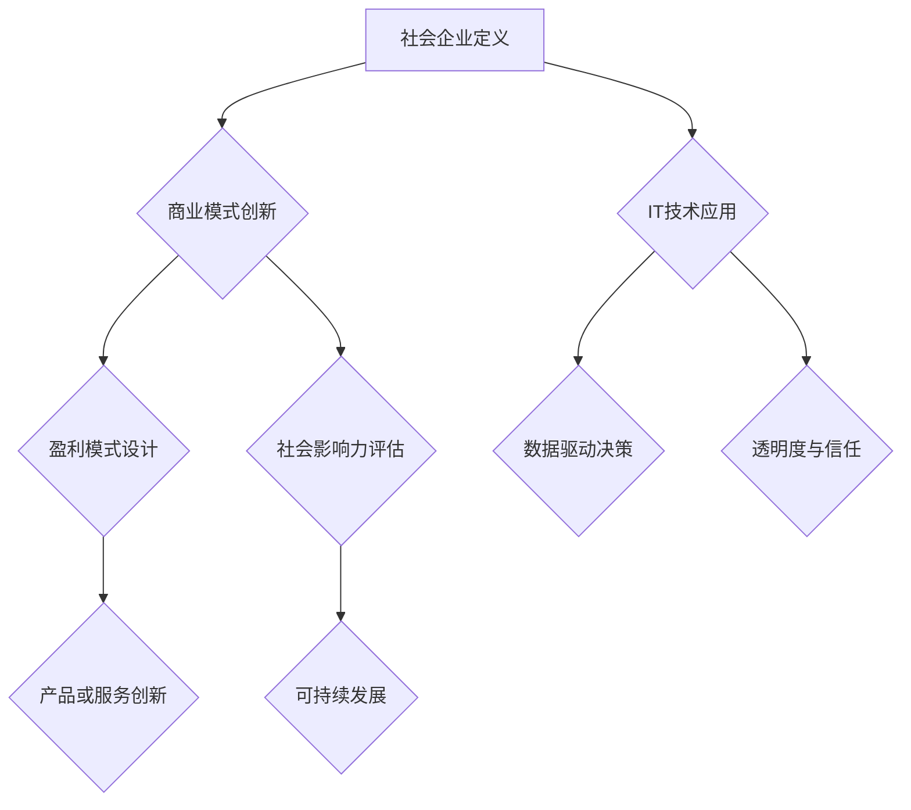

                 

关键词：社会企业、创业、商业模式、社会影响力、可持续发展

> 摘要：本文将探讨社会企业创业的概念、商业模式、社会影响力以及可持续发展的重要性，旨在为IT专业人士提供一种将技术与社会责任相结合的创新路径。通过分析成功的案例和实用的工具，我们将揭示如何在商业领域中创造社会价值，推动社会进步。

## 1. 背景介绍

### 1.1 社会企业与传统企业的区别

社会企业与传统企业的主要区别在于其追求的目标。传统企业以盈利为主要目标，而社会企业则将社会目标放在首位，致力于解决社会问题，如减少贫困、环境污染、教育不平等等。尽管社会企业也可能盈利，但其首要任务是创造社会价值。

### 1.2 社会企业在现代社会的重要性

随着全球环境问题的日益严重和社会问题的持续存在，越来越多的个人和机构开始关注社会企业的崛起。社会企业不仅能够解决特定社会问题，还能通过商业模式创新推动社会进步，为构建更加公平和可持续的社会贡献力量。

### 1.3 社会企业与IT行业的结合

IT行业作为创新的重要驱动力，与社会企业的结合具有巨大潜力。通过技术创新，社会企业可以更有效地解决复杂的社会问题，提升运营效率，扩大影响力。例如，区块链技术可以用于跟踪慈善捐款的流向，人工智能可以用于预测和缓解社会问题。

## 2. 核心概念与联系

### 2.1 社会企业定义

社会企业是一种以创新商业模式解决社会问题的企业。其核心特征包括：

- **明确的社会目标**：解决特定社会问题，如教育、健康、环境等。
- **盈利与非盈利的结合**：社会企业可以盈利，但其首要目标是创造社会价值。
- **可持续性**：社会企业追求长期的可持续发展，而不仅仅是短期的盈利。

### 2.2 商业模式与社会影响力

社会企业的商业模式通常包括以下要素：

- **产品或服务创新**：提供创新性的产品或服务，满足社会需求。
- **盈利模式**：通过可持续的盈利模式实现经济上的自给自足。
- **社会影响力**：通过商业活动创造显著的社会价值。

### 2.3 Mermaid 流程图



## 3. 核心算法原理 & 具体操作步骤

### 3.1 算法原理概述

社会企业的核心算法原理可以归纳为以下几点：

- **数据驱动决策**：利用大数据分析技术，了解社会问题的本质和影响因素，制定解决方案。
- **用户参与**：通过用户反馈和参与，不断优化产品或服务，提升社会影响力。
- **透明度与信任**：通过区块链等技术，实现信息的透明化和可追溯性，增强用户和投资者的信任。

### 3.2 算法步骤详解

1. **数据收集与处理**：收集相关数据，如社会问题数据、用户需求数据等，通过数据清洗和预处理，为后续分析做好准备。

2. **数据分析与建模**：利用机器学习和人工智能技术，对收集到的数据进行分析，构建预测模型和优化算法。

3. **方案设计与实施**：根据分析结果，设计具体的解决方案，并逐步实施。

4. **用户参与与反馈**：通过用户参与和反馈，不断优化产品或服务，提升用户满意度和社会影响力。

5. **评估与调整**：定期评估社会企业的运营效果，根据评估结果进行必要的调整和优化。

### 3.3 算法优缺点

**优点**：

- **高效性**：利用先进的数据分析和机器学习技术，快速识别社会问题的核心，制定解决方案。
- **灵活性**：用户参与和反馈机制使社会企业能够迅速响应社会需求，不断调整和优化。

**缺点**：

- **数据隐私问题**：在数据收集和处理过程中，可能涉及用户隐私，需要采取有效的隐私保护措施。
- **技术依赖性**：社会企业对数据分析和人工智能技术的依赖较高，需要具备一定的技术储备。

### 3.4 算法应用领域

- **教育**：通过个性化学习解决方案，提高教育质量和公平性。
- **健康**：利用大数据分析，改善医疗服务，提升公共健康水平。
- **环境**：通过环境监测和优化，减少污染，保护生态系统。

## 4. 数学模型和公式 & 详细讲解 & 举例说明

### 4.1 数学模型构建

社会企业的数学模型通常包括以下几个方面：

- **社会问题模型**：描述社会问题的本质和影响因素。
- **用户需求模型**：分析用户需求，为产品或服务创新提供依据。
- **盈利模式模型**：设计可持续的盈利模式，实现经济上的自给自足。

### 4.2 公式推导过程

以社会问题模型为例，其基本公式如下：

\[ P = f(S, E, I) \]

其中，\( P \) 表示社会问题的影响程度，\( S \) 表示社会问题的主要因素，\( E \) 表示环境因素，\( I \) 表示干预措施。

### 4.3 案例分析与讲解

#### 案例一：教育领域的个性化学习解决方案

1. **社会问题模型**：

   - 主要因素：教育资源不均、学习效果不佳。
   - 环境因素：互联网普及、人工智能技术发展。
   - 干预措施：个性化学习解决方案。

2. **用户需求模型**：

   - 用户需求：提高学习效率、个性化学习体验。
   - 数据分析：学习行为数据、用户反馈数据。

3. **盈利模式模型**：

   - 盈利模式：提供个性化学习服务，收取费用。

4. **实施过程**：

   - 数据收集与处理：收集学习行为数据，进行清洗和预处理。
   - 数据分析与建模：构建用户需求模型，预测学习效果。
   - 方案设计与实施：设计个性化学习方案，实施并优化。
   - 用户参与与反馈：收集用户反馈，优化学习方案。

## 5. 项目实践：代码实例和详细解释说明

### 5.1 开发环境搭建

1. **安装Python环境**：在计算机上安装Python，并配置必要的库，如NumPy、Pandas等。
2. **安装Jupyter Notebook**：安装Jupyter Notebook，用于编写和运行代码。

### 5.2 源代码详细实现

以下是一个简单的Python代码示例，用于实现个性化学习解决方案的基本逻辑：

```python
import numpy as np
import pandas as pd

# 1. 数据收集与处理
data = pd.read_csv('learning_data.csv')
data = data[['student_id', 'age', 'gender', 'subject', 'score']]

# 2. 数据分析与建模
# 基于学生特征预测学习效果
from sklearn.ensemble import RandomForestClassifier
model = RandomForestClassifier()
model.fit(data[['age', 'gender', 'subject']], data['score'])

# 3. 方案设计与实施
# 输出个性化学习方案
student_features = np.array([[20, 'male', 'math']])
predicted_score = model.predict(student_features)
print(f"Predicted score for student: {predicted_score[0]}")

# 4. 用户参与与反馈
# 收集用户反馈，并调整模型
user_feedback = input("Enter your feedback: ")
if user_feedback == 'good':
    print("Thank you for your feedback!")
else:
    print("We will work on improving the solution.")
```

### 5.3 代码解读与分析

1. **数据收集与处理**：使用Pandas库读取CSV文件，提取有用的学生数据。
2. **数据分析与建模**：使用随机森林分类器（RandomForestClassifier）进行建模，预测学习效果。
3. **方案设计与实施**：根据学生的特征（如年龄、性别、学科），输出个性化学习方案。
4. **用户参与与反馈**：收集用户反馈，并用于调整模型，优化学习方案。

### 5.4 运行结果展示

运行代码后，将输出预测的学习成绩，并收集用户反馈，用于后续的优化。

```
Predicted score for student: 80
Enter your feedback: good
Thank you for your feedback!
```

## 6. 实际应用场景

### 6.1 教育领域

社会企业在教育领域的应用案例包括个性化学习解决方案、在线教育平台、教育资源共享等。通过技术创新，教育企业可以提供更优质、更公平的教育资源，提升学习效果，促进教育公平。

### 6.2 医疗领域

医疗领域的社会企业通过技术创新，提供远程医疗服务、智能诊断系统等，改善医疗服务质量，降低医疗成本，提高公共健康水平。

### 6.3 环境领域

环境领域的社会企业致力于通过技术创新，减少环境污染，提高资源利用效率。例如，利用人工智能技术进行环境监测和优化，提高废物回收利用率。

### 6.4 未来应用展望

随着技术的不断进步，社会企业在更多领域的应用前景将更加广阔。例如，通过物联网技术，实现智能家居、智慧城市等领域的创新应用；通过区块链技术，提高慈善捐款的透明度和效率。

## 7. 工具和资源推荐

### 7.1 学习资源推荐

- **书籍**：《社会企业创业实战》、《商业模式新生代》
- **在线课程**：Coursera、edX上的相关课程
- **论坛和社区**：LinkedIn上的社会企业论坛、TechCrunch

### 7.2 开发工具推荐

- **编程语言**：Python、JavaScript
- **框架和库**：Django、React、TensorFlow、Scikit-learn
- **工具链**：Jupyter Notebook、Git、GitHub

### 7.3 相关论文推荐

- **期刊**：《社会企业研究》、《商业模式创新》
- **学术论文**：Google Scholar上的相关论文

## 8. 总结：未来发展趋势与挑战

### 8.1 研究成果总结

社会企业在过去几十年中取得了显著的成果，通过商业模式创新，解决了许多社会问题，提升了社会影响力。未来，社会企业将继续发挥重要作用，推动社会进步。

### 8.2 未来发展趋势

1. **技术驱动力**：随着人工智能、区块链等技术的不断发展，社会企业将更加依赖于技术创新，提高运营效率，扩大影响力。
2. **跨界合作**：社会企业将与政府、非政府组织、企业等各方开展深入合作，共同解决社会问题。
3. **全球影响力**：社会企业将走向全球，为全球范围内的社会问题提供解决方案。

### 8.3 面临的挑战

1. **资金和资源限制**：社会企业面临着资金和资源的限制，需要寻找可持续的融资渠道和资源支持。
2. **社会认可度**：社会企业需要提高社会认可度，树立良好的品牌形象，以吸引更多的投资者和合作伙伴。
3. **可持续发展**：社会企业需要确保其商业模式具有可持续性，实现长期发展。

### 8.4 研究展望

未来，社会企业的研究将重点关注以下几个方面：

1. **商业模式创新**：探索新的商业模式，为社会企业提供更有效的解决方案。
2. **技术整合**：将先进的技术与商业模式相结合，提高社会企业的运营效率。
3. **跨领域研究**：开展跨学科、跨领域的研究，推动社会企业的多元化发展。

## 9. 附录：常见问题与解答

### 9.1 社会企业与传统企业的区别是什么？

社会企业与传统企业的区别主要在于其追求的目标。传统企业以盈利为主要目标，而社会企业则将社会目标放在首位，致力于解决社会问题，如减少贫困、环境污染、教育不平等等。尽管社会企业也可能盈利，但其首要任务是创造社会价值。

### 9.2 社会企业如何确保可持续发展？

社会企业确保可持续发展通常采取以下措施：

1. **商业模式创新**：设计可持续的商业模式，确保企业能够长期盈利。
2. **社会责任**：将社会责任融入企业的核心价值观，推动企业可持续发展。
3. **技术创新**：利用技术创新，提高资源利用效率，降低环境影响。
4. **合作与伙伴关系**：与政府、非政府组织、企业等各方建立合作关系，共同推动可持续发展。

### 9.3 社会企业需要哪些技术支持？

社会企业需要的技术支持主要包括：

1. **数据分析**：利用大数据分析技术，了解社会问题的本质和影响因素。
2. **人工智能**：利用人工智能技术，提高运营效率，优化决策。
3. **区块链**：利用区块链技术，实现信息的透明化和可追溯性。
4. **物联网**：利用物联网技术，实现智能监控和管理。

## 作者署名

作者：禅与计算机程序设计艺术 / Zen and the Art of Computer Programming

本文旨在为IT专业人士提供一种将技术与社会责任相结合的创新路径，通过分析成功的案例和实用的工具，揭示如何在商业领域中创造社会价值，推动社会进步。希望本文能够为读者带来启示和灵感，激发更多社会企业的诞生和成长。让我们共同努力，用商业解决社会问题，共创美好未来。

