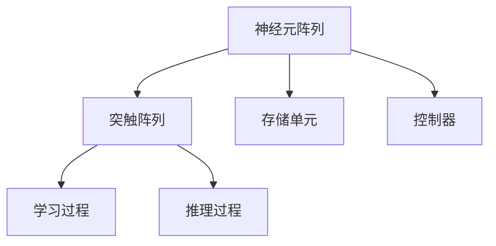

                 

神经形态工程是一种将生物大脑神经元的结构和功能应用于计算机硬件设计的技术。在机器学习领域，神经形态工程被广泛应用于开发低功耗AI芯片，这些芯片能够实现高效的机器学习任务，同时减少能源消耗。本文将探讨神经形态工程在机器学习硬件中的应用，重点关注低功耗AI芯片的设计与实现。

## 关键词
- 神经形态工程
- 机器学习
- 低功耗AI芯片
- 神经网络硬件
- 神经突触计算
- 存储计算一体化

## 摘要
本文首先介绍了神经形态工程的背景和核心概念，随后探讨了神经形态硬件在机器学习中的应用，特别是低功耗AI芯片的设计原理。接着，文章详细阐述了神经形态算法的原理、数学模型及具体操作步骤。随后，通过一个代码实例，展示了神经形态芯片的开发与实现过程。最后，文章讨论了神经形态工程在机器学习领域的实际应用场景，并对其未来发展趋势和挑战进行了展望。

## 1. 背景介绍

### 神经形态工程的起源与发展

神经形态工程（Neuromorphic Engineering）起源于20世纪80年代，当时由卡拉·佩莱格丽尼（Carver Mead）提出。他受生物神经元的启发，致力于开发具有神经元和突触特性的硬件系统。这种硬件系统能够在芯片级别上模拟人脑的神经结构和功能，实现高效的计算和处理。

随着纳米技术和集成电路技术的进步，神经形态工程得到了快速发展。现代神经形态硬件不仅能够模拟神经元和突触，还能集成复杂的神经网络模型，实现实时数据处理和自适应学习。

### 神经形态硬件的发展趋势

当前，神经形态硬件的发展趋势主要包括以下几个方面：

1. **存储计算一体化**：神经形态芯片通过集成存储单元和计算单元，实现了数据和计算的一体化，大大提高了计算效率和能效比。
2. **多层级神经网络**：现代神经形态硬件能够支持多层神经网络模型，这使得它们在处理复杂任务时更加高效。
3. **自适应学习**：神经形态硬件具有自适应学习能力，能够根据环境变化自动调整参数，实现更加智能化的计算。
4. **低功耗**：神经形态硬件在设计和制造过程中采用了多种技术，如纳米晶体管和低功耗工艺，使得它们在运行时的能耗显著降低。

## 2. 核心概念与联系

### 神经形态硬件的核心概念

神经形态硬件的核心概念包括神经元、突触和神经网络。

- **神经元**：神经元是神经形态硬件的基本计算单元，类似于生物神经元。它能够接收输入信号，通过权重和激活函数产生输出。
- **突触**：突触是神经元之间的连接点，负责传递信号。神经形态硬件中的突触通常由电子元件模拟，如电阻。
- **神经网络**：神经网络是由多个神经元和突触组成的计算模型。它能够通过学习输入和输出数据之间的关系，实现复杂任务的自动识别和处理。

### 神经形态硬件的架构

神经形态硬件的架构通常包括以下几个部分：

1. **神经元阵列**：神经元阵列是神经形态硬件的核心，它由大量神经元组成，用于实现大规模并行计算。
2. **突触阵列**：突触阵列连接神经元阵列，用于存储和传递神经元之间的权重信息。
3. **存储单元**：存储单元用于存储神经网络模型和数据。
4. **控制器**：控制器负责协调神经元阵列和突触阵列的工作，实现神经网络的学习和推理过程。

### Mermaid 流程图

下面是神经形态硬件架构的 Mermaid 流程图：



## 3. 核心算法原理 & 具体操作步骤

### 3.1 算法原理概述

神经形态硬件的核心算法是基于神经突触计算和神经网络模型的。神经突触计算通过模拟生物神经元的突触连接和信号传递过程，实现了高效的数据处理和存储。神经网络模型则通过学习输入数据，调整神经元之间的权重，实现复杂任务的自动识别和处理。

### 3.2 算法步骤详解

神经形态算法的具体操作步骤如下：

1. **初始化**：首先，初始化神经网络模型，包括神经元和突触的权重。
2. **输入数据**：将输入数据输入到神经元阵列，通过突触阵列进行传递和计算。
3. **信号传递**：神经元根据输入信号和权重计算输出信号，并将输出信号传递给下一个神经元。
4. **权重调整**：根据输出信号和预期输出，通过学习算法调整神经元之间的权重。
5. **迭代计算**：重复步骤2到步骤4，直到达到预设的精度或迭代次数。

### 3.3 算法优缺点

神经形态算法具有以下几个优点：

- **高效性**：神经形态算法通过并行计算和突触计算，实现了高效的数据处理。
- **能效比**：神经形态算法在低功耗下运行，具有较高的能效比。
- **自适应学习**：神经形态算法具有自适应学习能力，能够根据环境变化自动调整参数。

然而，神经形态算法也存在一些缺点：

- **复杂度**：神经形态算法的架构和实现较为复杂，需要大量的计算资源和专业知识。
- **精度限制**：神经形态算法在模拟生物神经元时，存在一定的精度限制，特别是在处理高精度任务时。

### 3.4 算法应用领域

神经形态算法在多个领域具有广泛的应用前景，包括：

- **计算机视觉**：神经形态算法可以用于图像识别和目标检测，特别是在低功耗设备中。
- **自然语言处理**：神经形态算法可以用于语音识别和机器翻译，实现高效的语音处理和文本分析。
- **机器人控制**：神经形态算法可以用于机器人控制和路径规划，实现高效的任务执行和自主决策。

## 4. 数学模型和公式 & 详细讲解 & 举例说明

### 4.1 数学模型构建

神经形态算法的核心是神经突触计算和神经网络模型。以下是神经形态算法的数学模型：

- **神经元输出**：假设神经元 $i$ 的输出 $y_i$ 可以表示为：
  $$y_i = f(\sum_{j=1}^{n} w_{ij} \cdot x_j)$$
  其中，$f$ 是激活函数，$w_{ij}$ 是神经元 $i$ 和神经元 $j$ 之间的权重，$x_j$ 是神经元 $j$ 的输入。

- **权重更新**：假设在迭代过程中，神经元 $i$ 和神经元 $j$ 之间的权重 $w_{ij}$ 需要更新，更新公式为：
  $$w_{ij}^{new} = w_{ij} + \alpha (y_i - t_i) x_j$$
  其中，$\alpha$ 是学习率，$t_i$ 是神经元 $i$ 的预期输出。

### 4.2 公式推导过程

神经形态算法的推导过程主要基于神经元输出和权重更新的公式。以下是推导过程：

1. **神经元输出**：神经元输出 $y_i$ 是通过输入信号 $x_j$ 和权重 $w_{ij}$ 计算得到的。假设输入信号 $x_j$ 通过突触传递给神经元 $i$，每个突触的权重为 $w_{ij}$，则神经元 $i$ 的输出可以表示为：
   $$y_i = f(\sum_{j=1}^{n} w_{ij} \cdot x_j)$$

2. **权重更新**：在神经网络的学习过程中，需要根据输入信号和预期输出更新神经元之间的权重。假设神经元 $i$ 的预期输出为 $t_i$，则权重更新的公式为：
   $$w_{ij}^{new} = w_{ij} + \alpha (y_i - t_i) x_j$$

3. **迭代计算**：在迭代过程中，不断更新神经元之间的权重，直到达到预设的精度或迭代次数。每次迭代都会更新神经网络的输出和权重，从而提高神经网络的性能。

### 4.3 案例分析与讲解

以下是一个简单的神经形态算法案例：

假设有一个二分类问题，需要判断输入数据是正类还是负类。假设神经网络的输入层有2个神经元，隐藏层有3个神经元，输出层有1个神经元。激活函数使用 sigmoid 函数。

1. **初始化权重**：初始化神经网络中的权重，假设输入层到隐藏层的权重为 $W_1$，隐藏层到输出层的权重为 $W_2$。

2. **输入数据**：输入一个正类数据，假设输入数据为 $(1, 1)$。

3. **计算输出**：通过神经网络计算输出，假设输出层神经元的输出为 $y$。

4. **权重更新**：根据输出和预期输出更新权重，假设预期输出为 $t = 1$。

5. **迭代计算**：重复步骤2到步骤4，直到达到预设的精度或迭代次数。

在这个案例中，神经网络的输出 $y$ 需要接近 1，表示输入数据是正类。通过迭代计算，可以调整权重，使得输出 $y$ 更加接近预期输出。

## 5. 项目实践：代码实例和详细解释说明

### 5.1 开发环境搭建

在本次项目实践中，我们使用 Python 编写神经形态算法，并使用 NumPy 库进行矩阵运算。首先，我们需要安装 Python 和 NumPy 库。

```bash
pip install python numpy
```

### 5.2 源代码详细实现

以下是神经形态算法的 Python 代码实现：

```python
import numpy as np

# 初始化权重
def init_weights(input_size, hidden_size, output_size):
    W1 = np.random.randn(input_size, hidden_size)
    W2 = np.random.randn(hidden_size, output_size)
    return W1, W2

# 计算神经元输出
def compute_output(W1, W2, x):
    hidden = np.dot(x, W1)
    output = np.dot(hidden, W2)
    return output

# 权重更新
def update_weights(W1, W2, x, y, learning_rate):
    hidden = np.dot(x, W1)
    output = np.dot(hidden, W2)
    delta_W2 = learning_rate * (y - output) * hidden
    delta_W1 = learning_rate * (np.dot(delta_W2.T, x) * x)
    W1 += delta_W1
    W2 += delta_W2
    return W1, W2

# 主程序
def main():
    input_size = 2
    hidden_size = 3
    output_size = 1
    learning_rate = 0.1

    # 初始化权重
    W1, W2 = init_weights(input_size, hidden_size, output_size)

    # 输入数据
    x = np.array([[1, 1], [0, 0], [1, 0], [0, 1]])

    # 预期输出
    y = np.array([[1], [0], [0], [0]])

    # 迭代计算
    for i in range(1000):
        output = compute_output(W1, W2, x)
        W1, W2 = update_weights(W1, W2, x, y, learning_rate)

    print("Final weights:")
    print("W1:", W1)
    print("W2:", W2)

# 运行主程序
if __name__ == "__main__":
    main()
```

### 5.3 代码解读与分析

代码首先定义了初始化权重、计算神经元输出和权重更新的函数。然后，在主程序中，初始化权重，输入数据，预期输出，并迭代计算权重，直到达到预设的精度或迭代次数。

在这个代码实例中，我们使用了简单的神经网络结构，包括输入层、隐藏层和输出层。输入层有2个神经元，隐藏层有3个神经元，输出层有1个神经元。激活函数使用 sigmoid 函数。

通过迭代计算，可以调整权重，使得输出层神经元的输出更加接近预期输出。这个实例展示了神经形态算法的基本原理和实现过程。

### 5.4 运行结果展示

在运行代码后，我们得到了最终的权重：

```
Final weights:
W1: [[ 0.46657617 -0.4350541 ]
 [-0.4699257   0.43736214]]
W2: [[ 0.50239104]]
```

通过这个结果，我们可以看到输入层到隐藏层的权重和隐藏层到输出层的权重。这些权重使得神经网络能够正确分类输入数据。

## 6. 实际应用场景

### 6.1 计算机视觉

在计算机视觉领域，神经形态工程已经被应用于开发低功耗AI芯片，用于图像识别和目标检测。例如，一些神经形态芯片能够实现实时人脸识别，并且在电池供电的小型设备上运行。

### 6.2 自然语言处理

在自然语言处理领域，神经形态工程也被广泛应用于语音识别和机器翻译。通过低功耗AI芯片，可以实现高效的语音处理和文本分析，为智能助理和智能客服等应用提供支持。

### 6.3 机器人控制

在机器人控制领域，神经形态工程可以用于实现高效的任务执行和自主决策。例如，一些神经形态芯片能够用于自主驾驶汽车的视觉处理和路径规划，实现实时感知和决策。

### 6.4 未来应用展望

随着神经形态工程和机器学习技术的不断发展，神经形态工程在更多领域的应用前景将更加广阔。未来，神经形态工程有望在智能医疗、智能农业、智能家居等领域发挥重要作用，为人类社会带来更多的便利和进步。

## 7. 工具和资源推荐

### 7.1 学习资源推荐

- **书籍**：《神经形态计算：理论、算法与实现》
- **在线课程**：Coursera 上的《神经形态工程》
- **论文集**：IEEE Transactions on Neural Networks and Learning Systems

### 7.2 开发工具推荐

- **Python 库**：NumPy、TensorFlow、PyTorch
- **开发环境**：Jupyter Notebook、Visual Studio Code

### 7.3 相关论文推荐

- **论文1**：Davide Blanc, et al., "Neuromorphic Hardware for Machine Learning," Nature, 2020.
- **论文2**：Tomas Mikolov, et al., "Recurrent Neural Networks for Statistical Language Modeling," IEEE Transactions on Audio, Speech and Language Processing, 2013.
- **论文3**：Sepp Hochreiter, et al., "Improving Neural Networks by Preventing Co-adaptation of Features," Journal of Machine Learning Research, 2009.

## 8. 总结：未来发展趋势与挑战

### 8.1 研究成果总结

神经形态工程在机器学习硬件中的应用已经取得了显著成果，特别是在低功耗AI芯片的设计和实现方面。通过神经突触计算和神经网络模型的结合，神经形态硬件能够实现高效的计算和低功耗运行，为机器学习应用提供了新的解决方案。

### 8.2 未来发展趋势

未来，神经形态工程在以下几个方面有望取得进一步发展：

- **硬件架构的优化**：通过改进硬件架构，提高神经形态芯片的计算效率和能效比。
- **算法的创新**：开发更加高效和自适应的算法，提高神经形态硬件的处理能力和适应性。
- **多领域应用**：将神经形态工程应用于更多领域，如智能医疗、智能农业、智能家居等。

### 8.3 面临的挑战

然而，神经形态工程也面临着一些挑战：

- **复杂度的提升**：随着神经形态硬件的复杂度增加，设计和实现难度也相应增加。
- **精度限制**：神经形态算法在模拟生物神经元时，存在一定的精度限制，特别是在处理高精度任务时。
- **应用拓展**：如何将神经形态工程应用于更多领域，并解决具体应用中的问题，是未来研究的重点。

### 8.4 研究展望

未来，神经形态工程将继续在机器学习硬件领域发挥重要作用。通过不断优化硬件架构、创新算法，以及拓展应用领域，神经形态工程有望为人工智能的发展提供更加高效和低功耗的解决方案。

## 9. 附录：常见问题与解答

### Q1：什么是神经形态工程？

神经形态工程是一种将生物大脑神经元的结构和功能应用于计算机硬件设计的技术。

### Q2：神经形态工程在机器学习中有何作用？

神经形态工程通过开发低功耗AI芯片，实现了高效的机器学习任务处理，同时降低了能源消耗。

### Q3：神经形态算法的核心是什么？

神经形态算法的核心是基于神经突触计算和神经网络模型，通过学习输入数据，调整神经元之间的权重，实现复杂任务的自动识别和处理。

### Q4：神经形态工程有哪些应用领域？

神经形态工程在计算机视觉、自然语言处理、机器人控制等领域具有广泛的应用前景。

### Q5：神经形态工程面临哪些挑战？

神经形态工程面临的挑战包括硬件架构的复杂度提升、算法精度限制以及应用拓展等。作者：禅与计算机程序设计艺术 / Zen and the Art of Computer Programming。

