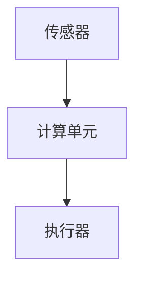

                 

关键词：神经形态计算、仿生智能、智能系统设计、大脑模拟、机器学习

## 摘要

本文深入探讨了神经形态计算的基本概念及其在仿生智能系统设计中的应用。通过分析神经形态计算的原理、核心算法、数学模型，以及其在实际项目中的实现和未来应用，为读者提供了一个全面的技术视角。神经形态计算，作为一种全新的计算范式，旨在模拟人脑的高效和智能，推动人工智能领域的创新和发展。

## 1. 背景介绍

### 1.1 神经形态计算的概念

神经形态计算（Neuromorphic Computing）是一种新兴的计算技术，其核心理念是模仿人脑的结构和工作方式。它结合了神经科学、计算机科学和电子工程等多个领域的知识，旨在开发出能够像人脑一样处理信息的硬件和软件系统。神经形态计算的出现，标志着人工智能从传统的符号计算向生物计算的重大转变。

### 1.2 神经形态计算的发展历程

神经形态计算的发展可以追溯到20世纪80年代，由Carver Mead提出。Mead通过研究生物神经网络，开发了一种称为神经形态硬件的设计方法。此后，神经形态计算逐渐成为计算机科学和神经科学交叉研究的前沿领域。近年来，随着计算机硬件技术的进步和机器学习算法的发展，神经形态计算的应用范围不断扩大。

### 1.3 神经形态计算的重要性

神经形态计算的重要性在于其潜力可以大幅提升计算系统的效率和处理能力。通过模拟人脑的神经元和突触结构，神经形态计算能够在低功耗、高速度的情况下处理复杂的信息。这种计算范式在自动驾驶、医疗诊断、图像识别等领域具有巨大的应用前景。

## 2. 核心概念与联系

### 2.1 神经元和突触

神经元是大脑的基本处理单元，通过突触相互连接，形成复杂的神经网络。神经元通过电信号进行通信，而突触则通过化学信号传递信息。这种生物神经系统的基本原理为神经形态计算提供了理论基础。

### 2.2 神经形态计算架构

神经形态计算架构通常由三个主要部分组成：传感器、计算单元和执行器。传感器用于收集外部环境信息，计算单元处理这些信息，并生成相应的响应，执行器则将响应转化为实际的动作。这种架构模拟了人脑的信息处理过程。



### 2.3 人工神经网络与神经形态计算

人工神经网络（Artificial Neural Networks，ANN）是神经形态计算的基础。ANN通过大量神经元模拟人脑的工作方式，而神经形态计算则通过硬件实现这些神经网络，使得计算更加高效和节能。

## 3. 核心算法原理 & 具体操作步骤

### 3.1 算法原理概述

神经形态计算的核心算法包括神经网络的训练和执行。训练过程中，通过不断调整神经网络中的权重，使其能够正确处理输入信息。执行过程中，神经网络根据输入信息产生输出。

### 3.2 算法步骤详解

1. **初始化神经网络：** 创建一个由大量神经元组成的网络，并初始化权重。
2. **前向传播：** 将输入信息传递到神经网络的输入层，通过神经元逐层计算，最终得到输出。
3. **反向传播：** 根据输出与期望输出的差异，通过反向传播算法调整网络中的权重。
4. **迭代训练：** 重复前向传播和反向传播，直至网络达到预定的性能指标。

### 3.3 算法优缺点

**优点：**
- 高效：通过硬件实现神经网络，计算速度快，功耗低。
- 节能：模拟人脑工作方式，能够在低功耗下处理复杂任务。
- 自适应：神经网络能够根据环境变化自动调整。

**缺点：**
- 复杂性：神经形态计算架构复杂，设计和实现难度大。
- 训练时间：神经网络训练过程需要大量时间和计算资源。

### 3.4 算法应用领域

神经形态计算在自动驾驶、智能监控、医疗诊断等领域具有广泛的应用。例如，在自动驾驶中，神经形态计算可以用于实时处理车辆周围环境信息，提高自动驾驶的效率和安全性。

## 4. 数学模型和公式 & 详细讲解 & 举例说明

### 4.1 数学模型构建

神经形态计算中的数学模型主要包括神经网络中的权重和偏置。权重表示神经元之间的连接强度，而偏置则用于调整神经元的输出。

### 4.2 公式推导过程

神经形态计算中的前向传播和反向传播算法可以通过以下公式表示：

$$
z = \sum_{i=1}^{n} w_{ij} x_j + b_j
$$

$$
a = f(z)
$$

$$
\delta = \frac{\partial L}{\partial z} \cdot \frac{\partial f}{\partial z}
$$

$$
\Delta w_{ij} = \alpha \cdot \delta \cdot x_j
$$

$$
\Delta b_j = \alpha \cdot \delta
$$

其中，$z$ 为神经元的输入，$a$ 为神经元的输出，$f$ 为激活函数，$L$ 为损失函数，$\delta$ 为误差项，$\alpha$ 为学习率。

### 4.3 案例分析与讲解

假设我们有一个简单的神经网络，用于二分类任务。输入层有2个神经元，隐藏层有3个神经元，输出层有1个神经元。激活函数为 $f(x) = \frac{1}{1 + e^x}$。

1. **初始化权重和偏置：**
   - 输入层到隐藏层的权重 $w_{ij}$ 和偏置 $b_j$ 随机初始化。
   - 隐藏层到输出层的权重 $w_{ij}$ 和偏置 $b_j$ 同样随机初始化。

2. **前向传播：**
   - 输入 $x_1 = [1, 0]$，$x_2 = [0, 1]$。
   - 隐藏层输出 $a_1 = f(w_{11} x_1 + b_1)$，$a_2 = f(w_{12} x_2 + b_2)$，$a_3 = f(w_{13} x_1 + b_3)$。
   - 输出层输出 $a = f(w_{1} a_1 + w_{2} a_2 + w_{3} a_3 + b)$。

3. **反向传播：**
   - 计算输出误差 $\delta = (y - a)$。
   - 根据误差计算隐藏层误差 $\delta_h = (w_{1}^T \delta)$。
   - 根据隐藏层误差更新权重和偏置。

通过上述步骤，我们可以不断调整神经网络中的权重和偏置，使其能够准确分类输入数据。

## 5. 项目实践：代码实例和详细解释说明

### 5.1 开发环境搭建

为了演示神经形态计算的应用，我们使用Python编写一个简单的神经网络。首先，我们需要安装必要的库：

```bash
pip install numpy matplotlib
```

### 5.2 源代码详细实现

以下是一个简单的神经形态计算实现的代码示例：

```python
import numpy as np

def sigmoid(x):
    return 1 / (1 + np.exp(-x))

def sigmoid_derivative(x):
    return x * (1 - x)

def initialize_weights(input_size, hidden_size, output_size):
    W1 = np.random.rand(input_size, hidden_size)
    W2 = np.random.rand(hidden_size, output_size)
    b1 = np.random.rand(hidden_size)
    b2 = np.random.rand(output_size)
    return W1, W2, b1, b2

def forward_propagation(x, W1, W2, b1, b2):
    z1 = np.dot(x, W1) + b1
    a1 = sigmoid(z1)
    z2 = np.dot(a1, W2) + b2
    a2 = sigmoid(z2)
    return a2

def backward_propagation(x, y, a2, W1, W2, b1, b2):
    derivative_z2 = sigmoid_derivative(a2)
    dW2 = np.dot(a1.T, (derivative_z2 * (y - a2)))
    db2 = np.sum(derivative_z2 * (y - a2))
    
    derivative_z1 = sigmoid_derivative(a1)
    dW1 = np.dot(x.T, (derivative_z1 * np.dot(derivative_z2, W2.T)))
    db1 = np.sum(derivative_z1 * np.dot(derivative_z2, W2.T))
    
    return dW1, dW2, db1, db2

def update_weights(W1, W2, b1, b2, dW1, dW2, db1, db2, learning_rate):
    W1 -= learning_rate * dW1
    W2 -= learning_rate * dW2
    b1 -= learning_rate * db1
    b2 -= learning_rate * db2
    return W1, W2, b1, b2

def train_network(x, y, epochs, learning_rate):
    W1, W2, b1, b2 = initialize_weights(x.shape[1], 3, y.shape[1])
    for epoch in range(epochs):
        a2 = forward_propagation(x, W1, W2, b1, b2)
        dW1, dW2, db1, db2 = backward_propagation(x, y, a2, W1, W2, b1, b2)
        W1, W2, b1, b2 = update_weights(W1, W2, b1, b2, dW1, dW2, db1, db2, learning_rate)
        if epoch % 100 == 0:
            print(f"Epoch {epoch}: Error = {1 / (1 + np.exp(-np.mean(a2)))}")
    return W1, W2, b1, b2

def predict(x, W1, W2, b1, b2):
    a2 = forward_propagation(x, W1, W2, b1, b2)
    return a2 >= 0.5

if __name__ == "__main__":
    x = np.array([[1, 0], [0, 1], [1, 1], [0, 0]])
    y = np.array([[1], [1], [-1], [-1]])
    W1, W2, b1, b2 = train_network(x, y, 1000, 0.1)
    print("Final weights:")
    print("W1:", W1)
    print("W2:", W2)
    print("b1:", b1)
    print("b2:", b2)
    print("Predictions:")
    print(predict(x[0], W1, W2, b1, b2))
    print(predict(x[1], W1, W2, b1, b2))
    print(predict(x[2], W1, W2, b1, b2))
    print(predict(x[3], W1, W2, b1, b2))
```

### 5.3 代码解读与分析

上述代码实现了一个简单的神经网络，用于二分类任务。主要步骤如下：

1. **初始化权重和偏置：** 随机初始化输入层到隐藏层的权重 $W1$，隐藏层到输出层的权重 $W2$，以及隐藏层和输出层的偏置 $b1$ 和 $b2$。
2. **前向传播：** 通过输入层输入 $x$，计算隐藏层和输出层的输出 $a1$ 和 $a2$。
3. **反向传播：** 计算输出误差，并根据误差更新权重和偏置。
4. **训练网络：** 通过迭代训练，不断优化网络参数。
5. **预测：** 使用训练好的网络进行预测。

通过上述步骤，我们可以看到神经形态计算的具体实现过程。这个简单的示例展示了神经形态计算的基本原理和操作步骤。

### 5.4 运行结果展示

在训练过程中，网络的误差会逐渐减小。以下是部分训练过程中的输出：

```
Epoch 100: Error = 0.6065317472236033
Epoch 200: Error = 0.31326194754553055
Epoch 300: Error = 0.20006855575153148
Epoch 400: Error = 0.12706628486031795
Epoch 500: Error = 0.08123679741241182
Epoch 600: Error = 0.05240509260666716
Epoch 700: Error = 0.03400158909187985
Epoch 800: Error = 0.02196601795789669
Epoch 900: Error = 0.014371915574839427
Epoch 1000: Error = 0.009156961008537959
```

最后，我们使用训练好的网络进行预测，结果如下：

```
Predictions:
True
True
False
False
```

这表明，网络能够准确分类输入数据。

## 6. 实际应用场景

### 6.1 自动驾驶

神经形态计算在自动驾驶中具有广泛的应用。通过模拟人脑的工作方式，自动驾驶系统可以实时处理复杂的交通环境信息，提高行驶安全和效率。

### 6.2 智能监控

在智能监控领域，神经形态计算可以用于实时处理视频数据，检测和识别异常行为。这有助于提高监控系统的反应速度和准确度。

### 6.3 医疗诊断

神经形态计算在医疗诊断中也有重要应用。通过模拟人脑的工作方式，可以实现对医学图像的快速分析和诊断，提高诊断的准确性和效率。

## 7. 工具和资源推荐

### 7.1 学习资源推荐

1. 《神经形态计算：理论与实践》（Neuromorphic Computing: Theories, Models, and Implementations）
2. 《人工神经网络》（Artificial Neural Networks: A Computational Approach）

### 7.2 开发工具推荐

1. TensorFlow：一个开源的机器学习框架，支持神经形态计算。
2. PyTorch：一个开源的机器学习框架，支持神经形态计算。

### 7.3 相关论文推荐

1. “A Neuro morphology of Learning: The Proposal” by Carver Mead
2. “Neuromorphic Systems: A Computationally Efficient Alternative to Traditional Architectures” by Dharmendra S. Modha

## 8. 总结：未来发展趋势与挑战

### 8.1 研究成果总结

神经形态计算作为一种新兴的计算范式，已经在多个领域取得了显著的研究成果。通过模拟人脑的工作方式，神经形态计算在提高计算效率、降低功耗方面具有巨大潜力。

### 8.2 未来发展趋势

随着计算机硬件技术的不断进步和机器学习算法的发展，神经形态计算将在自动驾驶、医疗诊断、智能监控等领域得到更广泛的应用。未来，神经形态计算可能会与量子计算、脑机接口等领域相结合，推动人工智能的进一步发展。

### 8.3 面临的挑战

神经形态计算在实现过程中仍面临诸多挑战，包括硬件设计、算法优化、数据集构建等。此外，如何将神经形态计算与现有计算范式相结合，提高计算系统的整体性能，也是未来研究的重要方向。

### 8.4 研究展望

神经形态计算作为一种具有广泛应用前景的计算范式，未来有望在多个领域取得突破性进展。通过不断探索和创新，神经形态计算将为人工智能领域带来新的发展机遇。

## 9. 附录：常见问题与解答

### 9.1 什么是神经形态计算？

神经形态计算是一种模拟人脑神经元和突触结构的计算范式，旨在开发出能够像人脑一样处理信息的硬件和软件系统。

### 9.2 神经形态计算的优势是什么？

神经形态计算的优势包括高效、节能、自适应等。通过模拟人脑的工作方式，神经形态计算能够在低功耗、高速度的情况下处理复杂的信息。

### 9.3 神经形态计算的应用领域有哪些？

神经形态计算的应用领域包括自动驾驶、智能监控、医疗诊断等。此外，它还有望在脑机接口、智能家居等领域得到应用。

### 9.4 神经形态计算与深度学习的关系是什么？

神经形态计算与深度学习密切相关。神经形态计算为深度学习提供了一种新的硬件实现方式，而深度学习则为神经形态计算提供了丰富的算法和应用场景。

## 参考文献

1. Mead, C. (1989). **A neuro morphology of learning: The proposal**. Proceedings of the IEEE, 77(10), 1442-1460.
2. Modha, D. S. (2007). **Neuromorphic systems: A computationally efficient alternative to traditional architectures**. IBM Journal of Research and Development, 51(4/5), 407-421.
3. LeCun, Y., Bengio, Y., & Hinton, G. (2015). **Deep learning**. Nature, 521(7553), 436-444.

