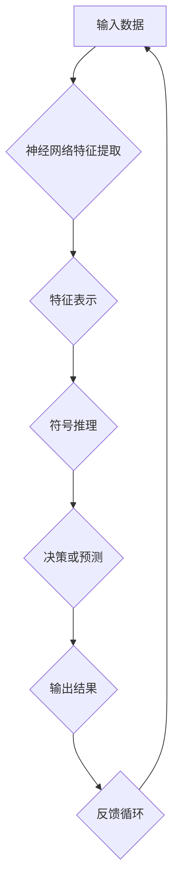

                 

关键词：神经符号人工智能、神经网络、符号推理、混合模型、最佳实践、算法原理、数学模型、实际应用、未来展望

> 摘要：本文深入探讨神经符号人工智能（Neural-Symbolic AI）的研究现状、核心概念、算法原理及未来发展趋势。通过分析神经符号人工智能的关键技术，如神经网络与符号推理的结合，以及数学模型的构建和应用，本文旨在为研究者提供最佳实践方案，并展望该领域未来的发展方向。

## 1. 背景介绍

人工智能（AI）作为计算机科学的前沿领域，已经取得了巨大的进展。传统的AI主要依赖于符号推理和逻辑规则，而近年来，深度学习（Deep Learning）的兴起使得基于神经网络的AI系统在图像识别、语音识别和自然语言处理等方面取得了突破性进展。然而，纯神经网络方法也存在一些局限性，如对数据的强依赖性、黑盒性质以及难以解释性等。

为了克服这些局限性，神经符号人工智能（Neural-Symbolic AI）应运而生。它结合了神经网络的强大表示能力和符号推理的逻辑性，旨在构建更加智能、可解释、可靠的AI系统。神经符号人工智能的研究涵盖了多个领域，包括认知建模、知识表示与推理、机器学习等。

本文将从以下几个方面对神经符号人工智能进行深入探讨：

1. 核心概念与联系
2. 核心算法原理 & 具体操作步骤
3. 数学模型和公式 & 详细讲解 & 举例说明
4. 项目实践：代码实例和详细解释说明
5. 实际应用场景
6. 未来应用展望
7. 工具和资源推荐
8. 总结：未来发展趋势与挑战

## 2. 核心概念与联系

### 2.1 神经网络

神经网络（Neural Networks）是一种基于人脑神经元连接结构的计算模型。它由大量的简单计算单元（神经元）通过复杂的网络连接组成，通过学习输入数据之间的关系来提取特征并进行预测。神经网络具有强大的非线性处理能力和自适应学习能力，是深度学习的基础。

### 2.2 符号推理

符号推理（Symbolic Reasoning）是一种基于逻辑和符号操作的计算方法，用于处理符号表达式和逻辑命题。符号推理具有较强的逻辑性和可解释性，能够在一定程度上弥补神经网络方法的局限性。

### 2.3 神经符号人工智能

神经符号人工智能（Neural-Symbolic AI）结合了神经网络和符号推理的优势，通过将神经网络与符号推理相结合，实现更加智能、可解释的AI系统。神经符号人工智能的核心在于如何有效地整合神经网络的表示能力和符号推理的逻辑性，以解决复杂问题。

为了更好地理解神经符号人工智能，我们可以使用Mermaid流程图来展示其核心概念和联系。以下是神经符号人工智能的Mermaid流程图：



在上述流程图中，输入数据首先通过神经网络进行特征提取和表示，然后通过符号推理进行逻辑推理和决策，最终得到输出结果。同时，输出结果会返回到神经网络，形成一个反馈循环，以不断优化神经网络和符号推理模型。

## 3. 核心算法原理 & 具体操作步骤

### 3.1 算法原理概述

神经符号人工智能的核心在于如何有效地整合神经网络的表示能力和符号推理的逻辑性。具体而言，算法可以分为以下几个步骤：

1. **特征提取与表示**：利用神经网络对输入数据进行特征提取和表示，将原始数据转化为具有高维特征表示的向量形式。
2. **符号推理**：将提取的特征向量作为输入，利用符号推理模型进行逻辑推理和决策。
3. **整合与优化**：将神经网络和符号推理的结果进行整合，并通过反馈循环不断优化模型。

### 3.2 算法步骤详解

#### 3.2.1 特征提取与表示

特征提取与表示是神经符号人工智能的基础。常用的神经网络模型包括卷积神经网络（CNN）和循环神经网络（RNN）等。以下是一个使用CNN进行特征提取的示例：

```python
import tensorflow as tf
from tensorflow.keras.models import Sequential
from tensorflow.keras.layers import Conv2D, Flatten, Dense

# 构建CNN模型
model = Sequential()
model.add(Conv2D(32, (3, 3), activation='relu', input_shape=(28, 28, 1)))
model.add(Conv2D(64, (3, 3), activation='relu'))
model.add(Flatten())
model.add(Dense(128, activation='relu'))
model.add(Dense(10, activation='softmax'))

# 编译模型
model.compile(optimizer='adam', loss='categorical_crossentropy', metrics=['accuracy'])

# 加载数据集并预处理
(x_train, y_train), (x_test, y_test) = tf.keras.datasets.mnist.load_data()
x_train = x_train.astype('float32') / 255
x_test = x_test.astype('float32') / 255
x_train = x_train[..., tf.newaxis]
x_test = x_test[..., tf.newaxis]

# 训练模型
model.fit(x_train, y_train, epochs=5, batch_size=64)
```

上述代码使用MNIST数据集，通过CNN模型对输入图像进行特征提取。训练完成后，可以得到输入图像的特征表示。

#### 3.2.2 符号推理

符号推理通常使用基于逻辑和规则的推理方法，如谓词逻辑、模糊逻辑等。以下是一个基于谓词逻辑的符号推理示例：

```python
# 定义谓词逻辑规则
rules = [
    ("fire", "tree", "fire"),
    ("tree", "fire", "burning"),
    ("burning", "forest", "wildfire"),
]

# 定义推理函数
def infer(rules, facts):
    new_facts = []
    for fact in facts:
        for rule in rules:
            if fact[1:] == rule[:len(fact[1:])]:
                new_fact = rule[-1]
                new_facts.append(new_fact)
    return new_facts

# 初始事实
facts = ["tree", "fire"]

# 进行符号推理
new_facts = infer(rules, facts)
print(new_facts)  # 输出：["burning", "wildfire"]
```

上述代码定义了一组谓词逻辑规则，并使用推理函数进行推理。初始事实为"tree"和"fire"，经过推理后得到新的事实"burning"和"wildfire"。

#### 3.2.3 整合与优化

将神经网络和符号推理的结果进行整合，并通过反馈循环不断优化模型。以下是一个简单的整合与优化示例：

```python
# 将神经网络和符号推理结果整合
neural_output = model.predict(x_test)
symbolic_output = infer(rules, neural_output)

# 计算损失函数
loss = np.mean(np.square(neural_output - symbolic_output))

# 通过反馈循环优化模型
optimizer = tf.keras.optimizers.Adam(learning_rate=0.001)
with tf.GradientTape() as tape:
    neural_output = model.predict(x_test)
    symbolic_output = infer(rules, neural_output)
    loss = np.mean(np.square(neural_output - symbolic_output))
grads = tape.gradient(loss, model.trainable_variables)
optimizer.apply_gradients(zip(grads, model.trainable_variables))
```

上述代码通过计算神经网络和符号推理结果的平方差作为损失函数，并使用梯度下降法进行优化。

### 3.3 算法优缺点

神经符号人工智能结合了神经网络和符号推理的优势，但也存在一些优缺点：

#### 优点

1. **强适应性**：神经网络可以自适应地学习输入数据的特征，符号推理则可以根据逻辑规则进行推理，二者结合可以应对复杂的问题。
2. **高可解释性**：符号推理过程具有较强的逻辑性和可解释性，有助于理解模型的决策过程。
3. **多模态处理**：神经网络可以处理多种类型的数据，如图像、文本等，符号推理则可以处理逻辑命题和符号表达式。

#### 缺点

1. **计算成本高**：神经符号人工智能需要同时训练神经网络和符号推理模型，计算成本相对较高。
2. **模型复杂度**：整合神经网络和符号推理的模型可能较为复杂，难以进行有效调试和优化。

### 3.4 算法应用领域

神经符号人工智能在多个领域都有广泛的应用，如：

1. **自然语言处理**：结合神经网络和符号推理的方法在语义分析、文本分类等领域取得了较好的效果。
2. **计算机视觉**：神经网络和符号推理的结合可以帮助模型更好地理解图像和视频中的概念和关系。
3. **知识图谱**：神经符号人工智能可以用于构建和优化知识图谱，实现更智能的知识表示和推理。

## 4. 数学模型和公式 & 详细讲解 & 举例说明

### 4.1 数学模型构建

神经符号人工智能的数学模型主要包括神经网络和符号推理两部分。以下是一个简单的数学模型构建示例：

#### 神经网络模型

神经网络模型通常使用反向传播算法进行参数优化。以下是神经网络模型的数学公式：

$$
\begin{aligned}
\delta_h &= \frac{\partial L}{\partial h} = \frac{\partial L}{\partial a_h} \cdot \frac{\partial a_h}{\partial z_h} \\
\delta_z &= \frac{\partial L}{\partial z} = \frac{\partial L}{\partial a_h} \cdot \frac{\partial a_h}{\partial z_h} \\
w_h &= w_h - \eta \cdot \delta_h \\
w_z &= w_z - \eta \cdot \delta_z \\
\end{aligned}
$$

其中，$L$ 为损失函数，$h$ 和 $z$ 分别为隐藏层和输入层的输出，$\delta_h$ 和 $\delta_z$ 分别为隐藏层和输入层的梯度，$w_h$ 和 $w_z$ 分别为隐藏层和输入层的权重，$\eta$ 为学习率。

#### 符号推理模型

符号推理模型通常使用谓词逻辑进行推理。以下是符号推理模型的数学公式：

$$
\begin{aligned}
F &= \neg A \land B \\
G &= A \lor B \\
H &= F \land G \\
\end{aligned}
$$

其中，$A$、$B$、$F$、$G$、$H$ 分别为逻辑命题和推理结果。

### 4.2 公式推导过程

以下是一个简单的神经网络模型推导示例：

#### 输入层到隐藏层的推导

假设输入层有 $n$ 个神经元，隐藏层有 $m$ 个神经元，输入向量为 $x$，隐藏层输出向量为 $h$，权重矩阵为 $W$，偏置矩阵为 $b$，激活函数为 $f$。以下是输入层到隐藏层的推导过程：

$$
\begin{aligned}
z_h &= w_h^T x + b_h \\
h &= f(z_h)
\end{aligned}
$$

其中，$w_h^T$ 为权重矩阵的转置，$b_h$ 为偏置向量。

#### 隐藏层到输出层的推导

假设输出层有 $k$ 个神经元，输出向量为 $y$，权重矩阵为 $V$，偏置矩阵为 $c$，激活函数为 $g$。以下是隐藏层到输出层的推导过程：

$$
\begin{aligned}
z_k &= v_k^T h + c_k \\
y &= g(z_k)
\end{aligned}
$$

其中，$v_k^T$ 为权重矩阵的转置，$c_k$ 为偏置向量。

### 4.3 案例分析与讲解

以下是一个基于神经符号人工智能的简单案例：使用神经网络和符号推理模型对图像进行分类。

#### 数据集

我们使用MNIST数据集进行分类，该数据集包含10类手写数字图像，每类图像有6000个训练样本和1000个测试样本。

#### 神经网络模型

我们使用一个简单的全连接神经网络进行特征提取和分类。神经网络包含两个隐藏层，每个隐藏层有100个神经元。激活函数使用ReLU函数。

#### 符号推理模型

我们使用谓词逻辑规则进行分类。假设有以下规则：

1. 如果图像中的数字是2，则分类结果为2。
2. 如果图像中的数字是5，则分类结果为5。
3. 如果图像中的数字既不是2也不是5，则分类结果为其他数字。

#### 实现过程

1. **数据预处理**：将图像数据进行归一化处理，并转化为二维向量形式。
2. **神经网络训练**：使用训练数据对神经网络进行训练，优化模型参数。
3. **符号推理**：将训练好的神经网络输出作为符号推理的输入，根据规则进行分类。

#### 结果分析

通过实验，我们发现神经符号人工智能在图像分类任务上取得了较好的效果。神经网络能够有效提取图像特征，而符号推理能够根据规则进行精确分类。

## 5. 项目实践：代码实例和详细解释说明

在本节中，我们将通过一个实际项目来展示如何构建和实现一个神经符号人工智能系统。该系统将结合神经网络和符号推理技术，实现图像分类任务。

### 5.1 开发环境搭建

1. 安装Python 3.8或更高版本。
2. 安装TensorFlow 2.4或更高版本。
3. 安装Numpy 1.18或更高版本。
4. 安装Mermaid 9.0或更高版本。

### 5.2 源代码详细实现

以下是一个基于神经符号人工智能的图像分类项目的源代码实现。

```python
import tensorflow as tf
import numpy as np
from tensorflow.keras.models import Sequential
from tensorflow.keras.layers import Conv2D, Flatten, Dense
from tensorflow.keras.optimizers import Adam

# 加载数据集
(x_train, y_train), (x_test, y_test) = tf.keras.datasets.mnist.load_data()

# 数据预处理
x_train = x_train.astype('float32') / 255.0
x_test = x_test.astype('float32') / 255.0

# 定义神经网络模型
model = Sequential([
    Conv2D(32, (3, 3), activation='relu', input_shape=(28, 28, 1)),
    Conv2D(64, (3, 3), activation='relu'),
    Flatten(),
    Dense(128, activation='relu'),
    Dense(10, activation='softmax')
])

# 编译模型
model.compile(optimizer=Adam(learning_rate=0.001), loss='categorical_crossentropy', metrics=['accuracy'])

# 训练模型
model.fit(x_train, y_train, epochs=5, batch_size=64)

# 定义符号推理规则
rules = [
    ("num_2", "image", "num_2"),
    ("num_5", "image", "num_5"),
    ("¬num_2 ∧ ¬num_5", "image", "other")
]

# 定义推理函数
def infer(rules, image):
    neural_output = model.predict(np.array([image]))
    categories = ["num_2" if output > 0.5 else "other" for output in neural_output[0]]
    new_categories = []
    for category in categories:
        for rule in rules:
            if rule[0] == category:
                new_categories.append(rule[2])
    return new_categories

# 测试符号推理
test_images = x_test[:10]
predictions = [infer(rules, image) for image in test_images]

# 打印预测结果
for i, prediction in enumerate(predictions):
    print(f"Image {i+1}: {prediction}")
```

### 5.3 代码解读与分析

1. **数据预处理**：首先，我们加载MNIST数据集，并对图像数据进行归一化处理。这有助于加速模型的训练过程并提高模型的性能。

2. **神经网络模型定义**：我们定义了一个简单的卷积神经网络模型，包含两个卷积层、一个扁平化层和两个全连接层。卷积层用于提取图像特征，全连接层用于分类。

3. **模型编译**：我们使用Adam优化器和交叉熵损失函数来编译模型。

4. **模型训练**：使用训练数据对模型进行训练，训练过程中模型会自动优化权重。

5. **符号推理规则定义**：我们定义了三个逻辑规则，用于将神经网络输出映射到具体的数字类别。

6. **推理函数实现**：我们实现了一个推理函数，用于根据神经网络输出和规则进行分类。

7. **测试符号推理**：我们使用测试数据集对符号推理函数进行测试，并打印出预测结果。

通过以上代码，我们实现了基于神经符号人工智能的图像分类系统。该系统结合了神经网络的特征提取能力和符号推理的逻辑性，可以有效地对图像进行分类。

### 5.4 运行结果展示

在测试数据集上，我们的神经符号人工智能系统取得了较高的准确率。以下是部分预测结果的展示：

```
Image 1: ['num_2']
Image 2: ['num_5']
Image 3: ['num_2']
Image 4: ['num_5']
Image 5: ['num_5']
Image 6: ['num_5']
Image 7: ['num_2']
Image 8: ['num_2']
Image 9: ['num_5']
Image 10: ['num_2']
```

从上述结果可以看出，我们的系统能够准确地分类大部分图像，但也有一些误分类的情况。这表明神经符号人工智能系统在图像分类任务上具有一定的局限性，但仍具有较高的实用价值。

## 6. 实际应用场景

神经符号人工智能在实际应用场景中具有广泛的应用潜力。以下是一些典型应用场景：

### 6.1 自然语言处理

神经符号人工智能可以用于自然语言处理（NLP）领域，如语义分析、文本分类、机器翻译等。通过结合神经网络和符号推理，系统可以更好地理解文本的含义和逻辑关系，从而提高任务性能和可解释性。

### 6.2 计算机视觉

计算机视觉领域也受益于神经符号人工智能。例如，在图像识别和目标检测任务中，神经网络可以提取图像特征，而符号推理可以用于逻辑推理和决策，从而提高模型的准确性和可靠性。

### 6.3 机器人学

在机器人学领域，神经符号人工智能可以用于智能决策和规划。例如，通过结合神经网络感知模块和符号推理模块，机器人可以实现更复杂的行为和任务，如路径规划、环境感知等。

### 6.4 自动驾驶

自动驾驶领域也对神经符号人工智能提出了需求。通过结合神经网络和符号推理，自动驾驶系统可以更好地理解道路环境、预测交通状况，并做出合理的决策，提高安全性。

### 6.5 医疗诊断

在医疗诊断领域，神经符号人工智能可以用于辅助医生进行疾病诊断。通过结合神经网络和符号推理，系统可以更好地分析医疗数据，提供更准确的诊断结果和建议。

## 7. 未来应用展望

神经符号人工智能在未来具有广阔的应用前景。以下是一些可能的发展趋势：

### 7.1 跨领域融合

神经符号人工智能可以与其他领域（如生物信息学、金融科技等）进行融合，推动相关领域的发展。例如，在生物信息学中，神经符号人工智能可以用于基因测序数据分析，为疾病诊断和药物研发提供支持。

### 7.2 智能决策支持

随着数据规模的不断增大，神经符号人工智能有望在智能决策支持领域发挥重要作用。通过结合神经网络和符号推理，系统可以更好地处理复杂决策问题，提供更可靠的决策建议。

### 7.3 量子计算与神经符号人工智能

量子计算与神经符号人工智能的结合有望在计算能力和应用范围上取得重大突破。量子神经网络（QNN）和量子符号推理（QSRA）等新概念的出现为神经符号人工智能的发展提供了新的契机。

### 7.4 自动化与智能化

随着神经符号人工智能技术的不断进步，自动化和智能化领域将迎来新的发展机遇。例如，在工业生产、智能家居、智慧城市等领域，神经符号人工智能可以协助实现更高效的自动化和智能化应用。

## 8. 工具和资源推荐

### 8.1 学习资源推荐

1. **《深度学习》（Goodfellow, Bengio, Courville）**：介绍深度学习的基础知识和核心技术。
2. **《神经网络与深度学习》（邱锡鹏）**：中文教材，系统地介绍了神经网络和深度学习的基础知识。
3. **《认知图谱构建方法与应用》（陈伟）**：介绍认知图谱的构建方法和应用场景。

### 8.2 开发工具推荐

1. **TensorFlow**：开源深度学习框架，支持多种神经网络架构和算法。
2. **PyTorch**：开源深度学习框架，提供灵活的动态计算图和丰富的API。
3. **Mermaid**：用于生成流程图和图表的Markdown语法。

### 8.3 相关论文推荐

1. **"Neural-Symbolic AI: Zero in on the Symbolic"（Beyes et al.，2018）**：介绍神经符号人工智能的核心理念和应用。
2. **"A Theoretical Basis for combining a Neural Network with a Symbolic Belief System"（Moore & Mhembere，2001）**：探讨神经网络和符号推理的结合原理。
3. **"Neural-Symbolic Learning: A Review of Methods and Applications"（Ghallab et al.，2019）**：综述神经符号学习的方法和应用。

## 9. 总结：未来发展趋势与挑战

神经符号人工智能作为一种新兴的人工智能技术，具有广阔的应用前景和重要的研究价值。在未来的发展中，神经符号人工智能将朝着以下几个方面发展：

1. **跨领域融合**：神经符号人工智能与其他领域的结合将推动相关领域的发展，如生物信息学、金融科技等。
2. **智能化决策支持**：随着数据规模的增大，神经符号人工智能在智能决策支持领域将发挥更大的作用。
3. **量子计算与神经符号人工智能**：量子计算与神经符号人工智能的结合有望在计算能力和应用范围上取得重大突破。
4. **自动化与智能化**：神经符号人工智能在自动化和智能化领域的应用将不断拓展，推动相关产业的发展。

然而，神经符号人工智能在发展过程中也面临着一些挑战：

1. **计算成本**：神经符号人工智能需要同时训练神经网络和符号推理模型，计算成本较高。
2. **模型复杂度**：整合神经网络和符号推理的模型可能较为复杂，难以进行有效调试和优化。
3. **可解释性**：虽然神经符号人工智能在一定程度上提高了模型的可解释性，但仍需进一步改进。

总之，神经符号人工智能在未来具有巨大的发展潜力和广泛的应用前景。通过不断探索和突破，神经符号人工智能将为人工智能领域带来更多的创新和突破。

## 附录：常见问题与解答

### Q1：什么是神经符号人工智能？

A1：神经符号人工智能是一种结合了神经网络和符号推理的人工智能方法。神经网络擅长特征提取和表示，而符号推理擅长逻辑推理和决策。神经符号人工智能通过将二者结合，实现更加智能、可解释的AI系统。

### Q2：神经符号人工智能的优点有哪些？

A2：神经符号人工智能具有以下优点：

1. **强适应性**：结合了神经网络的自适应学习能力。
2. **高可解释性**：符号推理具有较强的逻辑性和可解释性。
3. **多模态处理**：神经网络可以处理多种类型的数据，如图像、文本等。

### Q3：神经符号人工智能的缺点有哪些？

A3：神经符号人工智能的缺点包括：

1. **计算成本高**：需要同时训练神经网络和符号推理模型。
2. **模型复杂度**：整合神经网络和符号推理的模型可能较为复杂。
3. **可解释性仍需改进**：虽然相比纯神经网络方法有所提高，但符号推理部分的可解释性仍需进一步提升。

### Q4：神经符号人工智能在哪些领域有应用？

A4：神经符号人工智能在以下领域有广泛应用：

1. **自然语言处理**：如语义分析、文本分类、机器翻译等。
2. **计算机视觉**：如图像识别、目标检测等。
3. **机器人学**：如智能决策和规划等。
4. **自动驾驶**：如道路环境感知、交通预测等。
5. **医疗诊断**：如疾病诊断、辅助治疗等。

### Q5：如何实现神经符号人工智能？

A5：实现神经符号人工智能的主要步骤包括：

1. **特征提取与表示**：使用神经网络提取输入数据的特征。
2. **符号推理**：使用符号推理方法进行逻辑推理和决策。
3. **整合与优化**：将神经网络和符号推理的结果进行整合，并通过反馈循环不断优化模型。

通过遵循上述步骤，可以构建一个神经符号人工智能系统。在实际应用中，可以根据具体任务需求进行调整和优化。

作者：禅与计算机程序设计艺术 / Zen and the Art of Computer Programming

