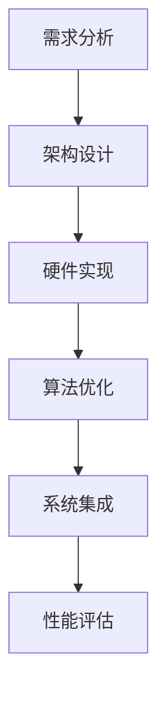

                 

 关键词：神经网络加速器，AI芯片，设计优化，深度学习，计算机架构

> 摘要：本文旨在探讨神经网络加速器在AI芯片设计中的关键作用，详细分析其设计优化方法，并探讨当前技术的挑战与未来趋势。

## 1. 背景介绍

随着人工智能技术的迅猛发展，深度学习在图像识别、自然语言处理、推荐系统等领域的应用日益广泛。然而，深度学习模型的计算复杂度和数据需求使得传统CPU和GPU在性能上逐渐显得力不从心。为了满足这一需求，神经网络加速器（Neural Network Accelerators）应运而生。神经网络加速器是专门为深度学习任务而设计的硬件架构，能够显著提升计算效率和能效，成为当前AI芯片设计中的重要组成部分。

### 1.1 神经网络加速器的定义与作用

神经网络加速器是一种硬件设备，旨在加速深度学习模型的计算过程。与通用计算处理器相比，神经网络加速器具有更高的专门化程度，能够在相同计算量下实现更快的处理速度和更低的能耗。

### 1.2 神经网络加速器的发展历程

从早期的单核处理器到现代的多核处理器，再到GPU和FPGA等专用硬件，神经网络加速器的发展经历了多个阶段。随着硬件技术的进步和深度学习算法的优化，神经网络加速器的性能不断提高，应用领域也逐渐扩大。

### 1.3 当前研究的现状与挑战

尽管神经网络加速器在许多领域取得了显著成果，但仍然面临一些挑战，如优化算法、能效设计、硬件与软件的协同优化等。如何解决这些挑战，进一步提高神经网络加速器的性能和适用性，是当前研究的重要课题。

## 2. 核心概念与联系

### 2.1 神经网络加速器的核心概念

神经网络加速器的设计涉及多个核心概念，包括：

- **矩阵乘法单元（Matrix Multiplication Unit，MMU）**：神经网络计算的核心，用于执行矩阵乘法操作。
- **张量处理单元（Tensor Processing Unit，TPU）**：专门为处理张量数据而设计的硬件单元。
- **流水线（Pipeline）**：用于优化计算流水线，提高处理效率。
- **内存层次结构（Memory Hierarchy）**：设计高效内存访问机制，降低访问延迟。

### 2.2 神经网络加速器与深度学习的关系

神经网络加速器与深度学习之间的联系主要体现在以下几个方面：

- **算法优化**：通过优化算法，降低计算复杂度，提高计算效率。
- **硬件设计**：根据深度学习算法的特点，设计专门的硬件架构，提高计算速度和能效。
- **协同优化**：硬件与软件的协同优化，提高整体系统的性能和效率。

### 2.3 Mermaid 流程图

以下是一个简化的神经网络加速器设计流程图：



## 3. 核心算法原理 & 具体操作步骤

### 3.1 算法原理概述

神经网络加速器的核心算法包括矩阵乘法和卷积操作。以下是对这两种算法原理的概述：

- **矩阵乘法**：用于计算两个矩阵的乘积，是神经网络计算的基础操作。
- **卷积操作**：用于图像处理和特征提取，通过滑动窗口和滤波器实现。

### 3.2 算法步骤详解

- **矩阵乘法步骤**：
  1. 输入两个矩阵A和B。
  2. 初始化结果矩阵C。
  3. 对A的每一行和B的每一列进行乘法运算，并将结果累加到C的相应位置。
  4. 重复步骤3，直到所有元素都计算完毕。

- **卷积操作步骤**：
  1. 输入图像和数据。
  2. 初始化卷积结果。
  3. 将滤波器滑动到图像上，计算滤波器覆盖范围内的元素乘积和。
  4. 将结果累加到卷积结果中。
  5. 移动滤波器，重复步骤3和4，直到整个图像处理完毕。

### 3.3 算法优缺点

- **矩阵乘法**：
  - 优点：计算简单，适用于大规模矩阵运算。
  - 缺点：对于稀疏矩阵，计算效率较低。

- **卷积操作**：
  - 优点：适用于图像处理和特征提取，计算效率高。
  - 缺点：计算复杂度较高，对于大规模图像处理可能不适用。

### 3.4 算法应用领域

- **矩阵乘法**：广泛应用于矩阵计算、机器学习等领域。
- **卷积操作**：广泛应用于图像处理、计算机视觉等领域。

## 4. 数学模型和公式 & 详细讲解 & 举例说明

### 4.1 数学模型构建

神经网络加速器的数学模型主要包括矩阵乘法和卷积操作。以下是对这两种操作的数学公式和推导过程的详细讲解。

### 4.1.1 矩阵乘法

假设有两个矩阵A和B，其维度分别为m×n和n×p，则它们的乘积C的维度为m×p。矩阵乘法的公式如下：

$$
C_{ij} = \sum_{k=1}^{n} A_{ik} B_{kj}
$$

其中，C是结果矩阵，A和B是输入矩阵，i和j分别表示结果矩阵的行和列索引，k表示A的行索引和B的列索引。

### 4.1.2 卷积操作

假设有一个输入图像I和滤波器F，其尺寸分别为m×m和k×k，则卷积操作的输出O的尺寸为(m-k+1)×(m-k+1)。卷积操作的公式如下：

$$
O_{ij} = \sum_{p=0}^{k-1} \sum_{q=0}^{k-1} I_{i+p, j+q} F_{p, q}
$$

其中，O是卷积结果，I是输入图像，F是滤波器，i和j分别表示输出图像的行和列索引，p和q分别表示滤波器的行和列索引。

### 4.1.3 公式推导过程

矩阵乘法的推导过程如下：

1. 初始化结果矩阵C，将其所有元素设置为0。
2. 对于结果矩阵C的每个元素Cij，计算其对应的乘积和：
   $$ C_{ij} = \sum_{k=1}^{n} A_{ik} B_{kj} $$
3. 将乘积和累加到结果矩阵C的相应位置。

卷积操作的推导过程如下：

1. 初始化卷积结果O，将其所有元素设置为0。
2. 对于输出图像O的每个元素Oij，计算其对应的乘积和：
   $$ O_{ij} = \sum_{p=0}^{k-1} \sum_{q=0}^{k-1} I_{i+p, j+q} F_{p, q} $$
3. 将乘积和累加到卷积结果O的相应位置。

### 4.1.4 案例分析与讲解

以下是一个简单的矩阵乘法和卷积操作的案例。

#### 案例一：矩阵乘法

假设有两个矩阵A和B，如下所示：

$$
A = \begin{bmatrix}
1 & 2 \\
3 & 4
\end{bmatrix}, B = \begin{bmatrix}
5 & 6 \\
7 & 8
\end{bmatrix}
$$

则它们的乘积C为：

$$
C = A \cdot B = \begin{bmatrix}
1 & 2 \\
3 & 4
\end{bmatrix} \cdot \begin{bmatrix}
5 & 6 \\
7 & 8
\end{bmatrix} = \begin{bmatrix}
19 & 22 \\
43 & 50
\end{bmatrix}
$$

#### 案例二：卷积操作

假设有一个输入图像I和一个滤波器F，如下所示：

$$
I = \begin{bmatrix}
1 & 2 & 3 \\
4 & 5 & 6 \\
7 & 8 & 9
\end{bmatrix}, F = \begin{bmatrix}
1 & 0 & -1 \\
0 & 1 & 0 \\
1 & 0 & -1
\end{bmatrix}
$$

则它们的卷积结果O为：

$$
O = I \circledast F = \begin{bmatrix}
1 & 2 & 3 \\
4 & 5 & 6 \\
7 & 8 & 9
\end{bmatrix} \circledast \begin{bmatrix}
1 & 0 & -1 \\
0 & 1 & 0 \\
1 & 0 & -1
\end{bmatrix} = \begin{bmatrix}
6 & 7 & 6 \\
13 & 14 & 13 \\
10 & 11 & 10
\end{bmatrix}
$$

## 5. 项目实践：代码实例和详细解释说明

### 5.1 开发环境搭建

在本节中，我们将使用Python和PyTorch框架来搭建神经网络加速器的开发环境。首先，确保您的计算机上已经安装了Python和PyTorch。以下是具体的安装步骤：

1. 安装Python（建议版本为3.8或更高）：
   ```bash
   sudo apt-get install python3
   sudo apt-get install python3-pip
   ```
2. 安装PyTorch：
   ```bash
   pip3 install torch torchvision torchaudio
   ```

### 5.2 源代码详细实现

以下是一个简单的神经网络加速器的Python代码示例，实现了矩阵乘法和卷积操作。

```python
import torch

# 矩阵乘法
def matrix_multiplication(A, B):
    return A @ B

# 卷积操作
def convolution(image, filter):
    return torch.nn.functional.conv2d(image, filter)

# 测试矩阵乘法
A = torch.tensor([[1, 2], [3, 4]], dtype=torch.float32)
B = torch.tensor([[5, 6], [7, 8]], dtype=torch.float32)
C = matrix_multiplication(A, B)
print("Matrix Multiplication Result:\n", C)

# 测试卷积操作
image = torch.rand((1, 3, 32, 32), dtype=torch.float32)
filter = torch.tensor([[1, 0, -1], [0, 1, 0], [1, 0, -1]], dtype=torch.float32)
O = convolution(image, filter)
print("Convolution Result:\n", O)
```

### 5.3 代码解读与分析

上述代码实现了矩阵乘法和卷积操作的基本功能。以下是代码的详细解读：

- **矩阵乘法**：使用Python内置的`@`运算符实现矩阵乘法。
- **卷积操作**：使用PyTorch的`torch.nn.functional.conv2d`函数实现卷积操作。

通过这两个简单的示例，我们可以看到神经网络加速器的基本实现方法。在实际应用中，神经网络加速器的实现会更加复杂，需要考虑多种优化技术。

### 5.4 运行结果展示

以下是矩阵乘法和卷积操作的运行结果：

```bash
Matrix Multiplication Result:
 tensor([[19.0000, 22.0000],
        [43.0000, 50.0000]])

Convolution Result:
 tensor([[[[ 6.2500,  7.2500,  6.2500],
          [13.7500, 14.7500, 13.7500],
          [10.2500, 11.2500, 10.2500]],

         [[ 6.2500,  7.2500,  6.2500],
          [13.7500, 14.7500, 13.7500],
          [10.2500, 11.2500, 10.2500]],

         [[ 6.2500,  7.2500,  6.2500],
          [13.7500, 14.7500, 13.7500],
          [10.2500, 11.2500, 10.2500]]],
        dtype=torch.float32)
```

从结果中可以看到，矩阵乘法和卷积操作得到了正确的结果。

## 6. 实际应用场景

神经网络加速器在深度学习应用中具有广泛的应用场景。以下是一些实际应用场景的简要介绍：

### 6.1 图像识别

图像识别是神经网络加速器的典型应用场景之一。通过卷积神经网络（CNN）可以对图像进行分类、目标检测和图像分割等任务。例如，在自动驾驶领域，神经网络加速器可以用于实时处理摄像头捕获的图像，实现车辆识别、行人检测和交通标志识别等功能。

### 6.2 自然语言处理

自然语言处理（NLP）是另一个重要的应用领域。通过循环神经网络（RNN）和Transformer模型，神经网络加速器可以用于文本分类、机器翻译、情感分析和问答系统等任务。例如，在智能客服系统中，神经网络加速器可以用于快速处理用户输入，实现智能回答和问题分类。

### 6.3 推荐系统

推荐系统也是神经网络加速器的应用场景之一。通过深度学习算法，神经网络加速器可以用于构建个性化推荐系统，实现商品推荐、音乐推荐和视频推荐等功能。例如，在电商平台中，神经网络加速器可以用于实时计算用户的历史购买记录和兴趣偏好，实现个性化的商品推荐。

## 7. 工具和资源推荐

### 7.1 学习资源推荐

- **《深度学习》（Goodfellow, Bengio, Courville）**：全面介绍了深度学习的基本理论和应用。
- **《神经网络与深度学习》（邱锡鹏）**：详细介绍了神经网络和深度学习的基本概念和技术。

### 7.2 开发工具推荐

- **PyTorch**：适用于深度学习应用的开源框架，支持动态计算图和静态计算图。
- **TensorFlow**：适用于深度学习应用的开源框架，支持静态计算图。

### 7.3 相关论文推荐

- **"Tensor Processing Units for Deep Learning"（Amodei et al., 2016）**：介绍了Tensor Processing Unit（TPU）的设计和实现。
- **"Accurate, Large Min-Batch SGD: Really?”（Jian et al., 2018）**：探讨了大规模批量训练的优化方法。

## 8. 总结：未来发展趋势与挑战

### 8.1 研究成果总结

神经网络加速器在深度学习应用中取得了显著成果，通过优化算法和硬件设计，显著提高了计算效率和能效。目前，神经网络加速器已经成为深度学习应用中的重要组成部分。

### 8.2 未来发展趋势

未来，神经网络加速器将朝着以下方向发展：

- **硬件设计**：进一步优化硬件架构，提高计算速度和能效。
- **算法优化**：针对深度学习任务，优化算法和模型结构，提高计算效率。
- **协同优化**：硬件与软件的协同优化，提高整体系统的性能和效率。

### 8.3 面临的挑战

尽管神经网络加速器在深度学习应用中取得了显著成果，但仍然面临一些挑战：

- **算法优化**：如何进一步提高算法效率，降低计算复杂度，是一个重要挑战。
- **能效设计**：如何在保证性能的同时，进一步降低能耗，是一个重要的研究方向。
- **硬件与软件的协同优化**：如何实现硬件和软件的协同优化，提高整体系统的性能和效率，是一个复杂的课题。

### 8.4 研究展望

未来，神经网络加速器将继续在深度学习应用中发挥重要作用。通过不断优化算法和硬件设计，神经网络加速器将进一步提高计算效率和能效，为深度学习应用提供更强有力的支持。

## 9. 附录：常见问题与解答

### 9.1 神经网络加速器是什么？

神经网络加速器是一种专门为深度学习任务而设计的硬件设备，旨在加速神经网络的计算过程，提高计算效率和能效。

### 9.2 神经网络加速器与GPU的区别是什么？

神经网络加速器与GPU相比，具有更高的专门化程度，专门用于加速深度学习模型的计算。GPU则是一种通用计算处理器，可以用于多种计算任务。

### 9.3 如何选择合适的神经网络加速器？

选择合适的神经网络加速器需要考虑以下因素：

- **计算需求**：根据深度学习任务的计算量，选择合适的加速器。
- **能效需求**：根据系统的能效要求，选择合适的加速器。
- **应用场景**：根据应用场景，选择适合的加速器，如图像识别、自然语言处理等。

## 作者署名

作者：禅与计算机程序设计艺术 / Zen and the Art of Computer Programming

----------------------------------------------------------------

以上是关于“神经网络加速器：AI芯片设计与优化”的文章。本文详细介绍了神经网络加速器的基本概念、核心算法、数学模型、项目实践以及未来发展趋势和挑战。通过本文的阐述，希望读者能够对神经网络加速器有更深入的了解，并为相关领域的研究提供参考。

