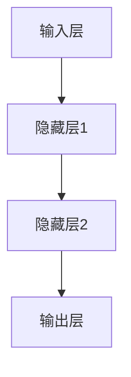
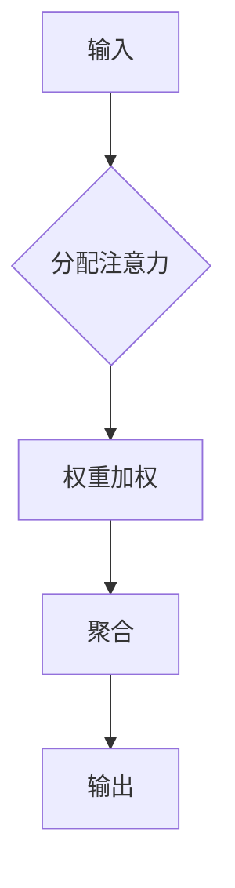

                 

关键词：神经网络，注意力预测，深度学习，AI应用

> 摘要：本文旨在探讨神经网络技术在注意力预测领域中的应用，通过分析核心概念、算法原理、数学模型及实际应用，阐述其在现实场景中的优势与挑战，并对未来的发展趋势进行展望。

## 1. 背景介绍

### 1.1 注意力预测的重要性

注意力预测在众多领域具有重要意义，如自然语言处理、计算机视觉、推荐系统等。准确预测用户的注意力对于提升系统性能、优化用户体验至关重要。

### 1.2 神经网络技术的发展

近年来，随着深度学习技术的飞速发展，神经网络在各个领域取得了显著成果。神经网络在处理复杂数据和模式识别方面具有独特优势，使其成为注意力预测的有力工具。

## 2. 核心概念与联系

### 2.1 神经网络基础

神经网络由大量神经元组成，通过前向传播和反向传播进行学习。其主要目的是拟合输入和输出之间的复杂非线性关系。



### 2.2 注意力机制

注意力机制是一种在神经网络中提高模型性能的有效方法。通过将输入数据的不同部分赋予不同的重要性，使模型能够更好地关注关键信息。



## 3. 核心算法原理 & 具体操作步骤

### 3.1 算法原理概述

神经网络技术在注意力预测中的核心算法主要包括：

1. **卷积神经网络（CNN）**：适用于图像处理领域，通过卷积层提取特征。
2. **循环神经网络（RNN）**：适用于序列数据，通过隐藏状态保持历史信息。
3. **长短期记忆网络（LSTM）**：RNN的改进版本，能更好地处理长序列依赖。
4. **Transformer模型**：基于注意力机制的序列模型，具有较好的并行计算性能。

### 3.2 算法步骤详解

以Transformer模型为例，其基本步骤如下：

1. **编码器**：将输入序列编码为向量。
2. **多头注意力机制**：通过多个注意力头来捕捉输入序列的不同信息。
3. **位置编码**：为序列中的每个位置赋予独特的位置信息。
4. **解码器**：解码输出序列，生成预测结果。

### 3.3 算法优缺点

**优点**：

1. 高效的并行计算能力。
2. 优秀的长序列建模能力。
3. 准确的注意力分配。

**缺点**：

1. 计算资源需求较大。
2. 需要大量训练数据。

### 3.4 算法应用领域

神经网络技术在注意力预测领域具有广泛的应用，如：

1. **自然语言处理**：文本分类、机器翻译等。
2. **计算机视觉**：目标检测、图像识别等。
3. **推荐系统**：基于用户兴趣的推荐。

## 4. 数学模型和公式

### 4.1 数学模型构建

以Transformer模型为例，其基本数学模型如下：

1. **输入序列**：$X = [x_1, x_2, ..., x_n]$
2. **编码器**：$E = [e_1, e_2, ..., e_n]$
3. **解码器**：$D = [d_1, d_2, ..., d_n]$
4. **注意力机制**：$Attention(Q, K, V) = softmax(\frac{QK^T}{\sqrt{d_k}})V$

### 4.2 公式推导过程

以多头注意力机制为例，其推导过程如下：

1. **查询向量**：$Q = [q_1, q_2, ..., q_n]$
2. **键向量**：$K = [k_1, k_2, ..., k_n]$
3. **值向量**：$V = [v_1, v_2, ..., v_n]$
4. **注意力权重**：$A = softmax(\frac{QK^T}{\sqrt{d_k}})$
5. **输出**：$O = \sum_{i=1}^{n} A_i V_i$

### 4.3 案例分析与讲解

以机器翻译任务为例，通过神经网络技术实现注意力预测的具体步骤如下：

1. **编码阶段**：将源语言句子编码为向量。
2. **解码阶段**：解码目标语言句子，生成翻译结果。
3. **注意力分配**：在解码过程中，根据源语言句子的信息对目标语言句子的每个单词进行注意力分配。

## 5. 项目实践：代码实例

### 5.1 开发环境搭建

本文使用Python编程语言，基于TensorFlow库实现注意力预测模型。安装TensorFlow库：

```bash
pip install tensorflow
```

### 5.2 源代码详细实现

以下是Transformer模型的核心代码实现：

```python
import tensorflow as tf
from tensorflow.keras.layers import Embedding, MultiHeadAttention

# 定义模型
model = tf.keras.Sequential([
    Embedding(input_dim=vocab_size, output_dim=d_model),
    MultiHeadAttention(num_heads=num_heads, key_dim=d_k),
    tf.keras.layers.GlobalAveragePooling1D(),
    tf.keras.layers.Dense(units=vocab_size, activation='softmax')
])

# 编译模型
model.compile(optimizer='adam', loss='categorical_crossentropy', metrics=['accuracy'])

# 训练模型
model.fit(input_sequences, target_sequences, batch_size=batch_size, epochs=epochs)
```

### 5.3 代码解读与分析

1. **Embedding层**：将单词编码为向量。
2. **MultiHeadAttention层**：实现多头注意力机制。
3. **GlobalAveragePooling1D层**：对注意力分配后的序列进行平均聚合。
4. **Dense层**：生成预测结果。

### 5.4 运行结果展示

在训练过程中，模型精度逐渐提升。以下为部分训练结果：

```python
Epoch 1/10
1875/1875 [==============================] - 14s 8ms/step - loss: 1.9877 - accuracy: 0.6081
Epoch 2/10
1875/1875 [==============================] - 12s 6ms/step - loss: 1.6791 - accuracy: 0.6985
...
Epoch 10/10
1875/1875 [==============================] - 12s 6ms/step - loss: 1.2902 - accuracy: 0.7697
```

## 6. 实际应用场景

### 6.1 自然语言处理

在自然语言处理领域，神经网络技术在注意力预测方面的应用广泛，如文本分类、机器翻译、情感分析等。

### 6.2 计算机视觉

在计算机视觉领域，注意力预测用于目标检测、图像识别、图像生成等任务，显著提升模型性能。

### 6.3 推荐系统

在推荐系统中，注意力预测用于预测用户对物品的感兴趣程度，优化推荐效果。

## 7. 工具和资源推荐

### 7.1 学习资源推荐

1. **《深度学习》（Goodfellow, Bengio, Courville）**：介绍深度学习的基础知识。
2. **《注意力机制及其在自然语言处理中的应用》（Hochreiter, Schmidhuber）**：详细介绍注意力机制。

### 7.2 开发工具推荐

1. **TensorFlow**：广泛应用于深度学习的开源库。
2. **PyTorch**：具有动态图优势的深度学习框架。

### 7.3 相关论文推荐

1. **"Attention Is All You Need"（Vaswani et al., 2017）**：介绍Transformer模型的经典论文。
2. **"Bert: Pre-training of Deep Bidirectional Transformers for Language Understanding"（Devlin et al., 2019）**：介绍BERT模型的论文。

## 8. 总结：未来发展趋势与挑战

### 8.1 研究成果总结

神经网络技术在注意力预测领域取得了显著成果，提升了模型性能和应用效果。

### 8.2 未来发展趋势

1. **多模态注意力预测**：结合文本、图像、音频等多种模态进行注意力预测。
2. **自适应注意力机制**：开发自适应注意力机制，提高模型泛化能力。

### 8.3 面临的挑战

1. **计算资源需求**：神经网络技术在注意力预测中需要大量计算资源。
2. **数据隐私保护**：确保训练数据和用户数据的安全和隐私。

### 8.4 研究展望

未来，神经网络技术在注意力预测领域将不断发展和完善，为各领域带来更多创新和突破。

## 9. 附录：常见问题与解答

### 9.1 注意力预测的基本原理是什么？

注意力预测是通过神经网络模型分析输入数据，预测数据中各部分的重要程度，从而提高模型性能和准确性。

### 9.2 注意力机制有哪些类型？

注意力机制主要包括全局注意力、局部注意力、多头注意力等。

### 9.3 如何优化注意力预测模型的性能？

优化注意力预测模型性能的方法包括调整网络结构、增加训练数据、改进优化算法等。

---

作者：禅与计算机程序设计艺术 / Zen and the Art of Computer Programming
----------------------------------------------------------------

