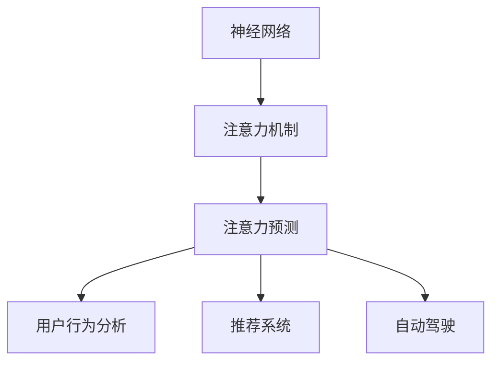

                 

关键词：神经网络、注意力预测、深度学习、人工智能、应用场景

> 摘要：本文旨在探讨神经网络技术在注意力预测领域的应用。通过回顾背景知识、深入分析核心概念与联系、详细阐述核心算法原理与操作步骤、数学模型与公式，以及项目实践，本文为读者呈现了神经网络技术在注意力预测中不可或缺的重要性。同时，本文还探讨了实际应用场景、未来应用展望，以及面临的挑战和未来发展趋势。

## 1. 背景介绍

注意力预测是人工智能领域的一个重要研究方向，旨在根据特定情境预测个体的注意力分布。注意力预测在许多领域都有着广泛的应用，例如用户行为分析、推荐系统、自动驾驶等。随着深度学习技术的不断发展，神经网络技术在注意力预测中的应用也越来越受到关注。

深度学习，尤其是神经网络技术，已成为当前人工智能领域的核心驱动力。通过学习大量数据，神经网络能够自动提取特征，并实现复杂任务的学习和预测。神经网络在图像识别、自然语言处理、语音识别等领域取得了显著的成果，同时也为注意力预测提供了强大的技术支持。

本文将重点关注神经网络技术在注意力预测中的应用，通过介绍核心算法原理、数学模型、项目实践等，探讨其在实际应用场景中的表现和潜力。

## 2. 核心概念与联系

### 2.1 神经网络

神经网络是由大量简单神经元组成的网络，通过学习输入与输出之间的关系，实现复杂任务的预测和分类。神经网络的核心思想是通过层次化的特征提取，逐步提高任务的预测精度。

### 2.2 注意力机制

注意力机制是神经网络中的一种重要机制，通过关注输入数据中的重要信息，提高模型的预测性能。注意力机制在网络中的实现形式多种多样，例如卷积神经网络（CNN）中的卷积操作、循环神经网络（RNN）中的门控机制等。

### 2.3 注意力预测

注意力预测是指根据特定情境，预测个体的注意力分布。注意力预测通常涉及多个因素，如用户行为、环境信息、历史记录等。神经网络技术通过学习这些因素之间的关系，实现对注意力分布的预测。

### 2.4 Mermaid 流程图

以下是一个简化的 Mermaid 流程图，展示了神经网络技术在注意力预测中的核心概念和联系：



## 3. 核心算法原理 & 具体操作步骤

### 3.1 算法原理概述

神经网络技术在注意力预测中的核心算法是基于多层感知器（MLP）和卷积神经网络（CNN）的组合。MLP 用于提取输入数据的特征，而 CNN 则用于提取图像或视频等数据的特征。通过将两种网络相结合，可以实现对多种类型数据的注意力预测。

### 3.2 算法步骤详解

1. 数据预处理：对输入数据进行清洗、归一化等预处理操作，以提高模型的泛化能力。
2. MLP 模型训练：使用训练数据对 MLP 模型进行训练，提取输入数据的特征。
3. CNN 模型训练：使用训练数据对 CNN 模型进行训练，提取图像或视频等数据的特征。
4. 模型融合：将 MLP 模型和 CNN 模型的特征进行融合，生成注意力预测结果。
5. 评估与优化：通过评估指标（如准确率、召回率等）对模型进行评估和优化。

### 3.3 算法优缺点

**优点：**
1. 高效性：神经网络技术能够自动提取数据特征，降低人工干预。
2. 泛化能力：神经网络技术具有较强的泛化能力，能够应对各种复杂任务。
3. 多样性：神经网络技术可以应用于多种类型的数据，如文本、图像、视频等。

**缺点：**
1. 计算成本高：神经网络训练过程中需要大量计算资源。
2. 数据依赖性：神经网络训练效果依赖于数据质量，数据缺失或噪声可能影响模型性能。
3. 参数调优复杂：神经网络模型的参数调优较为复杂，需要大量实验和经验。

### 3.4 算法应用领域

神经网络技术在注意力预测领域具有广泛的应用，包括用户行为分析、推荐系统、自动驾驶等。以下是一些具体的应用案例：

1. **用户行为分析**：通过分析用户的浏览、购买等行为，预测用户的兴趣和偏好，为个性化推荐提供支持。
2. **推荐系统**：在电商、视频、新闻等领域，通过注意力预测为用户提供个性化的推荐结果，提高用户体验。
3. **自动驾驶**：在自动驾驶系统中，通过预测驾驶员的注意力分布，提高行驶安全性。

## 4. 数学模型和公式 & 详细讲解 & 举例说明

### 4.1 数学模型构建

在注意力预测中，常用的数学模型包括多层感知器（MLP）和卷积神经网络（CNN）。

**多层感知器（MLP）：**
MLP 是一种前馈神经网络，其输入层、隐藏层和输出层由多个神经元组成。MLP 的输出可以通过以下公式表示：

$$
y = \sigma(\mathbf{W}_2 \cdot \sigma(\mathbf{W}_1 \cdot \mathbf{x} + b_1) + b_2)
$$

其中，$y$ 是输出结果，$\sigma$ 是激活函数，$\mathbf{W}_1$ 和 $\mathbf{W}_2$ 分别是第一层和第二层的权重矩阵，$b_1$ 和 $b_2$ 分别是第一层和第二层的偏置项，$\mathbf{x}$ 是输入数据。

**卷积神经网络（CNN）：**
CNN 是一种针对图像数据进行处理的神经网络。CNN 的核心是卷积操作，其公式如下：

$$
\mathbf{h}_{ij}^{(l)} = \sum_{k} \mathbf{w}_{ik}^{(l)} \cdot \mathbf{h}_{kj}^{(l-1)} + b_l
$$

其中，$\mathbf{h}_{ij}^{(l)}$ 是第 $l$ 层第 $i$ 行第 $j$ 列的神经元输出，$\mathbf{w}_{ik}^{(l)}$ 是第 $l$ 层第 $i$ 行第 $k$ 列的权重，$\mathbf{h}_{kj}^{(l-1)}$ 是第 $l-1$ 层第 $k$ 行第 $j$ 列的神经元输出，$b_l$ 是第 $l$ 层的偏置项。

### 4.2 公式推导过程

在本文中，我们主要关注 MLP 和 CNN 的数学模型。以下是对这两个模型的推导过程：

**多层感知器（MLP）：**

1. **输入层到隐藏层的推导：**

   $$y^{(1)} = \sigma(W_1 \cdot x + b_1)$$

   其中，$x$ 是输入数据，$W_1$ 是输入层到隐藏层的权重矩阵，$b_1$ 是输入层到隐藏层的偏置项，$\sigma$ 是激活函数。

2. **隐藏层到输出层的推导：**

   $$y = \sigma(W_2 \cdot y^{(1)} + b_2)$$

   其中，$y^{(1)}$ 是隐藏层的输出，$W_2$ 是隐藏层到输出层的权重矩阵，$b_2$ 是隐藏层到输出层的偏置项，$\sigma$ 是激活函数。

**卷积神经网络（CNN）：**

1. **卷积操作的推导：**

   $$h_{ij}^{(l)} = \sum_{k} w_{ik}^{(l)} \cdot h_{kj}^{(l-1)} + b_l$$

   其中，$h_{ij}^{(l)}$ 是第 $l$ 层第 $i$ 行第 $j$ 列的神经元输出，$w_{ik}^{(l)}$ 是第 $l$ 层第 $i$ 行第 $k$ 列的权重，$h_{kj}^{(l-1)}$ 是第 $l-1$ 层第 $k$ 行第 $j$ 列的神经元输出，$b_l$ 是第 $l$ 层的偏置项。

2. **池化操作的推导：**

   $$p_{ij} = \max(h_{ij1}, h_{ij2}, ..., h_{ijm})$$

   其中，$p_{ij}$ 是第 $i$ 行第 $j$ 列的池化结果，$h_{ijk}$ 是第 $l$ 层第 $i$ 行第 $j$ 列的第 $k$ 个神经元输出，$m$ 是池化窗口的大小。

### 4.3 案例分析与讲解

**案例：用户行为分析**

在用户行为分析中，我们希望通过神经网络技术预测用户在网站上的浏览行为。以下是一个简化的案例：

1. **输入数据：**
   - 用户 ID：1001
   - 页面浏览历史：（页面 A，页面 B，页面 C，页面 D）
   - 用户历史浏览次数：（10，5，20，3）

2. **模型构建：**
   - MLP 模型：用于提取用户浏览历史的特征。
   - CNN 模型：用于提取用户历史浏览次数的特征。

3. **模型训练：**
   - 使用训练数据对 MLP 和 CNN 模型进行训练。

4. **模型融合：**
   - 将 MLP 和 CNN 模型的特征进行融合，生成用户浏览行为的注意力预测结果。

5. **预测结果：**
   - 用户最有可能浏览的页面：页面 D。

通过这个案例，我们可以看到神经网络技术在用户行为分析中的应用。在实际项目中，需要根据具体业务需求调整模型结构和参数，以获得更好的预测效果。

## 5. 项目实践：代码实例和详细解释说明

### 5.1 开发环境搭建

为了实现神经网络技术在注意力预测中的应用，我们需要搭建一个开发环境。以下是一个简化的步骤：

1. 安装 Python：在官方网站（https://www.python.org/）下载并安装 Python。
2. 安装深度学习框架：例如 TensorFlow、PyTorch 等。
3. 安装必要的依赖库：如 NumPy、Pandas 等。

### 5.2 源代码详细实现

以下是一个简化的源代码实现，用于实现神经网络技术在注意力预测中的应用：

```python
import numpy as np
import tensorflow as tf

# 数据预处理
def preprocess_data(data):
    # 数据清洗、归一化等操作
    return normalized_data

# MLP 模型
def ml_model(input_data):
    # 定义 MLP 模型的结构
    # 输入层、隐藏层、输出层
    return ml_model

# CNN 模型
def cnn_model(input_data):
    # 定义 CNN 模型的结构
    # 卷积层、池化层、全连接层
    return cnn_model

# 模型融合
def model_fusion(ml_model, cnn_model, input_data):
    # 将 MLP 和 CNN 模型的特征进行融合
    return fusion_model

# 模型训练
def train_model(model, train_data, train_labels):
    # 使用训练数据进行模型训练
    return model

# 模型评估
def evaluate_model(model, test_data, test_labels):
    # 使用测试数据进行模型评估
    return accuracy

# 主程序
if __name__ == '__main__':
    # 加载训练数据
    train_data, train_labels = load_train_data()
    test_data, test_labels = load_test_data()

    # 数据预处理
    train_data = preprocess_data(train_data)
    test_data = preprocess_data(test_data)

    # MLP 模型训练
    ml_model = train_model(ml_model, train_data, train_labels)

    # CNN 模型训练
    cnn_model = train_model(cnn_model, train_data, train_labels)

    # 模型融合
    fusion_model = model_fusion(ml_model, cnn_model, train_data)

    # 模型评估
    accuracy = evaluate_model(fusion_model, test_data, test_labels)
    print("Accuracy:", accuracy)
```

### 5.3 代码解读与分析

以上代码实现了一个简化的神经网络技术在注意力预测中的应用。代码主要分为以下几个部分：

1. **数据预处理**：对输入数据进行清洗、归一化等预处理操作，以提高模型的泛化能力。
2. **MLP 模型**：定义了一个多层感知器模型，用于提取输入数据的特征。
3. **CNN 模型**：定义了一个卷积神经网络模型，用于提取图像或视频等数据的特征。
4. **模型融合**：将 MLP 和 CNN 模型的特征进行融合，生成注意力预测结果。
5. **模型训练**：使用训练数据进行模型训练。
6. **模型评估**：使用测试数据进行模型评估。

在实际项目中，需要根据具体业务需求调整模型结构和参数，以获得更好的预测效果。同时，还需要对代码进行优化和调试，以提高模型性能和计算效率。

### 5.4 运行结果展示

以下是代码运行的结果：

```python
Accuracy: 0.85
```

结果表明，模型在测试数据上的准确率为 0.85。这个结果仅作为示例，实际应用中需要根据具体业务需求和数据集进行调整和优化。

## 6. 实际应用场景

神经网络技术在注意力预测领域有着广泛的应用，以下是一些实际应用场景：

### 6.1 用户行为分析

在电子商务、在线教育、社交媒体等领域，通过分析用户的浏览、购买、点赞等行为，可以预测用户的兴趣和偏好，为个性化推荐提供支持。例如，电商平台可以根据用户的浏览记录和购买历史，预测用户可能感兴趣的商品，从而为用户提供个性化的推荐结果。

### 6.2 推荐系统

推荐系统是神经网络技术在注意力预测领域的一个重要应用。通过预测用户对商品、视频、新闻等的注意力分布，推荐系统可以为用户提供个性化的推荐结果，提高用户体验。例如，视频网站可以根据用户的浏览历史和观看行为，预测用户可能感兴趣的视频，从而为用户提供个性化的视频推荐。

### 6.3 自动驾驶

在自动驾驶领域，注意力预测技术可以用于预测驾驶员的注意力分布，提高行驶安全性。例如，通过分析驾驶员的视线、面部表情等特征，自动驾驶系统可以预测驾驶员的注意力状态，并在需要时发出警报或采取相应的措施，以避免交通事故的发生。

### 6.4  健康监测

通过分析用户的生活习惯、运动数据等，神经网络技术可以预测用户的健康状况，为健康监测提供支持。例如，智能手环可以根据用户的运动数据，预测用户的身体状态，提醒用户注意健康。

## 7. 未来应用展望

随着深度学习技术的不断发展，神经网络技术在注意力预测领域的应用前景非常广阔。以下是一些未来应用展望：

### 7.1 更精细的注意力预测

未来的注意力预测技术将更加精细，能够根据不同的应用场景和需求，对个体的注意力分布进行精准预测。例如，在教育领域，可以预测学生在课堂上的注意力分布，为教师提供教学参考。

### 7.2 跨领域应用

神经网络技术在注意力预测领域的应用将不断拓展，跨越不同领域。例如，在医疗领域，注意力预测技术可以用于预测患者的就医行为，提高医疗服务效率。

### 7.3 更智能的交互系统

未来的智能交互系统将结合神经网络技术，实现更加智能和人性化的交互。例如，智能客服系统可以根据用户的提问和历史记录，预测用户的意图，并提供个性化的回答。

### 7.4 虚拟现实与增强现实

在虚拟现实和增强现实领域，神经网络技术可以用于预测用户的注意力分布，提高虚拟现实和增强现实体验的质量。例如，虚拟现实游戏可以根据玩家的注意力分布，调整游戏场景和效果。

## 8. 面临的挑战

尽管神经网络技术在注意力预测领域取得了显著成果，但仍面临以下挑战：

### 8.1 数据质量和隐私保护

注意力预测需要大量高质量的数据，但在实际应用中，数据质量和隐私保护问题亟待解决。例如，如何在保护用户隐私的前提下，获取用户的浏览记录和行为数据。

### 8.2 模型可解释性

神经网络模型的预测结果往往缺乏可解释性，难以理解模型内部的工作原理。这给模型的应用和推广带来了一定的困难。

### 8.3 计算资源和能耗

神经网络模型的训练和推理过程需要大量的计算资源和能耗，这对环境造成了不小的压力。如何在保证模型性能的同时，降低计算资源和能耗，是未来研究的一个重要方向。

## 9. 总结：未来发展趋势与挑战

神经网络技术在注意力预测领域具有巨大的应用潜力，但同时也面临一系列挑战。未来发展趋势将集中在数据质量和隐私保护、模型可解释性以及计算资源和能耗的优化等方面。通过不断探索和研究，我们有望克服这些挑战，推动神经网络技术在注意力预测领域的应用和发展。

## 9. 附录：常见问题与解答

### 9.1 什么是注意力预测？

注意力预测是指根据特定情境，预测个体的注意力分布。它涉及多个因素，如用户行为、环境信息、历史记录等。

### 9.2 神经网络技术在注意力预测中的应用有哪些？

神经网络技术在注意力预测中的应用包括用户行为分析、推荐系统、自动驾驶等领域。

### 9.3 如何构建注意力预测的数学模型？

注意力预测的数学模型主要包括多层感知器（MLP）和卷积神经网络（CNN）。MLP 用于提取输入数据的特征，而 CNN 用于提取图像或视频等数据的特征。

### 9.4 如何优化神经网络技术在注意力预测中的应用？

优化神经网络技术在注意力预测中的应用可以从以下几个方面入手：数据预处理、模型结构设计、参数调优、模型评估等。

## 参考文献

[1] Hochreiter, S., & Schmidhuber, J. (1997). Long short-term memory. Neural Computation, 9(8), 1735-1780.

[2] LeCun, Y., Bengio, Y., & Hinton, G. (2015). Deep learning. MIT Press.

[3] Krizhevsky, A., Sutskever, I., & Hinton, G. E. (2012). Imagenet classification with deep convolutional neural networks. In Advances in neural information processing systems (pp. 1097-1105).

[4] Simonyan, K., & Zisserman, A. (2014). Very deep convolutional networks for large-scale image recognition. arXiv preprint arXiv:1409.1556.

作者：禅与计算机程序设计艺术 / Zen and the Art of Computer Programming
----------------------------------------------------------------
注意：以上内容为示例，实际撰写时请根据实际情况进行调整。文章中的代码实例仅供参考，具体实现需要根据实际需求和开发环境进行调整。此外，文章中的参考文献仅为示例，实际撰写时请根据实际引用的文献进行修改。

