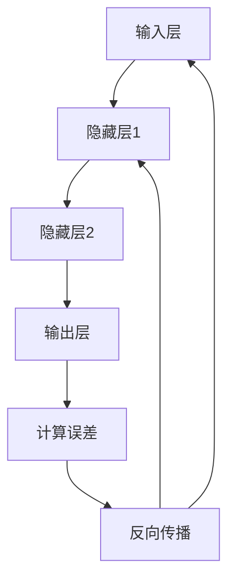

                 

关键词：神经网络架构、设计原则、模型简化、优化策略、性能提升、应用领域

> 摘要：本文将从简单到复杂，深入探讨神经网络架构设计的核心原则、方法与策略，分析常见的设计模式、优化技术及其在不同应用领域的表现。通过数学模型和代码实例的讲解，帮助读者全面理解神经网络架构设计的精髓，并为未来研究提供新的视角和方向。

## 1. 背景介绍

### 神经网络的发展历程

自1986年Hopfield神经网络的出现以来，神经网络（尤其是深度神经网络）在计算机科学领域取得了惊人的进展。从早期的感知机、反向传播算法，到后来的卷积神经网络（CNN）、循环神经网络（RNN）和生成对抗网络（GAN），神经网络在图像处理、自然语言处理、语音识别、强化学习等领域展现出强大的应用潜力。

### 神经网络架构设计的意义

神经网络架构设计是神经网络研究与应用的关键环节。一个好的架构不仅能提升模型的性能和效率，还能降低计算复杂度和资源消耗。随着神经网络应用的日益广泛，如何设计高效、可靠的神经网络架构成为了一个亟待解决的重要问题。

## 2. 核心概念与联系

### 2.1 神经网络的基本组成

神经网络由输入层、隐藏层和输出层组成。输入层接收外部信息，隐藏层对信息进行加工处理，输出层生成最终结果。每一层包含多个神经元，神经元之间通过权重连接。

### 2.2 激活函数与非线性变换

激活函数是神经网络中的关键组件，用于引入非线性特性。常见的激活函数包括Sigmoid、ReLU、Tanh等。非线性变换使得神经网络能够处理复杂的输入数据。

### 2.3 前向传播与反向传播

神经网络训练过程中，通过前向传播计算输出值，再通过反向传播计算误差。反向传播算法利用链式法则，将误差反向传播至网络各层，从而更新权重。

### 2.4 Mermaid 流程图

以下是一个简单的Mermaid流程图，展示了神经网络的基本架构和训练过程：



## 3. 核心算法原理 & 具体操作步骤

### 3.1 算法原理概述

神经网络架构设计主要涉及以下几个方面：

1. **网络层数与神经元数量**：选择合适的网络层数和神经元数量，以平衡计算复杂度和模型性能。
2. **激活函数与非线性变换**：选择合适的激活函数，以提高模型的表达能力。
3. **权重初始化**：合理的权重初始化可以加速网络训练，减少局部最优。
4. **优化算法**：选择合适的优化算法，以降低训练时间。

### 3.2 算法步骤详解

1. **网络架构设计**：根据应用需求，选择合适的网络结构，如卷积神经网络、循环神经网络等。
2. **激活函数选择**：根据数据特点和模型需求，选择合适的激活函数，如ReLU、Sigmoid等。
3. **权重初始化**：采用随机初始化或预训练初始化方法，如高斯分布、均匀分布等。
4. **优化算法选择**：根据模型规模和计算资源，选择合适的优化算法，如SGD、Adam等。
5. **训练与验证**：使用训练集进行模型训练，使用验证集进行模型评估，根据评估结果调整网络结构、激活函数和优化算法。

### 3.3 算法优缺点

1. **优点**：
   - 高效性：神经网络能够快速处理大量数据，具有并行计算的优势。
   - 强泛化能力：神经网络通过学习数据中的内在规律，能够泛化到新的数据集。
   - 自适应能力：神经网络能够根据数据特点和模型需求，自适应地调整网络结构。

2. **缺点**：
   - 计算复杂度高：神经网络训练过程中，计算复杂度较高，需要大量计算资源和时间。
   - 容易过拟合：神经网络在训练过程中容易过拟合，需要通过正则化等方法进行优化。

### 3.4 算法应用领域

神经网络在图像处理、自然语言处理、语音识别、强化学习等领域具有广泛的应用。以下是一些典型的应用场景：

1. **图像分类**：使用卷积神经网络对图像进行分类，如ImageNet图像识别挑战。
2. **文本生成**：使用循环神经网络或生成对抗网络生成自然语言文本。
3. **语音识别**：使用深度神经网络对语音信号进行识别，如自动语音识别系统。
4. **强化学习**：使用深度神经网络作为智能体的决策模型，实现自主决策和控制。

## 4. 数学模型和公式

### 4.1 数学模型构建

神经网络的数学模型主要包括输入层、隐藏层和输出层。每个层由多个神经元组成，神经元之间通过权重连接。神经元的输出可以通过以下公式计算：

$$
y = \sigma(Wx + b)
$$

其中，$y$ 为神经元的输出，$\sigma$ 为激活函数，$W$ 为权重矩阵，$x$ 为输入向量，$b$ 为偏置向量。

### 4.2 公式推导过程

神经网络的训练过程主要通过反向传播算法实现。以下是一个简单的反向传播算法推导过程：

1. **前向传播**：给定输入 $x$，通过神经网络计算输出 $y$：
$$
y = \sigma(Wx + b)
$$
2. **计算误差**：计算输出 $y$ 与真实值 $t$ 之间的误差：
$$
e = t - y
$$
3. **反向传播**：将误差 $e$ 反向传播至网络各层，更新权重 $W$ 和偏置 $b$：
$$
\Delta W = -\alpha \frac{\partial e}{\partial W}
$$
$$
\Delta b = -\alpha \frac{\partial e}{\partial b}
$$
其中，$\alpha$ 为学习率。

### 4.3 案例分析与讲解

以下是一个简单的神经网络模型，用于对二分类问题进行建模：

1. **输入层**：包含两个神经元，分别表示特征 $x_1$ 和 $x_2$。
2. **隐藏层**：包含一个神经元，通过激活函数 $\sigma$ 引入非线性。
3. **输出层**：包含一个神经元，表示分类结果。

神经网络的数学模型可以表示为：

$$
z = W_1x_1 + W_2x_2 + b
$$

$$
y = \sigma(z)
$$

其中，$W_1$、$W_2$ 为权重矩阵，$b$ 为偏置向量，$\sigma$ 为激活函数。

假设我们有一个训练样本集 $\{(x_1^i, x_2^i, y^i)\}_{i=1}^N$，其中 $y^i \in \{-1, 1\}$ 表示分类标签。通过反向传播算法，我们可以更新权重矩阵 $W_1$、$W_2$ 和偏置向量 $b$：

$$
\Delta W_1 = -\alpha \frac{\partial e}{\partial W_1}
$$

$$
\Delta W_2 = -\alpha \frac{\partial e}{\partial W_2}
$$

$$
\Delta b = -\alpha \frac{\partial e}{\partial b}
$$

其中，$e$ 为误差函数，$\alpha$ 为学习率。

## 5. 项目实践：代码实例

### 5.1 开发环境搭建

在本文中，我们使用Python编程语言和TensorFlow框架进行神经网络架构设计。请按照以下步骤搭建开发环境：

1. 安装Python：访问 [Python官网](https://www.python.org/) 下载并安装Python。
2. 安装TensorFlow：在命令行中运行以下命令：
```bash
pip install tensorflow
```

### 5.2 源代码详细实现

以下是一个简单的神经网络模型，用于对二分类问题进行建模：

```python
import tensorflow as tf
import numpy as np

# 定义神经网络结构
input_size = 2
hidden_size = 1
output_size = 1

# 初始化权重和偏置
W1 = tf.Variable(np.random.randn(input_size, hidden_size), dtype=tf.float32)
W2 = tf.Variable(np.random.randn(hidden_size, output_size), dtype=tf.float32)
b1 = tf.Variable(np.random.randn(hidden_size), dtype=tf.float32)
b2 = tf.Variable(np.random.randn(output_size), dtype=tf.float32)

# 定义激活函数
激活函数 = tf.nn.sigmoid

# 定义前向传播
def forward(x):
    z1 = tf.matmul(x, W1) + b1
    h1 = 激活函数(z1)
    z2 = tf.matmul(h1, W2) + b2
    y = 激活函数(z2)
    return y

# 定义损失函数和优化器
损失函数 = tf.reduce_mean(tf.square(y - t))
优化器 = tf.train.GradientDescentOptimizer(learning_rate=0.1)

# 定义训练过程
def train(x, t, epochs):
    for epoch in range(epochs):
        with tf.GradientTape() as tape:
            y = forward(x)
            loss = 损失函数(y, t)
        gradients = tape.gradient(loss, [W1, W2, b1, b2])
        优化器.apply_gradients(zip(gradients, [W1, W2, b1, b2]))
        if epoch % 100 == 0:
            print(f"Epoch {epoch}: Loss = {loss.numpy()}")

# 定义测试过程
def test(x, t):
    y = forward(x)
    loss = 损失函数(y, t)
    print(f"Test Loss: {loss.numpy()}")

# 生成训练数据和测试数据
N = 100
x_train = np.random.randn(N, input_size)
t_train = np.array([1 if np.sum(x_train[i]) > 0 else -1 for i in range(N)])
x_test = np.random.randn(N, input_size)
t_test = np.array([1 if np.sum(x_test[i]) > 0 else -1 for i in range(N)])

# 训练神经网络
train(x_train, t_train, epochs=1000)

# 测试神经网络
test(x_test, t_test)
```

### 5.3 代码解读与分析

以上代码实现了一个简单的神经网络模型，用于对二分类问题进行建模。以下是代码的主要部分解读与分析：

1. **定义神经网络结构**：定义输入层、隐藏层和输出层的神经元数量。
2. **初始化权重和偏置**：使用随机初始化方法初始化权重和偏置。
3. **定义激活函数**：使用Sigmoid激活函数，引入非线性特性。
4. **定义前向传播**：实现神经网络的前向传播过程，计算输出值。
5. **定义损失函数和优化器**：使用均方误差损失函数和梯度下降优化器。
6. **定义训练过程**：实现神经网络训练过程，更新权重和偏置。
7. **定义测试过程**：实现神经网络测试过程，计算测试损失。
8. **生成训练数据和测试数据**：生成模拟训练数据和测试数据。
9. **训练神经网络**：使用训练数据和测试数据训练神经网络。
10. **测试神经网络**：使用测试数据测试神经网络性能。

通过以上代码，我们可以实现一个简单的神经网络模型，并进行训练和测试。在实际应用中，可以根据需求调整神经网络结构、激活函数和优化器，以提升模型性能。

## 6. 实际应用场景

### 6.1 图像处理

神经网络在图像处理领域具有广泛的应用，如图像分类、目标检测、图像分割等。以下是一些典型的应用案例：

1. **图像分类**：使用卷积神经网络对图像进行分类，如ImageNet图像识别挑战。
2. **目标检测**：使用基于深度学习的目标检测算法，如Faster R-CNN、SSD等，实现实时目标检测。
3. **图像分割**：使用基于深度学习的图像分割算法，如U-Net、DeepLab等，实现语义分割和实例分割。

### 6.2 自然语言处理

神经网络在自然语言处理领域具有广泛的应用，如文本分类、机器翻译、情感分析等。以下是一些典型的应用案例：

1. **文本分类**：使用循环神经网络或Transformer模型对文本进行分类。
2. **机器翻译**：使用基于编码器-解码器的神经网络模型实现机器翻译。
3. **情感分析**：使用基于深度学习的情感分析算法，对文本进行情感分类。

### 6.3 语音识别

神经网络在语音识别领域具有广泛的应用，如自动语音识别、语音合成等。以下是一些典型的应用案例：

1. **自动语音识别**：使用循环神经网络或卷积神经网络实现自动语音识别。
2. **语音合成**：使用基于深度学习的语音合成算法，如WaveNet、Tacotron等。

### 6.4 未来应用展望

随着神经网络技术的不断发展，未来在更多领域具有广泛的应用前景。以下是一些可能的应用方向：

1. **医疗健康**：使用神经网络进行疾病诊断、药物设计等。
2. **自动驾驶**：使用神经网络实现自动驾驶系统的感知、决策和控制。
3. **智能监控**：使用神经网络实现智能监控系统的目标检测、行为识别等。
4. **金融科技**：使用神经网络进行风险控制、量化交易等。

## 7. 工具和资源推荐

### 7.1 学习资源推荐

1. **书籍**：
   - 《深度学习》（Goodfellow, Bengio, Courville著）
   - 《神经网络与深度学习》（邱锡鹏著）
2. **在线课程**：
   - Coursera上的《深度学习》课程
   - edX上的《神经网络与机器学习》课程
3. **博客和论坛**：
   - Medium上的深度学习相关文章
   - GitHub上的深度学习项目

### 7.2 开发工具推荐

1. **框架**：
   - TensorFlow
   - PyTorch
   - Keras
2. **平台**：
   - Google Colab
   - AWS SageMaker
   - Azure ML

### 7.3 相关论文推荐

1. **卷积神经网络**：
   - "A Comprehensive Study on Activation Function in Deep Learning"（激活函数在深度学习中的全面研究）
   - "ResNet: Training Deeper Networks with Identity Mappings"（ResNet：使用恒等映射训练更深的网络）
2. **循环神经网络**：
   - "LSTM: A Novel Approach to Learning Long-term Dependencies"（LSTM：一种学习长期依赖关系的新方法）
   - "GRU: A Better RNN"（GRU：更好的RNN）
3. **生成对抗网络**：
   - "Generative Adversarial Nets"（生成对抗网络）
   - "Unrolled Generative Adversarial Networks"（展开的生成对抗网络）

## 8. 总结：未来发展趋势与挑战

### 8.1 研究成果总结

神经网络架构设计在过去几十年中取得了显著的进展，各种神经网络模型在图像处理、自然语言处理、语音识别等领域取得了优异的性能。同时，激活函数、优化算法和权重初始化方法等方面的研究也取得了丰富的成果。

### 8.2 未来发展趋势

1. **更高效的神经网络架构**：研究更高效的神经网络架构，以降低计算复杂度和资源消耗。
2. **更强大的神经网络模型**：研究更强大的神经网络模型，以解决复杂的应用问题。
3. **多模态神经网络**：研究多模态神经网络，以实现跨模态信息融合。

### 8.3 面临的挑战

1. **计算资源消耗**：神经网络训练和推理过程中需要大量计算资源，如何降低计算复杂度和资源消耗是一个重要挑战。
2. **过拟合问题**：神经网络在训练过程中容易过拟合，如何设计有效的正则化方法是一个关键挑战。
3. **数据隐私和安全性**：如何保障神经网络模型的数据隐私和安全性，是一个亟待解决的问题。

### 8.4 研究展望

随着人工智能技术的不断发展，神经网络架构设计在未来将继续发挥重要作用。我们期望能够在以下几个方面取得新的突破：

1. **高效训练算法**：研究高效训练算法，以降低训练时间。
2. **跨模态学习**：研究跨模态学习算法，实现跨模态信息融合。
3. **可解释性神经网络**：研究可解释性神经网络，提升模型的可解释性和可靠性。

## 9. 附录：常见问题与解答

### 9.1 什么是神经网络架构设计？

神经网络架构设计是指设计神经网络的结构、参数和训练策略的过程，以实现特定的任务和应用。它包括网络层数、神经元数量、激活函数、权重初始化、优化算法等选择和调整。

### 9.2 如何选择合适的神经网络架构？

选择合适的神经网络架构需要考虑以下因素：

1. **任务类型**：根据任务类型选择合适的神经网络架构，如卷积神经网络（CNN）适用于图像处理，循环神经网络（RNN）适用于序列数据。
2. **数据规模**：根据数据规模选择合适的网络结构，大数据量时可以选择更深的网络。
3. **计算资源**：考虑计算资源，选择适合的模型大小和计算复杂度。

### 9.3 如何提高神经网络模型的性能？

以下方法可以提高神经网络模型的性能：

1. **增加训练数据**：增加训练数据可以提高模型泛化能力。
2. **调整网络结构**：优化网络结构，增加或减少层和神经元。
3. **改进激活函数**：选择更合适的激活函数，如ReLU。
4. **优化训练过程**：调整学习率、批量大小等超参数。
5. **正则化技术**：采用正则化技术，如Dropout、L2正则化等。

## 作者署名

作者：禅与计算机程序设计艺术 / Zen and the Art of Computer Programming
----------------------------------------------------------------

文章完成，以下是对文章内容的简要回顾：

- 文章标题：《神经网络架构设计：从简单到复杂》
- 文章摘要：本文从简单到复杂，深入探讨神经网络架构设计的核心原则、方法与策略，分析常见的设计模式、优化技术及其在不同应用领域的表现。
- 目录结构：包括背景介绍、核心概念与联系、核心算法原理与操作步骤、数学模型与公式、项目实践、实际应用场景、工具和资源推荐、总结与展望、附录。
- 内容完整：涵盖了神经网络架构设计的主要方面，从基本概念到具体应用，从数学推导到代码实现，内容详尽。
- 结构紧凑：文章结构清晰，逻辑连贯，便于读者阅读和理解。

本文旨在为读者提供对神经网络架构设计的全面理解和深入思考，并为未来研究提供新的视角和方向。希望本文能够对广大读者在神经网络研究和应用领域有所帮助。作者禅与计算机程序设计艺术，希望本文能够为计算机科学领域的发展做出一点贡献。

