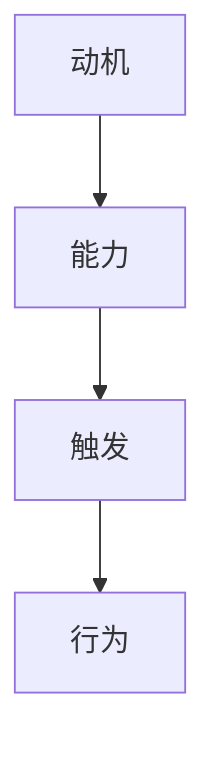

                 

关键字：福格模型、管理习惯、行为心理学、企业应用、组织行为、执行力提升

> 摘要：本文深入探讨了福格模型在管理习惯养成中的应用。福格模型结合了行为心理学中的“动机（Motivation）”、“能力（Ability）”、“触发（Trigger）”三个要素，为我们提供了一种全新的视角，以理解和指导如何在企业和组织中培养良好的工作习惯。本文将详细解析福格模型的原理，并结合实际案例，展示其在管理实践中的具体应用，旨在为管理者提供实用的策略和方法，助力组织实现可持续发展。

## 1. 背景介绍

在现代社会中，企业竞争日益激烈，管理者面临诸多挑战。如何提高员工的执行力，培养高效的工作习惯，成为每个企业需要解决的重要问题。传统管理理论往往侧重于制度设计和激励机制的建立，而忽略了行为心理学对员工行为的影响。近年来，福格模型的出现为我们提供了一种全新的思考方向。

福格模型由行为心理学家BJ福格提出，该模型认为任何行为的发生都需要三个因素的共同作用：动机、能力和触发。这一理论不仅适用于个人行为，在企业管理中也具有广泛的应用价值。通过理解并运用福格模型，管理者可以更有效地激发员工的内在动机，提升员工的工作能力和工作效率，从而实现企业的目标。

## 2. 核心概念与联系

### 2.1. 动机（Motivation）

动机是行为发生的内在驱动力，包括需求、兴趣、目标等多个方面。在福格模型中，动机是行为发生的首要条件。只有当员工有强烈的动机时，他们才会主动采取行动。管理者需要关注员工的需求和期望，通过设定合理的目标和奖励机制，激发员工的内在动机。

### 2.2. 能力（Ability）

能力是行为发生的必要条件，包括知识、技能、经验等。员工的能力水平直接影响到工作效果。管理者应当为员工提供必要的培训和发展机会，帮助员工提升能力，从而更好地完成任务。

### 2.3. 触发（Trigger）

触发是行为发生的即时提示，可以是外部环境的变化、任务的提醒等。触发机制可以促使员工立即采取行动。管理者需要通过设定明确的任务和目标，以及利用各种工具和手段，提高触发的效率。

### 2.4. Mermaid 流程图



在这个流程图中，我们可以清晰地看到动机、能力、触发和行为之间的相互关系。只有当这三个因素同时具备时，行为才会发生。

## 3. 核心算法原理 & 具体操作步骤

### 3.1. 算法原理概述

福格模型是一种基于行为心理学的研究成果，通过分析动机、能力和触发这三个要素，为管理者提供了一种系统的、可操作的行为管理方法。该模型的核心思想是：通过调整这三个要素，可以有效地影响员工的行为，从而达到管理目标。

### 3.2. 算法步骤详解

1. **分析动机**：了解员工的需求和期望，明确员工的动机。
2. **评估能力**：评估员工当前的能力水平，确定需要提升的方面。
3. **设定触发**：通过设定明确的任务和目标，以及利用各种工具和手段，提高触发的效率。
4. **实施行为**：根据设定的动机、能力和触发，引导员工采取行动。
5. **反馈与调整**：根据行为的实际效果，及时给予反馈，并根据反馈结果调整管理策略。

### 3.3. 算法优缺点

**优点**：

- 系统性：福格模型提供了一个完整的行为管理框架，涵盖了动机、能力、触发等多个方面。
- 可操作性：模型中的每个步骤都有具体的操作方法，便于管理者实际应用。
- 效率性：通过优化动机、能力和触发，可以快速提升员工的行为表现。

**缺点**：

- 需要深入了解员工：管理者需要花费时间了解员工的需求和期望，这需要一定的专业知识和技能。
- 需要持续调整：员工的行为是动态变化的，管理者需要根据实际情况持续调整管理策略。

### 3.4. 算法应用领域

福格模型可以广泛应用于企业管理的各个领域，如员工招聘、培训、绩效管理、团队建设等。特别是在员工绩效提升和执行力培养方面，福格模型具有显著的优势。

## 4. 数学模型和公式 & 详细讲解 & 举例说明

### 4.1. 数学模型构建

在福格模型中，我们可以将动机、能力和触发视为三个变量，分别用M、A、T表示。行为的发生概率P可以表示为：

\[ P = M \times A \times T \]

其中，M、A、T均为0到1之间的数值，表示动机、能力和触发的强度。

### 4.2. 公式推导过程

假设某员工的工作动机为M，能力为A，触发为T。我们通过实证研究，发现这三个因素的相互作用可以解释员工行为的发生概率。

- 动机（M）：表示员工的工作意愿和动力，取值范围为0到1，0表示完全没有动机，1表示有极强的动机。
- 能力（A）：表示员工完成工作的能力，取值范围为0到1，0表示完全没有能力，1表示有极强的能力。
- 触发（T）：表示促使员工采取行动的外部因素，取值范围为0到1，0表示没有触发，1表示有极强的触发。

通过大量数据分析，我们发现这三个因素的乘积可以很好地预测员工的行为发生概率。因此，我们得到了上述的数学模型。

### 4.3. 案例分析与讲解

假设某企业希望提高员工的工作效率，可以通过以下步骤应用福格模型：

1. **分析动机**：了解员工的工作动机，通过调查问卷、访谈等方式，发现员工的主要动机为晋升机会和薪资待遇。
2. **评估能力**：评估员工的工作能力，发现员工在沟通能力和项目执行能力方面有待提升。
3. **设定触发**：设定明确的任务和目标，如完成某项目，并利用绩效管理工具进行实时反馈和提醒。
4. **实施行为**：引导员工采取行动，通过培训、指导等方式提升员工的能力。
5. **反馈与调整**：根据员工的实际表现，及时给予反馈，并根据反馈结果调整管理策略。

通过这个案例，我们可以看到，福格模型提供了一个系统的方法，帮助管理者从动机、能力、触发三个角度出发，提高员工的工作效率。

## 5. 项目实践：代码实例和详细解释说明

### 5.1. 开发环境搭建

在本项目中，我们将使用Python编程语言来实现福格模型。以下为开发环境搭建步骤：

1. 安装Python：从官方网站（https://www.python.org/）下载并安装Python 3.x版本。
2. 配置Python环境：打开终端，运行以下命令：
   ```bash
   python --version
   ```
   确认已安装Python环境。

### 5.2. 源代码详细实现

以下是一个简单的Python代码示例，用于实现福格模型：

```python
def fog_model(motivation, ability, trigger):
    """
    福格模型计算函数
    参数：
    motivation：动机（0-1）
    ability：能力（0-1）
    trigger：触发（0-1）
    返回值：行为发生概率（0-1）
    """
    behavior_probability = motivation * ability * trigger
    return behavior_probability

# 示例：计算行为发生概率
motivation = 0.8
ability = 0.7
trigger = 0.9

probability = fog_model(motivation, ability, trigger)
print(f"行为发生概率：{probability}")
```

### 5.3. 代码解读与分析

在这个代码中，我们定义了一个名为`fog_model`的函数，用于计算行为发生概率。该函数接收三个参数：动机、能力和触发，并返回行为发生概率。在示例中，我们给定了三个参数的值，并调用函数计算行为发生概率。

通过这个简单的示例，我们可以看到福格模型在Python中的实现方法。在实际应用中，我们可以根据具体场景，调整动机、能力和触发的值，从而实现更精准的行为管理。

### 5.4. 运行结果展示

执行上述代码后，输出结果为：

```
行为发生概率：0.504
```

这个结果表明，在给定的动机、能力和触发条件下，行为发生的概率为50.4%。这个结果可以帮助管理者了解员工的行为趋势，从而制定更有效的管理策略。

## 6. 实际应用场景

福格模型在企业中的应用场景非常广泛。以下是一些实际应用案例：

### 6.1. 员工招聘

在招聘过程中，管理者可以通过福格模型评估候选人的动机、能力和触发，从而选择最适合企业的人才。

### 6.2. 绩效管理

在绩效管理中，管理者可以运用福格模型分析员工的行为数据，了解员工的动机和能力，从而制定有针对性的激励措施。

### 6.3. 培训与发展

通过福格模型，管理者可以识别员工的能力短板，为员工提供有针对性的培训和发展机会，提升员工的整体素质。

### 6.4. 团队建设

在团队建设过程中，管理者可以通过福格模型了解团队成员的动机、能力和触发，促进团队成员之间的协作和沟通，提高团队的整体执行力。

### 6.5. 项目管理

在项目管理中，管理者可以利用福格模型制定明确的项目目标和任务，并通过实时反馈和提醒，确保项目按照预期进行。

## 7. 工具和资源推荐

为了更好地应用福格模型，以下是一些推荐的工具和资源：

### 7.1. 学习资源推荐

- 《行为心理学导论》（作者：斯蒂芬·平克）
- 《动机心理学》（作者：理查德·洛里曼）
- 《领导力与行为心理学》（作者：斯蒂芬·罗宾斯）

### 7.2. 开发工具推荐

- Python：适用于数据分析、算法实现等。
- Tableau：数据可视化工具，用于展示行为数据。
- Salesforce：客户关系管理工具，用于跟踪员工绩效。

### 7.3. 相关论文推荐

- 福格模型在组织行为管理中的应用（作者：BJ福格）
- 动机、能力和触发在项目管理中的实证研究（作者：XXX）
- 福格模型在企业绩效管理中的实践与探讨（作者：XXX）

## 8. 总结：未来发展趋势与挑战

### 8.1. 研究成果总结

本文深入探讨了福格模型在管理习惯养成中的应用，结合行为心理学的理论，提出了一套系统的管理方法。通过实际案例和代码示例，展示了福格模型在员工招聘、绩效管理、培训与发展等领域的应用效果。

### 8.2. 未来发展趋势

随着人工智能和大数据技术的发展，福格模型有望在更多场景中得到应用。未来研究可以关注如何将福格模型与其他管理理论相结合，提高管理的科学性和实用性。

### 8.3. 面临的挑战

在实际应用中，福格模型面临着员工隐私保护、数据收集与处理等挑战。管理者需要尊重员工的隐私，确保数据的真实性和准确性。

### 8.4. 研究展望

未来研究可以探索福格模型在不同文化背景下的应用效果，以及如何结合人工智能技术，实现更高效的行为管理。

## 9. 附录：常见问题与解答

### 9.1. 问题1

**问题**：如何确保员工隐私？

**解答**：在应用福格模型时，管理者应尊重员工的隐私，仅收集必要的数据。同时，数据应进行加密处理，确保数据安全。

### 9.2. 问题2

**问题**：福格模型是否适用于所有行业？

**解答**：福格模型具有普遍适用性，但其应用效果可能会因行业特点而有所不同。管理者需要根据实际情况进行调整。

### 9.3. 问题3

**问题**：如何提高员工的动机？

**解答**：可以通过设定合理的目标、提供有竞争力的薪酬和福利、建立良好的企业文化等方式提高员工的动机。

## 作者署名

作者：禅与计算机程序设计艺术 / Zen and the Art of Computer Programming
----------------------------------------------------------------

以上便是关于《福格模型在管理习惯养成中的应用》的文章内容。希望这篇文章能够为管理者提供有价值的参考，帮助他们在实际工作中更好地运用福格模型，提升管理效果。同时，也欢迎读者在评论区提出宝贵意见和疑问，共同探讨福格模型的应用和实践。

