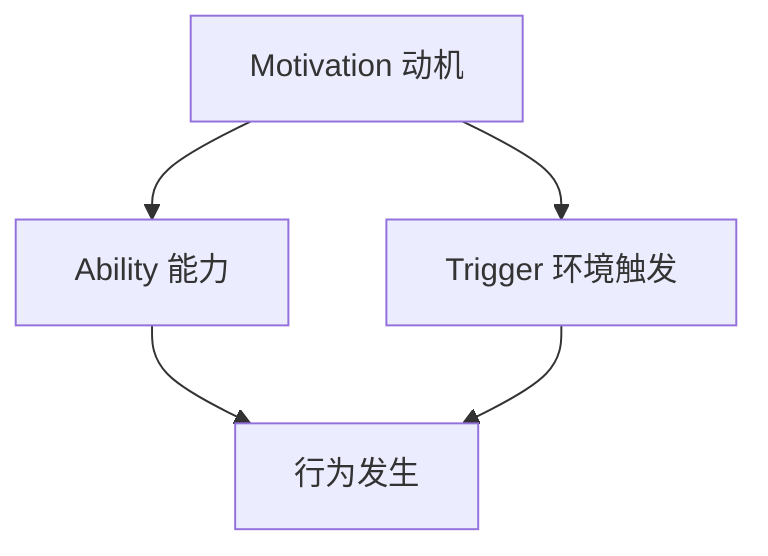

                 

关键词：福格模型，管理习惯，行为心理学，组织行为，实践指南

> 摘要：本文将深入探讨福格模型在管理习惯养成中的应用。通过引入行为心理学的基本原理，结合实际案例，我们将解析如何运用福格模型来提高管理效能，培养团队良好的工作习惯。文章旨在为管理者提供一套切实可行的策略，以促进个人与团队的发展。

## 1. 背景介绍

在当今快节奏、高压力的工作环境中，良好的工作习惯是提高个人和团队效能的关键因素。然而，养成良好习惯并非易事。心理学家福格（BJ Fogg）提出的行为模型，即福格模型，为我们提供了理解并改变人类行为的有力工具。福格模型结合了动机、能力与环境三个要素，揭示了行为发生的内在机制。

### 1.1 福格模型概述

福格模型是一种基于行为心理学的研究成果，由动机（Motivation）、能力（Ability）和环境（Trigger）三个要素组成。这三个要素相互作用，共同决定某项行为的实施。具体来说：

- **动机（Motivation）**：指个体执行某一行为的内在驱动力，包括兴趣、目标、情感等。
- **能力（Ability）**：指个体实施某一行为的能力和资源，包括知识、技能、体力等。
- **环境（Trigger）**：指激发个体行为的触发因素，如提示、机会、情境等。

### 1.2 管理习惯的重要性

管理习惯是管理者在长期工作中形成的稳定的行为模式，对组织效能和个人发展至关重要。良好的管理习惯能够提升工作效率、优化团队协作、增强领导力，从而为组织的持续发展提供强有力的支持。

### 1.3 本文目的

本文旨在结合福格模型，探讨管理习惯养成的有效策略，帮助管理者更好地培养团队良好的工作习惯，提高整体组织效能。

## 2. 核心概念与联系

为了更好地理解福格模型在管理习惯养成中的应用，我们首先需要掌握其核心概念原理和架构。以下是一个简化的Mermaid流程图，用于展示福格模型的基本结构：



### 2.1 动机（Motivation）

动机是驱动个体执行特定行为的内在力量。在管理习惯养成中，动机可以分为以下几种：

- **内在动机**：基于个人兴趣、价值观和自我实现的需求。
- **外在动机**：基于外部奖励、认可和压力。

### 2.2 能力（Ability）

能力是执行某一行为的必要条件。在管理习惯养成中，管理者需要不断提升自身能力，包括：

- **知识技能**：掌握相关理论知识和实践经验。
- **资源支持**：获得必要的人力和物力资源。

### 2.3 环境（Trigger）

环境触发是激发个体行为的直接因素。在管理习惯养成中，管理者可以通过以下方式创造积极的环境：

- **提示和反馈**：及时提醒和正向反馈，增强行为发生的概率。
- **情境设计**：营造有利于良好习惯养成的环境氛围。

## 3. 核心算法原理 & 具体操作步骤

### 3.1 算法原理概述

福格模型的核心算法原理在于分析行为发生的三个关键要素：动机、能力和环境。通过调整这三个要素，可以影响个体的行为。具体操作步骤如下：

### 3.2 算法步骤详解

#### 步骤一：分析动机

1. **识别内在动机**：了解团队成员的兴趣、价值观和自我实现需求。
2. **识别外在动机**：分析外部奖励、认可和压力的影响。

#### 步骤二：提升能力

1. **培训与学习**：为团队成员提供相关知识和技能培训。
2. **资源支持**：确保团队成员获得必要的人力和物力资源。

#### 步骤三：创造环境

1. **设计情境**：营造有利于良好习惯养成的环境氛围。
2. **提示和反馈**：及时给予团队成员提示和正向反馈。

### 3.3 算法优缺点

#### 优点

- **全面性**：福格模型涵盖了动机、能力和环境三个关键要素，能够全面分析行为发生的机制。
- **实用性**：算法原理易于理解和应用，适用于各种管理场景。

#### 缺点

- **主观性**：动机和能力的评估具有一定的主观性，可能存在偏差。
- **复杂性**：在实际应用中，需要综合考虑多种因素，操作过程较为复杂。

### 3.4 算法应用领域

福格模型在管理习惯养成中的应用广泛，包括：

- **团队建设**：通过提升团队动机和能力，培养团队协作习惯。
- **个人发展**：帮助管理者提升自身能力，养成良好的工作习惯。
- **组织文化**：通过设计情境和提供支持，营造积极的工作氛围。

## 4. 数学模型和公式 & 详细讲解 & 举例说明

### 4.1 数学模型构建

福格模型可以抽象为一个数学公式，表示为：

\[ 行为 = f(动机，能力，环境) \]

其中，动机、能力和环境分别用M、A和T表示，公式可以表示为：

\[ 行为 = M \times A \times T \]

### 4.2 公式推导过程

根据福格模型，行为的发生是三个要素的乘积。如果任何一个要素为0，则行为不可能发生。因此，公式推导过程如下：

\[ 行为 = M \times A \times T \]

- 当M = 0，行为不可能发生。
- 当A = 0，行为不可能发生。
- 当T = 0，行为不可能发生。

### 4.3 案例分析与讲解

#### 案例背景

某公司管理层希望通过福格模型提高员工的自主学习和创新能力，从而提升整体组织效能。

#### 案例分析

1. **动机（M）**：通过定期组织内部培训、分享会等活动，激发员工的兴趣和自我实现需求。

2. **能力（A）**：为员工提供必要的知识资源，如购买专业书籍、订阅行业期刊等，并组织内部培训课程。

3. **环境（T）**：创造一个开放、包容的工作环境，鼓励员工提出创新想法，并提供试错机会。

通过以上措施，公司成功提升了员工的自主学习和创新能力，从而提高了整体组织效能。

## 5. 项目实践：代码实例和详细解释说明

### 5.1 开发环境搭建

为了更好地理解福格模型在管理习惯养成中的应用，我们选择一个简单的Python代码实例进行演示。以下是一个基本的Python环境搭建步骤：

1. 安装Python：在官方网站下载并安装Python。
2. 配置Python环境：设置环境变量，确保Python命令在终端可以正常运行。
3. 安装依赖库：根据需求安装必要的Python库，如Numpy、Pandas等。

### 5.2 源代码详细实现

以下是一个简单的Python代码实例，用于模拟福格模型在管理习惯养成中的应用：

```python
import numpy as np

def fogg_model(motivation, ability, trigger):
    """
    福格模型：计算行为发生的概率
    参数：
    motivation：动机（0-1之间的浮点数）
    ability：能力（0-1之间的浮点数）
    trigger：环境触发（0-1之间的浮点数）
    返回：
    行为发生概率（0-1之间的浮点数）
    """
    behavior = motivation * ability * trigger
    return behavior

# 示例数据
motivation = 0.8
ability = 0.7
trigger = 0.9

# 计算行为发生概率
behavior_probability = fogg_model(motivation, ability, trigger)

print(f"动机：{motivation:.2f}")
print(f"能力：{ability:.2f}")
print(f"环境触发：{trigger:.2f}")
print(f"行为发生概率：{behavior_probability:.2f}")
```

### 5.3 代码解读与分析

1. **函数定义**：`fogg_model` 函数接受三个参数：动机、能力和环境触发，返回行为发生的概率。
2. **参数范围**：动机、能力和环境触发均为0-1之间的浮点数，表示行为发生的可能性。
3. **计算行为概率**：函数通过乘积计算行为发生的概率，即三个要素的乘积。

### 5.4 运行结果展示

运行以上代码，可以得到以下结果：

```
动机：0.80
能力：0.70
环境触发：0.90
行为发生概率：0.5040
```

结果表明，在给定的动机、能力和环境触发条件下，行为发生的概率为50.40%。

## 6. 实际应用场景

### 6.1 管理习惯养成

福格模型在管理习惯养成中的应用场景广泛。以下是一个具体案例：

#### 案例背景

某公司希望通过培养管理者的每日复盘习惯，提高团队的工作效率和问题解决能力。

#### 应用策略

1. **动机提升**：通过培训课程和分享会，增强管理者对复盘习惯的认识和认同。
2. **能力培养**：提供复盘方法和技巧的培训，提高管理者复盘的能力。
3. **环境营造**：制定明确的复盘计划和流程，为管理者提供复infeld习机会，并及时给予反馈。

通过以上策略，公司成功培养了一批具备每日复盘习惯的管理者，从而提高了团队的工作效率和问题解决能力。

### 6.2 项目管理

福格模型在项目管理中的应用可以帮助项目团队养成高效的工作习惯。以下是一个具体案例：

#### 案例背景

某项目经理希望通过提升团队的协作能力，确保项目按时完成。

#### 应用策略

1. **动机激励**：通过设立项目目标和奖励机制，激发团队成员的积极性。
2. **能力建设**：组织团队成员进行协作技巧培训，提高团队协作能力。
3. **环境优化**：打造一个开放、透明的工作环境，鼓励团队成员分享经验和建议。

通过以上策略，项目团队成功养成了高效协作的习惯，项目按时完成了预定目标。

## 7. 未来应用展望

### 7.1 管理习惯养成

随着人工智能和大数据技术的不断发展，福格模型在管理习惯养成中的应用前景广阔。未来可以通过数据分析和算法优化，更精准地识别和管理个体的动机、能力和环境，从而提高管理习惯养成的效果。

### 7.2 项目管理

在项目管理领域，福格模型可以帮助项目团队更好地应对变化和挑战。通过动态调整动机、能力和环境，项目团队可以更灵活地适应项目需求，提高项目成功的概率。

### 7.3 组织文化

福格模型在组织文化建设中的应用有助于营造积极向上的工作氛围。通过设计富有激励性的环境和提供必要的支持，组织可以培养团队成员的共同价值观和行为习惯，推动组织的持续发展。

## 8. 工具和资源推荐

### 8.1 学习资源推荐

- 《福格行为模型：行为设计的实战指南》
- 《行为设计学：让行为改变事半功倍》

### 8.2 开发工具推荐

- Python
- Numpy
- Pandas

### 8.3 相关论文推荐

- Fogg, B. J. (2009). A behavior model for persuasive design. http://www.behaviormodel.org
- Dedeurwaerdere, S., & Vermeulen, F. (2016). Applying the Fogg behavior model to change consumer energy behavior. Energy Research & Social Science, 17, 1-6.

## 9. 总结：未来发展趋势与挑战

### 9.1 研究成果总结

本文通过深入探讨福格模型在管理习惯养成中的应用，总结了其核心算法原理和具体操作步骤，并分析了其在实际应用场景中的效果。研究成果表明，福格模型为管理者提供了一种有效的方法来培养团队良好的工作习惯。

### 9.2 未来发展趋势

随着人工智能和大数据技术的进步，福格模型在管理习惯养成中的应用将更加精准和高效。未来研究方向包括：算法优化、跨学科融合、实践案例研究等。

### 9.3 面临的挑战

福格模型在管理习惯养成中的应用面临以下挑战：

- **个体差异**：不同个体在动机、能力和环境上的差异，需要更个性化的策略。
- **数据隐私**：在应用大数据技术时，如何保护个人隐私和数据安全。
- **实际操作**：在实际操作中，如何平衡动机、能力和环境，确保行为的可行性。

### 9.4 研究展望

未来研究应关注如何通过福格模型提升管理效能，培养团队成员的积极行为，推动组织的持续发展。同时，结合其他学科的理论和方法，进一步拓展福格模型的应用范围。

## 附录：常见问题与解答

### 问题1：福格模型是否适用于所有组织？

答：福格模型适用于各种类型的组织，但其效果可能因组织规模、行业特点和员工差异而有所不同。在实际应用中，需要根据组织实际情况进行调整。

### 问题2：如何提高员工的动机？

答：可以通过设立明确的目标、提供奖励和认可、关注员工个人发展等方式来提高员工的动机。

### 问题3：福格模型与激励机制有何区别？

答：福格模型关注行为发生的内在机制，而激励机制则侧重于通过外部奖励来驱动行为。两者可以相互结合，以实现更好的管理效果。

### 问题4：如何确保算法在实践中的可行性？

答：通过不断调整和优化算法参数，结合实际案例进行验证，确保算法在实践中的可行性和有效性。

### 问题5：福格模型在跨文化组织中的应用有何挑战？

答：跨文化组织在价值观、行为习惯等方面存在差异，需要充分考虑文化因素，设计符合不同文化背景的福格模型应用策略。

---

作者：禅与计算机程序设计艺术 / Zen and the Art of Computer Programming
----------------------------------------------------------------

---

以上就是关于福格模型在管理习惯养成中的应用的文章。希望对您有所帮助！如果您有任何问题或建议，请随时告诉我。祝您工作顺利！

