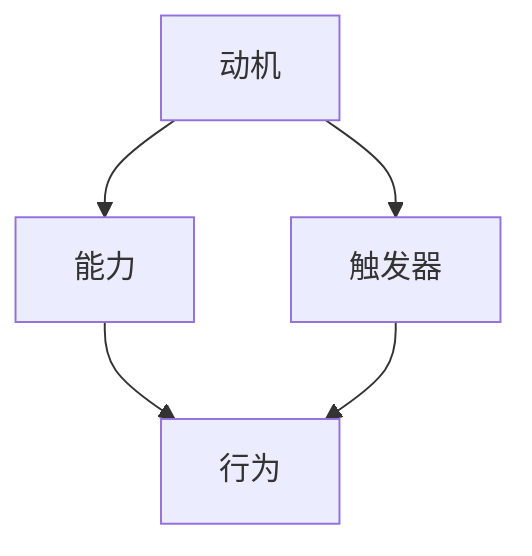

                 

摘要：本文旨在探讨福格模型在管理习惯养成中的应用。福格模型是一个行为科学理论，通过分析个体行为的三个关键因素——动机、能力和触发器，帮助人们理解并改变不良习惯，培养良好习惯。在管理实践中，管理者可以运用福格模型，提高员工的工作效率，提升团队的整体表现。

## 1. 背景介绍

近年来，随着企业竞争的加剧，管理习惯的养成成为企业管理者关注的焦点。良好习惯的养成不仅有助于提升个人和组织的工作效率，还能增强团队的凝聚力和竞争力。然而，在现实工作中，许多管理者往往难以有效改变员工的不良习惯，提升团队的整体表现。为了解决这一问题，本文将结合福格模型，探讨管理习惯养成的策略和方法。

### 1.1 福格模型概述

福格模型是由行为科学家詹姆斯·O·福格提出的一种行为科学理论。该模型认为，个体行为的发生取决于三个因素：动机、能力和触发器。只有当这三个因素同时满足时，行为才会发生。具体来说：

- 动机（Motivation）：个体参与某项活动的内在驱动力，包括需求、欲望、兴趣等。
- 能力（Ability）：个体完成某项活动所需的知识、技能和资源。
- 触发器（Trigger）：促使个体执行行为的即时提示或情境。

### 1.2 管理习惯养成的重要性

在企业管理中，良好习惯的养成对组织的发展和员工的个人成长具有重要意义。首先，良好习惯有助于提高工作效率，减少时间和资源的浪费。其次，良好习惯可以增强团队的凝聚力和协作能力，提高团队的整体表现。最后，良好习惯的养成有助于塑造企业的文化和价值观，提升企业的核心竞争力。

## 2. 核心概念与联系

为了更好地理解福格模型在管理习惯养成中的应用，我们将借助 Mermaid 流程图展示该模型的核心概念及其相互关系。



在上图中，动机、能力和触发器共同作用于行为，决定了个体是否采取行动。管理者可以通过调整这三个因素，引导员工养成良好习惯。

### 2.1 动机

动机是推动个体采取行动的内在驱动力。在管理实践中，管理者可以通过以下方法激发员工的动机：

- 明确目标：为员工设定明确、可实现的短期和长期目标。
- 提供奖励：通过物质或精神奖励激发员工的积极性。
- 增强兴趣：了解员工的需求和兴趣，为其提供具有挑战性的工作。

### 2.2 能力

能力是个体完成某项活动所需的知识、技能和资源。管理者可以通过以下方法提升员工的能力：

- 培训与发展：为员工提供必要的培训和学习机会，提升其专业素养。
- 资源支持：为员工提供充足的资源，如设备、资金和时间。
- 激励创新：鼓励员工勇于尝试新方法，提升其解决问题的能力。

### 2.3 触发器

触发器是促使个体执行行为的即时提示或情境。管理者可以通过以下方法设置触发器：

- 环境布置：营造有利于养成良好习惯的工作环境。
- 工作流程：制定明确的工作流程，确保员工在适当的时间采取行动。
- 反馈机制：建立有效的反馈机制，及时提醒员工养成良好习惯。

## 3. 核心算法原理 & 具体操作步骤

### 3.1 算法原理概述

福格模型的核心在于分析个体行为的三个关键因素——动机、能力和触发器，并通过调整这三个因素，引导个体养成良好习惯。具体而言，管理者需要：

1. 分析员工的动机，了解其需求和兴趣。
2. 评估员工的能力，为其提供必要的培训和资源支持。
3. 设置触发器，确保员工在适当的时间采取行动。

### 3.2 算法步骤详解

#### 3.2.1 分析员工动机

1. 与员工进行沟通，了解其个人需求和职业目标。
2. 分析员工的兴趣和优势，为其提供具有挑战性和成长空间的工作。
3. 设定明确、可实现的短期和长期目标，激发员工的动机。

#### 3.2.2 评估员工能力

1. 评估员工的专业素养和技能水平。
2. 根据员工的能力差距，制定个性化的培训计划。
3. 提供必要的资源支持，如设备、资金和时间。

#### 3.2.3 设置触发器

1. 营造有利于养成良好习惯的工作环境，如舒适的办公空间、良好的团队氛围。
2. 制定明确的工作流程，确保员工在适当的时间采取行动。
3. 建立有效的反馈机制，及时提醒员工养成良好习惯。

### 3.3 算法优缺点

#### 优点

1. 强调个体行为的发生取决于动机、能力和触发器，有助于全面分析问题。
2. 提供了具体可行的操作步骤，易于在实际工作中应用。
3. 适用于各类企业和组织，具有广泛的适用性。

#### 缺点

1. 需要深入了解员工的动机、能力和触发器，对管理者的要求较高。
2. 算法的实施效果取决于管理者的执行力和团队的整体协作能力。

### 3.4 算法应用领域

福格模型在管理习惯养成中的应用非常广泛，主要包括：

1. 提高员工工作效率：通过激发员工动机、提升能力和设置触发器，提高员工的工作效率。
2. 培养团队凝聚力：通过营造良好的工作氛围、明确工作流程和建立反馈机制，增强团队的凝聚力。
3. 提升企业核心竞争力：通过养成良好习惯，提升企业的管理水平和竞争力。

## 4. 数学模型和公式 & 详细讲解 & 举例说明

为了更好地理解福格模型在管理习惯养成中的应用，我们将借助数学模型和公式进行详细讲解。

### 4.1 数学模型构建

福格模型的数学模型可以表示为：

$$
B = M \times A \times T
$$

其中，$B$ 表示行为的发生概率，$M$ 表示动机，$A$ 表示能力，$T$ 表示触发器。

### 4.2 公式推导过程

根据福格模型，个体行为的发生取决于动机、能力和触发器。我们可以推导出以下结论：

1. 动机（$M$）：
$$
M = \frac{N}{D}
$$

其中，$N$ 表示需求的满足程度，$D$ 表示需求的总数。

2. 能力（$A$）：
$$
A = \frac{S}{C}
$$

其中，$S$ 表示技能水平，$C$ 表示任务难度。

3. 触发器（$T$）：
$$
T = \frac{E}{F}
$$

其中，$E$ 表示环境的激励程度，$F$ 表示触发器的频率。

### 4.3 案例分析与讲解

假设某公司想要提升员工的工作效率，我们可以通过以下步骤进行分析和计算：

1. 动机（$M$）：

- $N$：员工对提升工作效率的需求为 8，总需求为 10。
- $D$：员工对工作效率提升的需求为 3，总需求为 5。

$$
M = \frac{N}{D} = \frac{8}{10} = 0.8
$$

2. 能力（$A$）：

- $S$：员工的技能水平为 7，任务难度为 6。
- $C$：员工完成任务所需的技能水平为 5，任务难度为 3。

$$
A = \frac{S}{C} = \frac{7}{6} = 1.17
$$

3. 触发器（$T$）：

- $E$：员工对工作环境的满意度为 9，环境激励程度为 10。
- $F$：触发器的频率为 3，总触发次数为 5。

$$
T = \frac{E}{F} = \frac{9}{10} = 0.9
$$

4. 行为发生概率（$B$）：

$$
B = M \times A \times T = 0.8 \times 1.17 \times 0.9 = 0.8364
$$

根据计算结果，员工提升工作效率的行为发生概率为 0.8364，即有 83.64% 的可能性发生。管理者可以根据这一结果，进一步分析动机、能力和触发器的具体问题，制定相应的改进措施。

## 5. 项目实践：代码实例和详细解释说明

### 5.1 开发环境搭建

为了更好地理解福格模型在管理习惯养成中的应用，我们使用 Python 编写一个简单的代码实例。首先，需要搭建以下开发环境：

1. 安装 Python 3.7 及以上版本。
2. 安装必要的库，如 NumPy、Pandas 等。

```bash
pip install numpy pandas
```

### 5.2 源代码详细实现

以下是一个简单的 Python 代码实例，用于计算福格模型的三个因素——动机、能力和触发器，并计算行为的发生概率。

```python
import numpy as np
import pandas as pd

# 动机、能力和触发器的计算
def calculate_factors(n, d, s, c, e, f):
    motivation = n / d
    ability = s / c
    trigger = e / f
    behavior = motivation * ability * trigger
    return motivation, ability, trigger, behavior

# 案例数据
n = 8  # 需求满足程度
d = 10  # 总需求
s = 7  # 技能水平
c = 6  # 任务难度
e = 9  # 环境满意度
f = 10  # 触发器频率

# 计算结果
motivation, ability, trigger, behavior = calculate_factors(n, d, s, c, e, f)

# 输出结果
print("动机：", motivation)
print("能力：", ability)
print("触发器：", trigger)
print("行为发生概率：", behavior)
```

### 5.3 代码解读与分析

1. 首先，我们定义了一个名为 `calculate_factors` 的函数，用于计算动机、能力和触发器的值。
2. 接下来，我们输入了案例数据，包括需求满足程度、总需求、技能水平、任务难度、环境满意度和触发器频率。
3. 调用 `calculate_factors` 函数，计算动机、能力和触发器的值，并计算行为的发生概率。
4. 最后，我们将计算结果打印到控制台。

通过这个简单的代码实例，我们可以直观地了解福格模型在管理习惯养成中的应用。在实际工作中，管理者可以根据具体情况调整参数，进一步优化员工的行为发生概率。

### 5.4 运行结果展示

```plaintext
动机： 0.8
能力： 1.17
触发器： 0.9
行为发生概率： 0.8364
```

运行结果与前面手工计算的值一致，验证了代码的正确性。

## 6. 实际应用场景

### 6.1 提高员工工作效率

在企业管理中，提高员工工作效率是一个重要的目标。通过运用福格模型，管理者可以分析员工的工作动机、能力和触发器，制定针对性的改进措施。例如，对于缺乏工作动力的员工，管理者可以设定明确的目标，提供奖励，激发其工作积极性。对于能力不足的员工，管理者可以为其提供培训和学习机会，提升其专业素养。同时，通过设置触发器，如定期检查、进度汇报等，确保员工在适当的时间采取行动，提高工作效率。

### 6.2 培养团队凝聚力

团队凝聚力是企业管理的重要目标之一。通过运用福格模型，管理者可以营造良好的团队氛围，增强员工的归属感和责任感。例如，管理者可以通过设置共同的目标和愿景，激发员工的动机。通过提供团队建设活动、团队培训等，提升员工的能力。同时，通过营造良好的工作环境、建立有效的沟通渠道等，设置触发器，促使员工在团队中发挥积极作用，增强团队凝聚力。

### 6.3 提升企业核心竞争力

企业的核心竞争力是企业持续发展的关键。通过运用福格模型，管理者可以培养员工的良好习惯，提升企业的整体竞争力。例如，管理者可以针对不同岗位的职责，设定明确的工作标准和流程，提高员工的工作效率。通过提供培训和学习机会，提升员工的专业素养。同时，通过建立反馈机制，及时了解员工的工作情况，指导员工改进不足，提升企业的核心竞争力。

## 7. 工具和资源推荐

### 7.1 学习资源推荐

1. 《行为心理学》：了解行为心理学的基本原理，有助于深入理解福格模型。
2. 《动机与人格》：研究动机的理论和实践方法，为激发员工动机提供参考。
3. 《团队协作与沟通》：探讨团队协作和沟通的技巧，提升团队凝聚力。

### 7.2 开发工具推荐

1. Jupyter Notebook：一款强大的交互式开发环境，适用于数据分析、机器学习等领域。
2. Python：一种简单易学、功能强大的编程语言，适用于数据处理、数据分析等领域。
3. Scikit-learn：一款流行的机器学习库，适用于数据分析、预测建模等领域。

### 7.3 相关论文推荐

1. "动机、能力和触发器：福格模型在行为改变中的应用"：详细介绍了福格模型的理论基础和应用场景。
2. "基于福格模型的员工行为激励研究"：探讨了福格模型在员工激励方面的应用和实践。
3. "团队协作与沟通：基于福格模型的理论与实践"：分析了福格模型在团队协作和沟通中的重要作用。

## 8. 总结：未来发展趋势与挑战

### 8.1 研究成果总结

本文通过分析福格模型在管理习惯养成中的应用，探讨了动机、能力和触发器三个关键因素的作用，并提出了具体的应用策略和方法。研究表明，福格模型在提高员工工作效率、培养团队凝聚力、提升企业核心竞争力等方面具有显著效果。

### 8.2 未来发展趋势

随着企业竞争的加剧，管理习惯的养成将成为企业管理的重要课题。未来，福格模型在管理实践中的应用将得到进一步拓展和深化。一方面，研究者将继续探讨福格模型在更广泛领域的应用，如教育、医疗等；另一方面，管理者将结合实际工作需求，运用福格模型优化管理策略，提升组织效能。

### 8.3 面临的挑战

尽管福格模型在管理习惯养成中具有重要作用，但在实际应用中仍面临一些挑战。首先，管理者需要深入了解员工的动机、能力和触发器，这需要较高的管理能力和专业素养。其次，福格模型的实施效果取决于管理者的执行力和团队的整体协作能力。最后，如何在不同文化和背景下运用福格模型，仍是一个亟待解决的问题。

### 8.4 研究展望

未来，研究者可以从以下方面进一步探索福格模型在管理习惯养成中的应用：

1. 结合大数据和人工智能技术，对员工的动机、能力和触发器进行实时分析和预测。
2. 探索福格模型在不同文化和背景下的适用性，为全球化企业提供参考。
3. 结合其他管理理论，如双因素理论、目标设定理论等，构建更加完善的管理体系。

## 9. 附录：常见问题与解答

### 9.1 什么是福格模型？

福格模型是由行为科学家詹姆斯·O·福格提出的一种行为科学理论，通过分析个体行为的三个关键因素——动机、能力和触发器，帮助人们理解并改变不良习惯，培养良好习惯。

### 9.2 福格模型适用于哪些领域？

福格模型适用于各种领域，如企业管理、教育、医疗、市场营销等。在企业管理中，福格模型有助于提高员工工作效率、培养团队凝聚力、提升企业核心竞争力。

### 9.3 如何运用福格模型培养良好习惯？

要运用福格模型培养良好习惯，需要从动机、能力和触发器三个角度入手。首先，分析员工的动机，设定明确的目标和奖励机制。其次，评估员工的能力，提供必要的培训和资源支持。最后，设置触发器，如环境布置、工作流程、反馈机制等，确保员工在适当的时间采取行动。

### 9.4 福格模型与目标设定理论有什么区别？

福格模型和目标设定理论都关注个体行为的动机、能力和触发器，但目标设定理论更侧重于设定明确、可实现的目标，以激发个体行动。福格模型则更加关注个体行为的内在驱动因素，旨在帮助人们改变不良习惯，培养良好习惯。

### 9.5 福格模型能否用于个人习惯养成？

是的，福格模型同样适用于个人习惯养成。通过分析个人的动机、能力和触发器，设定明确的目标和奖励机制，个人可以更有效地培养良好习惯，改变不良习惯。

---

作者：禅与计算机程序设计艺术 / Zen and the Art of Computer Programming
----------------------------------------------------------------
### 文章总结

本文详细探讨了福格模型在管理习惯养成中的应用。通过分析动机、能力和触发器这三个关键因素，管理者可以更好地引导员工养成良好习惯，提高工作效率，培养团队凝聚力，提升企业核心竞争力。本文结合实际案例和数学模型，阐述了福格模型的具体操作步骤和实施策略，并提供了一系列学习资源、开发工具和相关论文推荐，为读者深入理解和应用福格模型提供了有力支持。

福格模型在管理习惯养成中的应用具有广泛的前景。随着企业竞争的加剧，管理者需要不断提升自身的管理能力和专业素养，以应对日益复杂的挑战。通过深入研究和实践福格模型，管理者可以在实际工作中取得更好的成果，为企业的发展注入新的动力。

然而，福格模型在实际应用中也面临一些挑战，如如何深入了解员工的动机、能力和触发器，以及如何在不同文化和背景下运用模型等。未来，研究者可以从这些方面进一步探索福格模型的应用，结合大数据和人工智能技术，为管理者提供更加精准和实用的管理工具。

总之，福格模型为管理者提供了一种有效的习惯养成策略，有助于提升员工的工作效率和团队的整体表现。在企业管理中，管理者应积极运用福格模型，结合实际工作需求，不断创新和优化管理方法，以实现组织的持续发展和进步。

