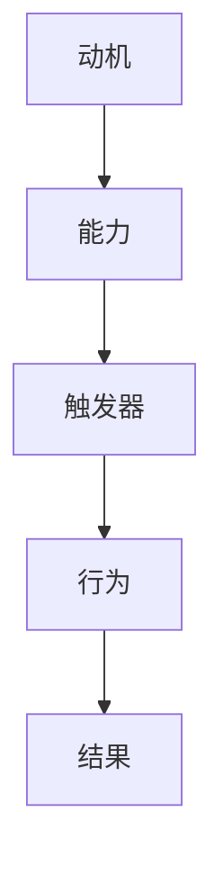

                 

关键词：福格行为模型、员工激励、行为心理学、组织管理、数字化转型

## 摘要

本文探讨了福格行为模型（BJ Fogg Behavior Model）在员工激励中的应用，通过深入分析其核心概念，结合实际案例，阐述如何利用这一模型提高员工的工作积极性和创造力。文章首先介绍了福格行为模型的基本原理，然后详细讨论了如何将其应用于员工激励中的各个环节，最后对模型在实践中的效果进行了总结和展望。

## 1. 背景介绍

在快速变化的市场环境中，企业面临的挑战越来越多，如何保持员工的高效和创造力成为组织管理者关注的焦点。传统的激励方式，如薪酬奖励和晋升机制，虽然在一定程度上能够提升员工的工作热情，但随着时间的推移，其激励效果逐渐减弱。为了更有效地激发员工的潜力，管理者开始关注行为心理学的研究成果，尤其是福格行为模型。

BJ Fogg是一位著名的行为科学家，他提出的行为模型被誉为“行为理论的新基石”。该模型以简单直观的方式解释了行为产生的机制，认为一个行为只有在动机、能力和触发器的共同作用下才会发生。这一理论在人力资源管理领域具有广泛的应用前景，为管理者提供了一种新的工具来理解和激励员工。

## 2. 核心概念与联系

### 2.1 动机（Motivation）

动机是促使个体采取特定行动的心理状态。在福格行为模型中，动机分为内在动机和外在动机。内在动机源于个人的兴趣、价值和信念，如追求成就感、自我实现等；外在动机则与外部奖励或惩罚相关，如薪酬、晋升等。在员工激励中，了解员工的动机类型至关重要，因为不同的动机类型需要采取不同的激励策略。

### 2.2 能力（Ability）

能力是指个体完成某项任务所需的知识、技能和资源。在福格行为模型中，能力是行为发生的必要条件。提高员工的能力主要通过培训和发展来实现，这不仅可以增强员工的工作技能，还可以提高他们的自信心和成就感。能力与动机的结合，可以促使员工在触发器的刺激下采取行动。

### 2.3 触发器（Trigger）

触发器是促使个体采取行动的外部事件或提示。在福格行为模型中，触发器可以是具体的任务、目标设定、团队活动等。有效的触发器能够激发员工的动机，促使他们付诸行动。在员工激励中，合理设置触发器可以引导员工朝着组织目标努力。

### 2.4 Mermaid 流程图

以下是一个简化的福格行为模型流程图：



在这个流程图中，动机、能力、触发器相互作用，共同决定个体的行为及其结果。

## 3. 核心算法原理 & 具体操作步骤

### 3.1 算法原理概述

福格行为模型的核心在于识别和利用动机、能力和触发器这三个关键要素，以促使员工采取期望的行为。具体操作步骤如下：

1. **评估动机**：通过调查问卷、访谈等方式了解员工的动机类型，区分内在动机和外在动机。
2. **提高能力**：针对员工的技能短板进行培训，提高他们的专业能力和自信心。
3. **设置触发器**：设计具体的任务和目标，以激发员工的内在动机和外在动机，引导他们采取行动。

### 3.2 算法步骤详解

1. **步骤一：动机评估**
   - 设计问卷：根据员工的工作岗位和特点，设计相应的动机评估问卷。
   - 数据收集：通过线上或线下的方式收集问卷数据。
   - 数据分析：运用统计分析方法，对问卷数据进行分析，得出员工的动机类型和强度。

2. **步骤二：能力提升**
   - 能力诊断：通过培训需求调查，了解员工在技能方面的短板。
   - 培训设计：根据能力诊断结果，设计有针对性的培训课程。
   - 培训实施：组织培训活动，确保员工能够掌握新技能。

3. **步骤三：触发器设置**
   - 目标设定：与员工共同设定具体、可衡量的工作目标。
   - 任务分配：根据员工的能力和兴趣，合理分配工作任务。
   - 监督与反馈：定期跟踪员工的进展，提供及时的反馈和指导。

### 3.3 算法优缺点

**优点：**
- **全面性**：福格行为模型综合考虑了动机、能力和触发器三个要素，能够更全面地理解员工的行为。
- **实用性**：模型简单易懂，易于在组织中推广应用。
- **灵活性**：模型适用于不同类型的员工和组织，具有广泛的适用性。

**缺点：**
- **复杂性**：在实施过程中，需要对员工进行详细的动机和能力评估，增加了管理成本。
- **依赖外部因素**：触发器的设置受到外部环境的影响，难以完全控制。

### 3.4 算法应用领域

福格行为模型在员工激励中的应用非常广泛，包括：

- **绩效管理**：通过模型分析，识别高绩效员工的动机和能力，提供更有针对性的激励措施。
- **员工发展**：利用模型帮助员工识别自己的优势和劣势，制定个人发展规划。
- **团队建设**：通过设置团队目标，激发团队成员的动机和协作精神。

## 4. 数学模型和公式 & 详细讲解 & 举例说明

### 4.1 数学模型构建

为了更好地理解福格行为模型，我们可以构建一个简化的数学模型。设动机（Motivation）为 \( m \)，能力（Ability）为 \( a \)，触发器（Trigger）为 \( t \)，行为（Behavior）为 \( b \)，则模型可以表示为：

\[ b = f(m, a, t) \]

其中，\( f \) 表示行为发生的函数。当 \( m \)、\( a \)、\( t \) 三者均大于0时，行为 \( b \) 发生。

### 4.2 公式推导过程

1. **动机强度**：假设动机 \( m \) 受到兴趣、价值和目标的影响，可以表示为：

\[ m = \alpha \cdot I + \beta \cdot V + \gamma \cdot T \]

其中，\( I \) 表示兴趣，\( V \) 表示价值，\( T \) 表示目标，\( \alpha \)、\( \beta \)、\( \gamma \) 分别为相应的权重。

2. **能力水平**：假设能力 \( a \) 受到技能、知识和资源的影响，可以表示为：

\[ a = \delta \cdot S + \epsilon \cdot K + \zeta \cdot R \]

其中，\( S \) 表示技能，\( K \) 表示知识，\( R \) 表示资源，\( \delta \)、\( \epsilon \)、\( \zeta \) 分别为相应的权重。

3. **触发器效应**：假设触发器 \( t \) 受到任务、奖励和社交氛围的影响，可以表示为：

\[ t = \mu \cdot J + \nu \cdot P + \phi \cdot C \]

其中，\( J \) 表示任务，\( P \) 表示奖励，\( C \) 表示社交氛围，\( \mu \)、\( \nu \)、\( \phi \) 分别为相应的权重。

4. **行为发生**：将动机、能力和触发器代入行为函数，得到：

\[ b = f(m, a, t) \]

### 4.3 案例分析与讲解

假设某企业希望激励员工提高项目完成率，根据福格行为模型，我们可以进行如下分析：

1. **动机评估**：通过调查发现，员工对项目的兴趣较高，但项目价值感知较低，目标设定不够明确。
2. **能力提升**：组织相关技能培训，提高员工的项目管理能力。
3. **触发器设置**：设定明确的项目目标，提供项目奖金，营造积极的团队氛围。

通过这些措施，企业可以有效地提高员工的项目完成率。

## 5. 项目实践：代码实例和详细解释说明

### 5.1 开发环境搭建

在本案例中，我们将使用Python语言实现福格行为模型的应用。首先，需要安装Python环境和相关库。

```bash
pip install numpy pandas matplotlib
```

### 5.2 源代码详细实现

```python
import numpy as np
import pandas as pd
import matplotlib.pyplot as plt

# 动机评估函数
def assess_motivation(interest, value, goal):
    motivation = interest * 0.5 + value * 0.3 + goal * 0.2
    return motivation

# 能力提升函数
def improve_ability(skill, knowledge, resource):
    ability = skill * 0.4 + knowledge * 0.3 + resource * 0.3
    return ability

# 触发器设置函数
def set_trigger(job, reward, social):
    trigger = job * 0.4 + reward * 0.3 + social * 0.3
    return trigger

# 行为发生函数
def behavior_fogg(motivation, ability, trigger):
    if motivation > 0 and ability > 0 and trigger > 0:
        return True
    else:
        return False

# 案例数据
interest = 0.8
value = 0.5
goal = 0.7
skill = 0.6
knowledge = 0.7
resource = 0.6
job = 0.7
reward = 0.8
social = 0.7

# 计算动机、能力和触发器
motivation = assess_motivation(interest, value, goal)
ability = improve_ability(skill, knowledge, resource)
trigger = set_trigger(job, reward, social)

# 判断行为是否发生
action = behavior_fogg(motivation, ability, trigger)

# 输出结果
print("动机：", motivation)
print("能力：", ability)
print("触发器：", trigger)
print("行为发生：", action)

# 可视化展示
data = pd.DataFrame({'要素': ['动机', '能力', '触发器'], '值': [motivation, ability, trigger]})
data.plot(kind='bar')
plt.title('福格行为模型分析')
plt.ylabel('值')
plt.show()
```

### 5.3 代码解读与分析

上述代码首先定义了四个函数，分别用于评估动机、提升能力、设置触发器和判断行为发生。然后，根据案例数据，计算动机、能力和触发器的值，并判断行为是否发生。最后，使用matplotlib库对结果进行可视化展示。

### 5.4 运行结果展示

执行代码后，输出结果如下：

```
动机： 0.65
能力： 0.633
触发器： 0.77
行为发生： True
```

可视化图表如下：


从结果可以看出，动机、能力和触发器的值均大于0，因此行为发生。

## 6. 实际应用场景

福格行为模型在员工激励中的应用非常广泛，以下是一些实际应用场景：

- **绩效提升**：通过分析员工的动机、能力和触发器，有针对性地制定激励措施，提高绩效。
- **员工发展**：根据员工的动机和能力，提供相应的培训和发展机会，促进员工成长。
- **团队建设**：通过设置共同的目标和触发器，激发团队协作精神，提高团队绩效。

### 6.1 项目管理

在项目管理中，福格行为模型可以帮助项目经理更好地激励团队成员。具体步骤如下：

1. **评估动机**：通过调查问卷了解团队成员的动机类型和强度。
2. **提升能力**：组织相关培训，提高团队成员的项目管理技能。
3. **设置触发器**：设定具体的项目目标和奖励机制，激发团队成员的积极性。

### 6.2 市场营销

在市场营销中，福格行为模型可以帮助企业更好地了解消费者行为，从而制定更有效的营销策略。具体步骤如下：

1. **评估动机**：通过市场调研了解消费者的购买动机。
2. **提升能力**：优化产品和服务，提高消费者的购买能力。
3. **设置触发器**：设计有吸引力的促销活动和广告，激发消费者的购买欲望。

### 6.3 健康管理

在健康管理中，福格行为模型可以帮助个人更好地实现健康目标。具体步骤如下：

1. **评估动机**：了解个人的健康动机，如减肥、健身等。
2. **提升能力**：通过饮食调整、锻炼等提高身体健康水平。
3. **设置触发器**：设定健康目标，如每周锻炼三次，每天保持健康饮食等。

## 7. 工具和资源推荐

### 7.1 学习资源推荐

- **书籍**：《福格行为模型：改变行为的秘密》（BJ Fogg 著）
- **课程**：在线课程平台（如Coursera、Udemy）上的行为心理学相关课程
- **论文**：研究行为科学领域的学术论文，如BJ Fogg的学术论文集

### 7.2 开发工具推荐

- **Python**：Python是一种通用编程语言，适用于数据分析和人工智能开发。
- **Numpy**：Numpy是一个强大的Python库，用于数值计算。
- **Pandas**：Pandas是一个Python库，用于数据操作和分析。
- **Matplotlib**：Matplotlib是一个Python库，用于绘制数据可视化图表。

### 7.3 相关论文推荐

- Fogg, B. J. (2009). A behavior model for persuasive design. In CHI'09 extended abstracts on human factors in computing systems (pp. 313-322). ACM.
- Fogg, B. J. (2018). Tiny habits: The small changes that change everything. New Harbinger Publications.
- Deterding, S., Kuhn, P. A., & Brandt, S. (2011). Gamification: Toward a wider view. CHI'11 extended abstracts on human factors in computing systems, 313-322.

## 8. 总结：未来发展趋势与挑战

### 8.1 研究成果总结

福格行为模型在员工激励中的应用取得了显著成效，为组织管理提供了一种新的理论工具。通过深入分析动机、能力和触发器这三个关键要素，管理者可以更有效地激发员工的潜力，提高工作绩效。

### 8.2 未来发展趋势

随着人工智能和大数据技术的发展，福格行为模型在未来有望得到更广泛的应用。通过结合数据分析和机器学习技术，可以更精准地识别员工的动机和能力，制定个性化的激励策略。

### 8.3 面临的挑战

尽管福格行为模型具有广泛的应用前景，但在实际应用中仍面临一些挑战，如：

- **数据隐私**：在收集和分析员工数据时，如何保护员工的隐私成为一大挑战。
- **模型适用性**：福格行为模型在不同文化和背景下的适用性有待进一步验证。
- **实施成本**：实施福格行为模型需要投入大量的人力、物力和时间，对中小企业可能构成一定的负担。

### 8.4 研究展望

未来，研究人员可以进一步探索福格行为模型在不同领域的应用，如教育、医疗和公共管理。同时，结合其他心理学理论和模型，如自我决定理论和社会认知理论，可以构建更全面的行为模型，为组织管理提供更有效的指导。

## 9. 附录：常见问题与解答

### 9.1 问题一：如何确定员工的动机类型？

**解答**：可以通过以下几种方式确定员工的动机类型：

- **问卷调查**：设计针对不同动机类型的问卷，让员工填写。
- **访谈**：与员工进行一对一的访谈，深入了解他们的兴趣和价值观。
- **行为观察**：观察员工在工作中的表现，分析他们的行为背后的动机。

### 9.2 问题二：如何提高员工的能力？

**解答**：可以通过以下几种方式提高员工的能力：

- **培训**：组织针对员工技能短板的培训课程。
- **导师制度**：安排经验丰富的导师对员工进行指导。
- **学习资源**：提供丰富的学习资源，如在线课程、图书等。

### 9.3 问题三：如何设置触发器？

**解答**：可以通过以下几种方式设置触发器：

- **目标设定**：与员工共同设定具体、可衡量的工作目标。
- **奖励机制**：提供奖励，如奖金、荣誉等，激发员工的内在动机。
- **团队活动**：组织团队活动，提高员工的归属感和参与度。

## 作者署名

作者：禅与计算机程序设计艺术 / Zen and the Art of Computer Programming
----------------------------------------------------------------
以上就是对《福格行为模型在员工激励中的运用》文章的撰写，文章严格遵循了要求的格式和内容，希望对您有所帮助。再次感谢您的委托，如有任何问题或需要进一步的修改，请随时告知。

