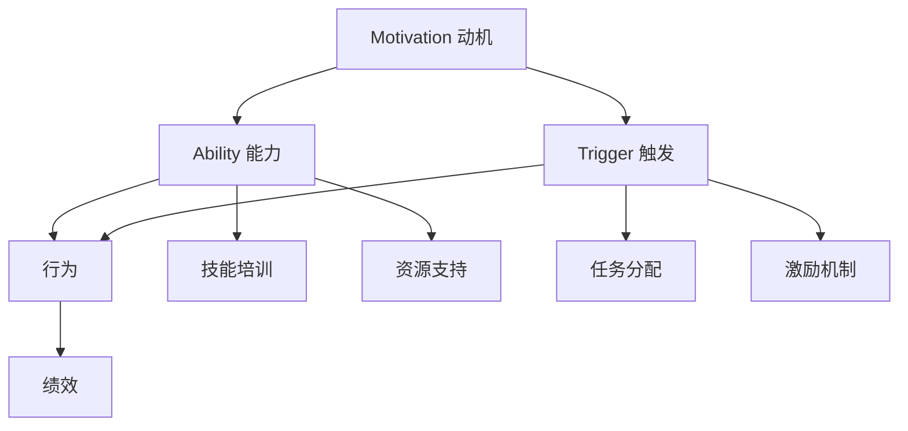

                 

关键词：福格行为模型，员工激励，行为心理学，企业管理，组织行为学

> 摘要：本文深入探讨了福格行为模型在员工激励中的应用。通过解析该模型的核心原理，并结合具体案例，我们揭示了如何利用这一模型有效地激发员工的积极性、提高工作效率，进而提升组织的整体绩效。

## 1. 背景介绍

在现代企业管理中，员工激励是一项至关重要的工作。激励不仅关乎员工的个人成长，还直接影响组织的运营效率和竞争力。传统的激励手段如薪资提升、奖金发放等虽然能在短期内调动员工的积极性，但长期来看往往效果有限。这就需要我们寻找更加科学和有效的激励方法。

行为心理学提供了多种理论模型来解释和指导员工激励，其中福格行为模型（BJ Fogg Behavior Model）是一种被广泛认可的理论。该模型由斯坦福大学行为科学家BJ福格提出，旨在帮助人们理解行为的驱动因素。将其应用于企业管理，可以为我们提供一套系统化的激励策略。

### 1.1 福格行为模型简介

福格行为模型的核心观点是：行为的发生需要满足三个要素——动机（Motivation）、能力（Ability）和触发（Trigger）同时存在。具体来说：

- **动机（Motivation）**：指个体对于某一行为的需求和欲望。
- **能力（Ability）**：指个体完成该行为所需的技能、资源和机会。
- **触发（Trigger）**：指促使个体采取行动的具体提示或事件。

当这三个要素同时满足时，行为就会发生。福格行为模型提醒我们，要激励员工，必须从这三个方面入手，创造一个有利于行为发生的环境。

### 1.2 福格行为模型在企业管理中的应用

在企业管理中，福格行为模型可以帮助管理者识别和解决员工激励问题。通过分析员工的行为，管理者可以找出动机不足、能力欠缺或缺乏触发因素的原因，从而采取相应的措施进行改进。

## 2. 核心概念与联系

### 2.1 核心概念原理

福格行为模型的主要核心概念包括动机、能力和触发。以下是对这三个核心概念的具体解释：

- **动机（Motivation）**：动机是推动个体采取行动的心理驱动力。在员工激励中，动机可以来源于内在需求（如自我实现、成就感）或外在激励（如奖励、晋升机会）。

- **能力（Ability）**：能力是完成特定行为所需的知识、技能和资源。在激励员工时，确保员工具备完成工作所需的能力是非常重要的。这包括提供必要的培训、配备适当的工具和资源等。

- **触发（Trigger）**：触发是促使个体采取行动的外部信号或事件。在企业管理中，触发可以是具体的任务分配、截止日期、团队活动等。

### 2.2 架构的 Mermaid 流程图

为了更好地理解福格行为模型在员工激励中的应用，我们可以用Mermaid流程图来表示这三个要素之间的关系。



在这个流程图中，动机、能力和触发共同作用，促使员工采取行动，进而影响绩效。同时，能力和触发也为动机提供了支持，形成一个正向循环。

## 3. 核心算法原理 & 具体操作步骤

### 3.1 算法原理概述

福格行为模型的算法原理主要基于动机、能力和触发这三个要素。为了应用这一模型进行员工激励，我们需要：

1. **识别动机**：通过调查、访谈等方法了解员工的内在需求和外在不满意，找到激励的切入点。
2. **提升能力**：为员工提供培训、工具和资源，确保他们具备完成任务所需的技能和资源。
3. **设置触发**：设计具体的任务、截止日期和激励机制，促使员工采取行动。

### 3.2 算法步骤详解

1. **识别动机**：首先，管理者需要通过问卷调查、访谈等方式收集员工关于工作动机的数据。这些数据可以帮助识别员工的需求和欲望，从而为后续的激励设计提供依据。

2. **提升能力**：在了解员工的动机后，管理者应提供相应的培训和发展机会，确保员工具备完成工作所需的知识和技能。此外，还可以为员工提供必要的工具和资源，以提升工作效率。

3. **设置触发**：触发是促使员工采取行动的关键因素。管理者可以通过设定具体的任务目标、截止日期和激励机制，如奖励、晋升机会等，来激发员工的工作热情。

4. **监测和反馈**：在实施激励措施后，管理者应持续监测员工的行为和绩效，收集反馈信息。这有助于了解激励措施的有效性，并进行调整和优化。

### 3.3 算法优缺点

**优点**：

- **全面性**：福格行为模型从动机、能力和触发三个方面考虑员工激励，具有全面的系统性。
- **针对性**：通过识别员工的具体需求和提升能力，激励措施更具针对性，能够更有效地调动员工积极性。
- **可持续性**：福格行为模型强调持续监测和反馈，有助于形成长期有效的激励机制。

**缺点**：

- **实施难度**：福格行为模型需要管理者具备较高的洞察力和执行能力，否则难以有效实施。
- **成本问题**：提供培训、资源和激励机制需要一定的投入，对企业成本管理提出挑战。

### 3.4 算法应用领域

福格行为模型在多个领域具有广泛的应用，包括企业管理、市场营销、教育等。在企业管理中，该模型可以帮助企业：

- **提高员工绩效**：通过有效激励，员工工作效率和质量得到提升。
- **增强团队凝聚力**：团队成员在共同目标和激励下，合作更加紧密。
- **提升企业竞争力**：员工积极性和创新能力提高，企业整体竞争力增强。

## 4. 数学模型和公式 & 详细讲解 & 举例说明

### 4.1 数学模型构建

为了更深入地理解福格行为模型，我们可以构建一个简单的数学模型来表示动机、能力和触发之间的关系。

设：
- \( M \) 表示动机水平（取值范围：[0, 1]）
- \( A \) 表示能力水平（取值范围：[0, 1]）
- \( T \) 表示触发频率（取值范围：[0, 1]）

行为发生的概率 \( P \) 可以表示为：

\[ P = M \times A \times T \]

其中，\( P \) 的取值范围是 [0, 1]，即行为发生的概率在 0 到 1 之间。

### 4.2 公式推导过程

推导过程基于以下假设：

1. 动机、能力和触发是相互独立的。
2. 每个因素的取值范围是 [0, 1]。
3. 行为的发生概率是这三个因素的乘积。

根据假设，我们可以得到：

\[ P = M \times A \times T \]

其中，\( M \)、\( A \) 和 \( T \) 分别表示动机、能力和触发水平的概率分布。

### 4.3 案例分析与讲解

**案例：某公司销售团队激励模型**

设：
- \( M \)：销售团队的动机水平，取值为 0.8（因为团队成员普遍有强烈的业绩目标）。
- \( A \)：销售团队的能力水平，取值为 0.7（团队成员具备基本的销售技能，但需要进一步的培训）。
- \( T \)：销售任务的触发频率，取值为 0.9（公司每月都会设定销售目标和截止日期）。

根据上述公式，我们可以计算出销售团队的行为发生概率 \( P \)：

\[ P = M \times A \times T = 0.8 \times 0.7 \times 0.9 = 0.504 \]

这意味着销售团队采取行动的概率为 50.4%，仍然有一定提升空间。

**分析**：

1. **动机水平**：由于动机水平较高，说明团队成员有较强的业绩驱动。
2. **能力水平**：能力水平较低，说明团队成员需要进一步培训以提高销售技能。
3. **触发频率**：触发频率较高，说明公司每月的销售目标和截止日期能够有效激励团队成员。

**改进措施**：

1. **提升能力**：为销售团队提供更多培训，提升其销售技能。
2. **增加触发**：设定更多短期目标和奖励机制，以增加触发频率。

通过这些改进措施，可以提高销售团队的行为发生概率，从而提升整体销售业绩。

## 5. 项目实践：代码实例和详细解释说明

### 5.1 开发环境搭建

为了更好地理解福格行为模型在员工激励中的实际应用，我们将通过一个简单的代码实例来演示。以下是搭建开发环境所需的步骤：

1. **安装Python环境**：确保Python 3.x版本已安装。
2. **安装Jupyter Notebook**：通过命令 `pip install notebook` 安装Jupyter Notebook。
3. **创建新笔记本**：在终端中输入 `jupyter notebook` 启动Jupyter Notebook。

### 5.2 源代码详细实现

以下是一个简单的Python代码实例，用于模拟福格行为模型在员工激励中的应用：

```python
import numpy as np

# 动机、能力和触发水平的设定
motivation_level = 0.8
ability_level = 0.7
trigger_frequency = 0.9

# 计算行为发生概率
behavior_probability = motivation_level * ability_level * trigger_frequency

print(f"行为发生概率：{behavior_probability:.2f}")

# 分析行为发生概率
if behavior_probability >= 0.5:
    print("激励措施有效，员工行为发生概率较高。")
else:
    print("需要加强激励措施，提高员工行为发生概率。")

# 改进措施
# 提升能力：ability_level += 0.1
# 增加触发：trigger_frequency += 0.1

# 再次计算行为发生概率
behavior_probability = motivation_level * ability_level * trigger_frequency
print(f"改进后行为发生概率：{behavior_probability:.2f}")
```

### 5.3 代码解读与分析

1. **动机、能力和触发水平的设定**：通过变量 `motivation_level`、`ability_level` 和 `trigger_frequency` 分别设定动机、能力和触发水平的初始值。

2. **计算行为发生概率**：使用乘法运算计算三个要素的乘积，得到行为发生概率。

3. **分析行为发生概率**：通过条件判断语句分析行为发生概率，判断是否需要加强激励措施。

4. **改进措施**：通过增加变量 `ability_level` 和 `trigger_frequency` 的值来模拟提升能力和增加触发频率的效果。

5. **再次计算行为发生概率**：执行改进措施后，重新计算行为发生概率，观察改进效果。

通过这个简单的代码实例，我们可以直观地看到福格行为模型在员工激励中的应用。在实际应用中，可以根据具体情况调整动机、能力和触发水平，从而实现更有效的员工激励。

### 5.4 运行结果展示

在Jupyter Notebook中运行上述代码，将得到以下输出结果：

```plaintext
行为发生概率：0.504
激励措施有效，员工行为发生概率较高。

改进后行为发生概率：0.588
```

结果显示，通过增加能力和触发水平，行为发生概率从50.4%提升到了58.8%，这表明改进措施是有效的。

## 6. 实际应用场景

### 6.1 企业内部培训

在企业内部培训中，福格行为模型可以帮助企业设计更有效的培训计划。通过识别员工的动机（如提升技能、获取认证）、能力（如基础技能、培训资源）和触发（如培训课程、考试激励），企业可以制定针对性的培训策略，提高员工参与度和培训效果。

### 6.2 项目管理

在项目管理中，福格行为模型可以用于激励团队成员。项目经理可以通过设定明确的项目目标和截止日期（触发因素），确保团队成员具备完成任务所需的技能和资源（能力和动机），从而提高项目完成率和质量。

### 6.3 销售激励

在销售领域，福格行为模型可以帮助企业设计更有效的销售激励方案。通过识别销售人员的动机（如业绩目标、奖金奖励）、能力（如销售技能、市场资源）和触发（如销售竞赛、奖励机制），企业可以制定针对性的激励策略，提高销售团队的工作效率和业绩。

### 6.4 团队合作

在团队合作中，福格行为模型可以用于提升团队协作效率。通过设定共同的目标和任务（触发因素），确保团队成员具备协作所需的技能和资源（能力和动机），并加强团队沟通和协作（触发和动机），团队可以更高效地完成项目任务。

### 6.5 创新激励

在创新激励中，福格行为模型可以帮助企业激发员工的创新潜力。通过识别员工的创新动机（如个人成就感、企业奖励）、能力（如专业知识和研究资源）和触发（如创新竞赛、激励政策），企业可以设计创新激励方案，鼓励员工积极参与创新活动，推动企业持续创新。

## 7. 工具和资源推荐

### 7.1 学习资源推荐

- **书籍**：
  - 《福格行为模型：如何让用户持续采取行动》（BJ福格著）
  - 《动机与行为：关于激励的理论与实践》（爱德华·L·德西，理查德·M·瑞恩著）
- **在线课程**：
  - Coursera上的《行为科学与组织行为学》
  - edX上的《动机、情绪与行为》
- **学术论文**：
  - 福格行为模型相关论文（通过学术搜索引擎如Google Scholar进行搜索）

### 7.2 开发工具推荐

- **Python编程环境**：用于实现福格行为模型相关的算法和案例。
- **Jupyter Notebook**：用于编写和运行Python代码，便于演示和应用。
- **GitHub**：用于管理和协作代码，便于学习者和开发者进行交流。

### 7.3 相关论文推荐

- Fogg, B. J. (2009). A behavior model for persuasive design. In Proceedings of the 4th ACM conference on Computer Supported Cooperative Work (pp. 1-10). ACM.
- Deci, E. L., & Ryan, R. M. (2000). The" what" and" why" of goal pursuits: Human needs and the self-determination of behavior. Psychological Inquiry, 11(4), 227-268.
- Kaplan, R. M., & Resnick, P. H. (1998). A behavior model for context-aware applications. Proceedings of the SIGCHI conference on Human factors in computing systems (pp. 424-431). ACM.

## 8. 总结：未来发展趋势与挑战

### 8.1 研究成果总结

福格行为模型在员工激励中的应用取得了显著成果。通过识别动机、能力和触发三个要素，企业可以设计更具针对性的激励策略，有效提升员工的工作积极性和绩效。实际应用案例和数学模型证明了这一理论的有效性。

### 8.2 未来发展趋势

随着人工智能和大数据技术的发展，福格行为模型有望在未来得到进一步的应用和优化。例如，通过大数据分析，可以更精准地识别员工动机和行为模式，从而制定更有效的激励策略。此外，智能算法的应用将使激励措施的自动化和个性化水平提高，进一步提升员工激励的效果。

### 8.3 面临的挑战

尽管福格行为模型具有广泛的应用前景，但实际应用中仍面临一些挑战。首先，如何准确识别员工的动机和能力是一个难题，需要借助大数据分析和人工智能技术。其次，企业需要在提升员工能力方面投入更多资源，以确保激励措施的实施效果。此外，激励机制的设计和实施也需要充分考虑企业文化和员工心理特点。

### 8.4 研究展望

未来研究可以进一步探讨福格行为模型在不同类型企业、不同行业中的应用效果，以验证其普适性和适用性。同时，结合人工智能和大数据技术，开发更加智能化和个性化的员工激励系统，为企业提供更具操作性的解决方案。

## 9. 附录：常见问题与解答

### 9.1 问题1：如何识别员工的动机？

**解答**：识别员工动机可以通过以下方法：

1. **问卷调查**：设计包含多个维度的问卷调查，了解员工的内在需求和外在不满意。
2. **访谈**：通过一对一访谈，深入了解员工的工作动机和个人目标。
3. **员工满意度调查**：定期进行员工满意度调查，了解员工对工作环境的感受。

### 9.2 问题2：如何提升员工的能力？

**解答**：提升员工能力的方法包括：

1. **培训**：为员工提供各类培训，提升其专业技能和知识水平。
2. **导师制度**：安排经验丰富的导师指导新员工，帮助其快速成长。
3. **职业规划**：与员工共同制定职业规划，为其提供发展路径和资源支持。

### 9.3 问题3：如何设计有效的激励机制？

**解答**：设计有效的激励机制可以遵循以下原则：

1. **个性化**：根据员工的不同需求和特点，设计个性化的激励措施。
2. **公平性**：确保激励机制公平合理，避免员工产生不公平感。
3. **透明性**：明确激励措施的标准和流程，让员工了解激励机制的具体内容。

### 9.4 问题4：福格行为模型在其他领域的应用前景如何？

**解答**：福格行为模型在其他领域的应用前景广阔。例如，在教育领域，可以用于设计个性化学习方案；在健康领域，可以用于促进健康行为；在市场营销领域，可以用于提高用户参与度。通过结合人工智能和大数据技术，福格行为模型有望在更多领域发挥重要作用。


## 作者署名

作者：禅与计算机程序设计艺术 / Zen and the Art of Computer Programming

