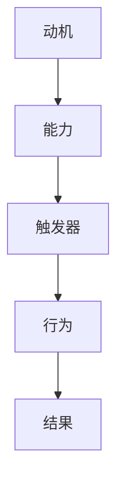

                 

关键词：福格行为模型、团队建设、行为心理学、动机、能力、触发器、IT团队、项目协作

## 摘要

本文将深入探讨福格行为模型（BJ Fogg Behavior Model）在IT团队建设中的应用。福格行为模型是由斯坦福大学的行为科学家BJ Fogg提出的一种解释行为发生的模型，它包括了动机（Motivation）、能力（Ability）和触发器（Trigger）三个核心要素。本文将通过具体实例和分析，阐述如何利用这一模型提升团队协作效率，培养积极的工作氛围，并最终推动项目成功。

## 1. 背景介绍

### 福格行为模型简介

福格行为模型是一种基于行为心理学理论的分析框架，用于解释人类行为的发生机制。该模型认为，行为的产生取决于三个因素：动机（Motivation）、能力（Ability）和触发器（Trigger）。具体来说：

- **动机（Motivation）**：指的是个体对于采取某一行为的内在需求或愿望。动机可以是内在的，如追求成就感、兴趣等；也可以是外在的，如奖励、惩罚等。
- **能力（Ability）**：是指个体在特定情境下能够采取某一行为的实际能力。能力既包括知识、技能，也涉及到时间、资源等因素。
- **触发器（Trigger）**：是激发个体采取某一行为的即时刺激或事件。触发器可以是外在的，如邮件提醒、会议通知等，也可以是内在的，如内在的紧迫感、好奇心等。

### IT团队建设的重要性

IT团队建设是现代企业中至关重要的一环。一个高效的IT团队不仅能够提高项目开发的速度和质量，还能培养良好的企业文化，提升员工满意度和忠诚度。然而，团队建设并非易事，它涉及到多个方面，如沟通、协作、激励机制等。因此，引入科学的行为模型，如福格行为模型，有助于更好地理解和优化团队建设过程。

## 2. 核心概念与联系

### 福格行为模型原理与架构

福格行为模型的核心原理在于通过分析动机、能力、触发器这三个要素的相互作用，来理解人类行为的发生机制。下面是一个简化的Mermaid流程图，展示了这三个要素之间的逻辑关系：



在这个流程图中，动机、能力和触发器是彼此关联的，任何一个要素的变化都会对行为产生影响。例如，如果某个团队成员（B）的能力得到了提升，但没有适当的触发器（C）来激发他采取行动，那么他的行为（D）可能就不会发生。

### 福格行为模型在团队建设中的应用

在团队建设过程中，福格行为模型可以帮助我们识别并优化影响团队协作的关键因素。以下是一个具体的应用实例：

1. **提高团队成员的动机**：通过设立明确的目标和奖励机制，激发团队成员的内在动机和外在动机，例如，通过KPI考核、奖金激励等方式。
2. **提升团队成员的能力**：提供培训、导师指导等资源，帮助团队成员提升技能和知识水平，增强他们在项目中的实际能力。
3. **设置有效的触发器**：通过项目管理工具、定期会议等手段，确保团队成员能够在适当的时间采取行动，完成项目任务。

### 应用场景举例

假设我们有一个软件开发团队，需要完成一个复杂的项目。根据福格行为模型，我们可以采取以下措施：

- **提高动机**：明确项目的目标和预期成果，设置合理的KPI，并通过奖金、表彰等方式激励团队成员。
- **提升能力**：组织技术培训，提供专业的技术支持和资源，确保团队成员具备完成项目所需的知识和技能。
- **设置触发器**：使用项目管理工具（如JIRA、Trello）来跟踪任务进度，定期召开项目会议，确保团队成员能够及时响应和完成任务。

通过以上措施，我们可以有效地利用福格行为模型来提升团队协作效率，确保项目成功。

## 3. 核心算法原理 & 具体操作步骤

### 3.1 算法原理概述

福格行为模型是一种基于行为心理学理论的分析框架，用于解释人类行为的发生机制。该模型认为，行为的产生取决于三个核心要素：动机（Motivation）、能力（Ability）和触发器（Trigger）。通过分析这三个要素的相互作用，我们可以更好地理解和优化团队协作过程。

### 3.2 算法步骤详解

#### 步骤1：确定目标行为

首先，我们需要明确希望团队采取的具体行为。例如，目标是提高项目开发效率，确保按期交付。

#### 步骤2：分析动机

接下来，我们需要分析团队成员的动机。动机可以分为内在动机和外在动机。内在动机包括个人成就感、工作兴趣等；外在动机包括奖励、晋升机会等。通过了解团队成员的动机，我们可以有针对性地设置激励措施。

#### 步骤3：评估能力

然后，我们需要评估团队成员的能力。这包括技能水平、知识储备、资源支持等方面。通过培训、导师指导等方式，我们可以提升团队成员的能力。

#### 步骤4：设置触发器

最后，我们需要设置触发器，以激发团队成员采取目标行为。触发器可以是项目管理工具、定期会议、任务提醒等。确保触发器能够及时、有效地激励团队成员。

### 3.3 算法优缺点

**优点**：

- **全面性**：福格行为模型涵盖了动机、能力、触发器三个关键要素，有助于全面分析团队协作问题。
- **灵活性**：该模型可以应用于各种团队和项目，具有广泛的适用性。

**缺点**：

- **复杂性**：分析动机、能力和触发器需要大量的时间和精力，对团队的协作和管理能力有较高要求。

### 3.4 算法应用领域

福格行为模型可以应用于多个领域，包括：

- **软件开发团队**：提高项目开发效率，确保按期交付。
- **市场营销团队**：提升市场活动效果，增加客户满意度。
- **教育培训团队**：提高教学效果，促进学生学习积极性。

## 4. 数学模型和公式 & 详细讲解 & 举例说明

### 4.1 数学模型构建

福格行为模型的数学表达可以表示为：

\[ 行为 = 动机 \times 能力 \times 触发器 \]

其中，动机（Motivation）、能力（Ability）和触发器（Trigger）都可以被量化。

### 4.2 公式推导过程

假设动机、能力和触发器分别为 \( m \)、\( a \) 和 \( t \)，则行为 \( b \) 可以表示为：

\[ b = m \times a \times t \]

这个公式说明了行为是由动机、能力和触发器共同决定的。

### 4.3 案例分析与讲解

假设一个软件开发团队的目标是提高代码审查的效率。我们可以通过以下步骤来应用福格行为模型：

1. **动机（Motivation）**：

   - 内在动机：提升代码质量，减少bug数量。
   - 外在动机：设立代码审查优秀者奖，给予一定奖金和荣誉。

2. **能力（Ability）**：

   - 技能培训：提供代码审查技巧培训，提高团队成员的代码审查能力。
   - 经验分享：组织经验交流会，分享优秀的代码审查案例。

3. **触发器（Trigger）**：

   - 项目管理工具：使用JIRA等工具，设置代码审查提醒，确保及时进行。
   - 定期会议：每周召开代码审查总结会议，反馈问题，分享经验。

通过以上措施，我们可以提高团队成员的动机、能力和触发器，从而提升代码审查的效率。

## 5. 项目实践：代码实例和详细解释说明

### 5.1 开发环境搭建

在本案例中，我们将使用Python作为主要编程语言，并使用JIRA作为项目管理工具。以下是如何搭建开发环境的基本步骤：

1. 安装Python：
   ```bash
   pip install jira
   ```

2. 配置JIRA：
   - 在JIRA网站上创建一个项目。
   - 获取JIRA的API访问令牌。

### 5.2 源代码详细实现

以下是一个简单的Python脚本，用于跟踪代码审查任务：

```python
import jira

def create_issue(jira_client, project_key, summary, description):
    issue = jira_client.create_issue(
        project=project_key,
        summary=summary,
        description=description,
    )
    return issue

def add_comment_to_issue(jira_client, issue_key, comment):
    jira_client.add_comment(issue_key, comment)

def main():
    jira_client = jira.JIRA('https://your_jira_url', basic_auth=('your_username', 'your_password'))

    project_key = 'PROJ'
    summary = 'Code Review Request'
    description = 'Please review the attached code and provide feedback.'

    issue = create_issue(jira_client, project_key, summary, description)
    print(f"Issue created: {issue.key}")

    comment = 'Please review the code and provide your feedback by end of day.'
    add_comment_to_issue(jira_client, issue.key, comment)
    print(f"Comment added to issue {issue.key}")

if __name__ == '__main__':
    main()
```

### 5.3 代码解读与分析

- **`create_issue`函数**：创建一个新的JIRA任务，设置任务的概要和描述。
- **`add_comment_to_issue`函数**：向已有的JIRA任务添加一条评论。
- **`main`函数**：主程序，首先创建一个新的代码审查任务，然后向该任务添加一条评论。

### 5.4 运行结果展示

运行上述脚本后，JIRA中将会创建一个名为“Code Review Request”的任务，并在该任务下添加一条评论。这可以帮助团队成员及时进行代码审查，并跟踪任务的进展。

## 6. 实际应用场景

### 6.1 提高项目开发效率

通过福格行为模型，我们可以有效地提高项目开发效率。例如，在一个软件开发项目中，通过设置明确的任务目标、提供培训资源、定期召开项目会议等手段，可以确保团队成员在合适的时机采取行动，从而提高整体开发效率。

### 6.2 培养团队合作精神

福格行为模型还可以帮助培养团队合作精神。通过分析团队成员的动机、能力和触发器，我们可以识别出影响团队协作的关键因素，并采取相应的措施来优化团队氛围，促进团队成员之间的沟通和协作。

### 6.3 项目管理和监控

利用福格行为模型，项目经理可以更有效地进行项目管理和监控。通过设置触发器和监控指标，项目经理可以及时发现和解决项目中的问题，确保项目按计划顺利进行。

## 7. 未来应用展望

### 7.1 深入研究动机与能力的量化

未来，对动机和能力的量化研究将更加深入。通过结合心理学和行为经济学的研究成果，我们可以更精确地量化动机和能力，从而更好地应用福格行为模型。

### 7.2 多领域应用探索

福格行为模型不仅适用于IT团队，还可以应用于其他领域，如市场营销、教育培训等。未来，我们可以探索其在不同领域的应用，以提升各类团队的工作效率和效果。

### 7.3 技术与心理学结合

随着人工智能技术的发展，福格行为模型可以与AI技术相结合，通过大数据分析和机器学习算法，预测团队成员的行为，并提供个性化的激励措施。

## 8. 总结：未来发展趋势与挑战

### 8.1 研究成果总结

通过本文的探讨，我们可以看到福格行为模型在团队建设中的应用具有显著的优势。该模型提供了一个系统性的方法，帮助我们识别并优化影响团队协作的关键因素，从而提高项目开发效率和团队合作精神。

### 8.2 未来发展趋势

未来，福格行为模型有望在更广泛的领域得到应用。结合心理学和行为经济学的最新研究成果，我们可以进一步深化对动机和能力的量化研究，从而提高模型的应用效果。

### 8.3 面临的挑战

尽管福格行为模型具有广泛的应用前景，但在实际应用中仍面临一些挑战。首先，分析动机、能力和触发器需要大量的时间和资源。其次，不同团队和项目之间的差异可能导致模型适用性的限制。因此，如何优化模型，使其更加灵活和通用，是未来研究的重要方向。

### 8.4 研究展望

未来的研究可以集中在以下几个方面：一是深入量化动机和能力的测量方法；二是探索模型在不同领域的应用；三是结合人工智能技术，提高模型的预测和个性化能力。

## 9. 附录：常见问题与解答

### Q：如何评估团队成员的动机和能力？

A：评估团队成员的动机和能力可以通过以下方法：

- **问卷调查**：设计动机调查问卷，了解团队成员的内在和外在动机。
- **技能评估**：通过技能测试和面试，评估团队成员的知识和技能水平。
- **绩效评估**：通过绩效评估体系，分析团队成员的工作表现。

### Q：触发器的设置有哪些常见方法？

A：常见的触发器设置方法包括：

- **项目管理工具**：使用JIRA、Trello等项目管理工具，设置任务提醒和进度跟踪。
- **定期会议**：召开定期项目会议，反馈问题，分享经验。
- **邮件通知**：通过邮件发送任务提醒和通知。

### Q：如何结合福格行为模型进行团队建设？

A：结合福格行为模型进行团队建设，可以按照以下步骤进行：

1. **明确目标**：确定团队建设的目标，如提高项目开发效率、培养团队合作精神等。
2. **分析动机**：通过问卷调查、访谈等方式，了解团队成员的动机。
3. **提升能力**：提供培训、导师指导等资源，提升团队成员的能力。
4. **设置触发器**：使用项目管理工具、定期会议等手段，确保团队成员能够及时采取行动。

---

### 作者署名

作者：禅与计算机程序设计艺术 / Zen and the Art of Computer Programming

[End of Article]

