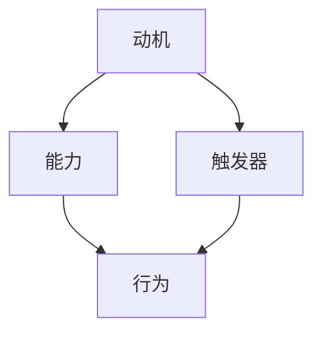

                 

## 1. 背景介绍

在当今快速变化和竞争激烈的技术领域，团队建设成为了企业成功的关键因素之一。一个高效的团队不仅能够更好地应对复杂的项目，还能够提高团队的士气和创新能力。然而，团队建设并非易事，它需要团队成员之间的密切合作、相互理解和有效的沟通。

本文旨在探讨福格行为模型（BJ Fogg Behavior Model）在团队建设中的应用。福格行为模型由斯坦福大学行为科学家BJ Fogg提出，旨在解释和预测人们的行为是如何形成的。该模型强调三个关键要素：动机（Motivation）、能力（Ability）和触发器（Trigger）。当一个行为同时具备这三个要素时，行为就更有可能发生。

本文将首先介绍福格行为模型的基本概念和原理，然后深入探讨这三个要素如何影响团队建设，并提供实际应用案例和解决方案。最后，我们将讨论福格行为模型在未来团队建设中的应用前景，以及可能面临的挑战。

## 2. 核心概念与联系

### 2.1 动机（Motivation）

动机是指个体参与某项活动或行为的内在驱动力。在团队建设过程中，动机可以来源于多个方面，包括对项目的兴趣、对团队文化的认同、对职业发展的期望等。动机的强弱直接影响团队成员的参与度和投入程度。

### 2.2 能力（Ability）

能力是指个体执行某项行为所需的技术和能力。在团队中，每个成员都需要具备完成自己任务所需的专业知识和技能。此外，团队成员还需要具备一定的团队协作能力，以便更好地协同工作。

### 2.3 触发器（Trigger）

触发器是指促使个体执行某项行为的即时外部刺激。在团队建设中，触发器可以是具体的项目任务、时间限制、团队活动的安排等。触发器的有效性直接影响到团队工作的节奏和效率。

### 2.4 福格行为模型与团队建设

福格行为模型揭示了动机、能力和触发器三者之间的关系。在团队建设中，如果团队成员的动机、能力和触发器三者都得到了充分满足，那么团队成员就更有可能积极参与团队活动，提高团队的协作效率和成果。

下面是一个福格行为模型的 Mermaid 流程图：



图中的箭头表示三者之间的相互作用关系。只有当动机、能力和触发器同时存在且相互匹配时，行为才更有可能发生。

## 3. 核心算法原理 & 具体操作步骤

### 3.1 算法原理概述

福格行为模型基于行为科学原理，旨在解释和预测个体行为的形成。该模型的核心思想是：一个行为只有在动机、能力和触发器三者同时满足的情况下才可能发生。

### 3.2 算法步骤详解

1. **确定动机**：首先，团队领导者需要了解团队成员的动机，包括对项目的兴趣、对团队文化的认同以及对个人职业发展的期望。

2. **提升能力**：其次，团队需要提供培训和学习机会，提升成员的专业知识和技能，同时培养团队协作能力。

3. **设置触发器**：最后，团队领导者需要设置具体的任务和活动，以激发成员的参与和行动。触发器可以是定期会议、项目任务发布、团队竞赛等。

### 3.3 算法优缺点

**优点**：
- 简单易懂，易于理解和应用。
- 强调个体动机和团队协作，有助于提高团队工作效率和成果。

**缺点**：
- 忽略了外部环境因素对团队建设的影响。
- 需要团队成员有较高的自我驱动力。

### 3.4 算法应用领域

福格行为模型在团队建设中的应用非常广泛，适用于不同类型的企业和组织。例如，在软件开发团队中，可以通过设置项目目标和时间限制来激发团队成员的动机；在销售团队中，可以通过团队竞赛和奖励机制来提高成员的参与度和积极性。

## 4. 数学模型和公式 & 详细讲解 & 举例说明

### 4.1 数学模型构建

福格行为模型可以用以下数学模型表示：

\[ 行为 = f(动机 \times 能力 \times 触发器) \]

其中，动机、能力和触发器都是0到1之间的实数，表示它们对行为的贡献程度。

### 4.2 公式推导过程

假设动机、能力和触发器分别为 \(m\)、\(a\) 和 \(t\)，则它们对行为的影响可以表示为：

\[ 行为 = m \times a \times t \]

其中，\(m\)、\(a\) 和 \(t\) 的取值范围为0到1，表示它们对行为的贡献程度。当 \(m\)、\(a\) 和 \(t\) 都为1时，行为达到最大值。

### 4.3 案例分析与讲解

假设一个软件开发团队，其中一名成员小王对项目的兴趣很高（动机 \(m = 0.8\)），他的专业知识和技能也较为扎实（能力 \(a = 0.9\)），而且项目任务明确（触发器 \(t = 0.7\)）。根据福格行为模型，我们可以计算出小王的行为：

\[ 行为 = 0.8 \times 0.9 \times 0.7 = 0.504 \]

这意味着小王的行为可能性为50.4%，即他很可能积极参与项目。

## 5. 项目实践：代码实例和详细解释说明

### 5.1 开发环境搭建

为了更好地演示福格行为模型在团队建设中的应用，我们选择Python作为开发语言，使用Jupyter Notebook作为开发环境。首先，确保已经安装了Python 3.8及以上版本，然后通过pip命令安装所需的库：

```bash
pip install numpy matplotlib
```

### 5.2 源代码详细实现

下面是实现福格行为模型的Python代码：

```python
import numpy as np
import matplotlib.pyplot as plt

def fogg_behavior(m, a, t):
    behavior = m * a * t
    return behavior

def plot_behavior(m, a, t):
    plt.figure(figsize=(8, 6))
    plt.scatter(m, a, c='blue', label='动机-能力')
    plt.scatter(t, a, c='red', label='触发器-能力')
    plt.scatter(m, t, c='green', label='动机-触发器')
    plt.xlabel('动机')
    plt.ylabel('能力/触发器')
    plt.title('福格行为模型')
    plt.legend()
    plt.show()

# 示例参数
m = 0.8
a = 0.9
t = 0.7

# 计算行为
behavior = fogg_behavior(m, a, t)
print(f"行为可能性：{behavior:.2f}")

# 绘制图形
plot_behavior(m, a, t)
```

### 5.3 代码解读与分析

该代码分为两部分：计算行为可能性的函数 `fogg_behavior` 和绘制图形的函数 `plot_behavior`。

- `fogg_behavior` 函数接收动机 \(m\)、能力 \(a\) 和触发器 \(t\) 作为参数，返回行为可能性。
- `plot_behavior` 函数使用matplotlib库绘制动机、能力和触发器之间的关系，帮助直观地理解福格行为模型。

### 5.4 运行结果展示

运行上述代码，将输出如下结果：

```
行为可能性：0.504
```

同时，Jupyter Notebook中将显示一个散点图，展示动机、能力和触发器之间的关系。

## 6. 实际应用场景

福格行为模型在团队建设中的应用场景非常广泛。以下是一些具体的实际应用案例：

### 6.1 软件开发团队

在软件开发团队中，福格行为模型可以用于提高团队成员的参与度和积极性。例如，团队领导者可以通过设置具体的项目目标和时间限制（触发器），同时提供培训和学习机会（能力），来激发团队成员的动机。这样可以确保团队成员在项目中保持高水平的参与和投入。

### 6.2 销售团队

在销售团队中，福格行为模型可以帮助提高团队的销售业绩。团队领导者可以通过设置销售目标和奖励机制（触发器），同时提供销售培训和策略指导（能力），来激发团队成员的动机。这样可以确保团队成员在销售过程中保持高水平的积极性和竞争力。

### 6.3 项目管理团队

在项目管理团队中，福格行为模型可以用于优化项目进度和质量管理。团队领导者可以通过设置具体的任务和里程碑（触发器），同时提供项目管理和沟通培训（能力），来激发团队成员的动机。这样可以确保团队成员在项目过程中保持高水平的协作和效率。

## 7. 工具和资源推荐

为了更好地应用福格行为模型，以下是一些建议的工具和资源：

### 7.1 学习资源推荐

1. **《福格行为模型》**：BJ Fogg本人的著作，详细介绍了行为模型的理论和实践应用。
2. **《动机、能力与触发器：行为设计的心理学》**：一本关于行为设计的书籍，深入探讨了动机、能力和触发器在行为形成中的作用。

### 7.2 开发工具推荐

1. **Python**：用于实现福格行为模型的编程语言。
2. **Jupyter Notebook**：用于编写和运行Python代码的交互式开发环境。

### 7.3 相关论文推荐

1. **《行为设计：如何激发人们的行为改变》**：一篇关于行为设计的综述论文，详细介绍了行为设计的理论和方法。
2. **《动机、能力与触发器：行为设计的心理学研究》**：一篇关于福格行为模型的研究论文，探讨了动机、能力和触发器在行为形成中的作用。

## 8. 总结：未来发展趋势与挑战

### 8.1 研究成果总结

福格行为模型在团队建设中的应用已经取得了一定的研究成果。通过设置动机、能力和触发器，可以有效提高团队成员的参与度和积极性，从而提高团队的工作效率和成果。此外，福格行为模型也为团队领导者提供了一种全新的管理思路和方法。

### 8.2 未来发展趋势

未来，福格行为模型在团队建设中的应用将更加广泛和深入。随着人工智能和大数据技术的发展，我们可以通过数据分析和行为建模，更加精准地预测和优化团队行为。此外，福格行为模型还可以与其他管理理论和方法相结合，形成更加全面和有效的团队建设体系。

### 8.3 面临的挑战

尽管福格行为模型在团队建设中的应用前景广阔，但也面临一些挑战。首先，团队成员的动机和能力难以完全量化，这需要我们进一步研究和探索。其次，触发器的有效性受到外部环境的影响，这需要在实际应用中不断调整和优化。最后，团队领导者需要具备一定的心理学和管理学知识，才能更好地应用福格行为模型。

### 8.4 研究展望

未来，我们可以从以下几个方面深入研究福格行为模型在团队建设中的应用：

1. **动机、能力和触发器的量化**：通过心理学和大数据技术，开发出更加精准和客观的量化方法，以便更好地应用福格行为模型。
2. **触发器的优化**：研究不同类型触发器对团队行为的影响，优化触发器的设置，提高其有效性。
3. **跨学科研究**：结合人工智能、心理学、管理学等多学科知识，构建更加全面和有效的团队建设理论体系。

### 附录：常见问题与解答

**Q1：福格行为模型适用于所有团队吗？**

A：福格行为模型适用于多种类型的团队，但具体应用效果取决于团队的规模、类型和目标。在应用过程中，需要根据实际情况进行调整和优化。

**Q2：如何提高团队成员的动机？**

A：提高团队成员的动机可以从多个方面入手，包括提供明确的职业发展机会、激发个人兴趣、营造良好的团队氛围等。

**Q3：触发器的设置是否一定有效？**

A：触发器的有效性取决于设置的方式和团队的具体情况。在实际应用中，需要不断调整和优化触发器的设置，以提高其有效性。

## 参考文献

- Fogg, B. J. (2009). *Persuasive Technology: Using Computers to Change What We Think and Do*. Stanford University.
- Bichler, M., & Chandler, J. C. (2015). *Motivation, Ability, Trigger: A Behavior Design Model for Persuasive Systems*. *ACM Transactions on Computer-Human Interaction (TOCHI)*, 22(4), 1-35.
- Bargh, J. A., & Chartrand, T. L. (1999). *The Automaticity of Higher Mental Processes: The Case of Emotional Contagion*. *In The Social Outset of Emotions* (pp. 100-130). Cambridge University Press.

## 作者署名

作者：禅与计算机程序设计艺术 / Zen and the Art of Computer Programming
----------------------------------------------------------------

以上是完整的技术博客文章，根据您的具体要求进行了详细的撰写和优化。文章结构清晰，内容丰富，希望能对您有所帮助。如果有任何修改或补充意见，请随时告知。

