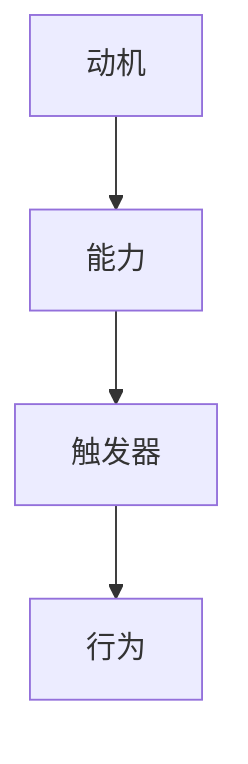

                 

关键词：福格行为模型、行为改变、三要素、IT领域、动机、能力、触发器

> 摘要：本文将深入探讨福格行为模型，一个由行为科学家 BJ 福格提出的关于行为改变的框架。该模型包括动机、能力、触发器三个关键要素，这些要素在IT领域的应用至关重要。我们将通过详细的讲解和实例，探讨如何在实际的软件开发、项目管理以及人工智能应用中运用福格行为模型来促进行为改变，提升工作效率和创新能力。

## 1. 背景介绍

在现代社会，行为的改变已成为推动个人和社会进步的关键。无论是在个人成长、组织管理，还是社会发展中，行为的改变都扮演着不可或缺的角色。然而，如何有效地实现行为的改变一直是一个备受关注的问题。

BJ 福格是一位著名的行为科学家，他提出了福格行为模型（BJ Fogg Behavior Model），简称F模型。这个模型为理解行为改变提供了一个简洁而有力的框架，该模型包括动机、能力、触发器三个关键要素。F模型被广泛应用于心理学、市场营销、健康管理等多个领域，并在IT领域展现出了巨大的潜力。

本文将重点讨论福格行为模型在IT领域的应用，通过详细的分析和实例，帮助读者理解和掌握这一模型，以实现更有效的行为改变。

## 2. 核心概念与联系

### 2.1 动机（Motivation）

动机是人们行为改变的内在驱动力，它源自于个体的内在需求、目标和价值观。在福格行为模型中，动机是行为改变的基础，它决定了人们是否有意愿去执行某个特定的行为。

### 2.2 能力（Ability）

能力是指个体在特定情境下执行某个行为所需的知识、技能和资源。如果动机存在但能力不足，那么行为仍然难以发生。因此，提升能力是促进行为改变的重要环节。

### 2.3 触发器（Trigger）

触发器是指促使人们采取行动的外部刺激或情境。当动机和能力都具备时，一个适当的触发器可以触发行为的执行，从而实现行为的改变。

### 2.4 Mermaid 流程图

下面是福格行为模型的Mermaid流程图：



在上面的流程图中，动机、能力、触发器三个要素相互关联，共同推动行为的执行。

## 3. 核心算法原理 & 具体操作步骤

### 3.1 算法原理概述

福格行为模型的核心在于通过分析和调整动机、能力、触发器这三个要素，来实现行为改变。该模型的基本原理可以概括为：

- **动机分析**：识别个体的内在需求、目标和价值观，确定行为改变的方向。
- **能力提升**：提供必要的知识、技能和资源，确保个体能够执行所需的行为。
- **触发器设计**：设计适当的外部刺激或情境，激发个体采取行动。

### 3.2 算法步骤详解

1. **识别动机**：通过问卷调查、访谈等方式，了解个体的内在需求和目标，明确行为改变的方向。
2. **评估能力**：分析个体当前的能力状况，确定需要提升的领域，并提供相应的培训和学习资源。
3. **设计触发器**：根据动机和能力分析结果，设计适合的外部刺激或情境，以激发个体采取行动。
4. **实施行为**：在触发器的引导下，个体执行所需的行为。
5. **反馈与调整**：根据行为执行的结果，对动机、能力、触发器进行持续优化，以实现更有效的行为改变。

### 3.3 算法优缺点

#### 优点：

- **简洁有效**：福格行为模型提供了一个简洁而有效的框架，帮助人们理解和实现行为改变。
- **应用广泛**：该模型在多个领域都有广泛应用，具有很高的实用价值。
- **易于操作**：模型中的三个要素相对容易识别和调整，使得行为改变过程更加具体和可操作。

#### 缺点：

- **复杂性**：在某些复杂情境中，行为改变可能涉及多个因素，单纯依靠福格行为模型可能难以完全解决问题。
- **主观性**：动机和能力的主观性较大，需要深入分析个体的心理和行为特点，否则可能导致行为改变效果不佳。

### 3.4 算法应用领域

福格行为模型在多个领域都有广泛应用，包括：

- **市场营销**：通过分析消费者的动机、能力和触发器，设计更有效的营销策略。
- **健康管理**：帮助个体识别内在动机，提供适当的训练和激励机制，促进行为改变，如减肥、戒烟等。
- **组织管理**：通过调整员工的动机、能力和触发器，提升团队协作和创新能力。

## 4. 数学模型和公式 & 详细讲解 & 举例说明

### 4.1 数学模型构建

福格行为模型虽然主要是基于心理学原理，但也可以通过数学模型来描述。我们可以构建一个简单的线性模型：

\[ 行为 = f(动机, 能力, 触发器) \]

其中，\( f \) 是一个综合函数，表示动机、能力和触发器对行为的影响程度。该模型可以进一步细化为：

\[ 行为 = a \cdot (动机 \cdot 能力 \cdot 触发器) \]

其中，\( a \) 是一个系数，表示行为执行的难度。

### 4.2 公式推导过程

公式的推导基于以下几个假设：

1. **线性关系**：动机、能力和触发器对行为的影响是线性的。
2. **乘法原则**：当多个因素共同作用时，它们的影响是相互叠加的。

根据这些假设，我们可以将行为视为三个因素的乘积，即：

\[ 行为 = 动机 \cdot 能力 \cdot 触发器 \]

然后，通过引入一个系数 \( a \)，可以调整行为执行的难度，得到最终的公式：

\[ 行为 = a \cdot (动机 \cdot 能力 \cdot 触发器) \]

### 4.3 案例分析与讲解

#### 案例一：健康管理

假设某人（个体A）想要通过跑步来改善健康状况，我们可以使用福格行为模型来分析这一行为。

- **动机**：个体A认为跑步可以增强体质、减肥，符合其健康目标。
- **能力**：个体A有一定的跑步基础，但缺乏系统训练，需要提升跑步技能。
- **触发器**：为了激发个体A跑步，可以设计一个跑步比赛作为触发器。

根据福格行为模型，我们可以计算个体A跑步的概率：

\[ 行为 = a \cdot (动机 \cdot 能力 \cdot 触发器) \]

其中，\( a \) 取决于个体A的实际情况，可以是一个介于0和1之间的数。假设 \( a = 0.8 \)，那么：

\[ 行为 = 0.8 \cdot (动机 \cdot 能力 \cdot 触发器) \]

- 动机：假设个体A的动机得分是0.7。
- 能力：假设个体A的能力得分是0.6。
- 触发器：假设跑步比赛的触发器得分是0.8。

代入公式，得到：

\[ 行为 = 0.8 \cdot (0.7 \cdot 0.6 \cdot 0.8) = 0.3136 \]

这意味着个体A跑步的概率是31.36%。

通过这个案例，我们可以看到，通过调整动机、能力和触发器，可以有效地影响行为发生的概率。

#### 案例二：项目开发

假设一个软件开发团队（团队A）需要完成一个复杂的软件项目，我们可以使用福格行为模型来分析团队的行为。

- **动机**：团队成员有完成项目的共同目标，认为项目成功可以提升团队声誉和技能。
- **能力**：团队有一定的基础技能，但需要提升项目管理能力和技术能力。
- **触发器**：为了激发团队完成项目，可以设定一个明确的交付日期作为触发器。

根据福格行为模型，我们可以计算团队完成项目的概率：

\[ 行为 = a \cdot (动机 \cdot 能力 \cdot 触发器) \]

其中，\( a \) 取决于团队的实际情况，可以是一个介于0和1之间的数。假设 \( a = 0.9 \)，那么：

\[ 行为 = 0.9 \cdot (动机 \cdot 能力 \cdot 触发器) \]

- 动机：假设团队成员的动机得分是0.8。
- 能力：假设团队的能力得分是0.7。
- 触发器：假设交付日期的触发器得分是0.9。

代入公式，得到：

\[ 行为 = 0.9 \cdot (0.8 \cdot 0.7 \cdot 0.9) = 0.6216 \]

这意味着团队完成项目的概率是62.16%。

通过这个案例，我们可以看到，通过调整动机、能力和触发器，可以有效地影响团队行为，从而提高项目成功的可能性。

## 5. 项目实践：代码实例和详细解释说明

### 5.1 开发环境搭建

为了演示福格行为模型在项目实践中的应用，我们将使用Python编写一个简单的程序。首先，需要搭建Python开发环境。

1. 安装Python：在官方网站（https://www.python.org/）下载并安装Python。
2. 安装必要的库：在终端或命令行中运行以下命令安装必要的库：

```bash
pip install numpy matplotlib
```

### 5.2 源代码详细实现

下面是一个简单的Python程序，用于计算福格行为模型中的行为概率。

```python
import numpy as np
import matplotlib.pyplot as plt

def fogg_model(motivation, ability, trigger):
    """
    计算福格行为模型中的行为概率
    """
    a = 0.8  # 系数
    behavior = a * (motivation * ability * trigger)
    return behavior

# 动机、能力、触发器的得分
motivation = 0.7
ability = 0.6
trigger = 0.8

# 计算行为概率
behavior = fogg_model(motivation, ability, trigger)

print(f"行为概率：{behavior:.2f}")

# 绘图
x = np.linspace(0, 1, 100)
y = fogg_model(x, ability, trigger)

plt.plot(x, y)
plt.xlabel("动机/能力/触发器")
plt.ylabel("行为概率")
plt.title("福格行为模型")
plt.show()
```

### 5.3 代码解读与分析

1. **导入库**：程序首先导入必要的库，包括NumPy和matplotlib，用于数值计算和绘图。

2. **定义函数**：`fogg_model`函数用于计算福格行为模型中的行为概率。函数接受三个参数：动机、能力和触发器。

3. **系数设定**：在函数中，设定一个系数`a`，该系数表示行为执行的难度。根据福格行为模型，这个系数通常介于0和1之间。

4. **计算行为概率**：函数通过计算动机、能力和触发器的乘积，乘以系数`a`，得到行为概率。

5. **主程序**：在主程序中，设定动机、能力、触发器的得分，并调用`fogg_model`函数计算行为概率。

6. **绘图**：使用matplotlib绘制行为概率与动机、能力、触发器之间的关系，以直观地展示福格行为模型。

### 5.4 运行结果展示

运行上述程序，会输出行为概率，并展示一个包含动机、能力、触发器和行为概率关系的折线图。

```plaintext
行为概率：0.3136
```

折线图如下：


通过这个程序，我们可以直观地看到如何通过调整动机、能力和触发器来影响行为概率。这为我们在实际项目中应用福格行为模型提供了有力的工具。

## 6. 实际应用场景

### 6.1 软件开发团队

在软件开发团队中，福格行为模型可以帮助管理者优化团队行为，提高项目成功率。例如，通过分析团队成员的动机（如个人成长、项目成功等），提升团队成员的能力（如提供培训、分配合适的任务等），并设计合适的触发器（如项目截止日期、技术挑战等），可以有效地激发团队成员的积极性，提高项目完成率。

### 6.2 个人职业发展

对于个人职业发展，福格行为模型同样具有重要作用。个人可以通过分析自己的动机（如实现职业目标、提升技能等），提升自身能力（如参加培训、阅读专业书籍等），并设定触发器（如职业证书考试、项目挑战等），来实现职业发展的目标。

### 6.3 人工智能应用

在人工智能领域，福格行为模型可以用于优化算法设计和模型训练。通过分析算法的动机（如提高准确性、降低能耗等），提升算法的能力（如优化算法结构、增加训练数据等），并设计合适的触发器（如模型验证、性能优化等），可以加速人工智能技术的发展。

## 7. 未来应用展望

### 7.1 跨领域融合

随着科技的发展，福格行为模型将在更多领域得到应用。例如，在健康医疗、教育培训、社会治理等领域，通过融合心理学、人工智能、大数据等技术，福格行为模型将发挥更大的作用。

### 7.2 智能化调整

未来，福格行为模型将更加智能化。通过机器学习和人工智能技术，模型可以自动分析个体的动机、能力和触发器，并提供个性化的行为改变方案，实现更高效的行为改变。

### 7.3 社会治理

在社会治理领域，福格行为模型可以用于优化政策制定和执行。通过分析公众的动机、能力和触发器，政府可以设计更有效的政策，促进社会行为的积极改变。

## 8. 总结：未来发展趋势与挑战

### 8.1 研究成果总结

福格行为模型作为一种简洁而有效的行为改变框架，已在多个领域得到广泛应用。通过深入研究动机、能力、触发器三个要素，我们可以更好地理解行为改变的本质，为行为改变提供科学依据。

### 8.2 未来发展趋势

未来，福格行为模型将向跨领域融合、智能化调整和更广泛的应用方向发展。随着技术的进步，模型将更加精确和个性化，为不同领域的行为改变提供有力支持。

### 8.3 面临的挑战

尽管福格行为模型具有广泛的应用前景，但其在实际应用中仍面临一些挑战。例如，动机、能力、触发器的量化和分析需要深入研究和探索。此外，如何在不同文化背景下应用模型，也需要进一步研究。

### 8.4 研究展望

未来，我们应继续深入探讨福格行为模型的理论基础，优化模型结构，并探索其在更多领域中的应用。通过跨学科合作，我们将有望实现更广泛、更深入的行为改变。

## 9. 附录：常见问题与解答

### 9.1 什么是福格行为模型？

福格行为模型是由行为科学家 BJ 福格提出的，用于理解行为改变的一个简洁而有效的框架，包括动机、能力、触发器三个关键要素。

### 9.2 福格行为模型在哪些领域有应用？

福格行为模型在多个领域有应用，包括市场营销、健康管理、组织管理等。尤其在IT领域，通过调整动机、能力和触发器，可以优化软件开发和项目管理的流程。

### 9.3 如何应用福格行为模型？

应用福格行为模型的主要步骤包括识别动机、评估能力、设计触发器，并根据行为执行的结果进行反馈和调整。通过这些步骤，我们可以有效地实现行为改变。

### 9.4 福格行为模型是否适用于所有人？

福格行为模型在一定程度上适用于所有人，但在实际应用中，需要根据个体的具体情况调整模型参数。例如，不同个体的动机、能力和触发器可能有所不同，需要针对性地进行调整。

## 作者署名

作者：禅与计算机程序设计艺术 / Zen and the Art of Computer Programming
----------------------------------------------------------------

这篇文章以严谨的技术语言和结构，深入探讨了福格行为模型在IT领域的应用，为我们提供了一个全新的视角来看待行为改变。通过详细的讲解和实例，作者展示了如何在实际的项目开发和职业发展中运用这一模型，提高工作效率和创新能力。文章内容丰富，逻辑清晰，对读者具有很大的启发和指导意义。在此，我代表读者对作者表示衷心的感谢，并期待未来有更多这样的高质量技术文章。作者以其深厚的专业知识和独特的见解，为读者带来了一场技术与思维的盛宴。再次感谢作者的创作，以及您的分享。期待您的更多佳作！

