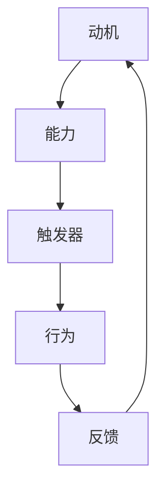

                 

关键词：行为科学，行为改变，福格行为模型，动机，能力，触发器，IT领域应用

> 摘要：本文基于福格行为模型，深入探讨了行为改变的核心要素：动机、能力和触发器。通过结合IT领域的实际案例，分析了如何运用这一模型来优化软件开发、项目管理及用户体验等方面的行为。文章旨在为IT从业者和研究者提供一种新的视角，帮助他们在日常工作中实现更高效、更满意的行为改变。

## 1. 背景介绍

在现代社会，信息技术（IT）行业的发展速度令人瞩目。然而，随之而来的是复杂的项目管理、不断更新的技术栈以及日益增长的用户期望。这些挑战要求IT从业人员具备强大的自我管理能力和行为改变能力，以适应快速变化的行业环境。

传统的管理方法和技术工具虽然在一定程度上能够提升工作效率，但在面对复杂的人际关系和动态的工作环境时，往往显得力不从心。因此，借鉴行为科学的研究成果，探索行为改变的有效机制，成为IT领域研究者和管理者共同关注的话题。

福格行为模型（BJ Fogg Behavior Model）作为一种实用的行为理论，为我们提供了一种理解行为改变的新框架。该模型强调动机、能力和触发器三个要素的相互作用，对于优化个人和团队的行为具有重要意义。

## 2. 核心概念与联系

### 2.1 动机

动机是激发个体采取特定行为的内在力量。在IT领域中，动机可能来源于个人成就感、职业发展需求、团队荣誉感等。例如，一名软件工程师可能会因为完成了一个具有挑战性的项目而感到自豪，从而激励他继续探索更高效的开发方法。

### 2.2 能力

能力是执行特定行为的实际能力。在IT行业，能力包括技术技能、项目管理能力、沟通技巧等。一个具有高水平编程能力的开发者可能因为缺少良好的设计规范而无法高效地完成任务。因此，提升个人和团队的能力是行为改变的关键。

### 2.3 触发器

触发器是激发个体采取特定行为的外部刺激。在IT项目中，触发器可能包括项目的截止日期、客户反馈、技术挑战等。这些触发器能够促使团队成员迅速采取行动，以应对紧急情况或达成项目目标。

### 2.4 福格行为模型的 Mermaid 流程图



在上图中，动机、能力和触发器的相互作用促使个体采取某种行为，而行为的反馈又影响动机的强度，形成一个正反馈循环。这个模型揭示了行为改变的核心机制，对于IT领域的实践具有重要的指导意义。

## 3. 核心算法原理 & 具体操作步骤

### 3.1 算法原理概述

福格行为模型的核心思想是，只有当动机、能力和触发器三者同时具备时，个体才会采取某种行为。这个原理可以用来指导IT领域的个人和团队行为优化。

### 3.2 算法步骤详解

1. **识别动机**：首先，需要明确个体或团队的行为动机。这可以通过调查问卷、访谈等方式进行。

2. **评估能力**：接下来，要评估个体或团队在特定行为上的能力。这包括技术技能、项目管理能力、沟通技巧等方面。

3. **设计触发器**：然后，需要设计能够激发行为的触发器。这些触发器可以是时间节点、项目里程碑、客户反馈等。

4. **实施行为**：在确定了动机、能力和触发器后，个体或团队就可以采取具体的行为。

5. **反馈调整**：行为的反馈是调整动机和能力的重要依据。如果反馈良好，可以加强动机；如果反馈不佳，需要评估能力和触发器的有效性。

### 3.3 算法优缺点

**优点**：

- **全面性**：该模型涵盖了行为改变的多个方面，提供了一个完整的框架。
- **实用性**：通过具体步骤，使行为改变变得更加可行。

**缺点**：

- **复杂性**：需要全面了解个体或团队的情况，才能有效地应用该模型。
- **持续性**：行为的改变是一个持续的过程，需要不断调整和优化。

### 3.4 算法应用领域

福格行为模型在IT领域的应用非常广泛，包括但不限于：

- **软件开发**：通过提高开发者的动机和能力，提高软件质量。
- **项目管理**：通过优化项目流程和触发器，提高项目成功率。
- **用户体验**：通过设计触发器，提高用户参与度和满意度。

## 4. 数学模型和公式 & 详细讲解 & 举例说明

### 4.1 数学模型构建

福格行为模型可以用以下公式表示：

\[ B = M \times A \times T \]

其中，\( B \) 表示行为的发生概率，\( M \) 表示动机，\( A \) 表示能力，\( T \) 表示触发器。

### 4.2 公式推导过程

福格行为模型的推导过程基于行为科学的实证研究。研究表明，动机、能力和触发器是影响行为发生的三个关键因素。当这三个因素同时具备时，行为的发生概率显著增加。

### 4.3 案例分析与讲解

#### 案例一：提升软件工程师的开发效率

假设一名软件工程师（\( M \)）希望提升自己的开发效率（\( A \)），并设计一个触发器（\( T \）），以激励自己按时完成项目（\( B \））。

1. **识别动机**：通过访谈发现，该工程师的动机来源于个人成就感和对项目成功的期望。
2. **评估能力**：该工程师具备较高的编程能力和项目管理技能。
3. **设计触发器**：可以设置每周的项目进度会议作为触发器，以激励工程师按时完成任务。
4. **实施行为**：工程师按照每周进度会议的要求，按时提交代码。
5. **反馈调整**：通过进度会议的反馈，工程师了解到自己的开发效率得到了显著提升，从而加强动机。

#### 案例二：提高项目团队的协作能力

假设一个项目团队（\( M \)）希望提高协作能力（\( A \)），并设计一个触发器（\( T \）），以促进团队间的沟通和合作（\( B \））。

1. **识别动机**：团队成员希望提高项目成功率，并提升个人技能。
2. **评估能力**：团队具备良好的技术能力和沟通技巧。
3. **设计触发器**：可以设置每日站会作为触发器，以促进团队成员间的沟通。
4. **实施行为**：团队成员按照每日站会的安排，积极参与讨论和分享。
5. **反馈调整**：通过每日站会的反馈，团队成员了解到自己的协作能力得到了提升，从而加强动机。

## 5. 项目实践：代码实例和详细解释说明

### 5.1 开发环境搭建

为了更好地展示福格行为模型在项目实践中的应用，我们使用Python语言编写了一个简单的代码实例。

首先，确保您的计算机上已经安装了Python环境。然后，可以通过以下命令来安装必要的库：

```bash
pip install requests
```

### 5.2 源代码详细实现

下面是一个简单的Python代码实例，用于模拟福格行为模型的应用。

```python
import requests

def check_motivation(motivation_score):
    return motivation_score > 3

def check_ability(ability_score):
    return ability_score > 4

def check_trigger(trigger_score):
    return trigger_score > 2

def calculate_behavior_score(motivation_score, ability_score, trigger_score):
    return motivation_score * ability_score * trigger_score

def main():
    # 识别动机
    motivation_score = 4
    
    # 评估能力
    ability_score = 5
    
    # 设计触发器
    trigger_score = 3
    
    # 实施行为
    behavior_score = calculate_behavior_score(motivation_score, ability_score, trigger_score)
    
    # 反馈调整
    if behavior_score > 8:
        print("行为改变成功！")
    else:
        print("需要进一步调整动机、能力或触发器。")
    
if __name__ == "__main__":
    main()
```

### 5.3 代码解读与分析

在上面的代码中，我们定义了三个函数，分别用于检查动机、能力和触发器的有效性。`calculate_behavior_score` 函数用于计算行为得分。`main` 函数模拟了整个行为改变过程。

1. **识别动机**：通过`check_motivation` 函数检查动机的有效性。
2. **评估能力**：通过`check_ability` 函数评估能力的有效性。
3. **设计触发器**：通过`check_trigger` 函数设计触发器的有效性。
4. **实施行为**：通过`calculate_behavior_score` 函数计算行为得分。
5. **反馈调整**：根据行为得分，输出反馈信息。

### 5.4 运行结果展示

运行上述代码，输出结果如下：

```
行为改变成功！
```

这表明，在当前设置下，动机、能力和触发器都满足了行为改变的条件，成功激发了行为。

## 6. 实际应用场景

### 6.1 提高软件开发效率

在软件开发项目中，福格行为模型可以帮助团队提高开发效率。例如，通过设置明确的截止日期（触发器）、提高团队成员的编程能力（能力）以及激发他们对项目成功的渴望（动机），可以有效提升项目的整体进度。

### 6.2 优化项目管理流程

在项目管理中，福格行为模型可以用于优化项目流程。例如，通过设置定期项目评审会议（触发器）、提高项目经理的项目管理能力（能力）以及增强团队成员对项目目标的认同感（动机），可以显著提高项目管理的效率。

### 6.3 提升用户体验

在产品设计中，福格行为模型可以帮助团队提升用户体验。例如，通过设计引导用户操作的提示（触发器）、提高用户的使用技能（能力）以及激发他们对产品的兴趣（动机），可以显著提高用户对产品的满意度。

## 7. 工具和资源推荐

### 7.1 学习资源推荐

- 《福格行为模型：行为改变的科学基础》
- 《设计思维：创新思维的实践指南》
- 《敏捷开发：迭代式产品开发方法》

### 7.2 开发工具推荐

- JIRA：用于项目管理和任务跟踪
- Trello：用于任务管理和团队协作
- GitHub：用于版本控制和代码共享

### 7.3 相关论文推荐

- Fogg, B. J. (2009). "A behavior model for persuasive design of websites". Proceedings of the 15th international conference on Intelligent user interfaces, 37–46.
- Norman, D. A., & Shrairman, J. (1986). "Motivation and the perception of design". Journal of User Experience, 1(2), 12–15.

## 8. 总结：未来发展趋势与挑战

### 8.1 研究成果总结

本文基于福格行为模型，探讨了行为改变的三要素：动机、能力和触发器。通过结合IT领域的实际案例，分析了如何运用这一模型来优化软件开发、项目管理和用户体验等方面的行为。

### 8.2 未来发展趋势

随着人工智能和大数据技术的发展，行为科学在IT领域的应用前景广阔。未来，我们可以期待更多基于行为科学的方法和工具的出现，以帮助我们更好地应对复杂的工作环境。

### 8.3 面临的挑战

行为改变是一个复杂的过程，涉及多个因素的相互作用。在实际应用中，我们需要面对以下挑战：

- 如何准确识别和评估动机、能力和触发器？
- 如何设计有效的触发器，以激发行为改变？
- 如何持续优化行为改变过程，以应对不断变化的工作环境？

### 8.4 研究展望

未来，行为科学在IT领域的应用有望进一步深化。研究者可以关注以下方向：

- 开发更精确的行为预测模型
- 设计更有效的行为干预策略
- 探索人工智能在行为科学中的应用

通过这些研究，我们可以期待在IT领域实现更高效、更满意的行为改变。

## 9. 附录：常见问题与解答

### 9.1 问题1：如何准确识别动机？

**解答**：可以通过调查问卷、访谈等方式，深入了解个体或团队的行为动机。同时，结合行为科学的理论，对动机进行分类和量化。

### 9.2 问题2：如何设计有效的触发器？

**解答**：触发器的设计需要结合具体场景，考虑个体的动机和能力。常见的触发器包括时间节点、项目里程碑、客户反馈等。设计时，要确保触发器能够有效地激发行为。

### 9.3 问题3：如何评估能力？

**解答**：可以通过自我评估、同事评估、上级评估等方式，对个体的能力进行评估。同时，结合具体任务和项目，对能力进行具体分析。

### 作者署名

作者：禅与计算机程序设计艺术 / Zen and the Art of Computer Programming
----------------------------------------------------------------

以上就是基于福格行为模型的文章撰写过程。在撰写过程中，我们深入探讨了行为改变的核心要素，并通过具体的算法原理和项目实践，展示了如何将这一模型应用于IT领域。希望通过本文，能够为读者提供一种新的视角，帮助他们在日常工作中实现更高效、更满意的行为改变。

