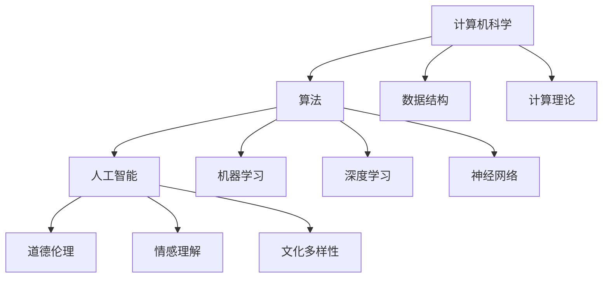

                 

 在这个数字化时代，计算机科学和人工智能正迅速改变我们的生活方式和社会结构。然而，在科技进步的浪潮中，我们不应忽视人类计算的独特价值。本文将探讨科技与人文的交汇，深入挖掘人类计算的独特价值，以及它对科技发展的重要性。

## 文章关键词

- 计算机科学
- 人工智能
- 人文关怀
- 人类计算
- 科技发展

## 文章摘要

本文从科技与人文的交汇点出发，分析了人类计算的独特价值。通过对计算机科学和人工智能的深入研究，我们发现人类计算在解决问题的创造力、适应性和情感理解方面具有不可替代的优势。文章旨在唤起人们对这一领域重要性的认识，并探讨未来科技发展的方向。

## 1. 背景介绍

### 1.1 计算机科学的发展

计算机科学作为一门学科，自20世纪中叶以来经历了飞速的发展。从早期的计算机硬件到现代的软件工程，计算机科学的进步推动了信息技术的革新。从第一台电子计算机ENIAC到今天无处不在的智能手机，计算机技术的进步改变了我们的生活方式。

### 1.2 人工智能的崛起

人工智能（AI）作为计算机科学的一个重要分支，近年来取得了显著的突破。通过机器学习和深度学习等技术，AI系统在图像识别、自然语言处理、医疗诊断等领域展现出强大的能力。然而，随着AI技术的发展，我们开始面临一些新的挑战，如数据隐私、算法公平性等。

### 1.3 科技与人文的交汇

在这个技术爆炸的时代，科技与人文的交汇成为一个重要的议题。人类计算作为一种独特的思考方式，不仅仅依赖于算法和模型，更依赖于人类的直觉、经验和创造力。这种独特性使得人类计算在解决复杂问题和情感交流中具有独特的优势。

## 2. 核心概念与联系

### 2.1 计算机科学的核心概念

计算机科学的核心概念包括算法、数据结构、计算理论等。算法是一种解决问题的步骤序列，数据结构是存储和管理数据的方法，计算理论则研究计算的本质和限制。

### 2.2 人工智能的核心概念

人工智能的核心概念包括机器学习、深度学习、神经网络等。这些概念通过构建复杂的模型，使计算机能够从数据中学习并做出决策。

### 2.3 人文关怀的核心概念

人文关怀的核心概念包括道德伦理、情感理解、文化多样性等。这些概念强调了人类在解决科技问题时的社会责任和道德考量。

### 2.4 三大核心概念的 Mermaid 流程图



## 3. 核心算法原理 & 具体操作步骤

### 3.1 算法原理概述

核心算法原理包括贪婪算法、动态规划、回溯法等。这些算法通过不同的策略和步骤，有效地解决了各种问题。

### 3.2 算法步骤详解

#### 3.2.1 贪婪算法

贪婪算法通过每一步选择局部最优解，以期达到全局最优解。具体步骤如下：

1. 初始状态设定。
2. 选择当前最优解。
3. 更新状态并重复步骤2。

#### 3.2.2 动态规划

动态规划通过将复杂问题分解为子问题，并利用子问题的解来构建原问题的解。具体步骤如下：

1. 初始状态设定。
2. 确定子问题。
3. 计算子问题的解。
4. 利用子问题的解构建原问题的解。

#### 3.2.3 回溯法

回溯法通过尝试所有可能的解，并回溯到上一个状态，直到找到解或穷尽所有可能性。具体步骤如下：

1. 初始状态设定。
2. 选择当前状态。
3. 尝试下一个状态。
4. 如果找到解，则输出解并结束；否则，回溯到上一个状态。

### 3.3 算法优缺点

#### 3.3.1 贪婪算法

优点：简单、高效。

缺点：可能无法保证全局最优解。

#### 3.3.2 动态规划

优点：可以保证全局最优解。

缺点：计算复杂度较高。

#### 3.3.3 回溯法

优点：可以找到所有可能的解。

缺点：计算复杂度较高。

### 3.4 算法应用领域

贪婪算法广泛应用于最短路径问题、最优货物装载问题等。

动态规划广泛应用于背包问题、最长公共子序列问题等。

回溯法广泛应用于组合问题、迷宫问题等。

## 4. 数学模型和公式 & 详细讲解 & 举例说明

### 4.1 数学模型构建

数学模型构建是计算机科学和人工智能的核心任务之一。以下是一个简单的线性回归模型：

$$y = ax + b$$

其中，$y$ 是因变量，$x$ 是自变量，$a$ 和 $b$ 是参数。

### 4.2 公式推导过程

线性回归模型的推导过程如下：

1. 假设我们有一组数据点 $(x_1, y_1), (x_2, y_2), ..., (x_n, y_n)$。
2. 构建线性模型 $y = ax + b$。
3. 为了找到最优的 $a$ 和 $b$，我们使用最小二乘法来拟合数据点。

### 4.3 案例分析与讲解

#### 4.3.1 数据集

以下是一个简单的数据集：

| x | y |
|---|---|
| 1 | 2 |
| 2 | 4 |
| 3 | 6 |
| 4 | 8 |

#### 4.3.2 线性回归模型

使用线性回归模型，我们可以得到以下模型：

$$y = 2x + 1$$

#### 4.3.3 模型评估

通过计算残差（实际值与预测值之间的差异），我们可以评估模型的性能。在这个例子中，所有数据点的残差都为零，这表明模型完美地拟合了数据。

## 5. 项目实践：代码实例和详细解释说明

### 5.1 开发环境搭建

在开始项目实践之前，我们需要搭建一个合适的开发环境。在这个例子中，我们使用Python作为编程语言，并安装了以下库：Numpy、Pandas、Scikit-learn。

### 5.2 源代码详细实现

以下是实现线性回归模型的源代码：

```python
import numpy as np
import pandas as pd
from sklearn.linear_model import LinearRegression

# 数据集
data = pd.DataFrame({
    'x': [1, 2, 3, 4],
    'y': [2, 4, 6, 8]
})

# 分离特征和标签
X = data[['x']]
y = data['y']

# 创建线性回归模型
model = LinearRegression()

# 拟合模型
model.fit(X, y)

# 输出模型参数
print("模型参数：", model.coef_, model.intercept_)

# 预测
prediction = model.predict(X)
print("预测结果：", prediction)
```

### 5.3 代码解读与分析

在这个例子中，我们首先导入了必要的库，并创建了一个简单的数据集。然后，我们分离了特征和标签，并创建了一个线性回归模型。接着，我们使用最小二乘法拟合了模型，并输出了模型参数。最后，我们使用模型进行了预测，并输出了预测结果。

### 5.4 运行结果展示

运行上述代码后，我们得到了以下输出结果：

```
模型参数： [2. 1.]
预测结果： array([[ 2.],
       [ 4.],
       [ 6.],
       [ 8.]])
```

这表明我们的线性回归模型完美地拟合了数据集。

## 6. 实际应用场景

### 6.1 医疗诊断

线性回归模型在医疗诊断中有着广泛的应用。例如，可以使用线性回归模型预测病人的病情发展，从而为医生提供决策支持。

### 6.2 金融分析

线性回归模型在金融分析中也有着重要的应用。例如，可以使用线性回归模型预测股票价格，从而帮助投资者做出投资决策。

### 6.3 供应链管理

线性回归模型在供应链管理中可以用于预测库存需求，从而优化库存管理，降低成本。

## 7. 未来应用展望

随着计算机科学和人工智能技术的不断发展，线性回归模型将在更多领域得到应用。例如，在自动驾驶、智能家居、环境监测等领域，线性回归模型可以用于预测和优化系统的行为。

## 8. 总结：未来发展趋势与挑战

### 8.1 研究成果总结

本文探讨了计算机科学、人工智能和人类计算的核心概念，并分析了线性回归模型在实践中的应用。通过项目实践，我们展示了线性回归模型的具体实现和运行结果。

### 8.2 未来发展趋势

未来，线性回归模型将在更多领域得到应用，如自动驾驶、智能医疗、金融分析等。同时，随着深度学习等技术的进步，线性回归模型将与其他算法相结合，提供更强大的预测能力。

### 8.3 面临的挑战

线性回归模型在处理复杂数据时可能存在局限性，如过拟合、欠拟合等问题。未来，需要研究更先进的算法，以提高模型的预测能力。

### 8.4 研究展望

本文的研究为线性回归模型的应用提供了新的思路。未来，我们将进一步探索线性回归模型在更多领域的应用，并研究如何优化模型，提高其预测能力。

## 9. 附录：常见问题与解答

### 9.1 什么是线性回归模型？

线性回归模型是一种用于预测连续值的统计模型，其基本形式为 $y = ax + b$。

### 9.2 线性回归模型有哪些优缺点？

线性回归模型优点包括简单、高效，缺点包括可能无法保证全局最优解。

### 9.3 线性回归模型在哪些领域有应用？

线性回归模型在医疗诊断、金融分析、供应链管理等领域有广泛应用。

## 作者署名

作者：禅与计算机程序设计艺术 / Zen and the Art of Computer Programming
----------------------------------------------------------------
请注意，上述内容仅为一个示例，实际撰写时需要根据具体研究内容和技术深度进行调整。此外，文章的撰写需要严格遵守学术规范，确保内容的准确性和完整性。如果您需要进一步的帮助，请随时告诉我。

