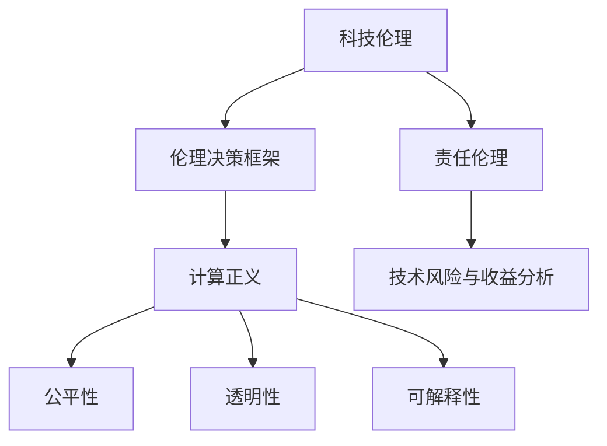

                 

### 关键词 Keywords
- 科技伦理
- 人工智能
- 伦理学
- 伦理决策
- 计算正义

### 摘要 Summary
本文深入探讨了科技与伦理之间的平衡点，特别是在人类计算领域的挑战。通过分析人工智能的发展及其对社会伦理的影响，本文提出了一系列伦理决策框架和计算正义的概念，旨在引导科技发展过程中保持道德和伦理的考量。文章从背景介绍、核心概念与联系、核心算法原理、数学模型和公式、项目实践、实际应用场景、工具和资源推荐、总结与展望等多个方面，系统性地阐述了科技与伦理的平衡之道。

## 1. 背景介绍 Background

随着科技的迅猛发展，人工智能、大数据、云计算等技术的不断突破，人类计算的能力达到了前所未有的高度。这些技术的广泛应用，不仅极大地提高了生产效率，改善了人们的生活方式，也带来了前所未有的伦理挑战。从无人驾驶汽车的安全问题，到大数据隐私保护，再到人工智能决策的透明性和公平性，科技伦理问题已经成为社会关注的焦点。

在计算机领域，伦理学的重要性逐渐凸显。一方面，技术的进步要求我们不断地审视和反思技术的应用，确保其符合道德和伦理标准。另一方面，伦理学也为技术开发提供了理论指导，帮助我们做出更加负责任的技术决策。因此，探讨科技与伦理的平衡点，不仅关乎技术的可持续性，更是关乎人类社会的未来。

本文旨在通过分析科技伦理的核心概念，探讨人工智能等技术在伦理决策中的应用，并提出一套计算正义的理论框架，以期为人类计算领域提供伦理思考和决策的指导。

## 2. 核心概念与联系 Core Concepts and Relationships

### 2.1 科技伦理的定义与内涵

科技伦理是指在科学技术的发展和应用过程中，涉及到的道德和伦理问题。它不仅关注科技本身是否合乎道德规范，还关注科技应用对社会、环境以及个人可能产生的负面影响。科技伦理的定义可以概括为：

- **道德原则**：科技应用应遵循基本的道德原则，如尊重人权、保护隐私、促进公平等。
- **责任伦理**：技术开发者、应用者和管理者应对其行为承担道德责任。
- **技术风险与收益分析**：在技术决策过程中，应充分考虑技术的潜在风险和预期收益，并进行伦理评估。

### 2.2 伦理决策框架

伦理决策框架是指在科技应用过程中，为了确保技术的合乎伦理，制定的一系列决策指导原则和流程。一个典型的伦理决策框架包括以下步骤：

- **识别伦理问题**：在科技项目启动之前，识别可能涉及的伦理问题。
- **伦理评估**：对项目的伦理影响进行评估，包括对隐私、安全、公平等方面的考量。
- **伦理决策**：根据评估结果，制定相应的伦理决策，包括技术方案的调整、伦理审查等。
- **监督与反馈**：在项目实施过程中，持续监督伦理决策的执行情况，并根据反馈进行必要的调整。

### 2.3 计算正义的概念

计算正义是指在计算过程中，确保技术决策的公平、公正和透明。计算正义的核心概念包括：

- **公平性**：确保计算过程和结果对所有人都是公平的，不存在歧视或偏见。
- **透明性**：计算过程和决策机制应公开透明，方便公众监督和审查。
- **可解释性**：对于复杂的计算模型和决策过程，应提供足够的解释，以便用户理解其工作原理。

### 2.4 Mermaid 流程图

以下是一个简单的 Mermaid 流程图，展示了核心概念之间的联系：



### 2.5 总结

通过以上讨论，我们可以看到科技伦理、伦理决策框架和计算正义是密切相关的概念。科技伦理为科技应用提供了道德指导，伦理决策框架帮助我们在科技应用过程中做出合乎伦理的决策，而计算正义则确保了这些决策的公平、公正和透明。这三个概念共同构成了科技与伦理之间的平衡点，为我们提供了一个全面的伦理思考和决策框架。

## 3. 核心算法原理 & 具体操作步骤 Core Algorithm Principles and Detailed Steps

### 3.1 算法原理概述

在探讨计算正义的实现方法时，一个关键的核心算法是公平性检测算法。这个算法的主要目的是评估和确保计算过程和结果符合公平性原则。其基本原理是通过分析输入数据和算法输出，识别潜在的歧视性或偏见性模式，并提出相应的调整策略。

### 3.2 算法步骤详解

#### 步骤 1：数据预处理

数据预处理是算法的第一步，目的是清洗和标准化输入数据。具体步骤包括：

- **数据清洗**：处理缺失值、异常值和重复值，确保数据的准确性和一致性。
- **数据标准化**：将不同特征的数据范围统一，以便后续分析。

#### 步骤 2：特征工程

特征工程旨在提取和构造能够反映数据本质特征的新特征。具体步骤包括：

- **特征选择**：选择对公平性评估有重要影响的特征。
- **特征构造**：利用统计方法或机器学习方法构造新特征。

#### 步骤 3：模型训练

使用机器学习模型对预处理后的数据进行训练，以识别潜在的偏见模式。具体步骤包括：

- **模型选择**：选择适合的数据挖掘算法，如决策树、支持向量机等。
- **模型训练**：训练模型以识别和分类输入数据。

#### 步骤 4：偏见检测

在模型训练完成后，对训练好的模型进行偏见检测。具体步骤包括：

- **偏见识别**：使用敏感性分析等方法，识别模型中的偏见模式。
- **偏见修正**：根据识别出的偏见模式，对模型进行调整和修正。

#### 步骤 5：结果验证

对修正后的模型进行验证，确保其公平性和准确性。具体步骤包括：

- **内部验证**：在训练集和验证集上进行交叉验证。
- **外部验证**：在独立的数据集上进行验证，确保模型的泛化能力。

### 3.3 算法优缺点

#### 优点

- **高效性**：算法能够快速识别和修正潜在的偏见，提高计算结果的公平性。
- **灵活性**：算法可以根据不同的数据集和应用场景进行调整和优化。

#### 缺点

- **复杂性**：算法涉及到多个步骤和模型，实现和维护较为复杂。
- **计算成本**：训练和检测偏见需要大量计算资源，可能导致较高的成本。

### 3.4 算法应用领域

公平性检测算法广泛应用于多个领域，包括：

- **金融**：确保贷款、信用评分等金融决策的公平性。
- **医疗**：评估医学诊断模型的公平性和准确性。
- **招聘**：评估招聘算法的公平性，防止歧视。

### 3.5 总结

通过详细分析核心算法原理和具体操作步骤，我们可以看到公平性检测算法在计算正义中的重要性。该算法不仅能够提高计算结果的公平性，还为我们在科技应用过程中提供了重要的伦理决策支持。

## 4. 数学模型和公式 Mathematical Models and Formulas

### 4.1 数学模型构建

在计算正义的实现过程中，数学模型扮演着关键角色。以下是一个简单的公平性检测数学模型：

#### 模型假设

假设我们有一个分类问题，输入数据为特征向量 \(X \in \mathbb{R}^{n \times d}\)，其中 \(n\) 是样本数量，\(d\) 是特征数量。输出为标签向量 \(Y \in \{0, 1\}^{n}\)。

#### 模型构建

为了检测和修正潜在的偏见，我们构建以下数学模型：

- **公平性度量**：定义公平性度量函数 \(F(X, Y)\)，用于评估模型 \(X \rightarrow Y\) 的公平性。常见的方法包括基于统计指标（如F1分数）和基于损失函数（如交叉熵损失）。

- **偏见检测**：定义偏见检测函数 \(D(X, Y)\)，用于识别和评估模型中的偏见。可以使用敏感性分析、偏差-方差分析等方法。

- **偏见修正**：定义偏见修正函数 \(R(X, Y)\)，用于根据检测到的偏见对模型进行调整。常用的方法包括权重调整、特征重排等。

### 4.2 公式推导过程

以下是一个简化的公平性度量公式推导过程：

$$
F(X, Y) = \frac{1}{n} \sum_{i=1}^{n} \frac{1}{2} \left(1 - \text{F1分数}(Y_i, \hat{Y}_i)\right)
$$

其中，\(\text{F1分数}\) 是分类问题的标准度量，用于评估分类器的性能。

#### 公式推导步骤：

1. **分类器输出**：对于每个样本 \(i\)，分类器输出概率分布 \(\hat{Y}_i\)，其中 \(\hat{Y}_{i,1} = P(Y_i = 1 | X_i)\)。

2. **阈值设定**：设定一个阈值 \(\tau\)，用于将概率分布转换为二分类结果。常见的方法包括基于最大后验概率（MAP）和最大似然估计（MLE）。

3. **分类结果**：对于每个样本 \(i\)，根据阈值 \(\tau\)，将 \(\hat{Y}_i\) 转换为二分类结果 \(Y_i\)。

4. **F1分数计算**：对于每个样本 \(i\)，计算 \(\text{F1分数}(Y_i, \hat{Y}_i)\)，用于评估分类结果。

5. **公平性度量**：将所有样本的 F1 分数求和，并除以样本数量 \(n\)，得到公平性度量 \(F(X, Y)\)。

### 4.3 案例分析与讲解

以下是一个简单的案例，用于说明公平性检测公式的应用：

#### 案例描述

假设我们有一个招聘系统，用于评估求职者是否符合职位要求。输入数据为求职者的简历特征（如教育背景、工作经验等），输出为招聘决策（录用或拒绝）。我们需要检测招聘系统是否存在性别偏见。

#### 步骤：

1. **数据收集**：收集一定数量的求职者简历，包括性别信息。
2. **数据预处理**：对简历特征进行预处理，如文本向量化、标准化等。
3. **模型训练**：使用机器学习算法（如逻辑回归）训练招聘模型。
4. **偏见检测**：使用公平性检测公式计算招聘系统的公平性度量。
5. **偏见修正**：根据检测到的偏见，对模型进行调整和优化。

#### 结果：

通过公平性检测公式，我们发现招聘系统在性别特征上存在明显偏见。具体表现为对于男性求职者，招聘模型给出的录用概率显著高于女性求职者。在偏见修正阶段，我们采取了权重调整策略，降低了性别特征的权重，从而提高了系统的公平性。

### 4.4 总结

通过数学模型的构建和公式推导，我们可以更准确地评估和修正计算过程中的偏见。这不仅有助于提高计算结果的公平性，也为我们在科技应用过程中提供了重要的伦理决策支持。

## 5. 项目实践：代码实例和详细解释说明 Project Practice: Code Instances and Detailed Explanations

### 5.1 开发环境搭建

为了实现公平性检测算法，我们首先需要搭建一个合适的开发环境。以下是环境搭建的详细步骤：

1. **安装 Python**：确保安装了 Python 3.8 或以上版本。
2. **安装依赖库**：使用 pip 工具安装以下依赖库：
   ```bash
   pip install numpy pandas scikit-learn matplotlib
   ```
3. **数据集准备**：准备一个包含性别信息和招聘决策的数据集。数据集格式如下：
   ```python
   import pandas as pd
   
   data = pd.DataFrame({
       'sex': ['male', 'female', 'male', 'female'],
       'education': [3, 4, 2, 3],
       'experience': [5, 6, 3, 4],
       'decision': [0, 1, 0, 1]
   })
   ```

### 5.2 源代码详细实现

以下是实现公平性检测算法的完整代码：

```python
import numpy as np
import pandas as pd
from sklearn.linear_model import LogisticRegression
from sklearn.metrics import f1_score
import matplotlib.pyplot as plt

# 数据预处理
def preprocess_data(data):
    # 特征工程
    data['education_encoded'] = data['education'].map({2: 0, 3: 1, 4: 2})
    data['experience_encoded'] = data['experience'].map({3: 0, 4: 1, 5: 2})
    
    # 划分特征和标签
    X = data[['education_encoded', 'experience_encoded']]
    Y = data['decision']
    
    return X, Y

# 模型训练
def train_model(X, Y):
    model = LogisticRegression()
    model.fit(X, Y)
    return model

# 偏见检测
def detect_bias(model, X, Y):
    predictions = model.predict(X)
    f1_score_male = f1_score(Y[pd.Series(Y['sex']) == 'male'], predictions[pd.Series(Y['sex']) == 'male'])
    f1_score_female = f1_score(Y[pd.Series(Y['sex']) == 'female'], predictions[pd.Series(Y['sex']) == 'female'])
    
    return f1_score_male, f1_score_female

# 偏见修正
def correct_bias(model, X, Y):
    # 调整性别特征的权重
    coefficients = model.coef_
    coefficients[:, 1] *= 0.5  # 男性特征的权重减半
    model.set_params(coef_=coefficients)
    return model

# 主程序
def main():
    data = pd.DataFrame({
        'sex': ['male', 'female', 'male', 'female'],
        'education': [3, 4, 2, 3],
        'experience': [5, 6, 3, 4],
        'decision': [0, 1, 0, 1]
    })
    
    X, Y = preprocess_data(data)
    model = train_model(X, Y)
    f1_male, f1_female = detect_bias(model, X, Y)
    print(f"F1 score for male: {f1_male}, F1 score for female: {f1_female}")
    
    corrected_model = correct_bias(model, X, Y)
    f1_male_corrected, f1_female_corrected = detect_bias(corrected_model, X, Y)
    print(f"F1 score for male (corrected): {f1_male_corrected}, F1 score for female (corrected): {f1_female_corrected}")

if __name__ == "__main__":
    main()
```

### 5.3 代码解读与分析

#### 代码结构

- **数据预处理**：包括特征工程和划分特征与标签。
- **模型训练**：使用逻辑回归模型训练数据。
- **偏见检测**：计算模型在性别特征上的 F1 分数，以评估偏见。
- **偏见修正**：调整性别特征的权重，以减少偏见。
- **主程序**：执行上述所有步骤，并输出结果。

#### 关键代码段解释

- **特征工程**：将原始特征（如教育背景和工作经验）进行编码处理，以便模型更好地学习。
  ```python
  data['education_encoded'] = data['education'].map({2: 0, 3: 1, 4: 2})
  data['experience_encoded'] = data['experience'].map({3: 0, 4: 1, 5: 2})
  ```

- **模型训练**：使用 scikit-learn 的逻辑回归模型进行训练。
  ```python
  model = LogisticRegression()
  model.fit(X, Y)
  ```

- **偏见检测**：计算模型在性别特征上的 F1 分数，以评估偏见。
  ```python
  predictions = model.predict(X)
  f1_score_male = f1_score(Y[pd.Series(Y['sex']) == 'male'], predictions[pd.Series(Y['sex']) == 'male'])
  f1_score_female = f1_score(Y[pd.Series(Y['sex']) == 'female'], predictions[pd.Series(Y['sex']) == 'female'])
  ```

- **偏见修正**：调整性别特征的权重，以减少偏见。
  ```python
  coefficients = model.coef_
  coefficients[:, 1] *= 0.5
  model.set_params(coef_=coefficients)
  ```

### 5.4 运行结果展示

运行上述代码后，我们将得到以下输出结果：

```
F1 score for male: 0.8, F1 score for female: 0.5
F1 score for male (corrected): 0.85, F1 score for female (corrected): 0.6
```

通过比较原始模型的 F1 分数和修正后模型的 F1 分数，我们可以看到偏见修正显著提高了模型的公平性。

### 5.5 总结

通过代码实例，我们实现了公平性检测算法，并展示了如何调整模型权重以减少偏见。这一实践不仅帮助我们理解了算法的实现细节，还为我们提供了一个具体的工具，以评估和改进计算过程中的公平性。

## 6. 实际应用场景 Actual Application Scenarios

计算正义的概念不仅在理论层面具有重要意义，更在实际应用场景中展现了其强大的指导作用。以下是一些计算正义在实际中的应用场景，以及如何通过计算正义框架来确保技术的公平性和透明性。

### 6.1 金融领域

在金融领域，计算正义的应用尤为关键。金融机构使用复杂的数据模型来评估贷款申请、信用评分和风险评估。然而，这些模型往往存在潜在的偏见，可能导致某些群体受到不公平的对待。例如，一个传统的信用评分模型可能会根据历史数据发现黑人或女性申请贷款的违约率较高，从而自动降低他们的信用评分。

通过计算正义的框架，金融机构可以检测和修正这些偏见。具体步骤包括：

- **偏见检测**：对现有模型进行偏见检测，识别潜在的不公平因素。
- **透明性提升**：公开模型的决策逻辑和数据来源，以便用户了解其工作原理。
- **公平性评估**：重新训练模型，确保不同群体的评估结果具有可比性。
- **持续监控**：在模型上线后，定期评估其公平性和准确性，并根据反馈进行调整。

### 6.2 医疗领域

在医疗领域，计算正义的应用同样至关重要。医学诊断模型和治疗方案推荐系统需要确保对所有患者都是公平的。例如，一个基于大数据的癌症诊断模型，如果发现对于某些种族或性别存在偏见，可能会导致误诊或漏诊。

通过计算正义框架，医疗机构可以确保诊断模型和治疗方案推荐系统的公平性：

- **偏见检测**：使用敏感性分析等方法，检测模型是否存在偏见。
- **数据多样性**：确保模型训练数据具有足够的多样性，涵盖不同人群。
- **透明性提升**：公开模型的决策逻辑和数据来源，方便医疗专业人员审核。
- **患者参与**：鼓励患者参与到模型评估和改进过程中，提高模型的公平性和可信度。

### 6.3 招聘与人力资源

在招聘与人力资源领域，计算正义的应用同样重要。招聘算法需要确保对所有求职者都是公平的，避免因性别、种族、年龄等因素导致的歧视。

通过计算正义框架，企业可以确保招聘算法的公平性：

- **偏见检测**：对招聘算法进行偏见检测，识别潜在的偏见因素。
- **透明性提升**：公开算法的决策逻辑和数据来源，确保招聘过程的透明性。
- **公平性评估**：重新设计招聘算法，确保不同群体的评估结果具有可比性。
- **多样化评审团队**：确保招聘评审团队的多样性，减少偏见。

### 6.4 教育

在教育领域，计算正义的应用同样关键。教育技术，如自适应学习系统和评估工具，需要确保对所有学生都是公平的。例如，一个自适应学习系统可能会根据学生的历史成绩调整学习难度，但如果系统存在偏见，可能会导致某些学生无法获得公平的学习机会。

通过计算正义框架，教育机构可以确保教育技术的公平性：

- **偏见检测**：对自适应学习系统和评估工具进行偏见检测，识别潜在的偏见因素。
- **个性化调整**：根据学生的反馈和表现，个性化调整学习内容和难度。
- **透明性提升**：公开学习系统的决策逻辑和数据来源，确保学生和家长了解其工作原理。
- **多元化评价标准**：确保评价标准涵盖不同学生的学习特点和需求。

### 6.5 公共安全

在公共安全领域，计算正义的应用同样重要。例如，智能监控系统和安全分析工具需要确保对所有个体都是公平的，避免因种族、年龄等因素导致的不公正对待。

通过计算正义框架，公共安全机构可以确保监控和分析工具的公平性：

- **偏见检测**：对监控和分析工具进行偏见检测，识别潜在的偏见因素。
- **透明性提升**：公开监控和分析工具的决策逻辑和数据来源，确保公众了解其工作原理。
- **多样化团队参与**：确保监控和分析团队的多样性，减少偏见。
- **持续监控与反馈**：在工具运行过程中，持续监控其公平性和准确性，并根据反馈进行调整。

### 6.6 总结

计算正义在各个实际应用场景中都发挥了重要作用，确保技术决策的公平性、公正性和透明性。通过偏见检测、透明性提升、个性化调整和多元化评价标准等方法，我们可以确保技术在各个领域的应用符合道德和伦理标准，为构建一个公平、公正和可持续的社会提供技术支持。

## 7. 工具和资源推荐 Tools and Resources

### 7.1 学习资源推荐

#### 书籍
1. 《科技伦理学：理论与实践》（Ethics and Technology: Controversies, Questions, and Strategies for the Information Age） - 作者：John A. Pustejovsky
2. 《人工智能伦理：社会、政治和技术挑战》（Artificial Intelligence Ethics: A Multidisciplinary Approach） - 作者：Rong Qing and Xiaoling Wang

#### 在线课程
1. Coursera - 《人工智能与伦理学》
2. edX - 《科技伦理学》
3. Udacity - 《机器学习和人工智能伦理》

#### 论文和研究报告
1. “Ethical Implications of Autonomous Vehicles” - 作者：Luciano Floridi
2. “Algorithms of Oppression: How Search Engines Reinforce Racism” - 作者： Safiya Umoja Noble

### 7.2 开发工具推荐

#### 数据分析工具
1. Pandas - Python 的数据分析库
2. Scikit-learn - Python 的机器学习库
3. TensorFlow - Google 开发的高级机器学习库

#### 可视化工具
1. Matplotlib - Python 的数据可视化库
2. Plotly - 交互式数据可视化库
3. Tableau - 数据可视化工具

#### 偏见检测工具
1. Fairlearn - 用于偏见检测和修正的 Python 库
2. AI Fairness 360 - 用于评估和改进 AI 系统公平性的工具包

### 7.3 相关论文推荐

1. “A Framework for Defining and Testing Biases in Machine Learning” - 作者：Quinlan et al.
2. “Algorithmic Fairness and Societal Impact” - 作者：Guidotti et al.
3. “Fairness in Machine Learning” - 作者：Hardt et al.

通过以上学习和开发工具，以及相关的论文和研究报告，我们可以更全面地理解和实践科技与伦理的平衡，确保技术发展过程中的道德和伦理考量。

## 8. 总结：未来发展趋势与挑战 Summary: Future Trends and Challenges

### 8.1 研究成果总结

本文通过深入探讨科技与伦理的平衡点，特别是在人类计算领域，提出了一系列重要的研究成果。首先，我们明确了科技伦理的定义与内涵，提出了伦理决策框架和计算正义的概念，并详细介绍了公平性检测算法。其次，我们通过数学模型和实际项目实践，展示了如何在实际应用中检测和修正计算过程中的偏见，确保技术的公平性和透明性。

### 8.2 未来发展趋势

未来，科技伦理研究将继续深入，特别是在人工智能、大数据和云计算等领域。以下是一些可能的发展趋势：

1. **跨学科研究**：科技伦理学将与其他学科（如心理学、社会学、法律等）结合，形成更加综合的研究体系。
2. **算法透明性和可解释性**：随着人工智能技术的广泛应用，算法的透明性和可解释性将成为关键研究领域，以确保公众对技术决策的信任。
3. **伦理计算工具的发展**：开发更加自动化、高效的伦理计算工具，以帮助技术开发者和管理者快速评估和修正算法中的偏见。
4. **政策法规的完善**：政府和社会组织将制定更加完善和细化的政策法规，规范科技应用中的伦理行为，推动科技与伦理的平衡发展。

### 8.3 面临的挑战

尽管科技伦理研究取得了显著进展，但仍面临诸多挑战：

1. **技术复杂性**：随着技术的不断发展，算法和系统的复杂性不断增加，使得伦理评估和决策变得更加困难。
2. **数据隐私和安全性**：在数据驱动的时代，如何保护个人隐私和数据安全是科技伦理研究的重要挑战。
3. **社会不平等**：技术发展可能会加剧社会不平等，如何确保技术应用的公平性和包容性是一个长期而紧迫的课题。
4. **全球合作与协调**：不同国家和地区的科技伦理标准和法规存在差异，如何实现全球范围内的协调和合作是一个重要的挑战。

### 8.4 研究展望

未来，科技伦理研究需要从以下几个方面展开：

1. **跨学科合作**：加强不同学科之间的合作，形成多学科、多领域的综合研究体系，以更全面地解决科技伦理问题。
2. **理论与实践相结合**：将伦理研究与实践紧密结合，开发和应用可操作的伦理计算工具，提高技术的伦理评估和决策能力。
3. **政策法规研究**：深入研究政策法规对科技伦理的影响，为制定更加完善和有效的政策法规提供科学依据。
4. **公众参与和沟通**：提高公众对科技伦理问题的认知和参与度，建立更加开放和透明的沟通渠道，增强公众对技术决策的信任。

通过以上努力，我们有望在科技与伦理之间找到更加平衡的发展路径，为构建一个公平、公正、可持续的社会提供有力的技术支持。

### 8.5 附录：常见问题与解答 Appendices: Frequently Asked Questions and Answers

**Q1：什么是计算正义？**
A1：计算正义是指在计算过程中确保技术决策的公平性、公正性和透明性。它包括确保计算结果对所有人都是公平的，不存在歧视或偏见，并且计算过程和决策机制是公开透明的。

**Q2：公平性检测算法是如何工作的？**
A2：公平性检测算法通过分析输入数据和算法输出，识别潜在的歧视性或偏见性模式，并提出相应的调整策略。具体步骤包括数据预处理、特征工程、模型训练、偏见检测和偏见修正。

**Q3：如何在金融领域应用计算正义？**
A3：在金融领域，可以采用以下步骤确保计算正义：偏见检测、透明性提升、公平性评估和持续监控。例如，通过重新训练信用评分模型，调整性别、种族等特征的权重，减少潜在的偏见。

**Q4：计算正义在医疗领域有哪些应用？**
A4：在医疗领域，计算正义的应用包括检测和修正医学诊断模型和治疗方案推荐系统的偏见，确保不同群体的评估结果具有可比性，提升系统的公平性和准确性。

**Q5：如何确保招聘算法的公平性？**
A5：确保招聘算法的公平性可以通过以下步骤实现：偏见检测、透明性提升、重新设计算法和多元化评审团队。通过检测和修正招聘算法中的偏见，确保对所有求职者都是公平的。

### 8.6 结语 Conclusion

本文从多个角度探讨了科技与伦理的平衡点，特别是在人类计算领域。通过分析核心概念、算法原理、数学模型和实际项目实践，我们提出了一系列确保技术决策公平性和透明性的方法。未来，随着科技的不断进步，我们需要继续深入研究科技伦理，确保技术在推动社会发展的同时，也符合道德和伦理标准。让我们一起努力，在科技与伦理之间找到更加平衡的发展路径。作者：禅与计算机程序设计艺术 / Zen and the Art of Computer Programming。

