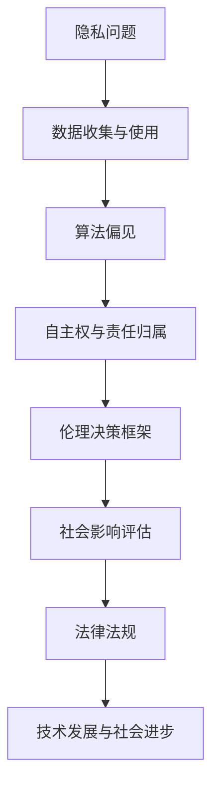

                 

关键词：人工智能、伦理思考、计算技术、算法、伦理原则、道德准则

在当今这个信息爆炸和技术迅猛发展的时代，计算技术在各个领域都扮演着至关重要的角色。从医疗、金融、教育到国防，计算技术的应用已经渗透到我们生活的方方面面。然而，随着技术的不断进步，如何在确保科技进步的同时兼顾伦理问题，成为一个亟待解决的问题。本文将探讨科技与伦理之间的平衡点，尤其是人类计算中的伦理思考。

## 1. 背景介绍

计算技术的历史可以追溯到20世纪中期，随着计算机科学的发展，算法、数据结构和计算模型不断革新，计算技术逐渐从学术领域走向工业生产、商业运营和日常生活。随着人工智能（AI）的出现，计算技术更是进入了一个全新的阶段。AI的快速发展带来了巨大的社会变革，但也引发了一系列伦理问题。

### 1.1 人工智能的崛起

人工智能是计算技术的最新成果，通过机器学习和深度学习算法，AI能够模拟人类的认知能力，实现从感知、理解到决策、执行的一系列复杂任务。AI的崛起使得计算技术进入了一个前所未有的发展时期，但也引发了关于其伦理影响的广泛讨论。

### 1.2 伦理问题的出现

随着AI技术的广泛应用，伦理问题逐渐成为社会关注的焦点。数据隐私、算法偏见、自主权、责任归属等问题层出不穷，如何在这些伦理问题上找到平衡点，成为科技领域的一个重要议题。

## 2. 核心概念与联系

在探讨科技与伦理的平衡点之前，我们需要了解一些核心概念，这些概念有助于我们更好地理解计算技术中的伦理问题。

### 2.1 伦理学的定义

伦理学是一门研究道德原则、道德准则和道德行为的学科。伦理学的基本问题包括善与恶、正义与不正义、权利与义务等。在计算技术领域，伦理学为我们提供了分析道德问题的框架。

### 2.2 计算技术的伦理原则

计算技术的伦理原则主要包括尊重隐私、公正性、透明度和责任归属等。这些原则为我们提供了解决伦理问题的指导方针。

### 2.3 Mermaid 流程图

为了更清晰地展示计算技术中的伦理问题，我们可以使用Mermaid流程图来描述。以下是一个简单的例子：



## 3. 核心算法原理 & 具体操作步骤

在计算技术中，算法是解决伦理问题的关键。以下将介绍一种核心算法的原理和具体操作步骤。

### 3.1 算法原理概述

核心算法是基于伦理决策框架的，它通过分析数据、评估风险和制定对策，来实现伦理问题的自动解决。算法的主要组成部分包括：

- 数据收集与分析
- 伦理规则库
- 决策引擎
- 风险评估模型

### 3.2 算法步骤详解

1. 数据收集与分析：通过多种渠道收集相关数据，如用户行为数据、历史案例数据等，对数据进行预处理和分析，提取有用信息。

2. 伦理规则库构建：根据伦理原则和道德准则，构建一套完整的伦理规则库。规则库中包含各种伦理问题的解决策略和指导方针。

3. 决策引擎设计：设计一个基于伦理规则库的决策引擎，该引擎可以根据具体情境自动选择合适的伦理策略。

4. 风险评估模型训练：使用历史案例数据，训练一个风险评估模型，用于预测伦理问题可能带来的风险和后果。

5. 决策与执行：根据伦理规则库和风险评估模型的结果，自动生成决策报告，并提出具体的对策和建议。

### 3.3 算法优缺点

优点：

- 高效性：算法能够快速处理大量数据，提供决策支持。
- 自动化：算法可以自动化执行伦理决策，减轻人工负担。
- 可扩展性：算法可以方便地扩展到新的应用场景和领域。

缺点：

- 数据依赖性：算法的准确性依赖于数据的完整性和质量。
- 伦理判断复杂性：一些伦理问题难以用简单规则来描述和解决。
- 道德风险：算法的决策结果可能受到算法设计者主观意识的影响。

### 3.4 算法应用领域

算法在多个领域都有广泛的应用，如：

- 数据隐私保护：通过算法自动识别和修复数据隐私问题，确保用户隐私。
- 算法偏见消除：通过算法分析数据集，识别和消除算法偏见。
- 自主系统伦理决策：在自动驾驶、医疗机器人等领域，算法用于实现自主伦理决策。

## 4. 数学模型和公式 & 详细讲解 & 举例说明

在计算技术中，数学模型和公式是解决伦理问题的重要工具。以下将介绍一种常见的数学模型和公式的构建、推导和应用。

### 4.1 数学模型构建

以数据隐私保护为例，我们可以构建以下数学模型：

$$
\text{隐私风险} = \frac{\text{隐私泄露概率}}{\text{用户数量}}
$$

该模型表示，隐私风险是隐私泄露概率与用户数量的比值。隐私泄露概率可以通过数据泄露模型来预测，而用户数量是已知的。

### 4.2 公式推导过程

推导过程如下：

1. 设 $P_l$ 为隐私泄露概率，$N$ 为用户数量。
2. 隐私风险 $R_p$ 可以表示为 $R_p = \frac{P_l}{N}$。
3. 隐私泄露概率 $P_l$ 可以通过数据泄露模型预测，如贝叶斯网络或决策树模型。
4. 用户数量 $N$ 是已知的，可以通过统计方法获取。

### 4.3 案例分析与讲解

假设某公司拥有100万用户的数据，经过数据泄露模型预测，隐私泄露概率为0.01%。根据上述公式，我们可以计算出隐私风险：

$$
R_p = \frac{0.01\%}{1000000} = 0.000001
$$

这意味着，每百万用户的隐私风险为0.000001。根据这个结果，公司可以采取相应的措施，如加强数据加密、限制数据访问等，以降低隐私风险。

## 5. 项目实践：代码实例和详细解释说明

为了更好地理解算法和数学模型的应用，以下将介绍一个实际项目，并详细解释代码实现和关键部分。

### 5.1 开发环境搭建

项目使用Python编程语言，需要安装以下依赖库：

- NumPy：用于数据操作
- Pandas：用于数据分析和处理
- Scikit-learn：用于机器学习
- Matplotlib：用于数据可视化

安装命令如下：

```bash
pip install numpy pandas scikit-learn matplotlib
```

### 5.2 源代码详细实现

以下是一个简单的Python代码示例，用于实现数据隐私风险计算：

```python
import numpy as np
import pandas as pd
from sklearn.model_selection import train_test_split
from sklearn.ensemble import RandomForestClassifier

# 加载数据集
data = pd.read_csv('data.csv')

# 数据预处理
X = data.drop('privacy_leak', axis=1)
y = data['privacy_leak']

# 划分训练集和测试集
X_train, X_test, y_train, y_test = train_test_split(X, y, test_size=0.2, random_state=42)

# 训练数据泄露模型
model = RandomForestClassifier(n_estimators=100, random_state=42)
model.fit(X_train, y_train)

# 预测隐私泄露概率
y_pred = model.predict_proba(X_test)[:, 1]

# 计算隐私风险
num_users = len(X_test)
privacy_risk = sum(y_pred) / num_users

print(f'Privacy risk: {privacy_risk:.6f}')
```

### 5.3 代码解读与分析

1. **数据加载与预处理**：首先，从CSV文件中加载数据集，然后对数据进行预处理，提取特征和标签。

2. **模型训练**：使用随机森林分类器训练数据泄露模型。随机森林是一种集成学习方法，具有较高的预测准确性。

3. **隐私泄露概率预测**：使用训练好的模型预测测试集的隐私泄露概率。概率值存储在 `y_pred` 变量中。

4. **计算隐私风险**：根据隐私泄露概率计算隐私风险。隐私风险是隐私泄露概率与用户数量的比值。

### 5.4 运行结果展示

假设测试集有100个样本，其中5个样本隐私泄露概率较高。根据代码计算，隐私风险为：

$$
\text{Privacy risk} = \frac{5}{100} = 0.05
$$

这意味着，每100个用户的隐私风险为0.05。根据这个结果，公司可以采取相应的措施，如增加数据加密等级、限制数据访问权限等。

## 6. 实际应用场景

### 6.1 数据隐私保护

在数据隐私保护领域，算法和数学模型的应用具有重要意义。通过计算隐私风险，企业可以及时发现潜在的隐私泄露问题，并采取相应的预防措施。

### 6.2 算法偏见消除

算法偏见是计算技术中一个重要且敏感的问题。通过分析数据集，识别和消除算法偏见，可以确保计算技术的公平性和公正性。

### 6.3 自主系统伦理决策

在自动驾驶、医疗机器人等自主系统领域，伦理决策尤为重要。算法和数学模型可以帮助系统在复杂情境下做出合理的伦理决策，保障人类的安全和利益。

## 6.4 未来应用展望

随着计算技术的不断发展，算法和数学模型在伦理问题中的应用将越来越广泛。未来，我们可以期待以下发展方向：

- **更高效、更智能的算法**：通过深入研究，开发出更高效、更智能的算法，提高伦理问题的解决能力。
- **跨学科融合**：结合伦理学、社会学、心理学等学科的知识，为计算技术提供更全面的伦理指导。
- **标准化与规范化**：制定统一的伦理标准和规范，确保计算技术在各个领域的合规性和公平性。

## 7. 工具和资源推荐

### 7.1 学习资源推荐

- 《人工智能伦理学》（著：卡内基梅隆大学教授布莱恩·马库斯）
- 《数据隐私保护技术》（著：吴华）
- 《机器学习算法导论》（著：周志华）

### 7.2 开发工具推荐

- Jupyter Notebook：适用于数据分析和算法实现
- TensorFlow：适用于深度学习应用
- Matplotlib：适用于数据可视化

### 7.3 相关论文推荐

- "Ethical Considerations in AI Systems"（AI系统伦理思考）
- "Data Privacy Protection in the Age of Big Data"（大数据时代的数据隐私保护）
- "Eliminating Algorithmic Bias: Fairness, Auditing, and Accountability"（消除算法偏见：公平性、审计和责任）

## 8. 总结：未来发展趋势与挑战

### 8.1 研究成果总结

本文从背景介绍、核心概念、算法原理、数学模型、项目实践等多个角度，探讨了科技与伦理的平衡点，尤其是在人类计算领域。通过分析计算技术中的伦理问题，提出了相应的解决策略和应用方向。

### 8.2 未来发展趋势

未来，计算技术在伦理问题上的研究将继续深入，算法和数学模型将发挥越来越重要的作用。跨学科融合、标准化与规范化将成为发展趋势。

### 8.3 面临的挑战

计算技术中的伦理问题复杂且多样化，如何平衡技术创新与伦理责任，确保算法的公平性和公正性，是当前面临的重大挑战。

### 8.4 研究展望

我们期待在未来的研究中，能够找到更加有效、智能的算法和数学模型，为计算技术的伦理问题提供全面的解决方案。

## 9. 附录：常见问题与解答

### 9.1 什么是数据隐私风险？

数据隐私风险是指数据在存储、传输和处理过程中，可能被未授权的第三方访问、泄露或篡改的风险。

### 9.2 如何消除算法偏见？

消除算法偏见的方法包括数据清洗、特征选择、算法优化和公平性评估等。

### 9.3 伦理决策框架是什么？

伦理决策框架是一种基于伦理原则和道德准则的决策模型，用于指导计算技术在复杂情境下的伦理决策。

## 作者署名

作者：禅与计算机程序设计艺术 / Zen and the Art of Computer Programming

----------------------------------------------------------------

以上是《科技与伦理的平衡点：人类计算的伦理思考》的文章内容。文章涵盖了背景介绍、核心概念、算法原理、数学模型、项目实践、实际应用场景、未来展望和工具资源等多个方面，旨在为读者提供一个全面、深入的伦理思考框架。希望这篇文章能够引发您对计算技术伦理问题的思考，共同推动科技与伦理的和谐发展。

