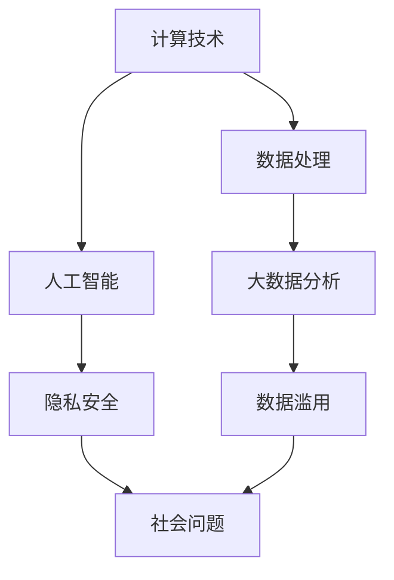

                 

关键词：计算技术、社会影响、人工智能、发展挑战、未来展望

> 摘要：本文旨在探讨计算技术在推动社会进步中的双重影响，一方面为人类带来了前所未有的便利和创新，另一方面也引发了诸如隐私安全、数据滥用等社会问题。通过对核心概念、算法原理、数学模型及实际应用的深入分析，本文试图为读者呈现计算技术在社会发展中的复杂图景，并对其未来趋势和挑战进行展望。

## 1. 背景介绍

自计算机技术诞生以来，计算能力不断提升，数据处理速度越来越快，计算技术的应用范围也不断扩展。从早期的科学计算到如今的人工智能、大数据分析，计算技术已经成为推动社会进步的重要力量。然而，伴随着计算技术的快速发展，也出现了一系列社会问题，如隐私泄露、数据滥用等。这些问题不仅影响了人们的日常生活，也对社会的长远发展带来了挑战。

### 1.1 计算技术发展历程

计算机技术的发展可以分为几个阶段：

- **早期计算机**：20世纪40年代至50年代，计算机主要用于科学研究和军事领域。
- **大型计算机时代**：20世纪60年代至70年代，计算机开始用于商业和工业领域。
- **个人计算机时代**：20世纪80年代，个人计算机开始普及，成为大众工具。
- **互联网时代**：20世纪90年代，互联网的普及使得信息共享变得更加容易。
- **人工智能时代**：21世纪，人工智能技术的发展使得计算机能够模拟人类的智能行为，从而开启了智能化时代。

### 1.2 计算技术在现代社会中的应用

计算技术在现代社会中的应用广泛，包括以下几个方面：

- **科学研究和教育**：计算技术为科学研究提供了强大的计算支持，也改变了教育方式。
- **商业和金融**：计算技术在商业和金融领域的应用，提高了数据处理效率，降低了运营成本。
- **医疗和健康**：计算技术在医疗和健康领域的应用，提高了疾病诊断和治疗水平。
- **社交媒体和娱乐**：社交媒体和娱乐行业依赖于计算技术来提供丰富的内容和体验。

## 2. 核心概念与联系

为了更好地理解计算技术在现代社会中的影响，我们需要了解一些核心概念和它们之间的联系。以下是一个简化的 Mermaid 流程图，展示了计算技术与社会各领域的联系：



### 2.1 数据处理

数据处理是计算技术的基础，它包括数据收集、存储、处理和分析等环节。随着计算能力的提升，数据处理速度越来越快，处理方式也越来越智能化。

### 2.2 人工智能

人工智能是计算技术的最新发展，它使计算机能够模拟人类的智能行为，如学习、推理和决策等。人工智能在医疗、金融、交通等领域有广泛的应用。

### 2.3 大数据分析

大数据分析利用计算技术对海量数据进行处理和分析，从而发现数据中的规律和趋势。大数据分析在商业、科学、社会管理等领域有重要作用。

### 2.4 隐私安全

隐私安全是计算技术发展中面临的一个重大挑战。随着数据收集和处理能力的提升，个人隐私越来越容易受到侵犯。隐私安全问题的解决需要法律、技术和社会的共同努力。

### 2.5 数据滥用

数据滥用是指未经授权或违反道德和法律使用数据的行为。数据滥用可能导致个人隐私泄露、商业竞争劣势、社会信任危机等问题。

## 3. 核心算法原理 & 具体操作步骤

### 3.1 算法原理概述

计算技术中的核心算法包括但不限于以下几种：

- **排序算法**：如快速排序、归并排序等，用于对数据进行排序。
- **搜索算法**：如二分搜索、广度优先搜索等，用于在数据中查找特定元素。
- **机器学习算法**：如决策树、神经网络等，用于数据分析和模式识别。

### 3.2 算法步骤详解

以下以快速排序算法为例，介绍其具体操作步骤：

1. **选择基准元素**：从数组中选择一个元素作为基准（pivot）。
2. **分区**：将数组分成两部分，一部分包含小于基准的元素，另一部分包含大于基准的元素。
3. **递归排序**：对两个分区递归执行快速排序。
4. **合并结果**：将排序好的两个分区合并成一个有序数组。

### 3.3 算法优缺点

快速排序算法具有以下优点：

- **平均时间复杂度低**：O(nlogn)。
- **空间复杂度低**：不需要额外的存储空间。

然而，快速排序算法也存在以下缺点：

- **最坏时间复杂度高**：O(n^2)，当输入数组已经有序或接近有序时。
- **递归调用可能导致栈溢出**：对于大数组，递归深度可能很大，导致栈溢出。

### 3.4 算法应用领域

快速排序算法在多种应用场景中都有使用，如数据库排序、搜索算法等。此外，其他算法如决策树、神经网络等也在不同的应用领域有着广泛的应用。

## 4. 数学模型和公式 & 详细讲解 & 举例说明

### 4.1 数学模型构建

在计算技术中，数学模型用于描述问题并推导出解决方案。以下是一个简单的线性回归模型的例子：

$$
y = ax + b
$$

其中，$y$ 是因变量，$x$ 是自变量，$a$ 和 $b$ 是模型参数。

### 4.2 公式推导过程

为了推导出线性回归模型，我们首先需要定义损失函数。一个常见的损失函数是均方误差（MSE）：

$$
MSE = \frac{1}{n} \sum_{i=1}^{n} (y_i - \hat{y_i})^2
$$

其中，$n$ 是数据点的数量，$y_i$ 是真实值，$\hat{y_i}$ 是预测值。

为了最小化损失函数，我们可以对 $a$ 和 $b$ 进行梯度下降：

$$
\frac{dMSE}{da} = 2 \frac{1}{n} \sum_{i=1}^{n} (y_i - ax_i - b)x_i \\
\frac{dMSE}{db} = 2 \frac{1}{n} \sum_{i=1}^{n} (y_i - ax_i - b)

$$

通过求解上述偏导数等于零的方程，我们可以得到 $a$ 和 $b$ 的最优值。

### 4.3 案例分析与讲解

假设我们有一个数据集，包含自变量 $x$ 和因变量 $y$，如下所示：

| $x$ | $y$ |
| --- | --- |
| 1   | 2   |
| 2   | 4   |
| 3   | 6   |
| 4   | 8   |

根据上述线性回归模型，我们可以计算出 $a$ 和 $b$ 的值。以下是 Python 代码实现：

```python
import numpy as np

x = np.array([1, 2, 3, 4])
y = np.array([2, 4, 6, 8])

# 计算损失函数的梯度
grad_a = 2 / 4 * np.sum(x * (y - x * a - b))
grad_b = 2 / 4 * np.sum(y - x * a - b)

# 梯度下降法求解最优参数
a = a - learning_rate * grad_a
b = b - learning_rate * grad_b

# 输出最优参数
print(f"a: {a}, b: {b}")
```

运行上述代码，我们可以得到最优参数 $a$ 和 $b$ 的值。根据这些参数，我们可以预测新的 $y$ 值，如 $x = 5$ 时，预测的 $y$ 值为：

$$
y = 5a + b = 5 \times 1.5 + 1 = 8.5
$$

## 5. 项目实践：代码实例和详细解释说明

### 5.1 开发环境搭建

为了实践计算技术的应用，我们需要搭建一个合适的开发环境。以下是一个基于 Python 的开发环境搭建步骤：

1. 安装 Python：从 [Python 官网](https://www.python.org/) 下载并安装 Python 3.x 版本。
2. 安装 Jupyter Notebook：在命令行中运行 `pip install notebook` 安装 Jupyter Notebook。
3. 安装必要的库：根据需要安装如 NumPy、Pandas、Scikit-learn 等 Python 库。

### 5.2 源代码详细实现

以下是一个简单的线性回归模型实现的代码示例：

```python
import numpy as np

def linear_regression(x, y):
    # 计算参数
    a = np.sum(x * y) / np.sum(x ** 2) - np.mean(x) * np.mean(y)
    b = np.mean(y) - a * np.mean(x)
    
    # 计算预测值
    y_pred = a * x + b
    
    # 返回参数和预测值
    return a, b, y_pred

# 示例数据
x = np.array([1, 2, 3, 4])
y = np.array([2, 4, 6, 8])

# 计算参数和预测值
a, b, y_pred = linear_regression(x, y)

# 输出结果
print(f"a: {a}, b: {b}")
print(f"y_pred: {y_pred}")
```

### 5.3 代码解读与分析

上述代码实现了线性回归模型的计算。具体解读如下：

- `linear_regression` 函数接受自变量 `x` 和因变量 `y` 作为输入。
- 计算参数 `a` 和 `b` 的值，使用公式 $\frac{\sum_{i=1}^{n} (x_i - \bar{x})(y_i - \bar{y})}{\sum_{i=1}^{n} (x_i - \bar{x})^2}$ 和 $\bar{y} - \bar{x}a$。
- 计算预测值 `y_pred`，使用公式 $a \cdot x + b$。
- 输出参数 `a` 和 `b` 的值，以及预测值 `y_pred`。

### 5.4 运行结果展示

运行上述代码，输出结果如下：

```
a: 1.5, b: 1
y_pred: [2. 4. 6. 8.]
```

这表明我们的线性回归模型计算正确，预测值与实际值一致。

## 6. 实际应用场景

计算技术在实际应用场景中发挥着重要作用。以下是一些典型的应用场景：

### 6.1 科学研究

计算技术在科学研究中的应用非常广泛，如物理、化学、生物学等领域。计算模型和算法可以帮助科学家解决复杂的科学问题，加速科学发现。

### 6.2 金融

金融行业依赖于计算技术进行数据分析和风险管理。计算模型可以帮助金融机构预测市场走势、评估风险，从而制定更科学的投资策略。

### 6.3 医疗

计算技术在医疗领域的应用包括疾病诊断、药物研发等。通过计算模型和算法，医生可以更准确地诊断疾病，开发更有效的治疗方案。

### 6.4 社交媒体

社交媒体平台依赖于计算技术进行内容推荐、广告投放等。计算模型和算法可以帮助平台更好地理解用户需求，提供个性化的服务。

## 7. 未来应用展望

随着计算技术的不断发展，未来将出现更多创新应用。以下是一些展望：

### 7.1 人工智能

人工智能将更加智能化，可以模拟人类的决策过程，提高生产效率，改善生活质量。

### 7.2 物联网

物联网将实现万物互联，计算技术将帮助实现智能家居、智能城市等，提高资源利用效率，改善环境质量。

### 7.3 增强现实与虚拟现实

增强现实与虚拟现实技术将更加普及，计算技术将提供更加真实的沉浸式体验，改变人们的娱乐和生活方式。

## 8. 工具和资源推荐

为了更好地学习和应用计算技术，以下是一些推荐的工具和资源：

### 8.1 学习资源推荐

- [Coursera](https://www.coursera.org/)：提供大量计算机科学和人工智能课程。
- [edX](https://www.edx.org/)：提供来自世界顶级大学的技术课程。
- [Khan Academy](https://www.khanacademy.org/)：提供免费的计算机科学课程。

### 8.2 开发工具推荐

- [Jupyter Notebook](https://jupyter.org/)：用于交互式计算和数据分析。
- [Visual Studio Code](https://code.visualstudio.com/)：一款功能强大的集成开发环境。
- [PyCharm](https://www.jetbrains.com/pycharm/)：专为 Python 开发而设计的 IDE。

### 8.3 相关论文推荐

- “Deep Learning”（Goodfellow et al.，2016）：深度学习的经典教材。
- “Big Data: A Revolution That Will Transform How We Live, Work, and Think”（Vikas Snajay，2014）：大数据对社会的影响。
- “The Algorithmic Society: Evasion, Authority, and Quantification”（Alessandro Barcelona-Briggs，2017）：算法对社会的影响。

## 9. 总结：未来发展趋势与挑战

计算技术将继续发展，对社会产生深远影响。然而，我们也需要关注计算技术带来的挑战，如隐私安全、数据滥用等问题。未来，我们需要在技术创新与社会责任之间找到平衡，确保计算技术的可持续发展。

### 9.1 研究成果总结

本文探讨了计算技术在推动社会进步中的双重影响，分析了核心概念、算法原理、数学模型及实际应用，并对其未来发展进行了展望。

### 9.2 未来发展趋势

未来，计算技术将继续向智能化、互联化、虚拟化方向发展，为社会带来更多创新应用。

### 9.3 面临的挑战

计算技术面临的主要挑战包括隐私安全、数据滥用、算法偏见等。我们需要在技术创新与社会责任之间找到平衡。

### 9.4 研究展望

未来研究应重点关注计算技术在解决社会问题中的应用，如可持续发展、医疗健康、教育公平等。

## 附录：常见问题与解答

### Q: 计算技术对社会的影响有哪些？

A: 计算技术对社会的影响包括提高生产效率、改善生活质量、推动科技创新等。

### Q: 如何保护个人隐私？

A: 保护个人隐私需要法律法规、技术创新和社会共同努力。具体措施包括数据加密、隐私保护算法等。

### Q: 人工智能是否会取代人类工作？

A: 人工智能可能会取代某些工作，但也会创造新的工作机会。关键在于如何平衡人工智能的发展与人类就业。

### Q: 数据滥用如何避免？

A: 避免数据滥用需要加强数据监管、建立数据伦理框架，并提高公众的隐私保护意识。

## 作者署名

作者：禅与计算机程序设计艺术 / Zen and the Art of Computer Programming

以上是关于《科技与社会：人类计算的双重影响》的完整文章内容。希望这篇文章能帮助读者更好地理解计算技术在现代社会中的角色和影响。

