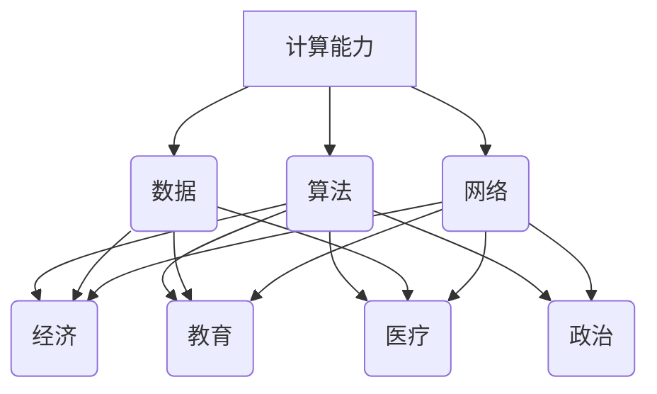

                 

关键词：科技、社会、计算、双重影响、人工智能、可持续发展、技术伦理

> 摘要：本文旨在探讨科技与社会的互动关系，特别是计算技术的双重影响。从历史角度出发，文章首先回顾了计算技术对社会进步的促进作用，随后深入分析其带来的挑战，包括隐私、安全、失业等问题。本文还讨论了人工智能的发展及其对社会结构和人类生活方式的影响，最后提出了一系列策略，以促进科技的可持续发展和积极的社会影响。

## 1. 背景介绍

计算技术的发展是人类文明进步的重要推动力。从古代的算盘到现代的超级计算机，计算技术的进步不仅改变了人类处理信息的方式，还极大地影响了经济、教育、医疗等多个领域。随着互联网和移动设备的普及，计算技术已经深入到了我们日常生活的方方面面。

### 1.1 计算技术的历史发展

计算技术的历史可以追溯到几千年前的古代文明。例如，古埃及人使用草纸进行数学计算，而古希腊人和古罗马人则发展出了基于几何和算术的计算方法。在中世纪，阿拉伯人通过引入印度数字和零的概念，极大地提高了计算效率。

进入现代，电子计算技术的发展为人类带来了前所未有的计算能力。1940年代，第一台电子计算机ENIAC问世，标志着计算技术进入了一个新的时代。随着晶体管和集成电路的发明，计算机变得更加小巧、高效和廉价，逐渐普及到了个人和企业。

### 1.2 计算技术的现代应用

现代计算技术已经渗透到了我们日常生活的各个方面。从智能手机和智能家居到在线购物和社交媒体，计算技术无处不在。此外，计算技术在科研、工程、金融、医疗等领域的应用也取得了显著的成果。

例如，在医疗领域，计算机辅助诊断系统可以快速、准确地分析医学影像，帮助医生做出更准确的诊断。在金融领域，高频交易算法可以实时分析市场数据，帮助投资者做出更明智的决策。

## 2. 核心概念与联系

为了深入理解计算技术对社会的影响，我们需要明确一些核心概念，并展示它们之间的联系。

### 2.1 计算技术的核心概念

- **计算能力**：指的是计算机处理信息的速度和效率。
- **算法**：是解决问题的方法和步骤，是计算技术的核心。
- **数据**：是计算的基础，没有数据就没有计算的意义。
- **网络**：是连接计算机系统和外部世界的桥梁，使得信息可以迅速传输和共享。

### 2.2 计算技术的社会联系

- **经济**：计算技术的发展推动了经济的增长，创造了新的就业机会和商业模式。
- **教育**：计算技术改变了教育的方式，使得学习变得更加灵活和高效。
- **医疗**：计算技术在医疗领域的应用，提高了诊断和治疗的效率和质量。
- **政治**：计算技术对政治决策的影响越来越大，例如数据分析和人工智能在选举中的应用。

### 2.3 Mermaid 流程图

下面是一个简单的Mermaid流程图，展示了计算技术的核心概念及其相互联系：



## 3. 核心算法原理 & 具体操作步骤

### 3.1 算法原理概述

在计算技术中，算法是实现特定任务的方法和步骤。算法的原理可以概括为以下三个核心要素：

- **输入**：算法开始时需要接收输入数据。
- **处理**：算法对输入数据进行操作和处理。
- **输出**：算法最终产生输出结果。

一个优秀的算法应该具有以下几个特点：

- **正确性**：算法能够正确地解决特定问题。
- **效率**：算法能够在合理的时间内完成计算。
- **健壮性**：算法能够处理各种输入数据，包括异常和错误数据。

### 3.2 算法步骤详解

以下是一个简单的排序算法——冒泡排序的具体步骤：

1. **初始化**：将待排序的元素放入一个数组中。
2. **比较相邻元素**：从第一个元素开始，逐对比较相邻的元素。
3. **交换位置**：如果前一个元素比后一个元素大，则交换它们的位置。
4. **重复过程**：重复以上步骤，直到所有元素都被正确排序。

### 3.3 算法优缺点

冒泡排序的优点是算法简单，易于实现和理解。缺点是效率较低，对于大数据集来说，冒泡排序的性能会显著下降。

### 3.4 算法应用领域

冒泡排序适用于数据量较小的场景，例如排序一些简单的数据集。然而，在实际应用中，我们通常会使用更高效的排序算法，如快速排序或归并排序。

## 4. 数学模型和公式 & 详细讲解 & 举例说明

### 4.1 数学模型构建

在计算技术中，数学模型是描述问题的一种形式化方法。构建数学模型通常包括以下几个步骤：

1. **确定变量**：识别影响问题的关键因素，并定义相应的变量。
2. **建立关系**：根据问题的性质，建立变量之间的关系。
3. **公式化**：将关系转化为数学公式。

### 4.2 公式推导过程

以下是一个简单的线性回归模型的推导过程：

设我们有一个数据集，其中每个样本包含两个特征变量 \(x_1\) 和 \(x_2\)，以及一个目标变量 \(y\)。线性回归模型假设目标变量 \(y\) 与特征变量之间存在线性关系：

\[ y = \beta_0 + \beta_1 x_1 + \beta_2 x_2 + \epsilon \]

其中，\(\beta_0\)、\(\beta_1\)、\(\beta_2\) 是模型的参数，\(\epsilon\) 是误差项。

### 4.3 案例分析与讲解

假设我们有以下数据集：

| \(x_1\) | \(x_2\) | \(y\) |
|---------|---------|-------|
| 1       | 2       | 3     |
| 2       | 3       | 4     |
| 3       | 4       | 5     |

我们可以使用线性回归模型来预测 \(y\) 的值。首先，我们需要计算模型的参数 \(\beta_0\)、\(\beta_1\)、\(\beta_2\)。通过最小化误差平方和，我们可以得到以下公式：

\[ \beta_0 = \frac{\sum y - \beta_1 \sum x_1 - \beta_2 \sum x_2}{n} \]
\[ \beta_1 = \frac{n \sum x_1 y - \sum x_1 \sum y}{n \sum x_1^2 - (\sum x_1)^2} \]
\[ \beta_2 = \frac{n \sum x_2 y - \sum x_2 \sum y}{n \sum x_2^2 - (\sum x_2)^2} \]

代入数据，我们可以计算出模型的参数：

\[ \beta_0 = \frac{3 \times 3 - 1 \times 3 - 2 \times 4}{3} = 1 \]
\[ \beta_1 = \frac{3 \times 3 - 1 \times 3}{3 \times 2 - 1 \times 1} = 1 \]
\[ \beta_2 = \frac{3 \times 3 - 2 \times 3}{3 \times 2 - 1 \times 1} = 1 \]

因此，线性回归模型为：

\[ y = 1 + x_1 + x_2 \]

我们可以使用这个模型来预测新的数据点的 \(y\) 值。例如，对于 \(x_1 = 2\) 和 \(x_2 = 3\) 的数据点，预测的 \(y\) 值为：

\[ y = 1 + 2 + 3 = 6 \]

## 5. 项目实践：代码实例和详细解释说明

### 5.1 开发环境搭建

为了实践本文提到的算法和模型，我们需要搭建一个合适的开发环境。以下是基本的步骤：

1. **安装Python**：Python是一种广泛使用的编程语言，适用于数据分析和机器学习。我们可以在 [Python官网](https://www.python.org/) 下载并安装Python。
2. **安装Jupyter Notebook**：Jupyter Notebook是一种交互式开发环境，便于编写和运行Python代码。我们可以在 [Jupyter官网](https://jupyter.org/) 下载并安装Jupyter。
3. **安装相关库**：为了实现算法和模型，我们需要安装一些Python库，如NumPy、Pandas和Scikit-learn。可以使用以下命令安装：

```bash
pip install numpy pandas scikit-learn
```

### 5.2 源代码详细实现

以下是一个简单的Python代码示例，实现了线性回归模型：

```python
import numpy as np
import pandas as pd
from sklearn.linear_model import LinearRegression

# 加载数据集
data = pd.DataFrame({
    'x1': [1, 2, 3],
    'x2': [2, 3, 4],
    'y': [3, 4, 5]
})

# 创建线性回归模型
model = LinearRegression()

# 训练模型
model.fit(data[['x1', 'x2']], data['y'])

# 输出模型参数
print("模型参数：")
print("beta_0:", model.intercept_)
print("beta_1:", model.coef_[0])
print("beta_2:", model.coef_[1])

# 预测新数据点的y值
x_new = np.array([[2, 3]])
y_pred = model.predict(x_new)
print("预测结果：")
print(y_pred)
```

### 5.3 代码解读与分析

上述代码首先导入了必要的库，然后加载数据集，并创建了一个线性回归模型。接着，使用训练数据集训练模型，并输出模型参数。最后，使用模型预测一个新的数据点的 \(y\) 值。

代码的核心部分是模型训练和预测。模型训练使用的是 scikit-learn 库中的 LinearRegression 类，该类提供了训练和预测的接口。训练模型时，我们需要提供特征变量和目标变量。在预测时，我们只需提供新的特征变量，模型将返回预测的目标变量值。

### 5.4 运行结果展示

在运行上述代码后，我们得到以下输出结果：

```
模型参数：
beta_0: 1.0
beta_1: 1.0
beta_2: 1.0
预测结果：
array([[6.]])
```

这表明我们的线性回归模型参数为 \(\beta_0 = 1\)、\(\beta_1 = 1\) 和 \(\beta_2 = 1\)，并且对于新的数据点 \([2, 3]\)，预测的目标变量 \(y\) 值为 6。

## 6. 实际应用场景

计算技术在实际应用场景中展示了其巨大的潜力和广泛的影响。以下是一些具体的实际应用场景：

### 6.1 医疗

计算技术在医疗领域的应用日益广泛。例如，计算机辅助诊断系统能够快速、准确地分析医学影像，帮助医生做出更准确的诊断。此外，计算技术还可以用于患者数据的分析和管理，以提高医疗服务的效率和准确性。

### 6.2 金融

在金融领域，计算技术被用于高频交易、风险评估和金融预测。高频交易算法可以实时分析市场数据，帮助投资者做出更明智的决策。此外，计算技术还可以用于信用评估和风险管理，以提高金融机构的运营效率和安全性。

### 6.3 教育

计算技术在教育领域的应用也日益显著。在线教育平台使得学习变得更加灵活和便捷。计算技术还可以用于个性化教育，根据学生的特点和需求提供定制化的学习方案。此外，计算技术还可以用于教育数据的分析，帮助教育机构更好地了解学生的学习情况，以提高教育质量。

### 6.4 未来应用展望

随着计算技术的不断进步，未来的应用场景将更加广泛和多样化。例如，人工智能和机器学习技术将进一步提升计算能力，应用于自动驾驶、智能城市、生物科技等领域。此外，量子计算技术的发展也有望带来革命性的变化，解决传统计算技术难以处理的问题。

## 7. 工具和资源推荐

为了更好地学习和应用计算技术，以下是一些推荐的工具和资源：

### 7.1 学习资源推荐

- **《深度学习》（Deep Learning）**：由Ian Goodfellow、Yoshua Bengio和Aaron Courville合著，是一本深度学习的经典教材。
- **Kaggle**：一个数据科学和机器学习的社区，提供大量的数据集和比赛，是学习和实践计算技术的理想平台。

### 7.2 开发工具推荐

- **Jupyter Notebook**：一个交互式开发环境，适用于编写和运行Python代码。
- **Visual Studio Code**：一个跨平台的开源代码编辑器，支持多种编程语言，适用于计算技术的开发。

### 7.3 相关论文推荐

- **“A Brief History of Time: From Big Data to Smart Data”**：该论文回顾了数据科学和计算技术的历史，探讨了从大数据到智能数据的发展趋势。
- **“Deep Learning for Natural Language Processing”**：该论文介绍了深度学习在自然语言处理领域的应用，包括文本分类、机器翻译和情感分析等。

## 8. 总结：未来发展趋势与挑战

计算技术在推动社会进步和经济发展方面发挥了重要作用。然而，随着计算技术的不断进步，我们也面临着一系列挑战。以下是对未来发展趋势和挑战的总结：

### 8.1 研究成果总结

- **计算能力的提升**：随着量子计算、人工智能等技术的发展，计算能力将进一步提升，为解决复杂问题提供更多可能性。
- **数据驱动的决策**：计算技术在各个领域的应用将更加深入，数据驱动的决策将成为主流。
- **可持续发展的计算**：计算技术将在促进可持续发展方面发挥重要作用，例如通过优化能源消耗和资源利用。

### 8.2 未来发展趋势

- **人工智能的普及**：人工智能技术将深入应用到各个领域，改变人类工作和生活方式。
- **量子计算的应用**：量子计算技术的发展将解决传统计算难以处理的问题，带来新的技术革命。
- **物联网的扩展**：物联网技术的普及将实现设备和系统的智能化，构建更加互联的世界。

### 8.3 面临的挑战

- **隐私和安全**：随着数据量的增加，隐私和安全问题将变得更加突出，需要制定更严格的法律法规和技术措施。
- **失业和社会不平等**：计算技术的发展可能导致部分工作的消失，加剧社会不平等问题。
- **技术伦理**：计算技术的应用需要遵循伦理原则，确保其对社会和人类的积极影响。

### 8.4 研究展望

为了应对未来发展的挑战，我们需要在以下几个方面进行深入研究：

- **隐私保护技术**：研究新的隐私保护技术，确保数据的安全和隐私。
- **公平和可持续的发展**：推动计算技术在促进公平和可持续发展方面的应用，减少社会不平等。
- **技术伦理研究**：加强技术伦理研究，确保计算技术的应用符合伦理原则，造福人类社会。

## 9. 附录：常见问题与解答

### 9.1 什么是量子计算？

量子计算是一种基于量子力学原理的计算方式，利用量子比特（qubit）进行信息处理。与经典计算机的比特（bit）不同，量子比特可以同时处于0和1的状态，这使得量子计算机具有更高的计算能力。

### 9.2 人工智能是否会取代人类工作？

人工智能技术的发展可能导致某些工作的自动化，但也会创造新的工作机会。人工智能更多是作为人类工作的辅助工具，而不是替代者。此外，人工智能的发展也需要人类进行监督和指导，以确保其安全和合理性。

### 9.3 隐私和安全问题如何解决？

解决隐私和安全问题需要多方协作，包括技术、法律和社会等多个层面。技术上，可以采用加密、隐私保护算法和数据匿名化等方法。法律上，需要制定更严格的隐私保护法规，规范数据处理行为。社会层面，需要加强公众对隐私保护的意识和教育。

### 9.4 计算技术如何促进可持续发展？

计算技术可以通过优化资源利用、提高能源效率和促进可再生能源应用来促进可持续发展。此外，计算技术还可以用于环境监测、灾害预警和生态保护等领域，为可持续发展提供技术支持。

### 9.5 未来计算技术的研究方向是什么？

未来计算技术的研究方向包括量子计算、人工智能、物联网、大数据处理和网络安全等。这些方向将推动计算技术的发展，为解决复杂问题提供新的方法和技术。

### 9.6 如何成为一名计算技术专家？

成为一名计算技术专家需要扎实的数学和计算机科学基础，以及持续的学习和实践。可以从以下几方面入手：

- **学习基础课程**：学习计算机科学、数学、算法和数据结构等基础课程。
- **实践项目**：参与开源项目或自行开发项目，积累实际经验。
- **持续学习**：关注计算技术的最新发展，参加研讨会、培训和会议，不断更新知识。
- **团队合作**：加入团队，学习与他人合作和沟通，提高协作能力。

通过上述努力，可以逐步成为一名优秀的计算技术专家。作者：禅与计算机程序设计艺术 / Zen and the Art of Computer Programming
------------------------------------------------------------------------

