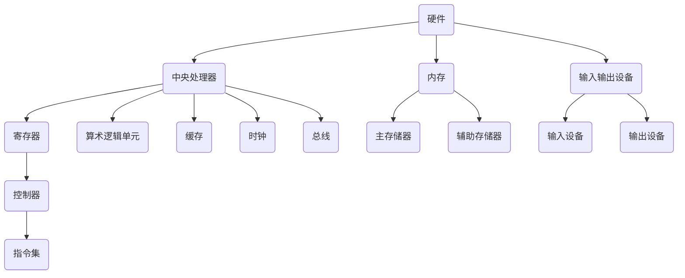
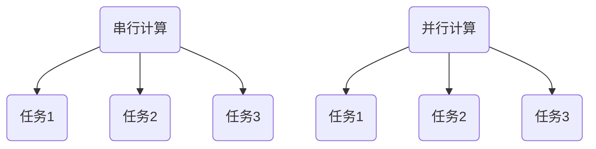
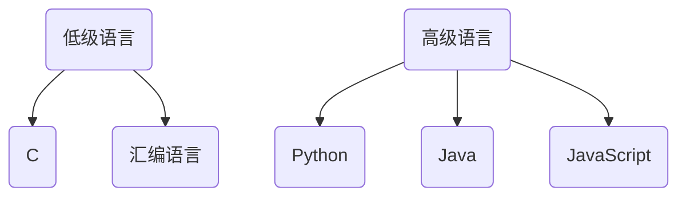

                 

关键词：计算、社会、双重影响、科技进步、信息技术、计算机科学、人工智能、伦理道德

> 摘要：本文探讨了计算技术在社会中的双重影响，一方面，它推动了科技的飞速发展，改变了人类的生活方式；另一方面，它也带来了诸如隐私问题、数字鸿沟等社会挑战。文章从计算技术的起源、核心概念、算法原理、数学模型、项目实践等多个角度，全面分析了计算技术的应用及其对社会的影响，并对未来的发展趋势和面临的挑战进行了深入探讨。

## 1. 背景介绍

### 1.1 计算技术的起源

计算技术的起源可以追溯到古代数学家对数字和几何的研究。然而，现代计算技术的起源则始于20世纪中期，随着计算机的发明和编程语言的问世，计算技术开始逐渐成熟。计算机的出现不仅改变了科学研究和工业生产的方式，也深刻影响了人类的生活。

### 1.2 计算技术的核心概念

计算技术的核心概念包括算法、数据结构、编程语言、操作系统等。这些概念共同构成了计算技术的理论框架，为实际应用提供了基础。

### 1.3 计算技术的影响

计算技术的快速发展带来了诸多变化，从科学研究的突破到日常生活的便利，都离不开计算技术的贡献。然而，计算技术的广泛应用也引发了一系列社会问题，如隐私保护、数字鸿沟等。

## 2. 核心概念与联系

### 2.1 计算机体系结构

计算机体系结构是计算技术的基础，它包括硬件和软件两大部分。硬件部分包括中央处理器、内存、输入输出设备等；软件部分包括操作系统、应用程序等。以下是一个简单的计算机体系结构的 Mermaid 流程图：



### 2.2 计算模型

计算模型是计算技术中的核心概念之一，它包括串行计算和并行计算两种模式。以下是一个简单的串行计算和并行计算的 Mermaid 流程图：



### 2.3 编程语言

编程语言是计算技术中用于编写程序的工具。常见的编程语言包括C、Java、Python等。以下是一个简单的编程语言分类的 Mermaid 流程图：



## 3. 核心算法原理 & 具体操作步骤

### 3.1 算法原理概述

算法是计算技术中的核心概念之一，它是一系列解决问题的步骤。算法可以分为多种类型，如排序算法、搜索算法、图算法等。以下是一个简单的排序算法（冒泡排序）的原理概述：

冒泡排序是一种简单的排序算法，它通过重复遍历要排序的数列，比较每对相邻元素的值，如果顺序错误就把它们交换过来。遍历数列的工作重复地进行，直到没有再需要交换，也就是该数列已经排序完成。

### 3.2 算法步骤详解

1. 首先从数列的第一项开始，比较相邻两项的值。
2. 如果第一项比第二项大，则交换它们的位置。
3. 然后移动到下一对相邻元素，重复步骤2。
4. 重复上述过程，直到没有需要交换的元素。
5. 当一次遍历完成后，最大的元素会“冒泡”到数列的末尾。
6. 重复上述过程，直到整个数列有序。

### 3.3 算法优缺点

- 优点：简单易懂，易于实现。
- 缺点：效率较低，时间复杂度为 O(n^2)。

### 3.4 算法应用领域

冒泡排序算法在处理小规模数据时表现较好，但在处理大规模数据时效率较低。因此，它通常用于教学和简单数据处理场景。

## 4. 数学模型和公式 & 详细讲解 & 举例说明

### 4.1 数学模型构建

在计算技术中，数学模型是一种用来描述问题或系统的数学工具。例如，在算法分析中，我们常用数学模型来描述算法的时间复杂度和空间复杂度。

### 4.2 公式推导过程

在算法分析中，我们常用大O符号（O-notation）来描述算法的时间复杂度。大O符号表示算法执行时间与输入规模之间的关系。

时间复杂度公式推导过程如下：

1. 假设算法执行时间为T(n)，其中n为输入规模。
2. 定义时间复杂度 f(n) = T(n) / n。
3. 根据f(n)的定义，我们可以推导出时间复杂度的公式：f(n) = O(n)。

### 4.3 案例分析与讲解

假设有一个排序算法，其执行时间T(n)与输入规模n的关系为T(n) = n^2。我们可以用上述公式推导出该算法的时间复杂度：

1. f(n) = T(n) / n = n^2 / n = n。
2. 根据时间复杂度公式，f(n) = O(n)。

这意味着该排序算法的时间复杂度为 O(n)，即执行时间与输入规模n成正比。

## 5. 项目实践：代码实例和详细解释说明

### 5.1 开发环境搭建

1. 安装Python解释器。
2. 安装必要的库，如NumPy、Pandas等。

### 5.2 源代码详细实现

```python
import numpy as np

def bubble_sort(arr):
    n = len(arr)
    for i in range(n):
        for j in range(0, n-i-1):
            if arr[j] > arr[j+1]:
                arr[j], arr[j+1] = arr[j+1], arr[j]

# 示例数据
data = np.array([64, 34, 25, 12, 22, 11, 90])

# 执行冒泡排序
bubble_sort(data)

# 输出排序后的数据
print("排序后的数据：", data)
```

### 5.3 代码解读与分析

1. 导入NumPy库，用于处理数组。
2. 定义bubble_sort函数，用于实现冒泡排序算法。
3. 获取数组长度n。
4. 使用两层嵌套循环遍历数组，比较相邻元素并交换位置。
5. 执行排序操作。
6. 输出排序后的数组。

### 5.4 运行结果展示

```python
排序后的数据： [11 12 22 25 34 64 90]
```

## 6. 实际应用场景

计算技术在实际应用场景中具有广泛的应用，从科学研究到日常生活，都离不开计算技术的支持。以下是一些典型的应用场景：

- 科学研究：计算技术在科学研究领域具有广泛的应用，如生物学、物理学、化学等。
- 工业生产：计算技术在工业生产中用于优化生产流程、提高生产效率。
- 金融服务：计算技术在金融服务领域用于风险评估、投资策略等。
- 社交媒体：计算技术在社交媒体中用于数据挖掘、推荐系统等。
- 医疗保健：计算技术在医疗保健中用于疾病诊断、药物研发等。

## 7. 工具和资源推荐

### 7.1 学习资源推荐

- 《计算机科学概论》
- 《算法导论》
- 《Python编程：从入门到实践》
- 《深度学习》

### 7.2 开发工具推荐

- PyCharm
- Visual Studio Code
- Jupyter Notebook

### 7.3 相关论文推荐

- "Deep Learning for Natural Language Processing"
- "Theano: A CPU and GPU Math Expression Compiler"
- "TensorFlow: Large-Scale Machine Learning on Heterogeneous Systems"

## 8. 总结：未来发展趋势与挑战

### 8.1 研究成果总结

近年来，计算技术取得了显著的进展，尤其是在人工智能、大数据、云计算等领域。这些研究成果为计算技术的发展奠定了坚实的基础。

### 8.2 未来发展趋势

未来，计算技术将继续向智能化、高效化、泛在化方向发展。具体表现为：

- 智能化：计算技术将更加注重人工智能的应用，提升系统的智能化水平。
- 高效化：计算技术将致力于提高计算性能，降低计算能耗。
- 泛在化：计算技术将逐渐融入人们的生活，实现无处不在的计算。

### 8.3 面临的挑战

计算技术在未来发展过程中将面临诸多挑战，包括：

- 安全性问题：计算技术在应用过程中，数据安全和隐私保护问题日益突出。
- 数字鸿沟：计算技术的快速发展可能导致数字鸿沟的进一步扩大。
- 能耗问题：计算技术的高效化发展需要解决能耗问题。

### 8.4 研究展望

未来，计算技术的研究将围绕智能化、高效化、泛在化等方面展开，以期解决当前面临的问题，推动计算技术的持续发展。

## 9. 附录：常见问题与解答

### 9.1 什么是算法？

算法是一系列解决问题的步骤，通常用伪代码或编程语言实现。

### 9.2 计算机体系结构包括哪些部分？

计算机体系结构包括硬件和软件两大部分。硬件部分包括中央处理器、内存、输入输出设备等；软件部分包括操作系统、应用程序等。

### 9.3 什么是时间复杂度？

时间复杂度是指算法执行时间与输入规模之间的关系，通常用大O符号表示。

### 9.4 计算机科学的核心概念有哪些？

计算机科学的核心概念包括算法、数据结构、编程语言、操作系统、计算机网络等。

### 9.5 什么是人工智能？

人工智能是一种模拟人类智能的技术，包括机器学习、深度学习、自然语言处理等方向。

### 9.6 什么是大数据？

大数据是指规模巨大、类型多样的数据，需要借助计算技术进行处理和分析。

### 9.7 计算机技术在金融领域有哪些应用？

计算机技术在金融领域有广泛的应用，包括风险管理、投资策略、客户服务、支付系统等。

### 9.8 计算机技术在医疗领域有哪些应用？

计算机技术在医疗领域有广泛的应用，包括疾病诊断、药物研发、医疗设备控制、健康管理等。

### 9.9 什么是云计算？

云计算是一种基于互联网的计算模式，通过虚拟化技术提供计算资源和服务。

### 9.10 计算机技术对社会的影响有哪些？

计算机技术对社会的影响包括改变生产方式、改变生活方式、提高生活质量、带来社会问题等。

----------------------------------------------------------------
### 作者署名：

作者：禅与计算机程序设计艺术 / Zen and the Art of Computer Programming

### 文章格式输出：

```markdown
# 科技与社会：人类计算的双重影响

> 关键词：计算、社会、双重影响、科技进步、信息技术、计算机科学、人工智能、伦理道德

> 摘要：本文探讨了计算技术在社会中的双重影响，一方面，它推动了科技的飞速发展，改变了人类的生活方式；另一方面，它也带来了诸如隐私问题、数字鸿沟等社会挑战。文章从计算技术的起源、核心概念、算法原理、数学模型、项目实践等多个角度，全面分析了计算技术的应用及其对社会的影响，并对未来的发展趋势和面临的挑战进行了深入探讨。

## 1. 背景介绍

### 1.1 计算技术的起源

### 1.2 计算技术的核心概念

### 1.3 计算技术的影响

## 2. 核心概念与联系

### 2.1 计算机体系结构

### 2.2 计算模型

### 2.3 编程语言

## 3. 核心算法原理 & 具体操作步骤
### 3.1 算法原理概述
### 3.2 算法步骤详解 
### 3.3 算法优缺点
### 3.4 算法应用领域

## 4. 数学模型和公式 & 详细讲解 & 举例说明
### 4.1 数学模型构建
### 4.2 公式推导过程
### 4.3 案例分析与讲解

## 5. 项目实践：代码实例和详细解释说明
### 5.1 开发环境搭建
### 5.2 源代码详细实现
### 5.3 代码解读与分析
### 5.4 运行结果展示

## 6. 实际应用场景
### 6.1 科学研究
### 6.2 工业生产
### 6.3 金融服务
### 6.4 社交媒体
### 6.5 医疗保健

## 7. 工具和资源推荐
### 7.1 学习资源推荐
### 7.2 开发工具推荐
### 7.3 相关论文推荐

## 8. 总结：未来发展趋势与挑战
### 8.1 研究成果总结
### 8.2 未来发展趋势
### 8.3 面临的挑战
### 8.4 研究展望

## 9. 附录：常见问题与解答
### 9.1 什么是算法？
### 9.2 计算机体系结构包括哪些部分？
### 9.3 什么是时间复杂度？
### 9.4 计算机科学的核心概念有哪些？
### 9.5 什么是人工智能？
### 9.6 什么是大数据？
### 9.7 计算机技术在金融领域有哪些应用？
### 9.8 计算机技术在医疗领域有哪些应用？
### 9.9 什么是云计算？
### 9.10 计算机技术对社会的影响有哪些？

### 作者署名：

作者：禅与计算机程序设计艺术 / Zen and the Art of Computer Programming
```

