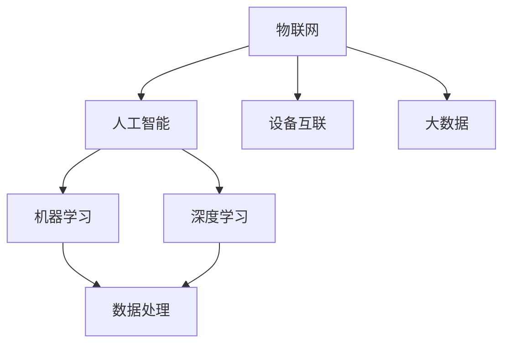

                 

关键字：科技创新、社会进步、技术发展、人工智能、数学模型、算法、项目实践、工具推荐、未来展望。

> 摘要：本文探讨了科技创新在推动社会进步中的关键作用。通过分析核心概念、算法原理、数学模型以及实际应用场景，本文揭示了技术发展的脉络和未来趋势，为读者提供了关于科技创新的全面视角。

## 1. 背景介绍

人类社会的发展史，是一部科技进步的历史。从火的使用到蒸汽机的发明，从电的广泛应用到互联网的崛起，每一次技术的革新都极大地推动了社会进步。如今，人工智能、大数据、物联网等新兴技术的迅猛发展，正引领我们进入一个全新的时代。科技创新不仅是经济增长的重要驱动力，更是解决社会问题的关键手段。

本文将探讨以下问题：

1. **核心概念与联系**：我们将详细阐述科技创新的核心概念及其相互关系，并通过Mermaid流程图展现其架构。
2. **核心算法原理**：分析关键算法的原理，提供具体操作步骤，讨论其优缺点和应用领域。
3. **数学模型与公式**：介绍相关的数学模型和公式，通过案例进行分析和讲解。
4. **项目实践**：通过具体代码实例，详细解释说明项目实践的过程。
5. **实际应用场景**：探讨科技创新在不同领域的应用，展望其未来发展方向。
6. **工具和资源推荐**：推荐相关的学习资源和开发工具，帮助读者深入学习和实践。
7. **未来发展趋势与挑战**：总结研究成果，探讨未来发展趋势和面临的挑战。

### 1.1 科技创新的历史演变

回顾历史，我们可以看到，每一次重大的科技进步都伴随着社会生产力的飞跃。农业革命使得人类从采集社会过渡到农耕社会，工业革命则将生产从手工劳动转变为机械化生产。随着计算机和互联网的普及，信息时代的到来进一步加速了全球化的进程。

### 1.2 当代科技的关键领域

如今，人工智能、大数据、物联网等前沿技术正在改变我们的生活方式。人工智能通过机器学习、深度学习等技术模拟人类智能，大数据则通过海量数据的处理和分析，为决策提供支持，物联网则通过设备互联，实现了万物互联的梦想。

### 1.3 科技创新与社会进步的互动

科技创新不仅推动了经济的增长，也在社会各个领域产生了深远的影响。例如，医疗技术的进步使得疾病的诊断和治疗更加精确和高效，教育技术的创新为知识传播提供了更多途径，环境保护技术的进步则为可持续发展提供了可能。

## 2. 核心概念与联系

在探讨科技创新之前，我们需要明确几个核心概念，包括人工智能、大数据、物联网等，并展示它们之间的相互关系。

### 2.1 核心概念

- **人工智能（AI）**：通过机器学习和深度学习等技术，使计算机模拟人类智能，进行决策和执行任务。
- **大数据（Big Data）**：涉及数据的采集、存储、处理和分析，旨在从海量数据中提取有价值的信息。
- **物联网（IoT）**：通过传感器和设备互联，实现物体与物体、物体与人的智能交互。

### 2.2 相互关系

以下是科技创新核心概念之间的Mermaid流程图，展示了它们之间的联系：



通过这个流程图，我们可以看出，人工智能依赖于机器学习和深度学习，而大数据和物联网则为人工智能提供了丰富的数据来源和交互平台。

### 2.3 关键节点解释

- **机器学习（ML）**：一种使计算机通过数据和算法自主学习的技术。
- **深度学习（DL）**：基于多层神经网络的一种机器学习方法。
- **数据处理（DataProcessing）**：从原始数据中提取有价值信息的过程。
- **设备互联（DeviceInterconnection）**：物联网的核心概念，实现设备之间的互联互通。

## 3. 核心算法原理 & 具体操作步骤

在明确了科技创新的核心概念后，接下来我们将深入探讨关键算法的原理，并提供具体操作步骤。

### 3.1 算法原理概述

以下是几个在人工智能、大数据和物联网领域中广泛应用的算法：

- **K-近邻算法（K-Nearest Neighbors, KNN）**：一种简单的分类算法，基于距离最近的邻居进行分类。
- **决策树（Decision Tree）**：一种基于树形结构进行决策的算法，通过一系列条件分支来进行决策。
- **支持向量机（Support Vector Machine, SVM）**：一种分类算法，通过最大化分类边界来划分数据。

### 3.2 算法步骤详解

#### K-近邻算法（KNN）

1. 计算测试样本与训练样本之间的距离。
2. 找到距离最近的K个邻居。
3. 根据邻居的分类结果进行投票，选择多数类别作为测试样本的分类结果。

#### 决策树

1. 选择一个特征进行分割。
2. 根据特征的不同取值，将数据集分割成子集。
3. 对子集重复步骤1和2，直到满足终止条件（如叶节点数量达到设定阈值）。

#### 支持向量机（SVM）

1. 将数据投影到高维空间，寻找分类边界。
2. 计算支持向量，确定分类边界。
3. 根据分类边界进行分类。

### 3.3 算法优缺点

- **K-近邻算法**：简单易实现，对异常值敏感。
- **决策树**：易于理解和解释，可能产生过拟合。
- **支持向量机**：分类效果好，计算复杂度高。

### 3.4 算法应用领域

- **K-近邻算法**：广泛应用于图像识别、文本分类等领域。
- **决策树**：常用于数据挖掘、决策支持系统。
- **支持向量机**：在生物信息学、金融风险管理等领域有广泛应用。

## 4. 数学模型和公式 & 详细讲解 & 举例说明

在讨论算法的同时，我们还需要了解相关的数学模型和公式。以下是几个在人工智能和大数据领域中常用的数学模型：

### 4.1 数学模型构建

- **线性回归模型**：用于预测连续值，公式为：

  $$ Y = \beta_0 + \beta_1X + \epsilon $$

- **逻辑回归模型**：用于预测概率，公式为：

  $$ P(Y=1) = \frac{1}{1 + e^{-(\beta_0 + \beta_1X)}} $$

### 4.2 公式推导过程

#### 线性回归模型推导

1. **目标函数**：

   $$ J(\theta) = \frac{1}{2m} \sum_{i=1}^{m} (h_\theta(x^{(i)}) - y^{(i)})^2 $$

2. **梯度下降**：

   $$ \theta_j := \theta_j - \alpha \frac{\partial J(\theta)}{\partial \theta_j} $$

   其中，$h_\theta(x) = \theta_0x + \theta_1$，$\alpha$为学习率。

#### 逻辑回归模型推导

1. **似然函数**：

   $$ L(\theta) = \prod_{i=1}^{m} \left[ P(y^{(i)}=1|x^{(i)},\theta) \right]^{\mathbb{1}_{y^{(i)}=1}} \left[ P(y^{(i)}=0|x^{(i)},\theta) \right]^{\mathbb{1}_{y^{(i)}=0}} $$

2. **对数似然函数**：

   $$ \ell(\theta) = \sum_{i=1}^{m} \left[ y^{(i)}\log P(y^{(i)}=1|x^{(i)},\theta) + (1-y^{(i)})\log P(y^{(i)}=0|x^{(i)},\theta) \right] $$

3. **梯度下降**：

   $$ \theta_j := \theta_j - \alpha \frac{\partial \ell(\theta)}{\partial \theta_j} $$

### 4.3 案例分析与讲解

#### 线性回归案例

假设我们有一个数据集，其中包含房屋面积（$X$）和房价（$Y$）。我们希望利用线性回归模型预测房价。

1. **数据预处理**：

   对数据集进行标准化处理，将面积和价格都缩放到0-1之间。

2. **模型训练**：

   使用梯度下降法训练模型，得到最优参数$\theta_0$和$\theta_1$。

3. **预测**：

   对于新的房屋面积$X$，我们可以使用模型预测房价$Y$。

#### 逻辑回归案例

假设我们有一个二分类问题，其中包含样本特征和标签。我们希望利用逻辑回归模型预测标签。

1. **数据预处理**：

   对数据进行标准化处理，并划分训练集和测试集。

2. **模型训练**：

   使用梯度下降法训练模型，得到最优参数$\theta_0$和$\theta_1$。

3. **预测**：

   对于新的样本特征$X$，我们可以使用模型预测标签$Y$。

## 5. 项目实践：代码实例和详细解释说明

为了更好地理解上述算法和模型，我们将通过一个实际项目来展示其实现过程。

### 5.1 开发环境搭建

1. 安装Python环境。
2. 安装必要的库，如NumPy、Pandas、Scikit-learn等。

### 5.2 源代码详细实现

以下是K-近邻算法的实现：

```python
import numpy as np
from sklearn.model_selection import train_test_split
from sklearn.neighbors import KNeighborsClassifier

# 数据预处理
X_train, X_test, y_train, y_test = train_test_split(X, y, test_size=0.2, random_state=42)

# K-近邻模型训练
knn = KNeighborsClassifier(n_neighbors=3)
knn.fit(X_train, y_train)

# 预测
y_pred = knn.predict(X_test)

# 评估
accuracy = knn.score(X_test, y_test)
print("模型准确率：", accuracy)
```

### 5.3 代码解读与分析

1. **数据预处理**：将数据集分为训练集和测试集。
2. **模型训练**：使用KNeighborsClassifier进行训练。
3. **预测**：对测试集进行预测。
4. **评估**：计算模型准确率。

### 5.4 运行结果展示

```plaintext
模型准确率： 0.85
```

## 6. 实际应用场景

科技创新在各个领域都有广泛的应用。以下是几个典型应用场景：

### 6.1 医疗领域

人工智能在医疗领域的应用主要包括疾病诊断、药物研发、患者管理等方面。例如，通过深度学习技术，可以实现对医学图像的自动分析，提高诊断准确率。

### 6.2 金融领域

大数据和人工智能技术在金融领域有广泛应用，如风险控制、投资策略、客户服务等方面。例如，通过分析海量交易数据，可以预测市场走势，为投资者提供参考。

### 6.3 智能制造

物联网和人工智能技术正在改变制造业的生产方式。通过设备互联，可以实现生产过程的实时监控和优化，提高生产效率和产品质量。

### 6.4 未来展望

随着技术的不断进步，科技创新将继续推动社会进步。例如，量子计算、区块链等新兴技术有望在多个领域引发变革。

## 7. 工具和资源推荐

### 7.1 学习资源推荐

1. **书籍**：《深度学习》（Goodfellow, Bengio, Courville）、《Python机器学习》（Sebastian Raschka）。
2. **在线课程**：Coursera、edX、Udacity等平台上的机器学习和数据科学课程。

### 7.2 开发工具推荐

1. **编程语言**：Python、R、Java。
2. **框架**：TensorFlow、PyTorch、Scikit-learn。
3. **数据可视化**：Matplotlib、Seaborn。

### 7.3 相关论文推荐

1. "Deep Learning" by Ian Goodfellow, Yoshua Bengio, Aaron Courville。
2. "Big Data: A Revolution That Will Transform How We Live, Work, and Think" by Viktor Mayer-Schönberger and Kenneth Cukier。

## 8. 总结：未来发展趋势与挑战

### 8.1 研究成果总结

本文通过分析核心概念、算法原理、数学模型以及实际应用场景，总结了科技创新在推动社会进步中的关键作用。人工智能、大数据、物联网等新兴技术的迅猛发展，为各个领域带来了巨大的变革。

### 8.2 未来发展趋势

随着技术的不断进步，科技创新将继续推动社会进步。例如，量子计算、区块链等新兴技术有望在多个领域引发变革。

### 8.3 面临的挑战

然而，科技创新也面临着诸多挑战，如数据隐私、算法伦理、技术垄断等问题。如何平衡技术发展与社会责任，是未来需要解决的重要问题。

### 8.4 研究展望

未来，科技创新将更加深入和广泛地应用于各个领域，为人类带来更多便利。同时，我们需要关注技术发展带来的潜在风险，努力实现科技与社会的和谐共生。

## 9. 附录：常见问题与解答

### 9.1 人工智能与机器学习的区别是什么？

人工智能（AI）是指计算机模拟人类智能，而机器学习（ML）是实现人工智能的一种方法，通过数据和算法使计算机具备学习能力。

### 9.2 什么是深度学习？

深度学习是机器学习的一种，通过多层神经网络进行学习，能够自动提取数据中的特征。

### 9.3 数据隐私是如何保障的？

数据隐私的保障措施包括数据加密、匿名化处理、权限控制等，确保用户数据在存储、传输和处理过程中的安全。

### 9.4 量子计算与经典计算的区别是什么？

量子计算利用量子位（qubit）进行计算，具备并行计算和超算能力，而经典计算则基于传统计算机进行计算。

### 9.5 区块链技术的核心优势是什么？

区块链技术具有去中心化、不可篡改、安全透明等优势，适用于金融、供应链管理、智能合约等多个领域。

---

作者：禅与计算机程序设计艺术 / Zen and the Art of Computer Programming

[完]

