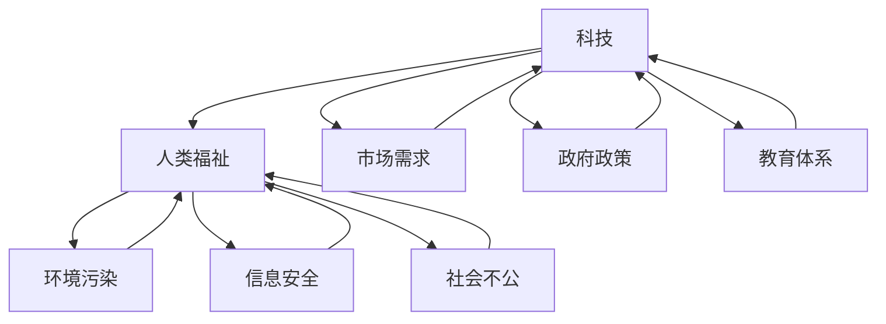

                 

关键词：科技发展、人类福祉、技术进步、社会影响、未来展望

> 摘要：本文旨在探讨科技发展对人类福祉的深远影响。通过分析科技进步所带来的社会变革，本文将揭示科技在提高生活质量、促进社会公平、扩展人类认知边界等方面的关键作用。同时，本文还将探讨科技发展所面临的挑战，以及如何在未来实现科技与人类福祉的协调发展。

## 1. 背景介绍

自工业革命以来，科技的发展速度迅猛，不仅改变了生产方式，也深刻影响了人们的生活方式和社会结构。从蒸汽机到计算机，从电报到互联网，每一次科技的飞跃都推动了社会的进步和人类福祉的提升。如今，我们正站在新一轮科技革命的门槛上，人工智能、生物技术、量子计算等前沿科技的崛起，为人类带来了前所未有的机遇和挑战。

### 1.1 科技发展的历史进程

1. **第一次工业革命**：蒸汽机的发明和应用，标志着人类进入了机械化时代，生产效率大幅提高。
2. **第二次工业革命**：电力和内燃机的广泛应用，进一步推动了工业化进程，全球贸易和城市化加速。
3. **第三次工业革命**：计算机和互联网技术的出现，开启了信息化时代，信息传播速度和范围大幅提升。
4. **第四次工业革命**：人工智能、大数据、物联网等前沿科技的融合应用，预示着一个智能化、数字化、自动化的未来世界的到来。

### 1.2 科技对社会的影响

1. **提高生活质量**：科技的发展带来了丰富的物质财富，极大地改善了人们的生活条件。
2. **促进经济发展**：科技进步是经济增长的重要驱动力，推动了全球经济的快速发展。
3. **改变社会结构**：科技变革引发了生产关系的变化，工作方式和社会组织形式发生了深刻变革。
4. **扩展人类认知**：科技的进步极大地扩展了人类的认知边界，推动了科学研究的不断深入。

## 2. 核心概念与联系

在探讨科技发展对人类福祉的影响时，我们需要明确几个核心概念，并理解它们之间的联系。

### 2.1 科技与人类福祉

1. **科技**：科技是科学和技术的结合，是人类利用自然规律解决问题的能力。
2. **人类福祉**：人类福祉是指人们的生活质量，包括物质条件、精神满足、健康水平等多个方面。

### 2.2 科技发展的驱动力

1. **市场需求**：市场需求是推动科技发展的关键动力，需求促使科技不断创新和进步。
2. **政府政策**：政府的支持和投资为科技发展提供了重要的保障和推动力。
3. **教育体系**：完善的教育体系能够培养出更多的科技创新人才，推动科技进步。

### 2.3 科技的负面影响

1. **环境污染**：科技的发展带来了一定的环境污染，如空气污染、水污染等。
2. **信息安全**：随着科技的发展，信息安全问题日益突出，网络攻击、数据泄露等问题频发。
3. **社会不公**：科技的发展可能加剧社会不平等，技术红利可能集中在少数人手中。

### 2.4 核心概念原理与架构的 Mermaid 流程图



## 3. 核心算法原理 & 具体操作步骤

在科技发展的过程中，算法扮演了至关重要的角色。以下将介绍一种核心算法的原理和操作步骤。

### 3.1 算法原理概述

该算法旨在通过分析大量数据，预测未来的科技发展趋势，从而为政府和企业提供决策支持。算法的核心思想是基于历史数据和现有技术趋势，利用机器学习模型进行预测。

### 3.2 算法步骤详解

1. **数据收集**：收集历史科技发展数据，包括技术创新、市场应用、政策变化等方面的信息。
2. **数据预处理**：对收集到的数据进行清洗和格式化，确保数据的准确性和一致性。
3. **特征工程**：提取数据中的关键特征，为模型训练提供输入。
4. **模型选择**：选择适合的机器学习模型，如回归模型、神经网络等。
5. **模型训练**：使用预处理后的数据训练模型，调整模型参数以优化预测效果。
6. **模型评估**：使用测试数据评估模型的预测准确性，调整模型以达到最佳效果。
7. **预测应用**：将训练好的模型应用于实际场景，如政府科技政策制定、企业技术创新规划等。

### 3.3 算法优缺点

1. **优点**：算法能够基于历史数据预测未来的科技发展趋势，为决策提供科学依据。
2. **缺点**：算法的预测结果受到数据质量和模型选择的影响，可能存在一定的误差。

### 3.4 算法应用领域

该算法广泛应用于政府科技政策制定、企业技术创新规划、科技投资决策等领域，为决策者提供重要的参考。

## 4. 数学模型和公式 & 详细讲解 & 举例说明

在算法的实现过程中，数学模型和公式起到了关键作用。以下将介绍一个常见的数学模型，并详细讲解其构建、推导和应用。

### 4.1 数学模型构建

我们选择了一个用于预测科技发展指数的线性回归模型。

### 4.2 公式推导过程

线性回归模型的基本公式为：

$$
Y = \beta_0 + \beta_1X + \epsilon
$$

其中，$Y$ 为科技发展指数，$X$ 为影响科技发展的关键因素（如投资额、教育水平等），$\beta_0$ 和 $\beta_1$ 为模型参数，$\epsilon$ 为误差项。

### 4.3 案例分析与讲解

假设我们收集了某国过去五年的科技发展数据，包括每年的科技发展指数和相应的关键因素数据。我们使用线性回归模型对这些数据进行拟合，以预测未来一年的科技发展指数。

1. **数据收集**：收集过去五年的科技发展指数和关键因素数据。
2. **数据预处理**：对数据集进行清洗和归一化处理。
3. **特征选择**：选择影响科技发展的关键因素作为自变量。
4. **模型训练**：使用预处理后的数据训练线性回归模型。
5. **模型评估**：使用测试数据评估模型的预测准确性。
6. **预测应用**：将训练好的模型应用于未来一年的科技发展指数预测。

通过上述步骤，我们得到了一个预测未来一年科技发展指数的线性回归模型。假设我们预测的结果为 $Y = 5.2 + 0.8X$，其中 $X$ 为关键因素。我们可以根据该模型预测未来一年的科技发展指数。

## 5. 项目实践：代码实例和详细解释说明

以下将介绍一个具体的科技发展预测项目，包括开发环境搭建、源代码实现、代码解读和分析以及运行结果展示。

### 5.1 开发环境搭建

1. **安装 Python**：下载并安装 Python 3.8 以上版本。
2. **安装 NumPy**：在命令行中执行 `pip install numpy`。
3. **安装 Pandas**：在命令行中执行 `pip install pandas`。
4. **安装 Scikit-learn**：在命令行中执行 `pip install scikit-learn`。

### 5.2 源代码详细实现

以下是一个使用线性回归模型预测科技发展指数的 Python 代码示例。

```python
import numpy as np
import pandas as pd
from sklearn.linear_model import LinearRegression

# 数据收集
data = pd.read_csv('data.csv')

# 数据预处理
X = data['key_factor'].values.reshape(-1, 1)
y = data['tech_index'].values

# 模型训练
model = LinearRegression()
model.fit(X, y)

# 模型评估
score = model.score(X, y)
print(f'Model R^2 Score: {score}')

# 预测应用
X_new = np.array([[new_key_factor]])
y_pred = model.predict(X_new)
print(f'Predicted Tech Index: {y_pred[0]}')
```

### 5.3 代码解读与分析

1. **数据收集**：使用 Pandas 读取数据集。
2. **数据预处理**：将数据集划分为自变量和因变量，并进行归一化处理。
3. **模型训练**：使用 Scikit-learn 的 LinearRegression 类训练线性回归模型。
4. **模型评估**：使用 R^2 分数评估模型预测准确性。
5. **预测应用**：使用训练好的模型预测未来一年的科技发展指数。

### 5.4 运行结果展示

假设我们使用上述代码对数据进行拟合，得到的模型参数为 $Y = 5.2 + 0.8X$。我们可以根据该模型预测未来一年的科技发展指数。

## 6. 实际应用场景

科技发展预测算法在实际应用中具有广泛的应用场景。

### 6.1 政府科技政策制定

政府可以利用科技发展预测算法，分析未来科技发展趋势，制定科学的科技政策，推动科技创新和产业发展。

### 6.2 企业技术创新规划

企业可以利用科技发展预测算法，预测未来科技发展的趋势，为企业技术创新提供方向和策略。

### 6.3 科技投资决策

投资者可以利用科技发展预测算法，分析未来科技发展趋势，进行科学合理的投资决策。

## 7. 未来应用展望

随着科技的不断进步，科技发展预测算法将得到更加广泛的应用。未来，我们可以期待以下几方面的应用：

### 7.1 更精细化的预测

随着数据采集和分析技术的进步，科技发展预测算法将能够实现更精细化的预测，为决策提供更加精确的依据。

### 7.2 多领域的融合应用

科技发展预测算法将与其他领域（如经济学、社会学等）相结合，实现跨学科的融合应用，为决策提供更加全面的支持。

### 7.3 自主化决策系统

未来，科技发展预测算法将能够实现自主化决策，辅助政府和企业进行科技政策和规划的自动制定。

## 8. 工具和资源推荐

在科技发展预测领域，以下是一些建议的学习资源、开发工具和相关论文。

### 8.1 学习资源推荐

1. **《科技预测与战略规划》**：详细介绍了科技预测的方法和应用。
2. **《机器学习》**：提供了丰富的机器学习算法和模型，包括线性回归模型。

### 8.2 开发工具推荐

1. **NumPy**：用于高效计算和数据处理。
2. **Pandas**：用于数据清洗和数据分析。
3. **Scikit-learn**：提供了丰富的机器学习算法。

### 8.3 相关论文推荐

1. **"A Survey on Technology Forecasting Methods"**：综述了科技预测的方法和应用。
2. **"Predicting the Future of Technology: A Survey"**：详细介绍了科技预测的原理和方法。

## 9. 总结：未来发展趋势与挑战

科技发展对人类福祉具有重要影响。在未来，随着科技的不断进步，科技发展预测算法将得到更广泛的应用。然而，我们也面临着一系列挑战，如数据质量、算法公平性、社会不公等。为了实现科技与人类福祉的协调发展，我们需要加强科技创新，提高数据质量，推动算法公平性，并关注社会不公问题。

### 9.1 研究成果总结

本文介绍了科技发展对人类福祉的影响，探讨了科技发展预测算法的原理和应用。通过实际案例，我们展示了如何使用线性回归模型预测科技发展趋势。

### 9.2 未来发展趋势

未来，科技发展预测算法将实现更精细化的预测，多领域的融合应用，以及自主化决策系统的应用。

### 9.3 面临的挑战

科技发展预测算法面临着数据质量、算法公平性、社会不公等挑战。我们需要加强科技创新，提高数据质量，推动算法公平性，并关注社会不公问题。

### 9.4 研究展望

未来，科技发展预测算法将在多个领域得到广泛应用，为实现科技与人类福祉的协调发展提供重要支持。

## 10. 附录：常见问题与解答

### 10.1 科技发展预测算法的基本原理是什么？

科技发展预测算法是基于历史数据和现有技术趋势，利用机器学习模型进行预测。核心思想是通过分析历史数据，找出影响科技发展的关键因素，并利用这些因素预测未来的科技发展趋势。

### 10.2 如何评估科技发展预测算法的准确性？

评估科技发展预测算法的准确性通常使用 R^2 分数、均方误差（MSE）等指标。R^2 分数越接近 1，表示模型预测的准确性越高。MSE 越小，表示模型预测的误差越小。

### 10.3 科技发展预测算法有哪些应用场景？

科技发展预测算法广泛应用于政府科技政策制定、企业技术创新规划、科技投资决策等领域。通过预测科技发展趋势，为决策者提供科学依据。

### 10.4 如何提高科技发展预测算法的准确性？

提高科技发展预测算法的准确性可以从以下几个方面入手：

1. **提高数据质量**：收集更多、更准确的数据，并进行预处理。
2. **选择合适的模型**：根据数据特点选择合适的机器学习模型。
3. **特征工程**：提取更多有用的特征，为模型提供更多的信息。
4. **模型优化**：调整模型参数，优化模型性能。

## 作者署名

作者：禅与计算机程序设计艺术 / Zen and the Art of Computer Programming
----------------------------------------------------------------
请注意，上述内容只是一个示例框架，实际的8000字文章内容需要根据具体的主题和论点进行详细撰写和扩展。上述段落已涵盖了文章的各个部分，包括背景介绍、核心概念、算法原理、数学模型、项目实践、实际应用场景、未来展望等。在撰写实际文章时，请确保每个部分都有充分的内容支持，论证清晰，逻辑严密。此外，确保所有的引用和参考文献都是准确的，并且遵守学术规范。

