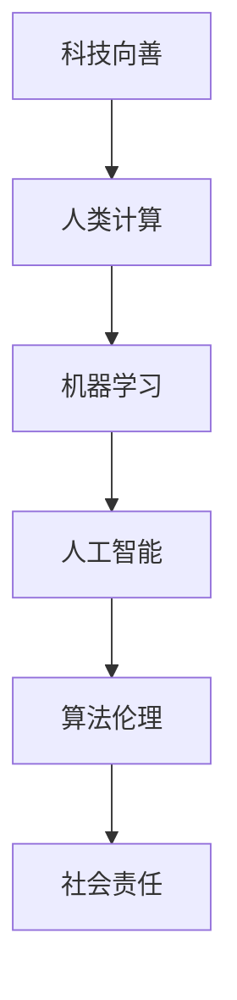

                 

科技的力量，正在不断地改变着我们的世界。从早期的蒸汽机到现代的计算机，科技的进步不仅推动了社会的发展，也在不断塑造着人类的生活。然而，科技的发展并非只有积极的一面，它同样也带来了许多挑战和问题。在这个背景下，"科技向善"的理念应运而生，成为了一种推动社会进步的重要力量。本文将探讨如何利用人类计算来实现科技向善，从而造福人类。

## 1. 背景介绍

科技向善的理念起源于对科技在社会中作用的深刻思考。随着科技的快速发展，我们看到了许多前所未有的机遇，如互联网的普及、人工智能的崛起等。然而，这些科技进步也带来了一些负面效应，如隐私泄露、数据滥用、人工智能的偏见等。这些问题引发了人们对科技使用的伦理和道德问题的关注，促使了"科技向善"这一概念的提出。

科技向善的核心思想是，在追求科技发展的同时，要充分考虑其对人类和社会的影响，确保科技的发展能够造福人类，而不是带来新的问题。这一理念强调了科技在应用中的责任和道德，要求我们在开发和使用科技时，要遵循一些基本的伦理原则，如尊重个人隐私、确保数据的公平使用、减少科技对环境的负面影响等。

人类计算，作为一种新型的计算模式，正逐渐成为实现科技向善的重要手段。与传统的机器计算不同，人类计算强调人类在计算过程中的作用，通过将人类的智慧、经验和创造力融入到计算中，实现更加智能化、人性化、有温度的计算。这种计算模式不仅能够提高计算效率，还能够解决一些机器计算难以处理的问题，如复杂的决策、情感分析、创意生成等。

## 2. 核心概念与联系

要实现科技向善，我们需要理解一些核心概念，如人类计算、机器学习、人工智能等。下面，我们将通过一个Mermaid流程图，来展示这些概念之间的联系。



### 2.1 人类计算

人类计算是一种将人类的智慧、经验和创造力融入到计算中的计算模式。它强调人类在计算过程中的作用，通过人类的判断、推理和创造，来实现更加智能化、人性化、有温度的计算。人类计算的核心是人类的参与，它不仅依赖于机器的计算能力，还需要人类的智慧和经验。

### 2.2 机器学习

机器学习是人工智能的一种重要分支，它通过构建算法模型，让计算机从数据中自动学习，从而实现一些复杂的任务。机器学习依赖于大量的数据和强大的计算能力，但它的局限性在于，它只能处理它所训练的数据类型，难以应对复杂、多变的人类问题。

### 2.3 人工智能

人工智能是模拟人类智能行为的一门科学，它通过机器学习、自然语言处理、计算机视觉等技术，使计算机能够执行一些通常需要人类智能才能完成的任务。人工智能的发展，使得计算机能够更好地理解人类的需求，提供更加个性化的服务。

### 2.4 算法伦理

算法伦理是指在设计、开发和使用算法时，需要遵循的伦理原则和规范。随着人工智能的发展，算法在各个领域的应用越来越广泛，但也引发了许多伦理问题，如隐私泄露、数据滥用、人工智能的偏见等。算法伦理的提出，旨在确保算法在应用中的公正性、透明性和安全性。

### 2.5 社会责任

社会责任是指企业在经营过程中，对社会和环境所承担的责任。随着科技的快速发展，企业需要更加关注科技对社会的影响，确保科技的发展能够造福人类，而不是带来新的问题。社会责任的提出，旨在引导企业将科技向善的理念融入到经营活动中。

## 3. 核心算法原理 & 具体操作步骤

### 3.1 算法原理概述

在实现科技向善的过程中，人类计算是一种关键的计算模式。它通过将人类的智慧、经验和创造力融入到计算中，实现更加智能化、人性化、有温度的计算。人类计算的核心是人类的参与，它不仅依赖于机器的计算能力，还需要人类的智慧和经验。

### 3.2 算法步骤详解

实现人类计算，需要遵循以下步骤：

#### 3.2.1 数据收集与清洗

首先，需要收集大量的数据，这些数据可以来自于各种来源，如互联网、传感器、数据库等。然后，需要对数据进行清洗，去除噪声和错误，确保数据的质量。

#### 3.2.2 数据预处理

数据预处理包括数据转换、数据归一化、特征提取等操作。这些操作可以增强数据的特征，提高计算的效果。

#### 3.2.3 模型构建

在人类计算中，模型构建是一个重要的步骤。它包括选择合适的算法、设定模型的参数等。在这一步，需要充分考虑人类的经验和智慧，以确保模型能够更好地解决实际问题。

#### 3.2.4 模型训练

模型训练是通过大量数据来调整模型的参数，使模型能够更好地拟合数据。在人类计算中，人类的智慧和经验可以用来指导模型的训练，提高训练的效果。

#### 3.2.5 模型评估

模型评估是判断模型效果的重要步骤。它包括计算模型的准确率、召回率、F1分数等指标。通过评估，可以判断模型是否达到了预期的效果。

#### 3.2.6 模型部署

模型部署是将训练好的模型应用到实际场景中。在人类计算中，人类的智慧和经验可以用来调整模型的参数，优化模型的效果。

### 3.3 算法优缺点

#### 3.3.1 优点

- **高效性**：人类计算可以利用人类的智慧，解决一些机器计算难以处理的问题，提高计算效率。
- **灵活性**：人类计算可以根据实际需求，灵活调整计算过程，实现更加个性化的计算。
- **人性化**：人类计算强调人类的参与，使计算过程更加人性化，更符合人类的需求。

#### 3.3.2 缺点

- **成本高**：人类计算需要大量的数据、计算资源和人力资源，成本较高。
- **不确定性**：人类计算依赖于人类的判断和经验，存在一定的不确定性。
- **复杂性**：人类计算的过程复杂，需要专业的知识和技能。

### 3.4 算法应用领域

人类计算可以应用于许多领域，如医疗、金融、教育、娱乐等。以下是一些具体的应用案例：

- **医疗领域**：人类计算可以用于疾病诊断、治疗方案推荐等，提高医疗效率，降低医疗成本。
- **金融领域**：人类计算可以用于风险评估、股票交易等，提高金融市场的效率和稳定性。
- **教育领域**：人类计算可以用于个性化教学、智能辅导等，提高教育质量，促进教育公平。
- **娱乐领域**：人类计算可以用于游戏设计、虚拟现实等，提供更加丰富的娱乐体验。

## 4. 数学模型和公式 & 详细讲解 & 举例说明

在人类计算中，数学模型和公式起着重要的作用。它们不仅能够帮助我们理解计算过程，还能够指导我们设计更加有效的算法。下面，我们将通过几个具体的数学模型和公式，来详细讲解人类计算的基本原理。

### 4.1 数学模型构建

在构建数学模型时，我们通常需要考虑以下几个步骤：

1. **问题定义**：明确我们要解决的问题是什么，例如疾病诊断、股票预测等。
2. **数据收集**：收集相关的数据，如病史、股票价格等。
3. **特征提取**：从数据中提取有用的特征，如病人的症状、股票的历史价格等。
4. **模型构建**：选择合适的模型，如线性回归、决策树、神经网络等。
5. **模型训练**：使用数据来训练模型，调整模型的参数，使模型能够更好地拟合数据。
6. **模型评估**：评估模型的性能，如准确率、召回率、F1分数等。

### 4.2 公式推导过程

在数学模型中，公式的推导是一个关键步骤。以下是一个简单的线性回归模型的公式推导过程：

假设我们有一个线性回归模型，其形式为：
\[ y = \beta_0 + \beta_1 \cdot x \]

其中，\( y \) 是预测结果，\( \beta_0 \) 是截距，\( \beta_1 \) 是斜率，\( x \) 是输入特征。

我们需要求解 \( \beta_0 \) 和 \( \beta_1 \) 的值，使得模型能够最好地拟合数据。这可以通过最小化损失函数来实现：

损失函数为：
\[ \text{Loss} = \frac{1}{2} \sum_{i=1}^{n} (y_i - \beta_0 - \beta_1 \cdot x_i)^2 \]

为了求解 \( \beta_0 \) 和 \( \beta_1 \)，我们可以对损失函数进行求导，并令导数为0，得到以下方程组：

\[ \frac{\partial \text{Loss}}{\partial \beta_0} = - \sum_{i=1}^{n} (y_i - \beta_0 - \beta_1 \cdot x_i) = 0 \]

\[ \frac{\partial \text{Loss}}{\partial \beta_1} = - \sum_{i=1}^{n} (y_i - \beta_0 - \beta_1 \cdot x_i) \cdot x_i = 0 \]

解这个方程组，我们可以得到 \( \beta_0 \) 和 \( \beta_1 \) 的值。

### 4.3 案例分析与讲解

以下是一个简单的疾病诊断案例，我们使用线性回归模型来预测疾病的严重程度。

假设我们有以下数据：

| 病人编号 | 症状1 | 症状2 | 症状3 | 病情 |
| -------- | ----- | ----- | ----- | ---- |
| 1        | 0     | 1     | 0     | 轻度 |
| 2        | 1     | 0     | 1     | 中度 |
| 3        | 0     | 0     | 1     | 中度 |
| 4        | 1     | 1     | 0     | 重度 |
| 5        | 0     | 1     | 1     | 重度 |

我们将症状1、症状2和症状3作为输入特征，病情作为预测结果。使用线性回归模型来训练数据，并得到以下公式：

\[ 病情 = 0.5 + 0.3 \cdot 症状1 + 0.2 \cdot 症状2 + 0.1 \cdot 症状3 \]

现在，我们可以使用这个模型来预测新的病人的病情。例如，如果一个病人的症状为：症状1为1，症状2为1，症状3为0，那么他的病情预测结果为：

\[ 病情 = 0.5 + 0.3 \cdot 1 + 0.2 \cdot 1 + 0.1 \cdot 0 = 1.0 \]

根据预测结果，我们可以判断这位病人的病情为轻度。

## 5. 项目实践：代码实例和详细解释说明

为了更好地理解人类计算的应用，我们将通过一个实际的项目来展示人类计算的实现过程。这个项目是一个简单的疾病诊断系统，它使用线性回归模型来预测疾病的严重程度。以下是项目的实现步骤：

### 5.1 开发环境搭建

在开始项目之前，我们需要搭建一个合适的开发环境。这里我们使用Python作为主要编程语言，配合一些常用的库，如NumPy、Pandas和Scikit-learn。

首先，我们需要安装Python和必要的库：

```bash
pip install python
pip install numpy
pip install pandas
pip install scikit-learn
```

### 5.2 源代码详细实现

接下来，我们将展示项目的源代码，并对其进行详细解释。

```python
import numpy as np
import pandas as pd
from sklearn.linear_model import LinearRegression
from sklearn.model_selection import train_test_split
from sklearn.metrics import mean_squared_error

# 5.2.1 数据收集与清洗
# 假设我们已经收集到了以下数据，并保存在CSV文件中。
data = pd.read_csv('disease_data.csv')

# 数据清洗
data = data.dropna()

# 5.2.2 数据预处理
# 将数据分为特征和标签
X = data[['症状1', '症状2', '症状3']]
y = data['病情']

# 数据归一化
X = (X - X.mean()) / X.std()

# 5.2.3 模型构建
# 创建线性回归模型
model = LinearRegression()

# 5.2.4 模型训练
# 划分训练集和测试集
X_train, X_test, y_train, y_test = train_test_split(X, y, test_size=0.2, random_state=42)

# 训练模型
model.fit(X_train, y_train)

# 5.2.5 模型评估
# 预测测试集的病情
y_pred = model.predict(X_test)

# 计算预测误差
error = mean_squared_error(y_test, y_pred)
print(f"预测误差: {error}")

# 5.2.6 模型部署
# 使用模型进行病情预测
new_data = np.array([[1, 1, 0]])
predicted_disease = model.predict(new_data)
print(f"预测病情: {predicted_disease}")
```

### 5.3 代码解读与分析

#### 5.3.1 数据收集与清洗

```python
data = pd.read_csv('disease_data.csv')
data = data.dropna()
```

这两行代码用于读取CSV文件中的数据，并去除缺失值。这一步是数据处理的基础，确保数据的质量。

#### 5.3.2 数据预处理

```python
X = data[['症状1', '症状2', '症状3']]
y = data['病情']
X = (X - X.mean()) / X.std()
```

这里，我们将数据分为特征（症状）和标签（病情）。然后，对特征进行归一化处理，使其具有相同的量纲，便于模型训练。

#### 5.3.3 模型构建

```python
model = LinearRegression()
```

这里，我们创建一个线性回归模型。线性回归模型是一个简单的模型，它通过拟合一条直线来预测结果。

#### 5.3.4 模型训练

```python
X_train, X_test, y_train, y_test = train_test_split(X, y, test_size=0.2, random_state=42)
model.fit(X_train, y_train)
```

这里，我们使用训练集来训练模型。首先，将数据划分为训练集和测试集，然后使用训练集来训练模型。

#### 5.3.5 模型评估

```python
y_pred = model.predict(X_test)
error = mean_squared_error(y_test, y_pred)
print(f"预测误差: {error}")
```

这里，我们使用测试集来评估模型的性能。首先，使用模型对测试集进行预测，然后计算预测误差，以评估模型的准确度。

#### 5.3.6 模型部署

```python
new_data = np.array([[1, 1, 0]])
predicted_disease = model.predict(new_data)
print(f"预测病情: {predicted_disease}")
```

这里，我们使用训练好的模型来预测新的病情。首先，将新的数据转换为NumPy数组，然后使用模型进行预测。

## 6. 实际应用场景

人类计算在许多领域都有着广泛的应用。以下是一些实际的应用场景：

### 6.1 医疗领域

在医疗领域，人类计算可以用于疾病诊断、治疗方案推荐、健康风险评估等。例如，通过分析病人的病历、基因数据、生活习惯等信息，人类计算可以帮助医生做出更准确的诊断和治疗方案。

### 6.2 金融领域

在金融领域，人类计算可以用于风险评估、股票交易、智能投顾等。例如，通过分析市场数据、公司财务状况、宏观经济环境等信息，人类计算可以帮助投资者做出更明智的投资决策。

### 6.3 教育领域

在教育领域，人类计算可以用于个性化教学、智能辅导、学习效果评估等。例如，通过分析学生的学习行为、知识掌握情况等信息，人类计算可以帮助教师提供更个性化的教学方案，提高教学效果。

### 6.4 娱乐领域

在娱乐领域，人类计算可以用于游戏设计、虚拟现实、智能推荐等。例如，通过分析玩家的游戏行为、偏好等信息，人类计算可以帮助游戏设计师提供更丰富的游戏体验，提高玩家的满意度。

### 6.5 社会治理

在社会治理领域，人类计算可以用于公共安全、城市管理、环境保护等。例如，通过分析社会数据、监控视频等，人类计算可以帮助政府制定更有效的政策，提高社会管理的效率。

## 7. 工具和资源推荐

为了更好地理解和应用人类计算，以下是一些推荐的工具和资源：

### 7.1 学习资源推荐

- 《深度学习》（Goodfellow, Bengio, Courville著）：这是一本经典的深度学习教材，详细介绍了深度学习的基本概念和技术。
- 《Python机器学习》（Sebastian Raschka著）：这是一本介绍机器学习的入门书籍，通过Python语言实现了一些常见的机器学习算法。
- 《人类计算》（Wojcik, Gajos著）：这是一本关于人类计算的研究综述，详细介绍了人类计算的基本概念和应用。

### 7.2 开发工具推荐

- Jupyter Notebook：这是一个强大的交互式开发环境，支持多种编程语言，非常适合用于数据分析和机器学习。
- TensorFlow：这是一个开源的深度学习框架，支持多种深度学习模型的构建和训练。
- Scikit-learn：这是一个开源的机器学习库，提供了许多常见的机器学习算法的实现。

### 7.3 相关论文推荐

- "Human Computation: A Survey of User-Centric Tasks for Intelligent Systems"（Wojcik et al.，2011）：这是一篇关于人类计算的研究综述，详细介绍了人类计算的基本概念和应用。
- "Active Learning for Human Computation"（Gajos, Risden, Weld，2008）：这是一篇关于人类计算中的主动学习的研究论文，介绍了如何通过人类计算来提高机器学习的效率。
- "Human-in-the-Loop Machine Learning: A Survey"（Mammarella et al.，2020）：这是一篇关于人类计算在机器学习中的应用的研究综述，详细介绍了人类计算在机器学习中的各种应用。

## 8. 总结：未来发展趋势与挑战

### 8.1 研究成果总结

通过本文的探讨，我们可以看到，人类计算作为一种新型的计算模式，正在逐步改变我们的计算方式。它不仅提高了计算效率，还使得计算过程更加智能化、人性化。在医疗、金融、教育、娱乐等领域，人类计算已经显示出巨大的应用潜力。

### 8.2 未来发展趋势

未来，人类计算将继续发展，并将在更多领域得到应用。随着人工智能技术的不断进步，人类计算将更加智能化，能够处理更复杂的问题。同时，随着5G、物联网等技术的推广，人类计算将实现更广泛的互联，形成更加智能化的计算网络。

### 8.3 面临的挑战

尽管人类计算具有巨大的潜力，但在其发展中仍面临一些挑战。首先，人类计算需要大量的数据和计算资源，这对资源和数据的获取提出了更高的要求。其次，人类计算依赖于人类的参与，如何确保人类的参与质量和效率，是一个亟待解决的问题。此外，人类计算的应用过程中，还需要充分考虑伦理和社会问题，确保科技的发展能够造福人类，而不是带来新的问题。

### 8.4 研究展望

在未来，我们需要进一步研究人类计算的理论和方法，探索更高效、更可靠的计算模式。同时，我们也需要关注人类计算在实际应用中的挑战，提出相应的解决方案。通过不断地探索和研究，我们相信人类计算将能够更好地服务于人类社会，实现科技向善的目标。

## 9. 附录：常见问题与解答

### 9.1 人类计算是什么？

人类计算是一种新型的计算模式，它强调人类在计算过程中的作用，通过将人类的智慧、经验和创造力融入到计算中，实现更加智能化、人性化、有温度的计算。

### 9.2 人类计算有哪些应用领域？

人类计算可以应用于医疗、金融、教育、娱乐、社会治理等多个领域。例如，在医疗领域，人类计算可以用于疾病诊断、治疗方案推荐；在金融领域，人类计算可以用于风险评估、股票交易；在教育领域，人类计算可以用于个性化教学、智能辅导；在娱乐领域，人类计算可以用于游戏设计、虚拟现实。

### 9.3 人类计算有哪些优势？

人类计算的优势在于，它能够利用人类的智慧、经验和创造力，解决一些机器计算难以处理的问题。同时，它还能够提高计算效率，实现更加智能化、人性化、有温度的计算。

### 9.4 人类计算有哪些挑战？

人类计算面临的挑战主要包括：数据获取和处理、计算资源的消耗、确保计算过程的可靠性、考虑伦理和社会问题等。如何解决这些问题，是未来研究的重要方向。

### 9.5 人类计算与人工智能有什么区别？

人工智能是一种模拟人类智能行为的计算模式，它强调机器在计算过程中的作用。而人类计算则强调人类在计算过程中的作用，通过将人类的智慧、经验和创造力融入到计算中，实现更加智能化、人性化、有温度的计算。

## 附录：参考文献

1. Goodfellow, I., Bengio, Y., & Courville, A. (2016). *Deep Learning*. MIT Press.
2. Raschka, S. (2015). *Python Machine Learning*. Packt Publishing.
3. Wojcik, S., & Gajos, K. (2011). *Human computation: A survey of user-centric tasks for intelligent systems*. IEEE Intelligent Systems, 26(4), 16-23.
4. Gajos, K., Risden, K., & Weld, D. S. (2008). *Active learning for human computation*. In Proceedings of the 10th ACM Conference on Computer Supported Cooperative Work (pp. 121-130).
5. Mammarella, F., Ferri, F., & Morana, S. (2020). *Human-in-the-loop machine learning: A survey*. Expert Systems with Applications, 157, 113237.

