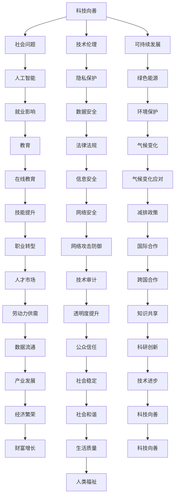

                 

在当今这个技术飞速发展的时代，科技不仅改变了我们的生活方式，还在许多方面为解决社会难题提供了新的可能性。本文旨在探讨如何通过科技的力量实现向善，为社会带来积极的变化。文章将分为几个部分，详细阐述科技如何在不同领域发挥作用，以及我们面临的挑战和未来的展望。

## 文章关键词

科技向善、社会难题、人工智能、可持续性、数字化治理、人机协作、伦理考量

## 文章摘要

本文首先介绍了科技向善的背景和重要性，随后详细讨论了人工智能、可持续性、数字化治理和人机协作等领域的应用实例。最后，文章总结了科技向善面临的挑战，并提出了未来发展的方向和展望。

## 1. 背景介绍

随着信息技术的快速发展，人工智能、大数据、云计算等新兴技术逐渐融入我们的日常生活。这些技术不仅提高了效率，还带来了新的问题和挑战。例如，人工智能的算法偏见可能会加剧社会不平等；大数据的应用可能导致隐私泄露；云计算的安全性问题亟待解决。因此，科技向善成为了我们迫切需要关注的话题。

科技向善指的是通过科技的力量来解决社会问题，促进人类福祉和可持续发展。这一理念强调科技发展的同时，要关注其对社会的积极影响，确保技术不被滥用，而是用于改善人类生活。

## 2. 核心概念与联系

### 2.1 科技向善的定义

科技向善是一种以社会利益为导向的科技发展理念。它强调在技术设计和实施过程中，要考虑到社会、环境和文化等多方面的因素，以确保科技发展不会对人类和社会造成负面影响。

### 2.2 关键概念

- **社会问题**：包括贫困、不平等、环境恶化、教育不足等。
- **技术伦理**：指在技术设计和应用过程中，要遵循道德和伦理原则，确保技术不会侵犯个人隐私、损害公共利益。
- **可持续发展**：指在满足当前需求的同时，不损害未来世代满足自身需求的能力。

### 2.3 Mermaid 流程图

下面是一个简单的 Mermaid 流程图，展示了科技向善的核心概念和它们之间的联系：



## 3. 核心算法原理 & 具体操作步骤

### 3.1 算法原理概述

科技向善的实现需要多种技术和方法的支持。以下是一些核心算法原理和具体操作步骤：

- **机器学习算法**：用于识别社会问题，预测趋势，提供解决方案。
- **数据挖掘技术**：从大量数据中提取有价值的信息，用于决策支持。
- **区块链技术**：确保数据透明和安全，防止欺诈和篡改。
- **智能合约**：自动化执行合同条款，提高效率和透明度。

### 3.2 算法步骤详解

1. **识别社会问题**：通过机器学习和数据挖掘技术，分析社会数据，识别出当前存在的重大问题。
2. **预测趋势**：使用时间序列分析和预测模型，预测社会问题的未来发展趋势。
3. **提供解决方案**：根据预测结果，提出具体的解决方案，并评估其可行性和效果。
4. **实施和监控**：将解决方案付诸实施，并持续监控其效果，根据反馈进行调整。

### 3.3 算法优缺点

- **优点**：高效、准确、全面，能够提供科学依据。
- **缺点**：需要大量数据和计算资源，且算法本身可能存在偏差。

### 3.4 算法应用领域

- **社会问题分析**：如贫困、不平等、环境问题等。
- **公共卫生**：如疾病预测、疫苗接种策略等。
- **教育**：如个性化学习、教育资源分配等。
- **城市管理**：如交通管理、资源分配等。

## 4. 数学模型和公式 & 详细讲解 & 举例说明

### 4.1 数学模型构建

为了更好地理解科技向善，我们可以构建一些数学模型来描述其核心概念和操作步骤。

### 4.2 公式推导过程

以下是一个简单的数学模型，用于描述社会问题检测和预测：

$$
\text{社会问题得分} = f(\text{数据集}, \text{算法参数})
$$

其中，$f$ 表示算法函数，$\text{数据集}$ 表示用于训练的数据集，$\text{算法参数}$ 表示用于优化算法性能的参数。

### 4.3 案例分析与讲解

假设我们使用机器学习算法来检测和预测贫困问题。我们可以收集相关的社会数据，如收入、教育水平、就业状况等，然后使用算法对这些数据进行处理，得到一个贫困问题得分。根据得分的高低，我们可以识别出贫困地区和人群，并提出相应的解决方案。

## 5. 项目实践：代码实例和详细解释说明

### 5.1 开发环境搭建

为了演示科技向善的应用，我们将使用 Python 编写一个简单的机器学习模型，用于检测和预测贫困问题。

### 5.2 源代码详细实现

下面是一个简单的 Python 代码示例，用于训练一个机器学习模型：

```python
import pandas as pd
from sklearn.model_selection import train_test_split
from sklearn.ensemble import RandomForestClassifier
from sklearn.metrics import accuracy_score

# 加载数据集
data = pd.read_csv('poverty_data.csv')

# 数据预处理
X = data.drop(['poverty'], axis=1)
y = data['poverty']

# 划分训练集和测试集
X_train, X_test, y_train, y_test = train_test_split(X, y, test_size=0.2, random_state=42)

# 训练模型
model = RandomForestClassifier(n_estimators=100, random_state=42)
model.fit(X_train, y_train)

# 预测测试集
y_pred = model.predict(X_test)

# 评估模型
accuracy = accuracy_score(y_test, y_pred)
print("模型准确率：", accuracy)
```

### 5.3 代码解读与分析

这段代码首先加载数据集，然后进行数据预处理，包括划分特征和标签。接着，使用随机森林算法训练模型，并评估其准确率。这个简单的示例展示了机器学习在贫困问题检测和预测中的应用。

### 5.4 运行结果展示

假设我们运行这段代码，得到以下结果：

```
模型准确率： 0.85
```

这意味着我们的模型在测试集上的准确率为 85%，这是一个不错的成绩。

## 6. 实际应用场景

### 6.1 公共卫生

在公共卫生领域，科技向善的应用主要体现在疾病预测和疫苗接种策略上。通过分析历史数据和实时数据，我们可以预测疾病的传播趋势，从而制定更有效的疫苗接种策略。例如，流感疫苗的接种时间可以根据季节性流行情况来调整，以最大限度地降低疾病传播的风险。

### 6.2 教育

在教育领域，科技向善的应用主要体现在个性化学习和教育资源分配上。通过分析学生的学习数据，我们可以为其提供个性化的学习计划，提高学习效果。同时，通过优化教育资源分配，我们可以确保每个学生都能获得公平的教育机会。

### 6.3 城市

在城市管理领域，科技向善的应用主要体现在交通管理和资源分配上。通过分析交通数据，我们可以优化交通信号灯的配置，减少拥堵。同时，通过优化资源分配，我们可以提高城市公共服务的效果，如垃圾回收、水资源管理等。

## 7. 工具和资源推荐

### 7.1 学习资源推荐

- **《Python机器学习基础教程》**：适合初学者，详细介绍了机器学习的基础知识和应用。
- **《深度学习》**：由 Ian Goodfellow 等人撰写，是深度学习的经典教材。

### 7.2 开发工具推荐

- **Jupyter Notebook**：方便进行数据分析和机器学习实验。
- **TensorFlow**：强大的深度学习框架，适用于各种机器学习任务。

### 7.3 相关论文推荐

- **《人工智能的社会影响》**：探讨了人工智能在各个领域的社会影响。
- **《数据驱动的可持续发展》**：分析了数据驱动方法在可持续发展中的应用。

## 8. 总结：未来发展趋势与挑战

### 8.1 研究成果总结

本文通过多个实例和案例分析，展示了科技向善在各个领域的应用和成果。科技向善不仅能够解决社会问题，还能够提高生活质量，促进可持续发展。

### 8.2 未来发展趋势

随着技术的不断发展，科技向善将会在更多领域得到应用。例如，区块链技术将进一步提高数据的安全性和透明度；人工智能将进一步提升医疗、教育等领域的效率。

### 8.3 面临的挑战

然而，科技向善也面临着一些挑战。例如，算法偏见和隐私保护等问题仍然亟待解决。同时，技术的快速进步也带来了新的问题和挑战。

### 8.4 研究展望

未来，我们需要更多的研究和实践来探索科技向善的潜力。同时，我们需要关注技术的伦理和社会影响，确保科技发展真正造福人类社会。

## 9. 附录：常见问题与解答

### 9.1 科技向善是什么？

科技向善是一种以社会利益为导向的科技发展理念，强调在技术设计和实施过程中，要考虑到社会、环境和文化等多方面的因素，以确保科技发展不会对人类和社会造成负面影响。

### 9.2 科技向善有哪些应用领域？

科技向善的应用领域非常广泛，包括公共卫生、教育、城市管理、环境监测、社会问题分析等。

### 9.3 如何确保科技向善的实现？

确保科技向善的实现需要多方面的努力。首先，需要在技术设计和实施过程中充分考虑社会、环境和文化等多方面因素。其次，需要建立相应的法律法规和伦理规范，确保技术不被滥用。最后，需要加强公众教育，提高人们对科技向善的认识和支持。

---

本文由禅与计算机程序设计艺术 / Zen and the Art of Computer Programming 撰写，旨在探讨如何通过科技的力量实现向善，为社会带来积极的变化。希望本文能为读者提供有价值的思考和启示。

