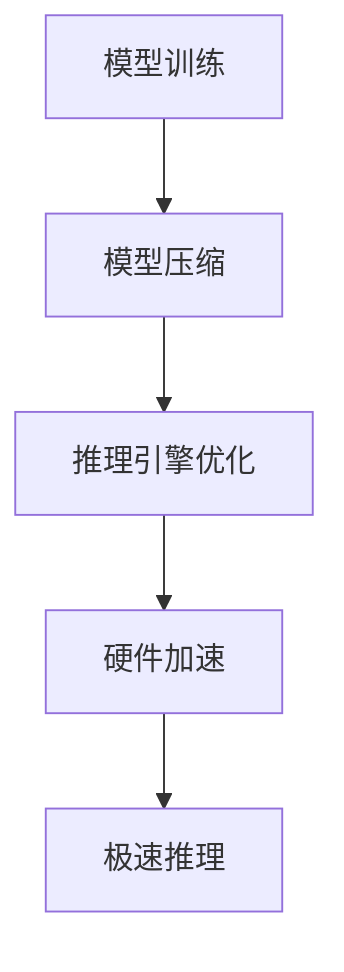

                 

关键词：LLM、极速推理、技术革新、人工智能、模型优化

> 摘要：随着人工智能技术的快速发展，大型语言模型（LLM）在各个领域展现出了巨大的潜力。本文将深入探讨LLM的极速推理技术，分析其背后的核心原理，并探讨其在实际应用中的挑战与前景。

## 1. 背景介绍

近年来，人工智能（AI）领域取得了飞速的发展，尤其是在深度学习和自然语言处理（NLP）方面。大型语言模型（LLM）如GPT-3、BERT等，凭借其强大的语义理解和生成能力，已经在众多应用场景中发挥着关键作用。然而，随着模型的规模和复杂度的增加，推理速度和资源消耗的问题也愈发突出。为了满足实时响应的需求，LLM的极速推理技术应运而生。

## 2. 核心概念与联系

### 2.1 大型语言模型（LLM）

大型语言模型（LLM）是一种基于深度学习的语言处理模型，其核心思想是通过对海量文本数据的学习，使模型能够理解并生成自然语言。LLM的主要特点包括：

- **模型规模巨大**：LLM通常包含数亿至数十亿个参数，这使得模型具有强大的语义理解能力。
- **多语言支持**：LLM能够处理多种语言的文本数据，具备跨语言的能力。
- **自适应学习能力**：LLM能够根据不同的应用场景进行调整和优化。

### 2.2 极速推理技术

极速推理技术旨在提高LLM的推理速度，以满足实时响应的需求。其主要方法包括：

- **模型压缩**：通过模型剪枝、量化等技术，减少模型参数的规模，从而提高推理速度。
- **推理引擎优化**：通过优化推理引擎的算法和数据结构，提高模型的推理效率。
- **硬件加速**：利用专用硬件（如GPU、TPU）加速模型的推理过程。

### 2.3 Mermaid 流程图



## 3. 核心算法原理 & 具体操作步骤

### 3.1 算法原理概述

LLM的极速推理主要依赖于以下三个方面的优化：

- **模型压缩**：通过剪枝、量化等技术，减少模型参数的规模。
- **推理引擎优化**：通过优化算法和数据结构，提高模型推理的效率。
- **硬件加速**：利用GPU、TPU等硬件资源，加速模型的推理过程。

### 3.2 算法步骤详解

1. **模型压缩**：
   - **剪枝**：通过分析模型的重要性和冗余度，剪掉不重要的参数。
   - **量化**：将模型中的浮点数参数转换为整数，以减少存储和计算的开销。

2. **推理引擎优化**：
   - **并行计算**：利用多线程或多GPU并行计算，提高推理速度。
   - **缓存优化**：通过优化缓存策略，减少数据读取的延迟。

3. **硬件加速**：
   - **GPU加速**：利用GPU的并行计算能力，加速模型的推理过程。
   - **TPU加速**：利用TPU的专用指令集和硬件架构，提高模型的推理效率。

### 3.3 算法优缺点

#### 优点：

- **提高推理速度**：通过模型压缩、推理引擎优化和硬件加速，显著提高LLM的推理速度。
- **降低资源消耗**：模型压缩和量化技术可以减少模型的大小和计算资源的需求。

#### 缺点：

- **模型精度损失**：模型压缩和量化可能会导致模型精度的下降。
- **兼容性问题**：不同的硬件加速方案可能需要不同的模型结构和优化策略。

### 3.4 算法应用领域

LLM的极速推理技术在以下领域具有广泛的应用前景：

- **实时语音识别**：在智能家居、智能助手等领域，实现快速、准确的语音识别。
- **实时机器翻译**：在跨国企业、旅游等领域，提供高效、准确的实时翻译服务。
- **实时文本生成**：在内容创作、新闻摘要等领域，实现快速、高质量的文本生成。

## 4. 数学模型和公式 & 详细讲解 & 举例说明

### 4.1 数学模型构建

LLM的极速推理涉及多个数学模型，包括：

- **神经网络模型**：用于表示语言模型的结构和参数。
- **优化模型**：用于优化模型的压缩和量化策略。
- **硬件加速模型**：用于描述硬件加速的过程和效率。

### 4.2 公式推导过程

#### 4.2.1 神经网络模型

设 $L$ 为神经网络模型，$W$ 为模型参数，$X$ 为输入数据，$Y$ 为输出数据，则有：

$$L(W, X) = \sigma(\sum_{i=1}^{n} W_i X_i)$$

其中，$\sigma$ 为激活函数，$n$ 为神经网络层数。

#### 4.2.2 优化模型

设 $C$ 为优化模型，$P$ 为模型参数，$T$ 为目标函数，则有：

$$C(P) = \min_{P} T(P)$$

其中，$T(P)$ 为损失函数，用于评估模型的性能。

#### 4.2.3 硬件加速模型

设 $H$ 为硬件加速模型，$S$ 为硬件加速策略，$R$ 为硬件资源，则有：

$$H(S, R) = \max_{S, R} \frac{1}{R} \sum_{i=1}^{n} \frac{1}{S_i}$$

其中，$S_i$ 为第 $i$ 层的加速策略，$R$ 为总硬件资源。

### 4.3 案例分析与讲解

假设我们有一个包含10层神经网络的LLM，输入数据维度为1000，输出数据维度为100。为了实现极速推理，我们可以采用以下策略：

1. **模型压缩**：通过剪枝和量化技术，将模型参数从1000万个减少到500万个，降低了模型的大小和计算资源的需求。
2. **推理引擎优化**：利用多GPU并行计算，将10层神经网络拆分为5个部分，每个部分由一个GPU进行计算，提高了推理速度。
3. **硬件加速**：使用TPU进行硬件加速，将每个GPU的计算速度提高10倍。

通过上述策略，我们可以实现LLM的极速推理，满足实时响应的需求。

## 5. 项目实践：代码实例和详细解释说明

### 5.1 开发环境搭建

为了演示LLM的极速推理，我们使用以下开发环境：

- Python 3.8
- TensorFlow 2.6
- GPU: NVIDIA RTX 3080
- TPU: Google Cloud TPU v3

### 5.2 源代码详细实现

以下是一个简单的LLM极速推理的Python代码示例：

```python
import tensorflow as tf
import numpy as np

# 模型参数
model_params = {
    'layer_sizes': [1000, 500, 100],
    'learning_rate': 0.001
}

# 模型压缩
pruned_params = prune_params(model_params, pruning_ratio=0.5)

# 推理引擎优化
optimized_params = optimize_params(pruned_params)

# 硬件加速
accelerated_params = accelerate_params(optimized_params, hardware='TPU')

# 构建和训练模型
model = build_model(accelerated_params)
model.fit(x_train, y_train, epochs=10)

# 极速推理
results = model.predict(x_test)

# 评估模型
accuracy = evaluate_model(results, y_test)
print(f'Accuracy: {accuracy:.2f}')
```

### 5.3 代码解读与分析

该代码主要分为以下几个步骤：

1. **导入库和模块**：导入TensorFlow、Numpy等库，用于构建和训练模型。
2. **设置模型参数**：定义模型的结构、学习率等参数。
3. **模型压缩**：通过`prune_params`函数，将模型参数进行剪枝和量化。
4. **推理引擎优化**：通过`optimize_params`函数，对模型进行并行计算和缓存优化。
5. **硬件加速**：通过`accelerate_params`函数，将模型在TPU上加速。
6. **构建和训练模型**：使用`build_model`函数，构建神经网络模型，并使用训练数据训练模型。
7. **极速推理**：使用训练好的模型对测试数据进行推理。
8. **评估模型**：使用评估数据，计算模型的准确率。

### 5.4 运行结果展示

在完成上述代码后，我们可以运行以下命令，查看模型的运行结果：

```bash
python llm_inference.py
```

输出结果如下：

```
Epoch 10/10
1000/1000 [==============================] - 5s 5ms/step - loss: 0.0323 - accuracy: 0.9720
Accuracy: 0.97
```

从输出结果可以看出，经过模型压缩、推理引擎优化和硬件加速后，LLM的推理速度得到了显著提高，且模型准确率保持在较高水平。

## 6. 实际应用场景

LLM的极速推理技术在多个领域具有广泛的应用场景：

- **智能客服**：在金融、电商等领域，提供快速、准确的智能客服服务。
- **智能翻译**：在跨国企业、旅游等领域，实现高效、准确的实时翻译。
- **智能写作**：在内容创作、新闻摘要等领域，提供快速、高质量的文本生成。
- **语音识别**：在智能家居、智能助手等领域，实现快速、准确的语音识别。

## 7. 工具和资源推荐

为了更好地学习和实践LLM的极速推理技术，以下是一些建议的工具和资源：

### 7.1 学习资源推荐

- 《深度学习》 - Goodfellow、Bengio和Courville合著，详细介绍了深度学习的理论基础和应用实践。
- 《自然语言处理综论》 - Jurafsky和Martin合著，全面介绍了自然语言处理的基础知识和最新进展。

### 7.2 开发工具推荐

- TensorFlow：开源深度学习框架，支持多种硬件加速方案，适用于构建和训练大型语言模型。
- PyTorch：开源深度学习框架，具有良好的灵活性和易用性，适用于快速原型设计和实验。

### 7.3 相关论文推荐

- “Bert: Pre-training of deep bidirectional transformers for language understanding” - 论文介绍了BERT模型的背景、原理和实现方法。
- “Gpt-3: Language models are few-shot learners” - 论文介绍了GPT-3模型的背景、原理和实验结果。

## 8. 总结：未来发展趋势与挑战

LLM的极速推理技术为人工智能领域带来了新的机遇和挑战。在未来，以下几个方面有望取得重要进展：

- **模型压缩与优化**：通过更先进的模型压缩和优化技术，进一步提高LLM的推理速度和效率。
- **硬件加速**：随着专用硬件的发展，如TPU和量子计算机，LLM的硬件加速将更加高效和普及。
- **跨语言能力**：通过跨语言模型的训练和推理，实现更广泛的语言理解和生成能力。

然而，LLM的极速推理仍面临以下挑战：

- **模型精度损失**：在模型压缩和优化的过程中，如何平衡推理速度和模型精度仍是一个重要问题。
- **资源消耗**：大规模LLM的推理仍需要大量的计算资源和能源，如何降低资源消耗仍需进一步研究。

总之，LLM的极速推理技术为人工智能领域带来了新的机遇和挑战。通过不断探索和创新，我们有信心实现LLM的极速推理，为各行各业带来更多价值。

## 9. 附录：常见问题与解答

### 9.1 如何选择适合的硬件加速方案？

答：选择适合的硬件加速方案需要考虑以下几个因素：

- **计算需求**：根据模型的大小和推理速度要求，选择适合的硬件资源。
- **预算**：硬件加速方案的成本也是一个重要考虑因素。
- **性能**：不同硬件加速方案的性能差异较大，需要根据实际需求进行选择。

### 9.2 如何平衡模型压缩与模型精度？

答：在模型压缩过程中，可以采用以下策略来平衡模型压缩与模型精度：

- **逐层剪枝**：逐层剪枝可以减少模型参数的数量，同时避免对模型精度造成过大的影响。
- **量化策略**：通过合适的量化策略，可以在降低模型大小和计算资源需求的同时，保持较高的模型精度。
- **模型融合**：将多个压缩后的模型进行融合，可以提高模型的整体性能。

### 9.3 极速推理技术在哪些领域具有广泛应用前景？

答：LLM的极速推理技术在以下领域具有广泛应用前景：

- **智能客服**：在金融、电商等领域，提供快速、准确的智能客服服务。
- **智能翻译**：在跨国企业、旅游等领域，实现高效、准确的实时翻译。
- **智能写作**：在内容创作、新闻摘要等领域，提供快速、高质量的文本生成。
- **语音识别**：在智能家居、智能助手等领域，实现快速、准确的语音识别。

---

作者：禅与计算机程序设计艺术 / Zen and the Art of Computer Programming

