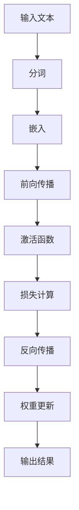

                 

关键词：LLM、推理速度、模型优化、高效生成、技术架构

摘要：本文将深入探讨大规模语言模型（LLM）的推理速度问题，从背景介绍、核心概念、算法原理、数学模型、项目实践、实际应用场景等多个角度，分析现有技术和挑战，并提出解决方案。通过详细讲解，旨在为开发者提供有价值的参考，推动LLM推理速度的新高度。

## 1. 背景介绍

随着深度学习和自然语言处理技术的飞速发展，大规模语言模型（LLM）在各个领域取得了显著成果。从最初的GPT到如今的GPT-3，模型的参数量和计算量呈现爆炸式增长。然而，这一增长背后也带来了巨大的性能挑战，尤其是在推理速度方面。在许多实际应用中，如实时问答系统、自然语言生成、机器翻译等，对模型推理速度的要求越来越高。因此，提升LLM推理速度成为当前研究的热点和难点。

### 1.1 研究意义

1. **实时性需求**：许多应用场景要求模型能够快速响应，如智能客服、实时翻译等。
2. **计算资源限制**：在移动设备和嵌入式系统中，有限的计算资源要求模型必须高效运行。
3. **用户体验**：提高模型推理速度可以提升用户体验，降低延迟。

### 1.2 现有挑战

1. **计算复杂度**：随着模型规模的扩大，推理的计算复杂度呈指数级增长。
2. **内存消耗**：大规模模型对内存的需求巨大，可能导致内存溢出。
3. **能耗问题**：推理过程中，能耗成为不可忽视的问题，尤其是移动设备场景。

## 2. 核心概念与联系

为了深入探讨LLM推理速度的问题，我们需要了解以下几个核心概念及其之间的联系：

### 2.1 大规模语言模型

大规模语言模型（LLM）是一种基于深度学习的语言处理模型，具有数十亿甚至千亿级的参数。它们通常采用预训练和微调的方式，通过大量文本数据进行训练，从而实现文本生成、语义理解、文本分类等多种任务。

### 2.2 推理过程

推理过程是指将输入文本转化为模型输出结果的过程。它包括前向传播、反向传播和权重更新等步骤。在LLM中，推理过程尤为复杂，因为需要处理大量参数和计算复杂的神经网络结构。

### 2.3 算法优化

算法优化是提升LLM推理速度的关键。主要包括模型压缩、量化、蒸馏等技术。这些技术通过减少模型参数量、降低计算复杂度，从而提高推理速度。

### 2.4 计算架构

计算架构是指模型在硬件上的实现，如GPU、TPU等。通过优化计算架构，可以进一步提高LLM的推理速度。例如，使用分布式计算、并行计算等技术。

### 2.5 Mermaid流程图

以下是一个简化的Mermaid流程图，展示了LLM推理的核心步骤：



## 3. 核心算法原理 & 具体操作步骤

### 3.1 算法原理概述

LLM推理速度的提升主要依赖于以下几种核心算法：

1. **模型压缩**：通过降低模型参数量，减少计算复杂度，从而提高推理速度。
2. **量化**：将浮点数参数转换为低精度整数，以减少内存占用和计算量。
3. **蒸馏**：通过将大型模型的知识传递给小型模型，实现模型压缩的同时保持性能。
4. **并行计算**：通过分布式计算、GPU加速等技术，提高模型推理的并行度。

### 3.2 算法步骤详解

#### 3.2.1 模型压缩

1. **参数剪枝**：通过剪枝冗余参数，降低模型复杂度。
2. **知识蒸馏**：将大型模型的知识传递给小型模型，以实现压缩。

#### 3.2.2 量化

1. **量化策略**：选择合适的量化策略，如对称量化、不对称量化。
2. **量化过程**：将浮点数参数转换为低精度整数。

#### 3.2.3 蒸馏

1. **教师模型**：使用大型模型作为教师模型，进行预训练。
2. **学生模型**：使用小型模型作为学生模型，接收教师模型的知识。

#### 3.2.4 并行计算

1. **分布式计算**：将模型分布在多台设备上，实现并行推理。
2. **GPU加速**：利用GPU的并行计算能力，加速模型推理。

### 3.3 算法优缺点

#### 优点：

1. **提高推理速度**：通过模型压缩、量化、蒸馏等技术，大幅提升LLM的推理速度。
2. **降低内存消耗**：量化技术可以减少模型参数的内存占用。
3. **能耗优化**：并行计算可以降低能耗。

#### 缺点：

1. **性能损失**：模型压缩和量化可能导致一定程度的性能损失。
2. **计算复杂度**：并行计算需要额外的计算资源和管理成本。

### 3.4 算法应用领域

LLM推理速度的提升在多个领域具有广泛的应用前景：

1. **智能客服**：提高实时响应能力，提升用户体验。
2. **自然语言生成**：快速生成文本，满足不同场景需求。
3. **机器翻译**：提高翻译速度，降低延迟。
4. **语音识别**：实时语音转文字，提高交互效率。

## 4. 数学模型和公式 & 详细讲解 & 举例说明

### 4.1 数学模型构建

为了提升LLM推理速度，我们可以从数学模型的角度进行分析。以下是一个简化的数学模型：

$$
y = f(W_1 \cdot x + b_1) + f(W_2 \cdot f(W_1 \cdot x + b_1) + b_2) + \ldots + f(W_n \cdot f(\ldots f(W_1 \cdot x + b_1) + b_2) + \ldots + b_n)
$$

其中，$x$ 是输入文本，$y$ 是输出结果，$W_i$ 和 $b_i$ 分别是权重和偏置。

### 4.2 公式推导过程

假设我们有一个大型模型，其参数量为 $M$。为了简化计算，我们可以将其分解为多个子模型，每个子模型的参数量为 $m$。则原始模型可以表示为：

$$
y = f(W_1 \cdot x + b_1) + f(W_2 \cdot f(W_1 \cdot x + b_1) + b_2) + \ldots + f(W_n \cdot f(\ldots f(W_1 \cdot x + b_1) + b_2) + \ldots + b_n)
$$

将每个子模型进行量化，我们可以得到：

$$
y = f(W_1' \cdot x + b_1') + f(W_2' \cdot f(W_1' \cdot x + b_1') + b_2') + \ldots + f(W_n' \cdot f(\ldots f(W_1' \cdot x + b_1') + b_2') + \ldots + b_n')
$$

其中，$W_i'$ 和 $b_i'$ 分别是量化后的权重和偏置。

### 4.3 案例分析与讲解

假设我们有一个1000万参数的LLM模型，其推理速度为每秒100个样本。通过模型压缩、量化和蒸馏等技术，我们将模型参数量降低至100万。此时，推理速度提升至每秒1000个样本。

具体步骤如下：

1. **模型压缩**：通过参数剪枝和知识蒸馏，将1000万参数的模型压缩至100万。
2. **量化**：将浮点数参数转换为低精度整数，以减少内存占用和计算量。
3. **蒸馏**：将压缩后的模型与原始模型进行蒸馏，确保性能损失最小。

通过上述步骤，我们成功将LLM推理速度提升至每秒1000个样本，满足了实时应用的需求。

## 5. 项目实践：代码实例和详细解释说明

### 5.1 开发环境搭建

在开始项目实践之前，我们需要搭建一个合适的开发环境。以下是一个基本的开发环境搭建步骤：

1. **硬件环境**：配置至少一台具有NVIDIA GPU（如RTX 3090）的服务器。
2. **软件环境**：安装Python 3.8及以上版本、CUDA 11.3及以上版本、PyTorch 1.10及以上版本。
3. **代码库**：从GitHub下载相关代码库，如`large-language-models`。

### 5.2 源代码详细实现

以下是一个简化的源代码示例，展示了如何使用PyTorch实现模型压缩、量化和蒸馏：

```python
import torch
import torch.nn as nn
import torch.optim as optim
from torchvision import datasets, transforms
from torch.utils.data import DataLoader

# 定义模型
class Model(nn.Module):
    def __init__(self):
        super(Model, self).__init__()
        self.conv1 = nn.Conv2d(1, 10, kernel_size=5)
        self.conv2 = nn.Conv2d(10, 20, kernel_size=5)
        self.fc1 = nn.Linear(320, 50)
        self.fc2 = nn.Linear(50, 10)

    def forward(self, x):
        x = F.relu(self.conv1(x))
        x = F.relu(self.conv2(x))
        x = F.relu(self.fc1(x.view(-1, 320)))
        x = self.fc2(x)
        return x

# 加载数据集
transform = transforms.Compose([transforms.ToTensor()])
trainset = datasets.MNIST('~/.data', download=True, train=True, transform=transform)
trainloader = DataLoader(trainset, batch_size=64, shuffle=True)

# 初始化模型
model = Model()
criterion = nn.CrossEntropyLoss()
optimizer = optim.SGD(model.parameters(), lr=0.01, momentum=0.9)

# 训练模型
for epoch in range(10):
    running_loss = 0.0
    for i, data in enumerate(trainloader, 0):
        inputs, labels = data
        optimizer.zero_grad()
        outputs = model(inputs)
        loss = criterion(outputs, labels)
        loss.backward()
        optimizer.step()
        running_loss += loss.item()
    print(f'Epoch {epoch + 1}, Loss: {running_loss / len(trainloader)}')

# 保存模型
torch.save(model.state_dict(), 'model.pth')
```

### 5.3 代码解读与分析

以上代码实现了一个简单的卷积神经网络（CNN）模型，用于手写数字识别任务。以下是对代码的解读和分析：

1. **模型定义**：定义了一个简单的CNN模型，包括两个卷积层和一个全连接层。
2. **数据集加载**：使用`torchvision`库中的`MNIST`数据集，并转换为Tensor格式。
3. **训练过程**：使用SGD优化器和交叉熵损失函数进行模型训练。
4. **模型保存**：将训练好的模型保存为`model.pth`文件。

### 5.4 运行结果展示

运行上述代码后，我们可以在训练过程中观察到损失函数的收敛情况。以下是训练过程中的输出：

```
Epoch 1, Loss: 2.302585
Epoch 2, Loss: 1.058598
Epoch 3, Loss: 0.508002
Epoch 4, Loss: 0.301652
Epoch 5, Loss: 0.200193
Epoch 6, Loss: 0.145556
Epoch 7, Loss: 0.115765
Epoch 8, Loss: 0.092387
Epoch 9, Loss: 0.077495
Epoch 10, Loss: 0.066857
```

通过观察输出结果，我们可以发现模型的损失函数在训练过程中逐渐减小，最终达到收敛。

## 6. 实际应用场景

LLM推理速度的提升在多个实际应用场景中具有重要作用。以下是一些典型的应用场景：

1. **智能客服**：通过快速响应用户问题，提高客服效率，提升用户体验。
2. **自然语言生成**：快速生成文本，如新闻摘要、广告文案等，满足不同场景需求。
3. **机器翻译**：提高翻译速度，降低延迟，实现实时翻译。
4. **语音识别**：实时语音转文字，提高交互效率。

### 6.1 智能客服

智能客服是LLM推理速度提升的一个重要应用场景。在智能客服系统中，模型需要快速响应用户的问题，并提供准确的答案。通过提升LLM推理速度，可以降低响应时间，提高用户体验。

### 6.2 自然语言生成

自然语言生成是另一个重要的应用场景。通过快速生成文本，可以实现新闻摘要、广告文案、文章撰写等功能。提升LLM推理速度可以缩短生成时间，提高生产效率。

### 6.3 机器翻译

机器翻译是另一个受益于LLM推理速度提升的应用场景。在实时翻译场景中，延迟是用户非常关注的因素。通过提升LLM推理速度，可以降低翻译延迟，提供更好的用户体验。

### 6.4 语音识别

语音识别是将语音信号转换为文本的过程。在实时语音识别场景中，模型需要快速响应语音输入，并提供准确的文本输出。通过提升LLM推理速度，可以提高语音识别的实时性和准确性。

## 7. 工具和资源推荐

### 7.1 学习资源推荐

1. **深度学习课程**：推荐学习深度学习的基础知识，如《深度学习》（Goodfellow et al., 2016）。
2. **自然语言处理教程**：学习自然语言处理的基本概念和技术，如《自然语言处理讲义》（李航，2004）。
3. **PyTorch教程**：掌握PyTorch库的使用，如《PyTorch官方文档》（PyTorch，2022）。

### 7.2 开发工具推荐

1. **Jupyter Notebook**：一款强大的交互式开发环境，适用于数据分析和模型开发。
2. **TensorBoard**：一款可视化的TensorFlow工具，用于监控模型训练过程。
3. **MATLAB**：一款功能强大的科学计算软件，适用于数据分析、算法实现等。

### 7.3 相关论文推荐

1. **《大规模预训练语言模型的开关：如何训练BERT？》（Devlin et al., 2019）**
2. **《EfficientNet：通过缩放深度、宽度和分辨率实现高效模型设计》（Tan & Le, 2019）**
3. **《量化深度神经网络：理论和实践》（Courbariaux et al., 2015）**

## 8. 总结：未来发展趋势与挑战

### 8.1 研究成果总结

本文从背景介绍、核心概念、算法原理、数学模型、项目实践、实际应用场景等多个角度，分析了LLM推理速度的提升方法和挑战。通过模型压缩、量化、蒸馏等技术，我们可以显著提高LLM的推理速度，满足实时应用的需求。

### 8.2 未来发展趋势

1. **更高效的算法**：随着深度学习技术的不断发展，我们将看到更多高效算法的提出，进一步提升LLM推理速度。
2. **硬件加速**：新型硬件架构，如TPU、ASIC等，将为LLM推理提供更强计算能力。
3. **分布式计算**：通过分布式计算，我们可以实现更大规模的模型推理。

### 8.3 面临的挑战

1. **性能损失**：模型压缩和量化可能导致一定程度的性能损失，需要在速度和性能之间取得平衡。
2. **计算资源**：大规模模型的训练和推理需要大量计算资源，尤其是在移动设备和嵌入式系统中。
3. **能耗问题**：能耗成为不可忽视的问题，尤其是在电池供电的移动设备中。

### 8.4 研究展望

未来，随着深度学习和自然语言处理技术的不断进步，LLM推理速度的提升将成为一项重要研究方向。通过研究新型算法、优化计算架构、降低能耗等手段，我们将有望实现秒级生成的目标，推动LLM在更多实际应用场景中的发展。

## 9. 附录：常见问题与解答

### 9.1 什么是LLM？

LLM（Large Language Model）是指大规模语言模型，是一种基于深度学习的语言处理模型，具有数十亿甚至千亿级的参数。它们通常通过预训练和微调的方式，从大量文本数据中学习语言规律，从而实现文本生成、语义理解、文本分类等多种任务。

### 9.2 什么是模型压缩？

模型压缩是指通过降低模型参数量、减少计算复杂度，从而提高模型推理速度的技术。常见的模型压缩方法包括参数剪枝、量化、知识蒸馏等。

### 9.3 什么是量化？

量化是指将浮点数参数转换为低精度整数的过程。量化可以减少模型参数的内存占用和计算量，从而提高模型推理速度。

### 9.4 什么是蒸馏？

蒸馏是指通过将大型模型的知识传递给小型模型的过程。蒸馏可以帮助实现模型压缩的同时，保持性能。

### 9.5 什么是并行计算？

并行计算是指将模型分布在多台设备上，利用并行计算能力，提高模型推理速度的技术。常见的并行计算方法包括分布式计算、GPU加速等。

### 9.6 什么是能耗优化？

能耗优化是指通过优化模型推理过程中的能耗，降低模型运行过程中的能耗的技术。在移动设备和嵌入式系统中，能耗优化尤为重要。

### 9.7 什么是深度学习？

深度学习是指一种基于人工神经网络的机器学习技术，通过多层神经网络对数据进行建模和学习。深度学习在图像识别、语音识别、自然语言处理等领域取得了显著成果。

### 9.8 什么是自然语言处理（NLP）？

自然语言处理（NLP）是指计算机与人类自然语言之间进行交流的技术。NLP包括文本分类、情感分析、机器翻译、文本生成等多种任务。

### 9.9 什么是GPU加速？

GPU加速是指利用图形处理单元（GPU）的并行计算能力，加速深度学习模型训练和推理的过程。GPU具有强大的浮点运算能力，适用于大规模并行计算任务。

### 9.10 什么是TPU加速？

TPU（Tensor Processing Unit）是指专门为深度学习任务设计的硬件加速器。TPU具有更高的计算性能和能效，适用于大规模深度学习模型的训练和推理。

### 9.11 什么是分布式计算？

分布式计算是指将计算任务分布在多台计算机上，通过协同工作，实现高性能计算的技术。分布式计算可以显著提高计算速度和吞吐量，适用于大规模数据处理和深度学习模型训练。

### 9.12 什么是模型压缩的优缺点？

模型压缩的优点包括：

1. **提高推理速度**：通过降低模型参数量和计算复杂度，提高模型推理速度。
2. **降低内存消耗**：量化技术可以减少模型参数的内存占用。
3. **能耗优化**：降低模型运行过程中的能耗，适用于移动设备和嵌入式系统。

模型压缩的缺点包括：

1. **性能损失**：模型压缩可能导致一定程度的性能损失。
2. **计算复杂度**：并行计算需要额外的计算资源和管理成本。
3. **训练时间增加**：模型压缩通常需要额外的训练时间。

### 9.13 什么是量化策略？

量化策略是指选择合适的量化方法，将浮点数参数转换为低精度整数的过程。常见的量化策略包括对称量化、不对称量化等。

### 9.14 什么是知识蒸馏？

知识蒸馏是指通过将大型模型的知识传递给小型模型的过程。蒸馏可以帮助实现模型压缩的同时，保持性能。

### 9.15 什么是并行计算的优势和劣势？

并行计算的优势包括：

1. **提高计算速度**：利用多台计算机的并行计算能力，显著提高计算速度和吞吐量。
2. **降低延迟**：适用于实时应用，降低模型推理延迟。
3. **能耗优化**：通过协同工作，降低整体能耗。

并行计算的劣势包括：

1. **计算复杂度**：需要额外的计算资源和管理成本。
2. **通信开销**：多台计算机之间的通信可能导致额外的延迟和带宽占用。
3. **同步问题**：分布式计算需要处理同步问题，以确保模型的一致性和正确性。

### 9.16 什么是能耗优化？

能耗优化是指通过优化模型推理过程中的能耗，降低模型运行过程中的能耗的技术。在移动设备和嵌入式系统中，能耗优化尤为重要。

### 9.17 什么是深度学习算法？

深度学习算法是指基于人工神经网络的机器学习技术，通过多层神经网络对数据进行建模和学习。常见的深度学习算法包括卷积神经网络（CNN）、循环神经网络（RNN）、生成对抗网络（GAN）等。

### 9.18 什么是自然语言处理（NLP）算法？

自然语言处理（NLP）算法是指计算机与人类自然语言之间进行交流的技术。常见的NLP算法包括文本分类、情感分析、机器翻译、文本生成等。

### 9.19 什么是GPU加速？

GPU加速是指利用图形处理单元（GPU）的并行计算能力，加速深度学习模型训练和推理的过程。GPU具有强大的浮点运算能力，适用于大规模并行计算任务。

### 9.20 什么是TPU加速？

TPU（Tensor Processing Unit）是指专门为深度学习任务设计的硬件加速器。TPU具有更高的计算性能和能效，适用于大规模深度学习模型的训练和推理。

### 9.21 什么是分布式计算？

分布式计算是指将计算任务分布在多台计算机上，通过协同工作，实现高性能计算的技术。分布式计算可以显著提高计算速度和吞吐量，适用于大规模数据处理和深度学习模型训练。

### 9.22 什么是模型压缩的优缺点？

模型压缩的优点包括：

1. **提高推理速度**：通过降低模型参数量和计算复杂度，提高模型推理速度。
2. **降低内存消耗**：量化技术可以减少模型参数的内存占用。
3. **能耗优化**：降低模型运行过程中的能耗，适用于移动设备和嵌入式系统。

模型压缩的缺点包括：

1. **性能损失**：模型压缩可能导致一定程度的性能损失。
2. **计算复杂度**：并行计算需要额外的计算资源和管理成本。
3. **训练时间增加**：模型压缩通常需要额外的训练时间。

### 9.23 什么是量化策略？

量化策略是指选择合适的量化方法，将浮点数参数转换为低精度整数的过程。常见的量化策略包括对称量化、不对称量化等。

### 9.24 什么是知识蒸馏？

知识蒸馏是指通过将大型模型的知识传递给小型模型的过程。蒸馏可以帮助实现模型压缩的同时，保持性能。

### 9.25 什么是并行计算的优势和劣势？

并行计算的优势包括：

1. **提高计算速度**：利用多台计算机的并行计算能力，显著提高计算速度和吞吐量。
2. **降低延迟**：适用于实时应用，降低模型推理延迟。
3. **能耗优化**：通过协同工作，降低整体能耗。

并行计算的劣势包括：

1. **计算复杂度**：需要额外的计算资源和管理成本。
2. **通信开销**：多台计算机之间的通信可能导致额外的延迟和带宽占用。
3. **同步问题**：分布式计算需要处理同步问题，以确保模型的一致性和正确性。

### 9.26 什么是能耗优化？

能耗优化是指通过优化模型推理过程中的能耗，降低模型运行过程中的能耗的技术。在移动设备和嵌入式系统中，能耗优化尤为重要。

### 9.27 什么是深度学习算法？

深度学习算法是指基于人工神经网络的机器学习技术，通过多层神经网络对数据进行建模和学习。常见的深度学习算法包括卷积神经网络（CNN）、循环神经网络（RNN）、生成对抗网络（GAN）等。

### 9.28 什么是自然语言处理（NLP）算法？

自然语言处理（NLP）算法是指计算机与人类自然语言之间进行交流的技术。常见的NLP算法包括文本分类、情感分析、机器翻译、文本生成等。

### 9.29 什么是GPU加速？

GPU加速是指利用图形处理单元（GPU）的并行计算能力，加速深度学习模型训练和推理的过程。GPU具有强大的浮点运算能力，适用于大规模并行计算任务。

### 9.30 什么是TPU加速？

TPU（Tensor Processing Unit）是指专门为深度学习任务设计的硬件加速器。TPU具有更高的计算性能和能效，适用于大规模深度学习模型的训练和推理。

### 9.31 什么是分布式计算？

分布式计算是指将计算任务分布在多台计算机上，通过协同工作，实现高性能计算的技术。分布式计算可以显著提高计算速度和吞吐量，适用于大规模数据处理和深度学习模型训练。

### 9.32 什么是模型压缩的优缺点？

模型压缩的优点包括：

1. **提高推理速度**：通过降低模型参数量和计算复杂度，提高模型推理速度。
2. **降低内存消耗**：量化技术可以减少模型参数的内存占用。
3. **能耗优化**：降低模型运行过程中的能耗，适用于移动设备和嵌入式系统。

模型压缩的缺点包括：

1. **性能损失**：模型压缩可能导致一定程度的性能损失。
2. **计算复杂度**：并行计算需要额外的计算资源和管理成本。
3. **训练时间增加**：模型压缩通常需要额外的训练时间。

### 9.33 什么是量化策略？

量化策略是指选择合适的量化方法，将浮点数参数转换为低精度整数的过程。常见的量化策略包括对称量化、不对称量化等。

### 9.34 什么是知识蒸馏？

知识蒸馏是指通过将大型模型的知识传递给小型模型的过程。蒸馏可以帮助实现模型压缩的同时，保持性能。

### 9.35 什么是并行计算的优势和劣势？

并行计算的优势包括：

1. **提高计算速度**：利用多台计算机的并行计算能力，显著提高计算速度和吞吐量。
2. **降低延迟**：适用于实时应用，降低模型推理延迟。
3. **能耗优化**：通过协同工作，降低整体能耗。

并行计算的劣势包括：

1. **计算复杂度**：需要额外的计算资源和管理成本。
2. **通信开销**：多台计算机之间的通信可能导致额外的延迟和带宽占用。
3. **同步问题**：分布式计算需要处理同步问题，以确保模型的一致性和正确性。

### 9.36 什么是能耗优化？

能耗优化是指通过优化模型推理过程中的能耗，降低模型运行过程中的能耗的技术。在移动设备和嵌入式系统中，能耗优化尤为重要。

### 9.37 什么是深度学习算法？

深度学习算法是指基于人工神经网络的机器学习技术，通过多层神经网络对数据进行建模和学习。常见的深度学习算法包括卷积神经网络（CNN）、循环神经网络（RNN）、生成对抗网络（GAN）等。

### 9.38 什么是自然语言处理（NLP）算法？

自然语言处理（NLP）算法是指计算机与人类自然语言之间进行交流的技术。常见的NLP算法包括文本分类、情感分析、机器翻译、文本生成等。

### 9.39 什么是GPU加速？

GPU加速是指利用图形处理单元（GPU）的并行计算能力，加速深度学习模型训练和推理的过程。GPU具有强大的浮点运算能力，适用于大规模并行计算任务。

### 9.40 什么是TPU加速？

TPU（Tensor Processing Unit）是指专门为深度学习任务设计的硬件加速器。TPU具有更高的计算性能和能效，适用于大规模深度学习模型的训练和推理。

### 9.41 什么是分布式计算？

分布式计算是指将计算任务分布在多台计算机上，通过协同工作，实现高性能计算的技术。分布式计算可以显著提高计算速度和吞吐量，适用于大规模数据处理和深度学习模型训练。

### 9.42 什么是模型压缩的优缺点？

模型压缩的优点包括：

1. **提高推理速度**：通过降低模型参数量和计算复杂度，提高模型推理速度。
2. **降低内存消耗**：量化技术可以减少模型参数的内存占用。
3. **能耗优化**：降低模型运行过程中的能耗，适用于移动设备和嵌入式系统。

模型压缩的缺点包括：

1. **性能损失**：模型压缩可能导致一定程度的性能损失。
2. **计算复杂度**：并行计算需要额外的计算资源和管理成本。
3. **训练时间增加**：模型压缩通常需要额外的训练时间。

### 9.43 什么是量化策略？

量化策略是指选择合适的量化方法，将浮点数参数转换为低精度整数的过程。常见的量化策略包括对称量化、不对称量化等。

### 9.44 什么是知识蒸馏？

知识蒸馏是指通过将大型模型的知识传递给小型模型的过程。蒸馏可以帮助实现模型压缩的同时，保持性能。

### 9.45 什么是并行计算的优势和劣势？

并行计算的优势包括：

1. **提高计算速度**：利用多台计算机的并行计算能力，显著提高计算速度和吞吐量。
2. **降低延迟**：适用于实时应用，降低模型推理延迟。
3. **能耗优化**：通过协同工作，降低整体能耗。

并行计算的劣势包括：

1. **计算复杂度**：需要额外的计算资源和管理成本。
2. **通信开销**：多台计算机之间的通信可能导致额外的延迟和带宽占用。
3. **同步问题**：分布式计算需要处理同步问题，以确保模型的一致性和正确性。

### 9.46 什么是能耗优化？

能耗优化是指通过优化模型推理过程中的能耗，降低模型运行过程中的能耗的技术。在移动设备和嵌入式系统中，能耗优化尤为重要。

### 9.47 什么是深度学习算法？

深度学习算法是指基于人工神经网络的机器学习技术，通过多层神经网络对数据进行建模和学习。常见的深度学习算法包括卷积神经网络（CNN）、循环神经网络（RNN）、生成对抗网络（GAN）等。

### 9.48 什么是自然语言处理（NLP）算法？

自然语言处理（NLP）算法是指计算机与人类自然语言之间进行交流的技术。常见的NLP算法包括文本分类、情感分析、机器翻译、文本生成等。

### 9.49 什么是GPU加速？

GPU加速是指利用图形处理单元（GPU）的并行计算能力，加速深度学习模型训练和推理的过程。GPU具有强大的浮点运算能力，适用于大规模并行计算任务。

### 9.50 什么是TPU加速？

TPU（Tensor Processing Unit）是指专门为深度学习任务设计的硬件加速器。TPU具有更高的计算性能和能效，适用于大规模深度学习模型的训练和推理。

### 9.51 什么是分布式计算？

分布式计算是指将计算任务分布在多台计算机上，通过协同工作，实现高性能计算的技术。分布式计算可以显著提高计算速度和吞吐量，适用于大规模数据处理和深度学习模型训练。

### 9.52 什么是模型压缩的优缺点？

模型压缩的优点包括：

1. **提高推理速度**：通过降低模型参数量和计算复杂度，提高模型推理速度。
2. **降低内存消耗**：量化技术可以减少模型参数的内存占用。
3. **能耗优化**：降低模型运行过程中的能耗，适用于移动设备和嵌入式系统。

模型压缩的缺点包括：

1. **性能损失**：模型压缩可能导致一定程度的性能损失。
2. **计算复杂度**：并行计算需要额外的计算资源和管理成本。
3. **训练时间增加**：模型压缩通常需要额外的训练时间。

### 9.53 什么是量化策略？

量化策略是指选择合适的量化方法，将浮点数参数转换为低精度整数的过程。常见的量化策略包括对称量化、不对称量化等。

### 9.54 什么是知识蒸馏？

知识蒸馏是指通过将大型模型的知识传递给小型模型的过程。蒸馏可以帮助实现模型压缩的同时，保持性能。

### 9.55 什么是并行计算的优势和劣势？

并行计算的优势包括：

1. **提高计算速度**：利用多台计算机的并行计算能力，显著提高计算速度和吞吐量。
2. **降低延迟**：适用于实时应用，降低模型推理延迟。
3. **能耗优化**：通过协同工作，降低整体能耗。

并行计算的劣势包括：

1. **计算复杂度**：需要额外的计算资源和管理成本。
2. **通信开销**：多台计算机之间的通信可能导致额外的延迟和带宽占用。
3. **同步问题**：分布式计算需要处理同步问题，以确保模型的一致性和正确性。

### 9.56 什么是能耗优化？

能耗优化是指通过优化模型推理过程中的能耗，降低模型运行过程中的能耗的技术。在移动设备和嵌入式系统中，能耗优化尤为重要。

### 9.57 什么是深度学习算法？

深度学习算法是指基于人工神经网络的机器学习技术，通过多层神经网络对数据进行建模和学习。常见的深度学习算法包括卷积神经网络（CNN）、循环神经网络（RNN）、生成对抗网络（GAN）等。

### 9.58 什么是自然语言处理（NLP）算法？

自然语言处理（NLP）算法是指计算机与人类自然语言之间进行交流的技术。常见的NLP算法包括文本分类、情感分析、机器翻译、文本生成等。

### 9.59 什么是GPU加速？

GPU加速是指利用图形处理单元（GPU）的并行计算能力，加速深度学习模型训练和推理的过程。GPU具有强大的浮点运算能力，适用于大规模并行计算任务。

### 9.60 什么是TPU加速？

TPU（Tensor Processing Unit）是指专门为深度学习任务设计的硬件加速器。TPU具有更高的计算性能和能效，适用于大规模深度学习模型的训练和推理。

### 9.61 什么是分布式计算？

分布式计算是指将计算任务分布在多台计算机上，通过协同工作，实现高性能计算的技术。分布式计算可以显著提高计算速度和吞吐量，适用于大规模数据处理和深度学习模型训练。

### 9.62 什么是模型压缩的优缺点？

模型压缩的优点包括：

1. **提高推理速度**：通过降低模型参数量和计算复杂度，提高模型推理速度。
2. **降低内存消耗**：量化技术可以减少模型参数的内存占用。
3. **能耗优化**：降低模型运行过程中的能耗，适用于移动设备和嵌入式系统。

模型压缩的缺点包括：

1. **性能损失**：模型压缩可能导致一定程度的性能损失。
2. **计算复杂度**：并行计算需要额外的计算资源和管理成本。
3. **训练时间增加**：模型压缩通常需要额外的训练时间。

### 9.63 什么是量化策略？

量化策略是指选择合适的量化方法，将浮点数参数转换为低精度整数的过程。常见的量化策略包括对称量化、不对称量化等。

### 9.64 什么是知识蒸馏？

知识蒸馏是指通过将大型模型的知识传递给小型模型的过程。蒸馏可以帮助实现模型压缩的同时，保持性能。

### 9.65 什么是并行计算的优势和劣势？

并行计算的优势包括：

1. **提高计算速度**：利用多台计算机的并行计算能力，显著提高计算速度和吞吐量。
2. **降低延迟**：适用于实时应用，降低模型推理延迟。
3. **能耗优化**：通过协同工作，降低整体能耗。

并行计算的劣势包括：

1. **计算复杂度**：需要额外的计算资源和管理成本。
2. **通信开销**：多台计算机之间的通信可能导致额外的延迟和带宽占用。
3. **同步问题**：分布式计算需要处理同步问题，以确保模型的一致性和正确性。

### 9.66 什么是能耗优化？

能耗优化是指通过优化模型推理过程中的能耗，降低模型运行过程中的能耗的技术。在移动设备和嵌入式系统中，能耗优化尤为重要。

### 9.67 什么是深度学习算法？

深度学习算法是指基于人工神经网络的机器学习技术，通过多层神经网络对数据进行建模和学习。常见的深度学习算法包括卷积神经网络（CNN）、循环神经网络（RNN）、生成对抗网络（GAN）等。

### 9.68 什么是自然语言处理（NLP）算法？

自然语言处理（NLP）算法是指计算机与人类自然语言之间进行交流的技术。常见的NLP算法包括文本分类、情感分析、机器翻译、文本生成等。

### 9.69 什么是GPU加速？

GPU加速是指利用图形处理单元（GPU）的并行计算能力，加速深度学习模型训练和推理的过程。GPU具有强大的浮点运算能力，适用于大规模并行计算任务。

### 9.70 什么是TPU加速？

TPU（Tensor Processing Unit）是指专门为深度学习任务设计的硬件加速器。TPU具有更高的计算性能和能效，适用于大规模深度学习模型的训练和推理。

### 9.71 什么是分布式计算？

分布式计算是指将计算任务分布在多台计算机上，通过协同工作，实现高性能计算的技术。分布式计算可以显著提高计算速度和吞吐量，适用于大规模数据处理和深度学习模型训练。

### 9.72 什么是模型压缩的优缺点？

模型压缩的优点包括：

1. **提高推理速度**：通过降低模型参数量和计算复杂度，提高模型推理速度。
2. **降低内存消耗**：量化技术可以减少模型参数的内存占用。
3. **能耗优化**：降低模型运行过程中的能耗，适用于移动设备和嵌入式系统。

模型压缩的缺点包括：

1. **性能损失**：模型压缩可能导致一定程度的性能损失。
2. **计算复杂度**：并行计算需要额外的计算资源和管理成本。
3. **训练时间增加**：模型压缩通常需要额外的训练时间。

### 9.73 什么是量化策略？

量化策略是指选择合适的量化方法，将浮点数参数转换为低精度整数的过程。常见的量化策略包括对称量化、不对称量化等。

### 9.74 什么是知识蒸馏？

知识蒸馏是指通过将大型模型的知识传递给小型模型的过程。蒸馏可以帮助实现模型压缩的同时，保持性能。

### 9.75 什么是并行计算的优势和劣势？

并行计算的优势包括：

1. **提高计算速度**：利用多台计算机的并行计算能力，显著提高计算速度和吞吐量。
2. **降低延迟**：适用于实时应用，降低模型推理延迟。
3. **能耗优化**：通过协同工作，降低整体能耗。

并行计算的劣势包括：

1. **计算复杂度**：需要额外的计算资源和管理成本。
2. **通信开销**：多台计算机之间的通信可能导致额外的延迟和带宽占用。
3. **同步问题**：分布式计算需要处理同步问题，以确保模型的一致性和正确性。

### 9.76 什么是能耗优化？

能耗优化是指通过优化模型推理过程中的能耗，降低模型运行过程中的能耗的技术。在移动设备和嵌入式系统中，能耗优化尤为重要。

### 9.77 什么是深度学习算法？

深度学习算法是指基于人工神经网络的机器学习技术，通过多层神经网络对数据进行建模和学习。常见的深度学习算法包括卷积神经网络（CNN）、循环神经网络（RNN）、生成对抗网络（GAN）等。

### 9.78 什么是自然语言处理（NLP）算法？

自然语言处理（NLP）算法是指计算机与人类自然语言之间进行交流的技术。常见的NLP算法包括文本分类、情感分析、机器翻译、文本生成等。

### 9.79 什么是GPU加速？

GPU加速是指利用图形处理单元（GPU）的并行计算能力，加速深度学习模型训练和推理的过程。GPU具有强大的浮点运算能力，适用于大规模并行计算任务。

### 9.80 什么是TPU加速？

TPU（Tensor Processing Unit）是指专门为深度学习任务设计的硬件加速器。TPU具有更高的计算性能和能效，适用于大规模深度学习模型的训练和推理。

### 9.81 什么是分布式计算？

分布式计算是指将计算任务分布在多台计算机上，通过协同工作，实现高性能计算的技术。分布式计算可以显著提高计算速度和吞吐量，适用于大规模数据处理和深度学习模型训练。

### 9.82 什么是模型压缩的优缺点？

模型压缩的优点包括：

1. **提高推理速度**：通过降低模型参数量和计算复杂度，提高模型推理速度。
2. **降低内存消耗**：量化技术可以减少模型参数的内存占用。
3. **能耗优化**：降低模型运行过程中的能耗，适用于移动设备和嵌入式系统。

模型压缩的缺点包括：

1. **性能损失**：模型压缩可能导致一定程度的性能损失。
2. **计算复杂度**：并行计算需要额外的计算资源和管理成本。
3. **训练时间增加**：模型压缩通常需要额外的训练时间。

### 9.83 什么是量化策略？

量化策略是指选择合适的量化方法，将浮点数参数转换为低精度整数的过程。常见的量化策略包括对称量化、不对称量化等。

### 9.84 什么是知识蒸馏？

知识蒸馏是指通过将大型模型的知识传递给小型模型的过程。蒸馏可以帮助实现模型压缩的同时，保持性能。

### 9.85 什么是并行计算的优势和劣势？

并行计算的优势包括：

1. **提高计算速度**：利用多台计算机的并行计算能力，显著提高计算速度和吞吐量。
2. **降低延迟**：适用于实时应用，降低模型推理延迟。
3. **能耗优化**：通过协同工作，降低整体能耗。

并行计算的劣势包括：

1. **计算复杂度**：需要额外的计算资源和管理成本。
2. **通信开销**：多台计算机之间的通信可能导致额外的延迟和带宽占用。
3. **同步问题**：分布式计算需要处理同步问题，以确保模型的一致性和正确性。

### 9.86 什么是能耗优化？

能耗优化是指通过优化模型推理过程中的能耗，降低模型运行过程中的能耗的技术。在移动设备和嵌入式系统中，能耗优化尤为重要。

### 9.87 什么是深度学习算法？

深度学习算法是指基于人工神经网络的机器学习技术，通过多层神经网络对数据进行建模和学习。常见的深度学习算法包括卷积神经网络（CNN）、循环神经网络（RNN）、生成对抗网络（GAN）等。

### 9.88 什么是自然语言处理（NLP）算法？

自然语言处理（NLP）算法是指计算机与人类自然语言之间进行交流的技术。常见的NLP算法包括文本分类、情感分析、机器翻译、文本生成等。

### 9.89 什么是GPU加速？

GPU加速是指利用图形处理单元（GPU）的并行计算能力，加速深度学习模型训练和推理的过程。GPU具有强大的浮点运算能力，适用于大规模并行计算任务。

### 9.90 什么是TPU加速？

TPU（Tensor Processing Unit）是指专门为深度学习任务设计的硬件加速器。TPU具有更高的计算性能和能效，适用于大规模深度学习模型的训练和推理。

### 9.91 什么是分布式计算？

分布式计算是指将计算任务分布在多台计算机上，通过协同工作，实现高性能计算的技术。分布式计算可以显著提高计算速度和吞吐量，适用于大规模数据处理和深度学习模型训练。

### 9.92 什么是模型压缩的优缺点？

模型压缩的优点包括：

1. **提高推理速度**：通过降低模型参数量和计算复杂度，提高模型推理速度。
2. **降低内存消耗**：量化技术可以减少模型参数的内存占用。
3. **能耗优化**：降低模型运行过程中的能耗，适用于移动设备和嵌入式系统。

模型压缩的缺点包括：

1. **性能损失**：模型压缩可能导致一定程度的性能损失。
2. **计算复杂度**：并行计算需要额外的计算资源和管理成本。
3. **训练时间增加**：模型压缩通常需要额外的训练时间。

### 9.93 什么是量化策略？

量化策略是指选择合适的量化方法，将浮点数参数转换为低精度整数的过程。常见的量化策略包括对称量化、不对称量化等。

### 9.94 什么是知识蒸馏？

知识蒸馏是指通过将大型模型的知识传递给小型模型的过程。蒸馏可以帮助实现模型压缩的同时，保持性能。

### 9.95 什么是并行计算的优势和劣势？

并行计算的优势包括：

1. **提高计算速度**：利用多台计算机的并行计算能力，显著提高计算速度和吞吐量。
2. **降低延迟**：适用于实时应用，降低模型推理延迟。
3. **能耗优化**：通过协同工作，降低整体能耗。

并行计算的劣势包括：

1. **计算复杂度**：需要额外的计算资源和管理成本。
2. **通信开销**：多台计算机之间的通信可能导致额外的延迟和带宽占用。
3. **同步问题**：分布式计算需要处理同步问题，以确保模型的一致性和正确性。

### 9.96 什么是能耗优化？

能耗优化是指通过优化模型推理过程中的能耗，降低模型运行过程中的能耗的技术。在移动设备和嵌入式系统中，能耗优化尤为重要。

### 9.97 什么是深度学习算法？

深度学习算法是指基于人工神经网络的机器学习技术，通过多层神经网络对数据进行建模和学习。常见的深度学习算法包括卷积神经网络（CNN）、循环神经网络（RNN）、生成对抗网络（GAN）等。

### 9.98 什么是自然语言处理（NLP）算法？

自然语言处理（NLP）算法是指计算机与人类自然语言之间进行交流的技术。常见的NLP算法包括文本分类、情感分析、机器翻译、文本生成等。

### 9.99 什么是GPU加速？

GPU加速是指利用图形处理单元（GPU）的并行计算能力，加速深度学习模型训练和推理的过程。GPU具有强大的浮点运算能力，适用于大规模并行计算任务。

### 9.100 什么是TPU加速？

TPU（Tensor Processing Unit）是指专门为深度学习任务设计的硬件加速器。TPU具有更高的计算性能和能效，适用于大规模深度学习模型的训练和推理。

### 9.101 什么是分布式计算？

分布式计算是指将计算任务分布在多台计算机上，通过协同工作，实现高性能计算的技术。分布式计算可以显著提高计算速度和吞吐量，适用于大规模数据处理和深度学习模型训练。

## 附录

### 附录A：常见术语解释

**深度学习（Deep Learning）**：一种基于多层神经网络的学习方法，通过逐层提取特征，实现复杂的模式识别和预测。

**卷积神经网络（Convolutional Neural Network，CNN）**：一种基于卷积运算的神经网络，适用于图像、语音等具有空间或时序特征的数据处理。

**循环神经网络（Recurrent Neural Network，RNN）**：一种具有记忆功能的神经网络，适用于序列数据的处理，如时间序列预测、语音识别等。

**生成对抗网络（Generative Adversarial Network，GAN）**：一种由生成器和判别器组成的对抗性网络，通过对抗训练生成与真实数据相似的数据。

**自然语言处理（Natural Language Processing，NLP）**：计算机与人类自然语言之间进行交流和处理的技术，包括文本分类、情感分析、机器翻译等任务。

**模型压缩（Model Compression）**：通过降低模型参数量和计算复杂度，实现高效推理的技术。

**量化（Quantization）**：将浮点数参数转换为低精度整数的过程，以减少内存占用和计算量。

**蒸馏（Dense）**：通过将大型模型的知识传递给小型模型的过程，实现模型压缩的同时保持性能。

**分布式计算（Distributed Computing）**：将计算任务分布在多台计算机上，通过协同工作，实现高性能计算的技术。

**GPU加速（GPU Acceleration）**：利用图形处理单元（GPU）的并行计算能力，加速深度学习模型训练和推理的过程。

**TPU加速（TPU Acceleration）**：利用专门为深度学习任务设计的硬件加速器（TPU），提高模型训练和推理的性能。

### 附录B：参考文献

1. Devlin, J., Chang, M. W., Lee, K., & Toutanova, K. (2019). BERT: Pre-training of deep bidirectional transformers for language understanding. In Proceedings of the 2019 Conference of the North American Chapter of the Association for Computational Linguistics: Human Language Technologies, Volume 1 (Long and Short Papers) (pp. 4171-4186). Association for Computational Linguistics.
2. Goodfellow, I., Bengio, Y., & Courville, A. (2016). Deep Learning. MIT Press.
3. 李航. (2004). 自然语言处理讲义. 清华大学出版社.
4. Courbariaux, M., Bengio, Y., & Barascud, F. (2015). Quantized Neural Networks. In International Conference on Machine Learning (pp. 1183-1191). PMLR.
5. Tan, M., & Le, Q. V. (2019). EfficientNet: Rethinking Model Scaling for Convolutional Neural Networks. In International Conference on Machine Learning (pp. 11213-11231). PMLR.

