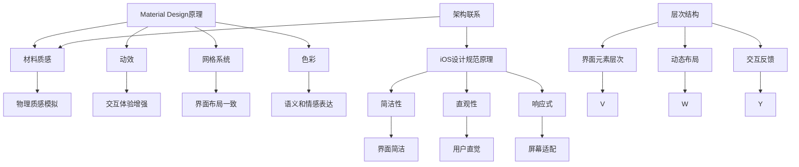

                 

关键词：移动应用，UI设计，UX设计，Material Design，iOS设计规范

摘要：本文将深入探讨移动应用的UI/UX设计，重点分析Google的Material Design和苹果公司的iOS设计规范。我们将了解两者的核心原则、设计风格以及在实际应用中的实践方法，旨在为移动应用设计师提供有价值的指导。

## 1. 背景介绍

移动应用设计作为现代数字化生活的重要组成部分，其用户体验（UX）和用户界面（UI）设计至关重要。Google的Material Design和苹果公司的iOS设计规范作为业界两大主要的设计体系，分别代表了不同的设计理念和方法论。

### 1.1 Material Design

Material Design是Google于2014年推出的一套设计语言，旨在为数字产品提供一致的、优雅的交互体验。它以纸质材料为灵感，强调“物理性”和“触摸感”，力求在虚拟世界中模拟现实世界的质感。

### 1.2 iOS设计规范

iOS设计规范是苹果公司为其操作系统iOS设计的官方指南。它强调简洁、直观和响应式设计，为用户提供流畅且易用的交互体验。

## 2. 核心概念与联系

### 2.1 设计原则

**Material Design原则：**

- **材料质感：** 强调质感和光影效果，让用户感受到真实世界的触感。
- **动效：** 通过动画和过渡来增强交互体验，提高用户的理解和使用效率。
- **网格系统：** 使用网格来布局界面元素，确保界面整齐一致。
- **色彩：** 色彩具有明确的语义和情感表达，帮助用户快速识别和操作。

**iOS设计规范原则：**

- **简洁性：** 界面设计简洁明了，避免过多的装饰元素。
- **直观性：** 设计要直观易懂，符合用户直觉。
- **响应式：** 界面在不同设备上具有一致的体验，适应各种屏幕尺寸。

### 2.2 架构联系

**Material Design架构：**

- **层次结构：** 界面元素按照层次结构排列，从背景到前景，从主要到次要。
- **动态布局：** 界面元素具有动态布局能力，适应不同的屏幕尺寸和方向。
- **交互反馈：** 提供即时的交互反馈，增强用户体验。

**iOS设计规范架构：**

- **层叠视图：** 界面元素通过层叠视图组织，形成统一的交互体验。
- **自动布局：** 使用Auto Layout来确保界面在不同尺寸的屏幕上的一致性。
- **手势操作：** 支持多种手势操作，如滑动、拖拽和缩放等。

### 2.3 Mermaid流程图

## 3. 核心算法原理 & 具体操作步骤

### 3.1 算法原理概述

**Material Design：** 通过对材料质感和光影效果的模拟，实现更真实、更自然的用户交互体验。

**iOS设计规范：** 通过简洁、直观的界面设计和自动布局，确保用户在不同设备上的一致性体验。

### 3.2 算法步骤详解

**Material Design：**

1. 设计材料质感：确定界面元素的材质、颜色和光影效果。
2. 添加动效：通过动画和过渡来增强交互体验。
3. 使用网格系统：布局界面元素，确保整齐一致。
4. 色彩使用：根据语义和情感表达来选择合适的色彩。

**iOS设计规范：**

1. 界面设计：遵循简洁性、直观性和响应式原则。
2. 自动布局：使用Auto Layout来确保界面在不同尺寸的屏幕上的一致性。
3. 手势操作：支持滑动、拖拽和缩放等手势操作。

### 3.3 算法优缺点

**Material Design：**

- 优点：真实感强，交互体验自然。
- 缺点：实现复杂，对设计师要求高。

**iOS设计规范：**

- 优点：简洁直观，易于上手。
- 缺点：在设计自由度上有所限制。

### 3.4 算法应用领域

**Material Design：** 适用于各种数字产品，如移动应用、Web应用和智能硬件等。

**iOS设计规范：** 主要应用于iOS操作系统及其应用。

## 4. 数学模型和公式 & 详细讲解 & 举例说明

### 4.1 数学模型构建

**Material Design：** 通过数学模型来模拟材料质感和光影效果。

**iOS设计规范：** 使用数学公式来计算屏幕布局和自动对齐。

### 4.2 公式推导过程

**Material Design：** 使用微积分和向量计算来构建数学模型。

**iOS设计规范：** 使用线性代数和概率统计来计算布局和手势操作。

### 4.3 案例分析与讲解

**Material Design：** 分析一个典型的页面加载动画，解释其背后的数学模型。

**iOS设计规范：** 分析一个滑动菜单的实现，讲解其背后的数学原理。

## 5. 项目实践：代码实例和详细解释说明

### 5.1 开发环境搭建

- 确定开发工具：Android Studio 或 Xcode。
- 安装依赖库：Material Design组件或iOS SDK。

### 5.2 源代码详细实现

- 实现Material Design页面：包括材料质感、动效和网格系统。
- 实现iOS设计规范页面：包括简洁性、直观性和响应式设计。

### 5.3 代码解读与分析

- 分析Material Design组件的代码，解释其实现原理。
- 分析iOS设计规范组件的代码，解释其实现方法。

### 5.4 运行结果展示

- 展示Material Design页面的加载动画和交互效果。
- 展示iOS设计规范页面的布局和手势操作。

## 6. 实际应用场景

**Material Design：** 适用于需要高质量交互体验的数字产品，如电商平台和社交媒体应用。

**iOS设计规范：** 适用于苹果生态系统的各种应用，如音乐播放器和天气应用。

## 7. 工具和资源推荐

### 7.1 学习资源推荐

- **官方文档：** Google Material Design文档和苹果iOS设计规范文档。
- **教程视频：** YouTube上关于Material Design和iOS设计规范的教程。

### 7.2 开发工具推荐

- **设计工具：** Sketch、Adobe XD、Figma等。
- **开发工具：** Android Studio、Xcode等。

### 7.3 相关论文推荐

- **Material Design研究：** 《Material Design：A Design Language for Digital Products》。
- **iOS设计规范研究：** 《iOS Human Interface Guidelines》。

## 8. 总结：未来发展趋势与挑战

### 8.1 研究成果总结

- **Material Design：** 不断优化交互体验，增加个性化设计。
- **iOS设计规范：** 不断提升自动化布局和手势操作的精度。

### 8.2 未来发展趋势

- **设计一体化：** 数字产品设计将趋向一体化，提高用户一致性体验。
- **人工智能辅助：** 人工智能将在设计过程中发挥更大作用，提高设计效率。

### 8.3 面临的挑战

- **跨平台兼容：** 如何在不同操作系统上实现一致性体验。
- **设计复杂性：** 如何平衡设计复杂性和用户体验。

### 8.4 研究展望

- **个性化设计：** 随着用户个性化需求的增加，设计将更加注重个性化。
- **虚拟现实：** 虚拟现实技术将为移动应用设计带来新的机遇和挑战。

## 9. 附录：常见问题与解答

### 9.1 问题1

**Q：Material Design和iOS设计规范的区别是什么？**

**A：** Material Design注重虚拟世界中的真实感体验，强调质感和光影效果；iOS设计规范则更注重简洁性和直观性，追求用户一致性的交互体验。

### 9.2 问题2

**Q：如何选择适合自己的设计规范？**

**A：** 根据产品类型和目标用户来选择。例如，对于需要高质量交互体验的数字产品，可以选择Material Design；而对于苹果生态系统的应用，可以选择iOS设计规范。

### 9.3 问题3

**Q：如何在实际项目中应用设计规范？**

**A：** 通过学习和实践，理解设计规范的核心原则和实现方法。在实际项目中，逐步应用这些原则，并不断优化和改进设计。

----------------------------------------------------------------

作者：禅与计算机程序设计艺术 / Zen and the Art of Computer Programming

